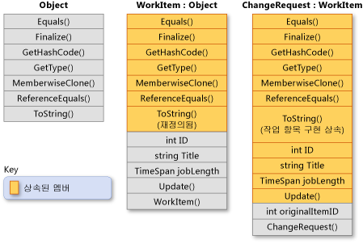

# 상속(C# 프로그래밍 가이드)Inheritance (C# Programming Guide)

캡슐화 및 다형성과 함께 상속은 개체 지향 프로그래밍의 세 가지 주요 특징 중 하나입니다.Inheritance, together with encapsulation and polymorphism, is one of the three primary characteristics of object-oriented programming. 상속을 사용하면 다른 클래스에 정의된 동작을 다시 사용, 확장 및 수정하는 새 클래스를 만들 수 있습니다.Inheritance enables you to create new classes that reuse, extend, and modify the behavior that is defined in other classes. 멤버가 상속되는 클래스를 *기본 클래스*라고 하고 해당 멤버를 상속하는 클래스를 *파생 클래스*라고 합니다.The class whose members are inherited is called the *base class*, and the class that inherits those members is called the *derived class*. 파생 클래스에는 직접적인 기본 클래스가 하나만 있을 수 있습니다.A derived class can have only one direct base class. 그러나 상속은 전이됩니다.However, inheritance is transitive. ClassC가 ClassB에서 파생되고 ClassB가 ClassA에서 파생되는 경우 ClassC는 ClassB 및 ClassA에 선언된 멤버를 상속합니다.If ClassC is derived from ClassB, and ClassB is derived from ClassA, ClassC inherits the members declared in ClassB and ClassA.  
  
> [!NOTE]
>  구조체는 상속을 지원하지 않지만 인터페이스를 구현할 수 있습니다.Structs do not support inheritance, but they can implement interfaces. 자세한 내용은 [인터페이스](../../../csharp/programming-guide/interfaces/index.md)를 참조하세요.For more information, see [Interfaces](../../../csharp/programming-guide/interfaces/index.md).  
  
 파생 클래스는 개념적 측면에서 기본 클래스의 특수화입니다.Conceptually, a derived class is a specialization of the base class. 예를 들어 기본 클래스 `Animal`이 있는 경우 `Mammal`이라는 하나의 파생 클래스와 `Reptile`이라는 다른 파생 클래스가 있을 수 있습니다.For example, if you have a base class `Animal`, you might have one derived class that is named `Mammal` and another derived class that is named `Reptile`. `Mammal`은 `Animal`이고 `Reptile`은 `Animal`이지만 각 파생 클래스는 기본 클래스의 서로 다른 특수화를 나타냅니다.A `Mammal` is an `Animal`, and a `Reptile` is an `Animal`, but each derived class represents different specializations of the base class.  
  
 다른 클래스에서 파생할 클래스를 정의하는 경우 파생 클래스는 해당 생성자와 종료자를 제외하고 기본 클래스의 모든 멤버를 암시적으로 얻게 됩니다.When you define a class to derive from another class, the derived class implicitly gains all the members of the base class, except for its constructors and finalizers. 따라서 파생 클래스는 다시 구현하지 않고도 기본 클래스의 코드를 다시 사용할 수 있습니다.The derived class can thereby reuse the code in the base class without having to re-implement it. 파생 클래스에서 더 많은 멤버를 추가할 수 있습니다.In the derived class, you can add more members. 이런 방식으로 파생 클래스는 기본 클래스의 기능을 확장합니다.In this manner, the derived class extends the functionality of the base class.  
  
 다음 그림은 일부 비즈니스 프로세스의 작업 항목을 나타내는 `WorkItem` 클래스를 보여 줍니다.The following illustration shows a class `WorkItem` that represents an item of work in some business process. 모든 클래스와 마찬가지로, <xref:System.Object?displayProperty=fullName>에서 파생되고 해당 메서드를 모두 상속합니다.Like all classes, it derives from <xref:System.Object?displayProperty=fullName> and inherits all its methods. `WorkItem`은 고유한 멤버 5개를 추가합니다.`WorkItem` adds five members of its own. 생성자는 상속되지 않으므로 생성자도 여기에 포함됩니다.These include a constructor, because constructors are not inherited. `ChangeRequest` 클래스는 `WorkItem`에서 상속되며 특정 종류의 작업 항목을 나타냅니다.Class `ChangeRequest` inherits from `WorkItem` and represents a particular kind of work item. `ChangeRequest`는 `WorkItem` 및 <xref:System.Object>에서 상속하는 멤버에 둘 이상의 멤버를 추가합니다.`ChangeRequest` adds two more members to the members that it inherits from `WorkItem` and from <xref:System.Object>. 고유한 생성자를 추가해야 하며, `originalItemID`도 추가합니다.It must add its own constructor, and it also adds `originalItemID`. `originalItemID` 속성을 사용하면 `ChangeRequest` 인스턴스를 변경 요청이 적용되는 원래 `WorkItem`에 연결할 수 있습니다.Property `originalItemID` enables the `ChangeRequest` instance to be associated with the original `WorkItem` to which the change request applies.  
  
   
클래스 상속Class inheritance  
  
 다음 예제에서는 앞의 그림에서 보여 주는 클래스 관계가 C#에서 어떻게 표현되는지를 보여 줍니다.The following example shows how the class relationships demonstrated in the previous illustration are expressed in C#. 또한 이 예제에서 `WorkItem`은 가상 메서드 <xref:System.Object.ToString%2A?displayProperty=fullName>을 재정의하는 방법과 `ChangeRequest` 클래스가 메서드의 `WorkItem` 구현을 상속하는 방법을 보여 줍니다.The example also shows how `WorkItem` overrides the virtual method <xref:System.Object.ToString%2A?displayProperty=fullName>, and how the `ChangeRequest` class inherits the `WorkItem` implementation of the method.  
  
 [!code-cs[csProgGuideInheritance#49](../../../csharp/programming-guide/classes-and-structs/codesnippet/CSharp/inheritance_1.cs)][!code-cs[csProgGuideInheritance#49](../../../csharp/programming-guide/classes-and-structs/codesnippet/CSharp/inheritance_1.cs)]  
  
## 추상 메서드 및 가상 메서드Abstract and Virtual Methods  
 기본 클래스가 메서드를 [virtual](../../../csharp/language-reference/keywords/virtual.md)로 선언하는 경우 파생 클래스가 해당 구현으로 메서드를 [재정의](../../../csharp/language-reference/keywords/override.md)할 수 있습니다.When a base class declares a method as [virtual](../../../csharp/language-reference/keywords/virtual.md), a derived class can [override](../../../csharp/language-reference/keywords/override.md) the method with its own implementation. 기본 클래스가 멤버를 [abstract](../../../csharp/language-reference/keywords/abstract.md)로 선언하는 경우 해당 클래스에서 직접 상속하는 모든 비추상 클래스에서 메서드를 재정의해야 합니다.If a base class declares a member as [abstract](../../../csharp/language-reference/keywords/abstract.md), that method must be overridden in any non-abstract class that directly inherits from that class. 파생 클래스 자체가 abstract인 경우 직접 구현하지 않고 추상 멤버를 상속합니다.If a derived class is itself abstract, it inherits abstract members without implementing them. 추상 멤버 및 가상 멤버는 개체 지향 프로그래밍의 두 번째 주요 특징인 다형성의 기초가 됩니다.Abstract and virtual members are the basis for polymorphism, which is the second primary characteristic of object-oriented programming. 자세한 내용은 [다형성](../../../csharp/programming-guide/classes-and-structs/polymorphism.md)을 참조하세요.For more information, see [Polymorphism](../../../csharp/programming-guide/classes-and-structs/polymorphism.md).  
  
## 추상 기본 클래스Abstract Base Classes  
 [new](../../../csharp/language-reference/keywords/new.md) 키워드를 사용한 직접 인스턴스화를 방지하려는 경우 클래스를 [abstract](../../../csharp/language-reference/keywords/abstract.md)로 선언할 수 있습니다.You can declare a class as [abstract](../../../csharp/language-reference/keywords/abstract.md) if you want to prevent direct instantiation by using the [new](../../../csharp/language-reference/keywords/new.md) keyword. 이 작업을 수행하면 해당 클래스에서 새 클래스가 파생된 경우에만 클래스를 사용할 수 있습니다.If you do this, the class can be used only if a new class is derived from it. 추상 클래스에는 그 자체가 abstract로 선언된 메서드 시그니처가 하나 이상 포함될 수 있습니다.An abstract class can contain one or more method signatures that themselves are declared as abstract. 이러한 시그니처는 매개 변수와 반환 값을 지정하지만 구현(메서드 본문)이 없습니다.These signatures specify the parameters and return value but have no implementation (method body). 추상 클래스는 추상 멤버를 포함하지 않아도 됩니다. 그러나 클래스에 추상 멤버가 포함되지 않은 경우 클래스 자체를 abstract로 선언해야 합니다.An abstract class does not have to contain abstract members; however, if a class does contain an abstract member, the class itself must be declared as abstract. 그 자체가 추상이 아닌 파생 클래스는 추상 기본 클래스의 모든 추상 멤버에 대한 구현을 제공해야 합니다.Derived classes that are not abstract themselves must provide the implementation for any abstract methods from an abstract base class. 자세한 내용은 [추상 및 봉인 클래스와 클래스 멤버](../../../csharp/programming-guide/classes-and-structs/abstract-and-sealed-classes-and-class-members.md)를 참조하세요.For more information, see [Abstract and Sealed Classes and Class Members](../../../csharp/programming-guide/classes-and-structs/abstract-and-sealed-classes-and-class-members.md).  
  
## 인터페이스Interfaces  
 *인터페이스*는 추상 멤버로만 구성된 추상 기본 클래스와 비슷한 참조 형식입니다.An *interface* is a reference type that is somewhat similar to an abstract base class that consists of only abstract members. 클래스에서 인터페이스를 구현하는 경우 인터페이스의 모든 멤버에 대해 구현을 제공해야 합니다.When a class implements an interface, it must provide an implementation for all the members of the interface. 하나의 직접 기본 클래스에서만 파생할 수 있는 경우에도 클래스에서 여러 인터페이스를 구현할 수 있습니다.A class can implement multiple interfaces even though it can derive from only a single direct base class.  
  
 인터페이스는 "is a" 관계가 없을 수도 있는 클래스에 대해 특정 기능을 정의하는 데 사용됩니다.Interfaces are used to define specific capabilities for classes that do not necessarily have an "is a" relationship. 예를 들어 <xref:System.IEquatable%601?displayProperty=fullName> 인터페이스는 클라이언트 코드에서 형식의 두 개체가 같은지 여부를 확인할 수 있도록 해야 하는 모든 클래스 또는 구조체에 의해 구현될 수 있습니다(그러나 형식이 동등성을 정의함).For example, the <xref:System.IEquatable%601?displayProperty=fullName> interface can be implemented by any class or struct that has to enable client code to determine whether two objects of the type are equivalent (however the type defines equivalence). <xref:System.IEquatable%601>은 기본 클래스와 파생 클래스 간에 존재하는 동일한 종류의 "is a" 관계를 암시하지 않습니다(예: `Mammal`은 `Animal`임).<xref:System.IEquatable%601> does not imply the same kind of "is a" relationship that exists between a base class and a derived class (for example, a `Mammal` is an `Animal`). 자세한 내용은 [인터페이스](../../../csharp/programming-guide/interfaces/index.md)를 참조하세요.For more information, see [Interfaces](../../../csharp/programming-guide/interfaces/index.md).  
  
## 추가 파생 방지Preventing Further Derivation  
 클래스는 자신이나 멤버를 [sealed](../../../csharp/language-reference/keywords/sealed.md)로 선언하여 다른 클래스가 해당 클래스나 멤버에서 상속할 수 없도록 차단할 수 있습니다.A class can prevent other classes from inheriting from it, or from any of its members, by declaring itself or the member as [sealed](../../../csharp/language-reference/keywords/sealed.md). 자세한 내용은 [추상 및 봉인 클래스와 클래스 멤버](../../../csharp/programming-guide/classes-and-structs/abstract-and-sealed-classes-and-class-members.md)를 참조하세요.For more information, see [Abstract and Sealed Classes and Class Members](../../../csharp/programming-guide/classes-and-structs/abstract-and-sealed-classes-and-class-members.md).  
  
## 파생 클래스의 기본 클래스 멤버 숨기기Derived Class Hiding of Base Class Members  
 파생 클래스는 동일한 이름과 시그니처로 멤버를 선언하여 기본 클래스 멤버를 숨길 수 있습니다.A derived class can hide base class members by declaring members with the same name and signature. [new](../../../csharp/language-reference/keywords/new.md) 한정자를 사용하여 멤버가 기본 멤버를 재정의하지 않음을 명시적으로 나타내는 데 사용할 수 있습니다.The [new](../../../csharp/language-reference/keywords/new.md) modifier can be used to explicitly indicate that the member is not intended to be an override of the base member. [new](../../../csharp/language-reference/keywords/new.md) 사용은 필수가 아니지만 [new](../../../csharp/language-reference/keywords/new.md)를 사용하지 않을 경우 컴파일러 경고가 생성됩니다.The use of [new](../../../csharp/language-reference/keywords/new.md) is not required, but a compiler warning will be generated if [new](../../../csharp/language-reference/keywords/new.md) is not used. 자세한 내용은 [Override 및 New 키워드를 사용하여 버전 관리](../../../csharp/programming-guide/classes-and-structs/versioning-with-the-override-and-new-keywords.md) 및 [Override 및 New 키워드를 사용해야 하는 경우](../../../csharp/programming-guide/classes-and-structs/knowing-when-to-use-override-and-new-keywords.md)를 참조하세요.For more information, see [Versioning with the Override and New Keywords](../../../csharp/programming-guide/classes-and-structs/versioning-with-the-override-and-new-keywords.md) and [Knowing When to Use Override and New Keywords](../../../csharp/programming-guide/classes-and-structs/knowing-when-to-use-override-and-new-keywords.md).  
  
## 참고 항목See Also  
 [C# 프로그래밍 가이드](../../../csharp/programming-guide/index.md) [C# Programming Guide](../../../csharp/programming-guide/index.md)   
 [클래스 및 구조체](../../../csharp/programming-guide/classes-and-structs/index.md) [Classes and Structs](../../../csharp/programming-guide/classes-and-structs/index.md)   
 [class](../../../csharp/language-reference/keywords/class.md) [class](../../../csharp/language-reference/keywords/class.md)   
 [tructstruct](../../../csharp/language-reference/keywords/struct.md)

