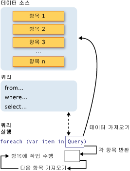

# Introduction to LINQ Queries (C#)
*쿼리*는 데이터 소스에서 데이터를 검색하는 식입니다.  일반적으로 쿼리는 특수한 쿼리 언어로 표현됩니다.  관계형 데이터베이스용 SQL이나 XML용 XQuery와 같은 다양한 유형의 데이터 소스를 위한 여러 언어가 개발되었습니다.  따라서 개발자는 지원해야 하는 각 데이터 소스 유형이나 데이터 형식에 대한 새 쿼리 언어를 배워야 했습니다.  [!INCLUDE[vbteclinq](../../../../csharp/includes/vbteclinq-md.md)]는 다양한 종류의 데이터 소스와 형식에서 작업하기 위한 일관된 모델을 제공하여 이 상황을 단순화합니다.  [!INCLUDE[vbteclinq](../../../../csharp/includes/vbteclinq-md.md)] 쿼리에서는 항상 개체를 사용합니다.  XML 문서, SQL 데이터베이스, [!INCLUDE[vstecado](../../../../csharp/programming-guide/concepts/linq/includes/vstecado-md.md)] 데이터 집합, .NET 컬렉션 및 [!INCLUDE[vbteclinq](../../../../csharp/includes/vbteclinq-md.md)] 공급자를 사용할 수 있는 다른 모든 형식에서 데이터를 쿼리 및 변환하기 위해 동일한 기본 코딩 패턴을 사용합니다.  
  
## 쿼리 작업의 세 가지 부분  
 모든 [!INCLUDE[vbteclinq](../../../../csharp/includes/vbteclinq-md.md)] 쿼리 작업은 다음과 같은 세 개의 고유한 작업으로 구성됩니다.  
  
1.  데이터 소스를 가져옵니다.  
  
2.  쿼리를 만듭니다.  
  
3.  쿼리를 실행합니다.  
  
 다음 예제에서는 쿼리 작업의 세 가지 부분이 소스 코드에서 표현되는 방법을 보여 줍니다.  이 예제에서는 편의상 정수 배열을 데이터 소스로 사용하지만 다른 데이터 소스에도 동일한 개념이 적용됩니다.  이 예제는 이 항목의 나머지 부분에서도 참조됩니다.  
  
 [!code-cs[CsLINQGettingStarted#1](../../../../csharp/programming-guide/concepts/linq/codesnippet/CSharp/introduction-to-linq-queries_1.cs)]  
  
 다음 그림에서는 완전한 쿼리 작업을 보여 줍니다.  [!INCLUDE[vbteclinq](../../../../csharp/includes/vbteclinq-md.md)]에서 쿼리 실행은 쿼리 자체와 다릅니다. 즉, 쿼리 변수를 만드는 것만으로는 데이터가 검색되지 않습니다.  
  
   
  
## 데이터 소스  
 앞의 예제에서는 데이터 소스가 배열이기 때문에 제네릭 <xref:System.Collections.Generic.IEnumerable%601> 인터페이스가 암시적으로 지원됩니다.  이것은 [!INCLUDE[vbteclinq](../../../../csharp/includes/vbteclinq-md.md)]를 사용하여 쿼리할 수 있다는 것을 의미합니다.  쿼리는 `foreach` 문에서 실행되며, `foreach`는 <xref:System.Collections.IEnumerable> 또는 <xref:System.Collections.Generic.IEnumerable%601>이 필요합니다.  제네릭 <xref:System.Linq.IQueryable%601>과 같은 파생 인터페이스나 <xref:System.Collections.Generic.IEnumerable%601>를 지원하는 형식을 *쿼리 가능한 형식*이라고 합니다.  
  
 쿼리 가능한 형식은 특별한 처리나 수정 없이 [!INCLUDE[vbteclinq](../../../../csharp/includes/vbteclinq-md.md)] 데이터 소스로 사용할 수 있습니다.  소스 데이터가 이미 메모리에 쿼리 가능한 형식으로 존재하지 않는 경우 [!INCLUDE[vbteclinq](../../../../csharp/includes/vbteclinq-md.md)] 공급자가 소스 데이터를 그와 같이 나타내야 합니다.  예를 들어 [!INCLUDE[sqltecxlinq](../../../../csharp/programming-guide/concepts/linq/includes/sqltecxlinq-md.md)]은 XML 문서를 쿼리 가능한 <xref:System.Xml.Linq.XElement> 형식에 로드합니다.  
  
 [!code-cs[CsLINQGettingStarted#2](../../../../csharp/programming-guide/concepts/linq/codesnippet/CSharp/introduction-to-linq-queries_2.cs)]  
  
 [!INCLUDE[vbtecdlinq](../../../../csharp/includes/vbtecdlinq-md.md)]에서는 먼저 개체 관계형 매핑을 디자인 타임에 수동으로 만들거나 [O\/R 디자이너\(개체 관계형 디자이너\)](/visual-studio/data-tools/linq-to-sql-tools-in-visual-studio2)를 사용하여 만듭니다.  사용자가 개체에 대한 쿼리를 작성하고 런타임에 [!INCLUDE[vbtecdlinq](../../../../csharp/includes/vbtecdlinq-md.md)]은 데이터베이스와의 통신을 처리합니다.  다음 예제에서 `Customers`는 데이터베이스에 있는 특정 테이블을 나타내고 쿼리 결과의 형식인 <xref:System.Linq.IQueryable%601>은 <xref:System.Collections.Generic.IEnumerable%601>에서 파생됩니다.  
  
```c#  
Northwnd db = new Northwnd(@"c:\northwnd.mdf");  
  
// Query for customers in London.  
IQueryable<Customer> custQuery =  
    from cust in db.Customers  
    where cust.City == "London"  
    select cust;  
  
```  
  
 특정 데이터 소스 형식을 만드는 방법에 대한 자세한 내용은 다양한 [!INCLUDE[vbteclinq](../../../../csharp/includes/vbteclinq-md.md)] 공급자에 대한 설명서를 참조하십시오.  그러나 기본 규칙은 매우 간단합니다. 즉 [!INCLUDE[vbteclinq](../../../../csharp/includes/vbteclinq-md.md)] 데이터 소스는 제네릭 <xref:System.Collections.Generic.IEnumerable%601> 인터페이스 또는 이 인터페이스에 파생된 인터페이스를 지원하는 모든 개체입니다.  
  
> [!NOTE]
>  제네릭이 아닌 <xref:System.Collections.IEnumerable> 인터페이스를 지원하는 <xref:System.Collections.ArrayList>와 같은 형식을 [!INCLUDE[vbteclinq](../../../../csharp/includes/vbteclinq-md.md)] 데이터 소스로 사용할 수도 있습니다.  자세한 내용은 [How to: Query an ArrayList with LINQ](../Topic/How%20to:%20Query%20an%20ArrayList%20with%20LINQ.md)을 참조하십시오.  
  
##  <a name="query"></a> 쿼리  
 쿼리는 데이터 소스 또는 소스에서 검색할 정보를 지정합니다.  또한 필요한 경우 해당 정보를 반환하기 전에 정렬 또는 그룹화하거나 모양을 지정하는 방법을 쿼리에서 지정합니다.  쿼리는 쿼리 변수에 저장되며 쿼리 식을 사용하여 초기화됩니다.  쿼리를 더 쉽게 작성할 수 있도록 C\#에서는 새 쿼리 구문이 소개되었습니다.  
  
 위 예제의 쿼리는 정수 배열에서 모든 짝수를 반환합니다.  쿼리 식에는 세 개의 절인 `from`, `where` 및 `select`가 포함되어 있습니다. SQL에 익숙하다면 여기서 절의 순서가 SQL의 경우와 반대로 되어 있다는 것을 알 수 있을 것입니다. `from` 절은 데이터 소스를 지정하고 `where` 절은 필터를 적용하며 `select` 절은 반환된 요소의 형식을 지정합니다.  이러한 절과 기타 쿼리 절이 [LINQ 쿼리 식](../../../../csharp/programming-guide/linq-query-expressions/index.md) 섹션에 자세히 설명되어 있습니다.  여기서 중요한 것은 [!INCLUDE[vbteclinq](../../../../csharp/includes/vbteclinq-md.md)]에서 쿼리 변수 자체가 아무 작업도 수행하지 않으며 데이터를 반환하지 않는다는 것입니다.  쿼리 변수는 나중에 쿼리를 실행할 때 결과를 생성하는 데 필요한 정보를 저장할 뿐입니다.  내부적으로 쿼리가 생성되는 방법에 대한 자세한 내용은 [Standard Query Operators Overview](../../../../visual-basic/programming-guide/concepts/linq/standard-query-operators-overview.md)를 참조하십시오.  
  
> [!NOTE]
>  메서드 구문을 사용하여 쿼리를 표현할 수도 있습니다.  자세한 내용은 [Query Syntax and Method Syntax in LINQ](../../../../csharp/programming-guide/concepts/linq/query-syntax-and-method-syntax-in-linq.md)을 참조하십시오.  
  
## 쿼리 실행  
  
### 지연된 실행  
 이미 설명한 것처럼 쿼리 변수 자체는 쿼리 명령을 저장할 뿐입니다.  쿼리의 실제 실행은 `foreach` 문에서 쿼리 변수를 반복할 때까지 지연됩니다.  이 개념을 *지연된 실행*이라고 하며 다음 예제에 나와 있습니다.  
  
 [!code-cs[csLinqGettingStarted#4](../../../../csharp/programming-guide/concepts/linq/codesnippet/CSharp/introduction-to-linq-queries_3.cs)]  
  
 `foreach` 문은 또한 쿼리 결과가 검색되는 위치입니다.  예를 들어 위 쿼리에서 반복 변수 `num`은 반환된 시퀀스에서 각 값을 한 번에 하나씩 보유합니다.  
  
 쿼리 변수 자체가 쿼리 결과를 보유하지 않으므로 원하는 만큼 자주 실행할 수 있습니다.  예를 들어 별개의 응용 프로그램에 의해 계속 업데이트되는 데이터베이스가 있다고 가정해 봅니다.  이 경우 응용 프로그램에서 최신 데이터를 검색하는 하나의 쿼리를 만들고 일정한 간격으로 반복적으로 실행하면 매번 다른 결과를 검색할 수 있습니다.  
  
### 즉시 실행 강제  
 소스 요소 범위에서 집계 함수를 수행하는 쿼리는 먼저 해당 요소를 반복해야 합니다.  이러한 쿼리의 예로는 `Count`, `Max`, `Average` 및 `First`가 있습니다.  이러한 쿼리는 결과를 반환하기 위해 자체에 `foreach`가 사용되어야 하므로 명시적 `foreach` 문 없이 실행됩니다.  또한 이러한 형식의 쿼리는 `IEnumerable` 컬렉션이 아니라 단일 값을 반환합니다.  다음 쿼리는 소스 배열의 짝수 개수를 반환합니다.  
  
 [!code-cs[csLinqGettingStarted#5](../../../../csharp/programming-guide/concepts/linq/codesnippet/CSharp/introduction-to-linq-queries_4.cs)]  
  
 쿼리의 즉시 실행을 강제하고 해당 결과를 캐시하려면 <xref:System.Linq.Enumerable.ToList%2A> 또는 <xref:System.Linq.Enumerable.ToArray%2A> 메서드를 호출합니다.  
  
 [!code-cs[csLinqGettingStarted#6](../../../../csharp/programming-guide/concepts/linq/codesnippet/CSharp/introduction-to-linq-queries_5.cs)]  
  
 또한 쿼리 식 바로 뒤에 `foreach` 루프를 포함하여 실행을 강제할 수도 있습니다.  그러나 `ToList` 또는 `ToArray`를 호출할 경우에는 또한 단일 컬렉션 개체의 모든 데이터가 캐시됩니다.  
  
## 참고 항목  
 [Getting Started with LINQ in C\#](../../../../csharp/programming-guide/concepts/linq/getting-started-with-linq.md)   
 [Walkthrough: Writing Queries in C\#](../../../../csharp/programming-guide/concepts/linq/walkthrough-writing-queries-linq.md)   
 [LINQ 샘플](../Topic/LINQ%20Samples.md)   
 [O\/R 디자이너 개요](../Topic/LINQ%20to%20SQL%20Tools%20in%20Visual%20Studio1.md)   
 [LINQ 쿼리 식](../../../../csharp/programming-guide/linq-query-expressions/index.md)   
 [foreach, in](../../../../csharp/language-reference/keywords/foreach-in.md)   
 [쿼리 키워드\(LINQ\)](../../../../csharp/language-reference/keywords/query-keywords.md)   
 [LINQ 및 지연 동영상](http://go.microsoft.com/fwlink/?LinkId=112414)