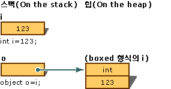
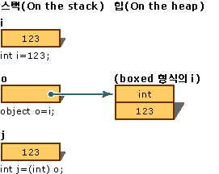

# <a name="boxing-and-unboxing-c-programming-guide"></a><span data-ttu-id="7d5ed-102">Boxing 및 Unboxing(C# 프로그래밍 가이드)</span><span class="sxs-lookup"><span data-stu-id="7d5ed-102">Boxing and Unboxing (C# Programming Guide)</span></span>
<span data-ttu-id="7d5ed-103">Boxing은 [값 형식](../../../csharp/language-reference/keywords/value-types.md)을 `object` 형식 또는 이 값 형식에서 구현된 임의의 인터페이스 형식으로 변환하는 프로세스입니다.</span><span class="sxs-lookup"><span data-stu-id="7d5ed-103">Boxing is the process of converting a [value type](../../../csharp/language-reference/keywords/value-types.md) to the type `object` or to any interface type implemented by this value type.</span></span> <span data-ttu-id="7d5ed-104">CLR은 값 형식을 boxing할 때 값을 System.Object 내부에 래핑하고 관리되는 힙에 저장합니다.</span><span class="sxs-lookup"><span data-stu-id="7d5ed-104">When the CLR boxes a value type, it wraps the value inside a System.Object and stores it on the managed heap.</span></span> <span data-ttu-id="7d5ed-105">unboxing하면 개체에서 값 형식이 추출됩니다.</span><span class="sxs-lookup"><span data-stu-id="7d5ed-105">Unboxing extracts the value type from the object.</span></span> <span data-ttu-id="7d5ed-106">Boxing은 암시적이며 unboxing은 명시적입니다.</span><span class="sxs-lookup"><span data-stu-id="7d5ed-106">Boxing is implicit; unboxing is explicit.</span></span> <span data-ttu-id="7d5ed-107">Boxing 및 unboxing의 개념은 개체로 처리할 수 있는 모든 값 형식에서 형식 시스템의 C#에 통합된 뷰의 기반이 됩니다.</span><span class="sxs-lookup"><span data-stu-id="7d5ed-107">The concept of boxing and unboxing underlies the C# unified view of the type system in which a value of any type can be treated as an object.</span></span>  
  
 <span data-ttu-id="7d5ed-108">다음 예제에서는 정수 변수 `i`를 *boxing*하고 개체 `o`에 할당합니다.</span><span class="sxs-lookup"><span data-stu-id="7d5ed-108">In the following example, the integer variable `i` is *boxed* and assigned to object `o`.</span></span>  
  
 <span data-ttu-id="7d5ed-109">[!code-cs[csProgGuideTypes#14](../../../csharp/programming-guide/nullable-types/codesnippet/CSharp/boxing-and-unboxing_1.cs)]</span><span class="sxs-lookup"><span data-stu-id="7d5ed-109">[!code-cs[csProgGuideTypes#14](../../../csharp/programming-guide/nullable-types/codesnippet/CSharp/boxing-and-unboxing_1.cs)]</span></span>  
  
 <span data-ttu-id="7d5ed-110">그런 다음 `o` 개체를 unboxing하고 정수 변수 `i`에 할당할 수 있습니다.</span><span class="sxs-lookup"><span data-stu-id="7d5ed-110">The object `o` can then be unboxed and assigned to integer variable `i`:</span></span>  
  
 <span data-ttu-id="7d5ed-111">[!code-cs[csProgGuideTypes#15](../../../csharp/programming-guide/nullable-types/codesnippet/CSharp/boxing-and-unboxing_2.cs)]</span><span class="sxs-lookup"><span data-stu-id="7d5ed-111">[!code-cs[csProgGuideTypes#15](../../../csharp/programming-guide/nullable-types/codesnippet/CSharp/boxing-and-unboxing_2.cs)]</span></span>  
  
 <span data-ttu-id="7d5ed-112">다음 예제에서는 C#에서 boxing이 사용되는 방법을 보여 줍니다.</span><span class="sxs-lookup"><span data-stu-id="7d5ed-112">The following examples illustrate how boxing is used in C#.</span></span>  
  
 <span data-ttu-id="7d5ed-113">[!code-cs[csProgGuideTypes#47](../../../csharp/programming-guide/nullable-types/codesnippet/CSharp/boxing-and-unboxing_3.cs)]</span><span class="sxs-lookup"><span data-stu-id="7d5ed-113">[!code-cs[csProgGuideTypes#47](../../../csharp/programming-guide/nullable-types/codesnippet/CSharp/boxing-and-unboxing_3.cs)]</span></span>  
  
## <a name="performance"></a><span data-ttu-id="7d5ed-114">성능</span><span class="sxs-lookup"><span data-stu-id="7d5ed-114">Performance</span></span>  
 <span data-ttu-id="7d5ed-115">단순 할당에서는 boxing과 unboxing을 수행하는 데 많은 계산 과정이 필요합니다.</span><span class="sxs-lookup"><span data-stu-id="7d5ed-115">In relation to simple assignments, boxing and unboxing are computationally expensive processes.</span></span> <span data-ttu-id="7d5ed-116">값 형식을 boxing할 때는 새로운 개체를 할당하고 생성해야 합니다.</span><span class="sxs-lookup"><span data-stu-id="7d5ed-116">When a value type is boxed, a new object must be allocated and constructed.</span></span> <span data-ttu-id="7d5ed-117">정도는 약간 덜하지만 unboxing에 필요한 캐스트에도 상당한 계산 과정이 필요합니다.</span><span class="sxs-lookup"><span data-stu-id="7d5ed-117">To a lesser degree, the cast required for unboxing is also expensive computationally.</span></span> <span data-ttu-id="7d5ed-118">자세한 내용은 [성능](https://msdn.microsoft.com/library/ms173196(VS.110).aspx)을 참조하세요.</span><span class="sxs-lookup"><span data-stu-id="7d5ed-118">For more information, see [Performance](https://msdn.microsoft.com/library/ms173196(VS.110).aspx).</span></span>  
  
## <a name="boxing"></a><span data-ttu-id="7d5ed-119">boxing</span><span class="sxs-lookup"><span data-stu-id="7d5ed-119">Boxing</span></span>  
 <span data-ttu-id="7d5ed-120">boxing은 가비지 수집되는 힙에 값 형식을 저장하는 데 사용됩니다.</span><span class="sxs-lookup"><span data-stu-id="7d5ed-120">Boxing is used to store value types in the garbage-collected heap.</span></span> <span data-ttu-id="7d5ed-121">Boxing은 [값 형식](../../../csharp/language-reference/keywords/value-types.md)을 `object` 형식 또는 이 값 형식에서 구현된 임의의 인터페이스 형식으로 암시적으로 변환하는 프로세스입니다.</span><span class="sxs-lookup"><span data-stu-id="7d5ed-121">Boxing is an implicit conversion of a [value type](../../../csharp/language-reference/keywords/value-types.md) to the type `object` or to any interface type implemented by this value type.</span></span> <span data-ttu-id="7d5ed-122">값 형식을 boxing하면 힙에 개체 인스턴스가 할당되고 값이 새 개체에 복사됩니다.</span><span class="sxs-lookup"><span data-stu-id="7d5ed-122">Boxing a value type allocates an object instance on the heap and copies the value into the new object.</span></span>  
  
 <span data-ttu-id="7d5ed-123">다음과 같이 값 형식 변수를 선언합니다.</span><span class="sxs-lookup"><span data-stu-id="7d5ed-123">Consider the following declaration of a value-type variable:</span></span>  
  
 <span data-ttu-id="7d5ed-124">[!code-cs[csProgGuideTypes#17](../../../csharp/programming-guide/nullable-types/codesnippet/CSharp/boxing-and-unboxing_4.cs)]</span><span class="sxs-lookup"><span data-stu-id="7d5ed-124">[!code-cs[csProgGuideTypes#17](../../../csharp/programming-guide/nullable-types/codesnippet/CSharp/boxing-and-unboxing_4.cs)]</span></span>  
  
 <span data-ttu-id="7d5ed-125">다음 문에서는 변수 `i`에 암시적으로 boxing 연산을 적용합니다.</span><span class="sxs-lookup"><span data-stu-id="7d5ed-125">The following statement implicitly applies the boxing operation on the variable `i`:</span></span>  
  
 <span data-ttu-id="7d5ed-126">[!code-cs[csProgGuideTypes#18](../../../csharp/programming-guide/nullable-types/codesnippet/CSharp/boxing-and-unboxing_5.cs)]</span><span class="sxs-lookup"><span data-stu-id="7d5ed-126">[!code-cs[csProgGuideTypes#18](../../../csharp/programming-guide/nullable-types/codesnippet/CSharp/boxing-and-unboxing_5.cs)]</span></span>  
  
 <span data-ttu-id="7d5ed-127">이 문의 결과로 힙에 있는 `o` 형식의 값을 참조하는 `int` 개체 참조가 스택에 생성됩니다.</span><span class="sxs-lookup"><span data-stu-id="7d5ed-127">The result of this statement is creating an object reference `o`, on the stack, that references a value of the type `int`, on the heap.</span></span> <span data-ttu-id="7d5ed-128">이 값은 변수`i`에 할당된 값 형식 값의 복사본입니다.</span><span class="sxs-lookup"><span data-stu-id="7d5ed-128">This value is a copy of the value-type value assigned to the variable `i`.</span></span> <span data-ttu-id="7d5ed-129">다음 그림에서는 두 변수 `i` 및 `o`의 차이점을 보여 줍니다.</span><span class="sxs-lookup"><span data-stu-id="7d5ed-129">The difference between the two variables, `i` and `o`, is illustrated in the following figure.</span></span>  
  
 <span data-ttu-id="7d5ed-130"></span><span class="sxs-lookup"><span data-stu-id="7d5ed-130"></span></span>  
<span data-ttu-id="7d5ed-131">boxing 변환</span><span class="sxs-lookup"><span data-stu-id="7d5ed-131">Boxing Conversion</span></span>  
  
 <span data-ttu-id="7d5ed-132">다음 예제에서와 같이 명시적으로 boxing을 수행할 수도 있지만 명시적 boxing이 반드시 필요한 것은 아닙니다.</span><span class="sxs-lookup"><span data-stu-id="7d5ed-132">It is also possible to perform the boxing explicitly as in the following example, but explicit boxing is never required:</span></span>  
  
 <span data-ttu-id="7d5ed-133">[!code-cs[csProgGuideTypes#19](../../../csharp/programming-guide/nullable-types/codesnippet/CSharp/boxing-and-unboxing_6.cs)]</span><span class="sxs-lookup"><span data-stu-id="7d5ed-133">[!code-cs[csProgGuideTypes#19](../../../csharp/programming-guide/nullable-types/codesnippet/CSharp/boxing-and-unboxing_6.cs)]</span></span>  
  
## <a name="description"></a><span data-ttu-id="7d5ed-134">설명</span><span class="sxs-lookup"><span data-stu-id="7d5ed-134">Description</span></span>  
 <span data-ttu-id="7d5ed-135">이 예제에서는 boxing을 통해 정수 변수 `i`를 개체 `o`로 변환합니다.</span><span class="sxs-lookup"><span data-stu-id="7d5ed-135">This example converts an integer variable `i` to an object `o` by using boxing.</span></span> <span data-ttu-id="7d5ed-136">그런 다음 변수 `i`에 저장된 값을 `123`에서 `456`으로 변경합니다.</span><span class="sxs-lookup"><span data-stu-id="7d5ed-136">Then, the value stored in the variable `i` is changed from `123` to `456`.</span></span> <span data-ttu-id="7d5ed-137">이 예제에서는 원래 값 형식과 boxing된 개체에 개별 메모리 위치를 사용하여 서로 다른 값을 저장하는 방법을 보여 줍니다.</span><span class="sxs-lookup"><span data-stu-id="7d5ed-137">The example shows that the original value type and the boxed object use separate memory locations, and therefore can store different values.</span></span>  
  
## <a name="example"></a><span data-ttu-id="7d5ed-138">예제</span><span class="sxs-lookup"><span data-stu-id="7d5ed-138">Example</span></span>  
 <span data-ttu-id="7d5ed-139">[!code-cs[csProgGuideTypes#16](../../../csharp/programming-guide/nullable-types/codesnippet/CSharp/boxing-and-unboxing_7.cs)]</span><span class="sxs-lookup"><span data-stu-id="7d5ed-139">[!code-cs[csProgGuideTypes#16](../../../csharp/programming-guide/nullable-types/codesnippet/CSharp/boxing-and-unboxing_7.cs)]</span></span>  
  
## <a name="unboxing"></a><span data-ttu-id="7d5ed-140">unboxing</span><span class="sxs-lookup"><span data-stu-id="7d5ed-140">Unboxing</span></span>  
 <span data-ttu-id="7d5ed-141">Unboxing은 `object` 형식에서 [값 형식](../../../csharp/language-reference/keywords/value-types.md)으로, 또는 인터페이스 형식에서 해당 인터페이스를 구현하는 값 형식으로 명시적으로 변환하는 프로세스입니다.</span><span class="sxs-lookup"><span data-stu-id="7d5ed-141">Unboxing is an explicit conversion from the type `object` to a [value type](../../../csharp/language-reference/keywords/value-types.md) or from an interface type to a value type that implements the interface.</span></span> <span data-ttu-id="7d5ed-142">unboxing 연산 과정은 다음과 같습니다.</span><span class="sxs-lookup"><span data-stu-id="7d5ed-142">An unboxing operation consists of:</span></span>  
  
-   <span data-ttu-id="7d5ed-143">개체 인스턴스가 지정한 값 형식을 boxing한 값인지 확인합니다.</span><span class="sxs-lookup"><span data-stu-id="7d5ed-143">Checking the object instance to make sure that it is a boxed value of the given value type.</span></span>  
  
-   <span data-ttu-id="7d5ed-144">인스턴스의 값을 값 형식 변수에 복사합니다.</span><span class="sxs-lookup"><span data-stu-id="7d5ed-144">Copying the value from the instance into the value-type variable.</span></span>  
  
 <span data-ttu-id="7d5ed-145">다음 문은 boxing 및 unboxing 연산을 모두 보여 줍니다.</span><span class="sxs-lookup"><span data-stu-id="7d5ed-145">The following statements demonstrate both boxing and unboxing operations:</span></span>  
  
 <span data-ttu-id="7d5ed-146">[!code-cs[csProgGuideTypes#21](../../../csharp/programming-guide/nullable-types/codesnippet/CSharp/boxing-and-unboxing_8.cs)]</span><span class="sxs-lookup"><span data-stu-id="7d5ed-146">[!code-cs[csProgGuideTypes#21](../../../csharp/programming-guide/nullable-types/codesnippet/CSharp/boxing-and-unboxing_8.cs)]</span></span>  
  
 <span data-ttu-id="7d5ed-147">다음 그림에서는 이전 문의 결과를 보여 줍니다.</span><span class="sxs-lookup"><span data-stu-id="7d5ed-147">The following figure demonstrates the result of the previous statements.</span></span>  
  
 <span data-ttu-id="7d5ed-148"></span><span class="sxs-lookup"><span data-stu-id="7d5ed-148"></span></span>  
<span data-ttu-id="7d5ed-149">unboxing 변환</span><span class="sxs-lookup"><span data-stu-id="7d5ed-149">Unboxing Conversion</span></span>  
  
 <span data-ttu-id="7d5ed-150">런타임에 값 형식의 unboxing이 성공하려면 unboxing되는 항목은 이전에 해당 값 형식의 인스턴스를 boxing하여 생성된 개체에 대한 참조여야 합니다.</span><span class="sxs-lookup"><span data-stu-id="7d5ed-150">For the unboxing of value types to succeed at run time, the item being unboxed must be a reference to an object that was previously created by boxing an instance of that value type.</span></span> <span data-ttu-id="7d5ed-151">`null`을 unboxing하려고 하면 <xref:System.NullReferenceException>이 발생합니다.</span><span class="sxs-lookup"><span data-stu-id="7d5ed-151">Attempting to unbox `null` causes a <xref:System.NullReferenceException>.</span></span> <span data-ttu-id="7d5ed-152">호환되지 않는 값 형식에 대한 참조를 unboxing하려고 하면 <xref:System.InvalidCastException>이 발생합니다.</span><span class="sxs-lookup"><span data-stu-id="7d5ed-152">Attempting to unbox a reference to an incompatible value type causes an <xref:System.InvalidCastException>.</span></span>  
  
## <a name="example"></a><span data-ttu-id="7d5ed-153">예제</span><span class="sxs-lookup"><span data-stu-id="7d5ed-153">Example</span></span>  
 <span data-ttu-id="7d5ed-154">다음 예제에서는 잘못된 unboxing의 경우와 그 결과로 발생하는 `InvalidCastException`을 보여 줍니다.</span><span class="sxs-lookup"><span data-stu-id="7d5ed-154">The following example demonstrates a case of invalid unboxing and the resulting `InvalidCastException`.</span></span> <span data-ttu-id="7d5ed-155">이 예제에서는 `try` 및 `catch`를 사용하여 오류가 발생할 때 오류 메시지를 표시합니다.</span><span class="sxs-lookup"><span data-stu-id="7d5ed-155">Using `try` and `catch`, an error message is displayed when the error occurs.</span></span>  
  
 <span data-ttu-id="7d5ed-156">[!code-cs[csProgGuideTypes#20](../../../csharp/programming-guide/nullable-types/codesnippet/CSharp/boxing-and-unboxing_9.cs)]</span><span class="sxs-lookup"><span data-stu-id="7d5ed-156">[!code-cs[csProgGuideTypes#20](../../../csharp/programming-guide/nullable-types/codesnippet/CSharp/boxing-and-unboxing_9.cs)]</span></span>  
  
 <span data-ttu-id="7d5ed-157">이 프로그램의 출력은 다음과 같습니다.</span><span class="sxs-lookup"><span data-stu-id="7d5ed-157">This program outputs:</span></span>  
  
 `Specified cast is not valid. Error: Incorrect unboxing.`  
  
 <span data-ttu-id="7d5ed-158">다음 문을</span><span class="sxs-lookup"><span data-stu-id="7d5ed-158">If you change the statement:</span></span>  
  
```  
int j = (short) o;  
```  
  
 <span data-ttu-id="7d5ed-159">다음과 같이 변경합니다.</span><span class="sxs-lookup"><span data-stu-id="7d5ed-159">to:</span></span>  
  
```  
int j = (int) o;  
```  
  
 <span data-ttu-id="7d5ed-160">변환이 수행되고 결과가 출력됩니다.</span><span class="sxs-lookup"><span data-stu-id="7d5ed-160">the conversion will be performed, and you will get the output:</span></span>  
  
 `Unboxing OK.`  
  
## <a name="c-language-specification"></a><span data-ttu-id="7d5ed-161">C# 언어 사양</span><span class="sxs-lookup"><span data-stu-id="7d5ed-161">C# Language Specification</span></span>  
 [!INCLUDE[CSharplangspec](~/includes/csharplangspec-md.md)]  
  
## <a name="related-sections"></a><span data-ttu-id="7d5ed-162">관련 단원</span><span class="sxs-lookup"><span data-stu-id="7d5ed-162">Related Sections</span></span>  
 <span data-ttu-id="7d5ed-163">추가 정보</span><span class="sxs-lookup"><span data-stu-id="7d5ed-163">For more information:</span></span>  
  
-   [<span data-ttu-id="7d5ed-164">참조 형식</span><span class="sxs-lookup"><span data-stu-id="7d5ed-164">Reference Types</span></span>](../../../csharp/language-reference/keywords/reference-types.md)  
  
-   [<span data-ttu-id="7d5ed-165">값 형식</span><span class="sxs-lookup"><span data-stu-id="7d5ed-165">Value Types</span></span>](../../../csharp/language-reference/keywords/value-types.md)  
  
## <a name="c-language-specification"></a><span data-ttu-id="7d5ed-166">C# 언어 사양</span><span class="sxs-lookup"><span data-stu-id="7d5ed-166">C# Language Specification</span></span>  
 [!INCLUDE[CSharplangspec](~/includes/csharplangspec-md.md)]  
  
## <a name="see-also"></a><span data-ttu-id="7d5ed-167">참고 항목</span><span class="sxs-lookup"><span data-stu-id="7d5ed-167">See Also</span></span>  
 [<span data-ttu-id="7d5ed-168">C# 프로그래밍 가이드</span><span class="sxs-lookup"><span data-stu-id="7d5ed-168">C# Programming Guide</span></span>](../../../csharp/programming-guide/index.md)

