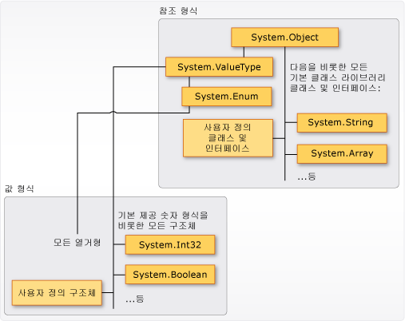

# <a name="types-c-programming-guide"></a>형식(C# 프로그래밍 가이드)
## <a name="types-variables-and-values"></a>형식, 변수 및 값  
 C#은 강력한 형식의 언어입니다. 모든 변수 및 상수에는 값으로 계산되는 모든 식을 실행하는 형식이 있습니다. 모든 메서드 시그니처는 각 입력 매개 변수 및 반환 값의 형식을 지정합니다. .NET Framework 클래스 라이브러리는 기본 제공 숫자 형식 집합 및 날짜, 개체의 배열, 컬렉션, 네트워크 연결, 파일 시스템과 같은 더 복잡한 형식을 정의합니다. 일반 C# 프로그램에서는 클래스 라이브러리의 형식 및 프로그램의 문제 도메인에 관련된 개념을 모델링하는 사용자 정의 형식을 사용합니다.  
  
 형식에 저장된 정보에는 다음이 포함될 수 있습니다.  
  
-   형식 변수에 필요한 저장소 공간.  
  
-   형식이 나타낼 수 있는 최대값 및 최소값.  
  
-   형식에 포함되는 멤버(메서드, 필드, 이벤트 등).  
  
-   형식이 상속하는 기본 형식.  
  
-   런타임에 변수에 대한 메모리가 할당될 위치.  
  
-   허용되는 작업 유형.  
  
 컴파일러는 형식 정보를 사용하여 코드에서 수행되는 모든 작업이 *형식이 안전*한지 확인합니다. 예를 들어 [int](../../../csharp/language-reference/keywords/int.md) 형식의 변수를 선언할 경우 컴파일러를 통해 더하기 및 빼기 작업에서 변수를 사용할 수 있습니다. [bool](../../../csharp/language-reference/keywords/bool.md) 형식의 변수에 대해 같은 작업을 수행하려고 하면 컴파일러는 다음 예제와 같이 오류를 생성합니다.  
  
 [!code-csharp[csProgGuideTypes#42](../../../csharp/programming-guide/nullable-types/codesnippet/CSharp/index_1.cs)]  
  
> [!NOTE]
>  C 및 C++ 개발자는 C#에서 [bool](../../../csharp/language-reference/keywords/bool.md)이 [int](../../../csharp/language-reference/keywords/int.md)로 변환될 수 없음을 알고 있습니다.  
  
 컴파일러는 형식 정보를 실행 파일에 메타데이터로 포함합니다. CLR(공용 언어 런타임)는 런타임에 이 메타데이터를 사용하여 메모리를 할당 및 회수할 때 형식 안정성을 추가로 보장합니다.  
  
### <a name="specifying-types-in-variable-declarations"></a>변수 선언에서 형식 지정  
 프로그램에서 변수나 상수를 선언할 때 컴파일러가 형식을 유추하게 하려면 형식을 지정하거나 [var](../../../csharp/language-reference/keywords/var.md) 키워드를 사용해야 합니다. 다음 예제에서는 기본 제공 숫자 형식 및 복잡한 사용자 정의 형식을 둘 다 사용하는 일부 변수 선언을 보여 줍니다.  
  
 [!code-csharp[csProgGuideTypes#36](../../../csharp/programming-guide/nullable-types/codesnippet/CSharp/index_2.cs)]  
  
 메서드 매개 변수 및 반환 값의 형식은 메서드 시그니처에서 지정됩니다. 다음 시그니처는 입력 인수로 [int](../../../csharp/language-reference/keywords/int.md)가 필요하고 문자열을 반환하는 메서드를 보여 줍니다.  
  
 [!code-csharp[csProgGuideTypes#35](../../../csharp/programming-guide/nullable-types/codesnippet/CSharp/index_3.cs)]  
  
 변수가 선언된 후에는 새 형식으로 다시 선언될 수 없고 선언된 형식과 호환되지 않는 값이 할당될 수 없습니다. 예를 들어 [int](../../../csharp/language-reference/keywords/int.md)를 선언하고 [true](../../../csharp/language-reference/keywords/true-literal.md)의 부울 값을 여기에 할당할 수 있습니다. 그러나 값은 새 변수에 할당되거나 메서드 인수로 전달될 경우 다른 형식으로 변환할 수 있습니다. 데이터 손실을 일으키지 않는 *형식 변환*은 컴파일러에서 자동으로 수행됩니다. 데이터 손실을 일으킬 수 있는 변환의 경우 소스 코드에 *캐스트*가 있어야 합니다.  
  
 자세한 내용은 [캐스팅 및 형식 변환](../../../csharp/programming-guide/types/casting-and-type-conversions.md)을 참조하세요.  
  
## <a name="built-in-types"></a>기본 제공 형식  
 C#에서는 정수, 부동 소수점 값, 부울 식, 텍스트 문자, 10진수 값 및 기타 데이터 형식을 표현하는 기본 제공 숫자 형식의 표준 집합을 제공합니다. 이 밖에도 기본 제공 `string` 및 `object` 형식이 있습니다. 이러한 형식을 모든 C# 프로그램에서 사용할 수 있습니다. 기본 제공 형식에 대한 자세한 내용은 [형식 참조 테이블](../../../csharp/language-reference/keywords/reference-tables-for-types.md)을 참조하세요.  
  
## <a name="custom-types"></a>사용자 지정 형식  
 [struct](../../../csharp/language-reference/keywords/struct.md), [class](../../../csharp/language-reference/keywords/class.md), [interface](../../../csharp/language-reference/keywords/interface.md) 및 [enum](../../../csharp/language-reference/keywords/enum.md) 구문을 사용하여 자체 사용자 지정 형식을 만듭니다. .NET Framework 클래스 라이브러리 자체는 자체 응용 프로그램에서 사용할 수 있는 Microsoft에서 제공되는 사용자 지정 형식의 컬렉션입니다. 기본적으로 클래스 라이브러리의 가장 자주 사용되는 형식을 모든 C# 프로그램에서 사용할 수 있습니다. 기타 형식은 정의되어 있는 어셈블리에 대한 프로젝트 참조를 명시적으로 추가할 경우에만 사용할 수 있습니다. 컴파일러에 어셈블리에 대한 참조가 포함된 후에는 소스 코드에서 해당 어셈블리에 선언된 형식의 변수(및 상수)를 선언할 수 있습니다. 자세한 내용은 [.NET Framework 클래스 라이브러리](http://go.microsoft.com/fwlink/?LinkID=217856)를 참조하세요.  
  
## <a name="the-common-type-system"></a>공용 형식 시스템.  
 [!INCLUDE[dnprdnshort](~/includes/dnprdnshort-md.md)]의 형식 시스템에 대한 두 가지 기초 사항을 이해해야 합니다.  
  
-   형식 시스템은 상속 원칙을 지원합니다. 형식은 *기본 형식*이라는 다른 형식에서 파생될 수 있습니다. 파생 형식은 기본 형식의 메서드, 속성 및 기타 멤버를 상속합니다(몇 가지 제한 사항 있음). 기본 형식이 다른 형식에서 파생될 수도 있습니다. 이 경우 파생 형식은 상속 계층 구조에 있는 두 기본 형식의 멤버를 상속합니다. <xref:System.Int32?displayProperty=nameWithType>(C# 키워드: [int](../../../csharp/language-reference/keywords/int.md))와 같은 기본 제공 숫자 형식을 포함한 모든 형식은 기본적으로 단일 기본 형식 <xref:System.Object?displayProperty=nameWithType>(C# 키워드: [object](../../../csharp/language-reference/keywords/object.md))에서 파생됩니다. 이 통합 형식 계층 구조를 CTS([공용 형식 시스템](../../../standard/base-types/common-type-system.md))라고 합니다. C#의 상속에 대한 자세한 내용은 [상속](../../../csharp/programming-guide/classes-and-structs/inheritance.md)을 참조하세요.  
  
-   CTS의 각 형식은 *값 형식* 또는 *참조 형식*으로 정의됩니다. 여기에는 .NET Framework 클래스 라이브러리의 모든 사용자 지정 형식과 자체 사용자 지정 형식도 포함됩니다. [struct](../../../csharp/language-reference/keywords/struct.md)를 사용하여 정의한 형식은 값 형식이고, 모든 기본 제공 숫자 형식은 `structs`입니다. [class](../../../csharp/language-reference/keywords/class.md) 키워드를 사용하여 정의한 형식은 참조 형식입니다. 참조 형식과 값 형식의 컴파일 타임 규칙 및 런타임 동작은 서로 다릅니다.  
  
 다음 그림에서는 CTS에서 값 형식과 참조 형식 간의 관계를 보여 줍니다.  
  
   
CTS의 값 형식과 참조 형식  
  
> [!NOTE]
>  가장 일반적으로 사용되는 형식은 모두 <xref:System> 네임스페이스에 구성되어 있다는 사실을 알 수 있습니다. 그러나 형식이 포함된 네임스페이스는 형식이 값 형식인지 또는 참조 형식인지와 관련이 없습니다.  
  
### <a name="value-types"></a>값 형식  
 값 형식은 <xref:System.Object?displayProperty=nameWithType>에서 파생되는 <xref:System.ValueType?displayProperty=nameWithType>에서 파생됩니다. <xref:System.ValueType?displayProperty=nameWithType>에서 파생되는 형식에는 CLR의 특수 동작이 있습니다. 값 형식 변수에는 해당 값이 직접 포함되므로, 변수가 선언된 컨텍스트에 관계없이 메모리가 인라인으로 할당됩니다. 값 형식 변수에 대한 별도 힙 할당이나 가비지 수집 오버헤드는 없습니다.  
  
 값 형식에는 [struct](../../../csharp/language-reference/keywords/struct.md) 및 [enum](../../../csharp/language-reference/keywords/enum.md)의 두 가지 범주가 있습니다.  
  
 기본 제공 숫자 형식은 구조체이며, 액세스할 수 있는 속성과 메서드가 있습니다.  
  
```csharp  
// Static method on type Byte.  
byte b = Byte.MaxValue;  
```  
  
 하지만 단순 비집계 형식처럼 값을 선언하고 변수에 할당합니다.  
  
```csharp  
byte num = 0xA;  
int i = 5;  
char c = 'Z';  
```  
  
 값 형식은 *sealed*이므로, 예를 들어 <xref:System.Int32?displayProperty=nameWithType>에서 형식을 파생시킬 수 없으며 구조체는 <xref:System.ValueType?displayProperty=nameWithType>에서만 상속할 수 있기 때문에 사용자 정의 클래스 또는 구조체에서 상속하는 구조체를 정의할 수 없습니다. 그러나 구조체는 하나 이상의 인터페이스를 구현할 수 있습니다. 구조체 형식을 인터페이스 형식으로 캐스팅할 수 있습니다. 이 경우 *boxing* 작업은 관리되는 힙의 참조 형식 개체 내에 구조체를 래핑합니다. Boxing 작업은 <xref:System.Object?displayProperty=nameWithType>를 입력 매개 변수로 사용하는 메서드에 값 형식을 전달할 때 발생합니다. 자세한 내용은 [Boxing 및 Unboxing](../../../csharp/programming-guide/types/boxing-and-unboxing.md)을 참조하세요.  
  
 [struct](../../../csharp/language-reference/keywords/struct.md) 키워드를 사용하여 고유한 사용자 지정 값 형식을 만듭니다. 일반적으로 구조체는 다음 예제와 같이 소규모 관련 변수 집합의 컨테이너로 사용됩니다.  
  
 [!code-csharp[csProgGuideObjects#1](../../../csharp/programming-guide/classes-and-structs/codesnippet/CSharp/index_4.cs)]  
  
 구조체에 대한 자세한 내용은 [구조체](../../../csharp/programming-guide/classes-and-structs/structs.md)를 참조하세요. [!INCLUDE[dnprdnshort](~/includes/dnprdnshort-md.md)][CTS(공용 형식 시스템)](../../../standard/base-types/common-type-system.md)를 참조하세요.  
  
 값 형식의 다른 범주는 [enum](../../../csharp/language-reference/keywords/enum.md)입니다. 열거형은 명명된 정수 상수 집합을 정의합니다. 예를 들어 .NET Framework 클래스 라이브러리의 <xref:System.IO.FileMode?displayProperty=nameWithType> 열거형에는 파일을 여는 방법을 지정하는 명명된 상수 정수 집합이 포함됩니다. 이 패턴은 다음 예제와 같이 정의됩니다.  
 
 [!code-csharp[csProgGuideTypes#44](../../../csharp/programming-guide/nullable-types/codesnippet/CSharp/index_5.cs)]  
  
 `System.IO.FileMode.Create` 상수 값은 2입니다. 그러나 이 이름은 소스 코드를 읽는 사람에게 훨씬 더 의미가 있습니다. 따라서 상수 리터럴 숫자 대신 열거형을 사용하는 것이 더 좋습니다. 자세한 내용은 <xref:System.IO.FileMode?displayProperty=nameWithType>을 참조하십시오.  
  
 모든 열거형은 <xref:System.ValueType?displayProperty=nameWithType>에서 상속받는 <xref:System.Enum?displayProperty=nameWithType>에서 상속됩니다. 구조체에 적용되는 모든 규칙이 열거형에도 적용됩니다. 열거형에 대한 자세한 내용은 [열거형 형식](../../../csharp/programming-guide/enumeration-types.md)을 참조하세요.  
  
### <a name="reference-types"></a>참조 형식  
 [클래스](../../../csharp/language-reference/keywords/class.md), [대리자](../../../csharp/language-reference/keywords/delegate.md), 배열 또는 [인터페이스](../../../csharp/language-reference/keywords/interface.md)로 정의되는 형식은 *참조 형식*입니다. 런타임에 참조 형식의 변수를 선언하면 [new](../../../csharp/language-reference/keywords/new.md) 연산자를 사용하여 개체의 인스턴스를 명시적으로 만들거나 다음 예제와 같이 `new`를 사용하여 다른 곳에서 만들어진 개체를 할당할 때까지 변수에는 [null](../../../csharp/language-reference/keywords/null.md) 값이 포함됩니다.
  
```csharp  
MyClass mc = new MyClass();  
MyClass mc2 = mc;  
```  
   인터페이스는 구현하는 클래스 개체와 함께 초기화되어야 합니다. `MyClass`가 `IMyInterface`를 구현하는 경우 다음 예제와 같이 `IMyInterface`의 인스턴스를 만듭니다.  
  
```csharp  
IMyInterface iface = new MyClass();  
```  
  
 개체가 만들어지면 관리되는 힙에 메모리가 할당되고 변수에는 개체 위치에 대한 참조만 포함됩니다. 관리되는 힙의 형식은 할당될 때, 그리고 *가비지 수집*이라는 CLR의 자동 메모리 관리 기능에 의해 회수될 때 오버헤드가 필요합니다. 그러나 가비지 수집은 고도로 최적화되고 대부분 시나리오에서 성능 문제를 일으키지 않습니다. 가비지 수집에 대한 자세한 내용은 [자동 메모리 관리](../../../standard/automatic-memory-management.md)를 참조하세요.  
  
 모든 배열은 해당 요소가 값 형식이더라도 참조 형식입니다. 배열은 <xref:System.Array?displayProperty=nameWithType> 클래스에서 암시적으로 파생되지만 다음 예제와 같이 C#에서 제공하는 단순한 구문을 사용하여 배열을 선언하고 사용할 수 있습니다.  
  
 [!code-csharp[csProgGuideTypes#45](../../../csharp/programming-guide/nullable-types/codesnippet/CSharp/index_6.cs)]  
  
 참조 형식은 상속을 완벽하게 지원합니다. 클래스를 만들 때 [sealed](../../../csharp/language-reference/keywords/sealed.md)로 정의되지 않은 기타 인터페이스 또는 클래스에서 상속될 수 있고 기타 클래스는 직접 만든 클래스에서 상속되고 가상 메서드를 재정의할 수 있습니다. 클래스를 직접 만드는 방법에 대한 자세한 내용은 [클래스 및 구조체](../../../csharp/programming-guide/classes-and-structs/index.md)를 참조하세요. 상속 및 가상 메서드에 대한 자세한 내용은 [상속](../../../csharp/programming-guide/classes-and-structs/inheritance.md)을 참조하세요.  
  
## <a name="types-of-literal-values"></a>리터럴 값 형식  
 C#에서는 리터럴 값이 컴파일러에서 형식을 받습니다. 숫자의 끝에 문자를 추가하여 숫자 리터럴의 입력 방법을 지정할 수 있습니다. 예를 들어 값 4.56이 float로 처리되도록 지정하려면 숫자 뒤에 "f" 또는 "F"를 추가합니다(`4.56f`). 문자를 추가하지 않으면 컴파일러가 리터럴의 형식을 유추합니다. 문자 접미사와 함께 지정할 수 있는 형식에 대한 자세한 내용은 [값 형식](../../../csharp/language-reference/keywords/value-types.md)에서 개별 형식의 참조 페이지를 참조하세요.  
  
 리터럴은 형식화되고 모든 형식이 궁극적으로 <xref:System.Object?displayProperty=nameWithType>에서 파생되기 때문에 다음과 같은 코드를 작성하고 컴파일할 수 있습니다.  
  
 [!code-csharp[csProgGuideTypes#37](../../../csharp/programming-guide/nullable-types/codesnippet/CSharp/index_7.cs)]  
  
## <a name="generic-types"></a>제네릭 형식  
 클라이언트 코드가 형식의 인스턴스를 만들 때 제공하는 실제 형식(*구체적 형식*)에 대한 자리 표시자로 사용되는 하나 이상의 *형식 매개 변수*를 사용하여 형식을 선언할 수 있습니다. 해당 형식을 *제네릭 형식*이라고 합니다. 예를 들어 .NET Framework 형식 <xref:System.Collections.Generic.List%601?displayProperty=nameWithType>에는 변환을 통해 이름 *T*가 제공되는 하나의 형식 매개 변수가 있습니다. 형식의 인스턴스를 만들 때 목록에 포함될 개체의 형식(예: 문자열)을 지정합니다.  
 
```csharp
List<string> stringList = new List<string>();
stringList.Add("String example");
// compile time error adding a type other than a string:
stringList.Add(4);
```
 형식 매개 변수를 사용하면 각 요소를 [개체](../../../csharp/language-reference/keywords/object.md)로 변환할 필요 없이 같은 클래스를 재사용하여 요소 형식을 포함할 수 있습니다. 컴파일러는 컬렉션 요소의 특정 형식을 인식하며, 예를 들어 이전 예제에서 `strings` 개체에 정수를 추가하려는 경우 컴파일 시간에 오류를 발생시킬 수 있기 때문에 제네릭 컬렉션 클래스를 *강력한 형식의 컬렉션*이라고 합니다. 자세한 내용은 [제네릭](../../../csharp/programming-guide/generics/index.md)을 참조하세요.  
  
## <a name="implicit-types-anonymous-types-and-nullable-types"></a>암시적 형식, 무명 형식 및 Null 허용 형식  
 앞에서 설명한 대로 [var](../../../csharp/language-reference/keywords/var.md) 키워드를 사용하여 클래스 멤버가 아닌 로컬 변수를 암시적으로 형식화할 수 있습니다. 이 변수는 컴파일 타임에 형식을 받지만 형식은 컴파일러에서 제공됩니다. 자세한 내용은 [암시적으로 형식화된 지역 변수](../../../csharp/programming-guide/classes-and-structs/implicitly-typed-local-variables.md)를 참조하세요.  
  
 경우에 따라 저장하거나 메서드 경계 외부로 전달할 의도가 없는 관련 값의 단순 집합에 대한 명명된 형식을 만드는 것은 불편합니다. 이 목적으로는 *무명 형식*을 만들 수 있습니다. 자세한 내용은 [무명 형식](../../../csharp/programming-guide/classes-and-structs/anonymous-types.md)을 참조하세요.  
  
 일반적인 값 형식은 [null](../../../csharp/language-reference/keywords/null.md) 값을 가질 수 없습니다. 그러나 형식 뒤에 `?`를 추가하면 null 허용 값 형식을 예를 들어 `int?`는 [null](../../../csharp/language-reference/keywords/null.md) 값을 가질 수도 있는 `int` 형식입니다. CTS에서 Nullable 형식은 제네릭 구조체 형식 <xref:System.Nullable%601?displayProperty=nameWithType>의 인스턴스입니다. Nullable 형식은 특히 숫자 값이 null일 수 있는 데이터베이스에 데이터를 전달하는 경우에 유용합니다. 자세한 내용은 [Null 허용 형식](../../../csharp/programming-guide/nullable-types/index.md)을 참조하세요.  
  
## <a name="related-sections"></a>관련 단원  
 자세한 내용은 다음 항목을 참조하세요.  
  
-   [캐스팅 및 형식 변환](../../../csharp/programming-guide/types/casting-and-type-conversions.md)  
  
-   [boxing 및 unboxing](../../../csharp/programming-guide/types/boxing-and-unboxing.md)  
  
-   [dynamic 형식 사용](../../../csharp/programming-guide/types/using-type-dynamic.md)  
  
-   [값 형식](../../../csharp/language-reference/keywords/value-types.md)  
  
-   [참조 형식](../../../csharp/language-reference/keywords/reference-types.md)  
  
-   [클래스 및 구조체](../../../csharp/programming-guide/classes-and-structs/index.md)  
  
-   [익명 형식](../../../csharp/programming-guide/classes-and-structs/anonymous-types.md)  
  
-   [제네릭](../../../csharp/programming-guide/generics/index.md)  

## <a name="c-language-specification"></a>C# 언어 사양  
 [!INCLUDE[CSharplangspec](~/includes/csharplangspec-md.md)]  
  
## <a name="see-also"></a>참고 항목  
 [C# 참조](../../../csharp/language-reference/index.md)  
 [C# 프로그래밍 가이드](../../../csharp/programming-guide/index.md)  
 [XML 데이터 형식 변환](../../../standard/data/xml/conversion-of-xml-data-types.md)  
 [정수 계열 형식 표](../../../csharp/language-reference/keywords/integral-types-table.md)
