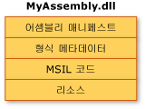
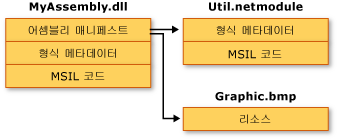

# 어셈블리 콘텐츠
일반적으로 정적 어셈블리는 네 가지 요소로 구성됩니다.  
  
-   어셈블리 메타데이터를 포함하는 [어셈블리 매니페스트](../../../docs/framework/app-domains/assembly-manifest.md)  
  
-   형식 메타데이터  
  
-   형식을 구현하는 MSIL(Microsoft Intermediate Language) 코드  
  
-   리소스 집합  
  
 어셈블리 매니페스트만 있으면 되지만, 어셈블리에 의미 있는 기능을 부여하려면 형식 또는 리소스가 필요합니다.  
  
 어셈블리의 요소를 그룹화하는 방법에는 여러 가지가 있습니다. 다음 예제에서와 같이 모든 요소를 하나의 실제 파일에 그룹화할 수 있습니다.  
  
   
단일 파일 어셈블리  
  
 어셈블리의 요소를 여러 파일에 그룹화할 수도 있는데 이러한 파일에는 컴파일된 코드의 모듈(.netmodule), 리소스(.bmp 또는 .jpg 파일), 응용 프로그램에 필요한 기타 파일 등이 있습니다. 다중 파일 어셈블리는, 서로 다른 언어로 작성된 모듈을 결합하거나 응용 프로그램 다운로드 작업을 최적화할 수 있도록 필요할 때만 다운로드하는 모듈 안에 자주 사용하지 않는 형식을 그룹화할 때 사용됩니다.  
  
 다음 그림에서는 가상의 응용 프로그램에 대해 일부 유틸리티 코드를 다른 모듈로 분리하고 원래 파일에 큰 리소스 파일(이 경우에는 .bmp 이미지)을 두었습니다. .NET Framework에서는 파일이 참조될 때만 파일을 다운로드합니다. 이와 같이 자주 참조되지 않는 코드를 응용 프로그램과 분리된 다른 파일에 보관함으로써 코드 다운로드를 최적화할 수 있습니다.  
  
   
다중 파일 어셈블리  
  
> [!NOTE]
>  파일 시스템은 다중 파일 어셈블리를 구성하는 파일을 실제로 연결하지 않습니다. 이들 파일은 어셈블리 매니페스트를 통해 연결되며, 공용 언어 런타임은 이들 파일을 하나의 단위로 관리합니다.  
  
 이 그림에서는 MyAssembly.dll에 포함된 어셈블리 매니페스트에 설명된 대로, 세 개 파일 모두 어셈블리에 속하지만 파일 시스템에서는 이들 파일을 세 개의 별도 파일로 인식합니다. Util.netmodule 파일은 아무런 어셈블리 정보를 포함하지 않기 때문에 모듈로 컴파일되었습니다. 어셈블리가 만들어질 때 MyAssembly.dll과 Util.netmodule 및 Graphic.bmp와의 관계를 나타내도록 어셈블리 매니페스트가 MyAssembly.dll에 추가되었습니다.  
  
 소스 코드를 디자인하는 경우 응용 프로그램의 기능을 하나 이상의 파일로 분리하는 방법에 대해 명시적으로 결정해야 합니다. 또한 .NET Framework 코드를 디자인하는 경우에도 해당 기능을 하나 이상의 어셈블리로 분리하는 방법에 대해 결정해야 합니다.  
  
## 참고 항목  
 [공용 언어 런타임의 어셈블리](../../../docs/framework/app-domains/assemblies-in-the-common-language-runtime.md)  
 [어셈블리 매니페스트](../../../docs/framework/app-domains/assembly-manifest.md)  
 [어셈블리 보안 고려 사항](../../../docs/framework/app-domains/assembly-security-considerations.md)
