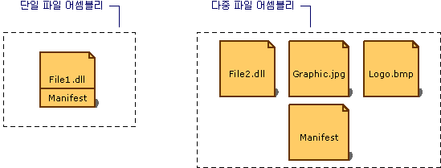

# 어셈블리 매니페스트
정적 또는 동적 어셈블리인지 여부에 상관 없이 모든 어셈블리는 어셈블리의 요소가 서로 어떻게 연관되는지를 설명하는 데이터 컬렉션을 포함합니다. 이러한 어셈블리 메타데이터는 어셈블리 매니페스트에 들어 있습니다. 어셈블리 매니페스트는 어셈블리의 버전 요구 사항과 보안 ID를 지정하는 데 필요한 모든 메타데이터와 어셈블리의 범위를 정의하고 리소스나 클래스에 대한 참조를 확인하는 데 필요한 모든 메타데이터를 포함합니다. 어셈블리 매니페스트는 MSIL(Microsoft Intermediate Language)로 PE 파일(.exe 또는 .dll)에 저장되거나 어셈블리 매니페스트 정보만 포함하는 독립 실행형 PE 파일에 저장됩니다.  
  
 다음 예제에서는 매니페스트를 저장하는 여러 가지 방법을 보여 줍니다.  
  
   
어셈블리 종류  
  
 하나의 연관 파일을 갖는 어셈블리의 경우, 매니페스트는 PE 파일에 포함되어 단일 파일 어셈블리를 구성합니다. 독립 실행형 매니페스트 파일을 만들거나 어셈블리의 PE 파일 중 하나에 매니페스트를 포함시키면 다중 파일 어셈블리를 만들 수 있습니다.  
  
 각 어셈블리의 매니페스트는 다음 기능을 수행합니다.  
  
-   어셈블리를 구성하고 있는 파일을 열거합니다.  
  
-   어셈블리의 형식 및 리소스로의 참조가 해당 선언 및 구현이 포함된 파일에 매핑되는 방법을 관리합니다.  
  
-   어셈블리가 종속된 다른 어셈블리를 열거합니다.  
  
-   어셈블리 소비자와 어셈블리의 구현 정보 간의 간접 참조 수준을 제공합니다.  
  
-   어셈블리가 자체 설명되도록 렌더링합니다.  
  
## 어셈블리 매니페스트 내용  
 다음 표에서는 어셈블리 매니페스트에 포함되는 정보를 보여 줍니다. 어셈블리의 ID는 처음 네 개 항목(어셈블리 이름, 버전 번호, 문화권 및 강력한 이름 정보)으로 구성됩니다.  
  
|정보|설명|  
|-----------------|-----------------|  
|어셈블리 이름|어셈블리의 이름을 나타내는 텍스트 문자열입니다.|  
|버전 번호|주 버전 번호와 부 버전 번호 및 수정 번호와 빌드 번호입니다. 공용 언어 런타임은 이들 번호를 사용하여 버전 정책을 적용합니다.|  
|문화권|어셈블리에서 지원하는 문화권 또는 언어입니다. 이 정보는 특정 어셈블리를 문화권 또는 언어 관련 정보를 포함하는 위성 어셈블리로 지정할 때만 사용해야 합니다. 문화권 정보를 포함하는 어셈블리는 자동으로 위성 어셈블리로 간주됩니다.|  
|강력한 이름 정보|어셈블리에 강력한 이름을 지정하는 경우 게시자의 공개 키.|  
|어셈블리에 포함된 파일 목록|어셈블리에 포함된 각 파일의 해시와 파일 이름입니다. 어셈블리를 구성하는 모든 파일은 어셈블리 매니페스트가 포함된 파일과 동일한 디렉터리에 위치해야 합니다.|  
|형식 참조 정보|이 정보는 형식 참조를 해당 선언 및 구현이 포함된 파일에 매핑하는 데 사용되며 어셈블리에서 내보내는 형식에 대해 사용됩니다.|  
|참조된 어셈블리에 대한 정보|어셈블리에서 정적으로 참조하는 다른 어셈블리의 목록입니다. 각 참조는 종속 어셈블리의 이름, 어셈블리 메타데이터(버전, 문화권, 운영 체제 등) 및 공개 키(강력한 이름의 어셈블리인 경우)를 포함합니다.|  
  
 코드에서 어셈블리 특성을 사용하여 어셈블리 매니페스트에 있는 정보를 추가하거나 변경할 수 있습니다. 버전 정보나 정보 특성(상표, 저작권, 제품, 회사, 정보 버전 등)을 변경할 수 있습니다. 어셈블리 특성에 대한 전체 목록은 [어셈블리 특성 설정](../../../docs/framework/app-domains/set-assembly-attributes.md)을 참조하세요.  
  
## 참고 항목  
 [어셈블리 콘텐츠](../../../docs/framework/app-domains/assembly-contents.md)  
 [어셈블리 버전 관리](../../../docs/framework/app-domains/assembly-versioning.md)  
 [위성 어셈블리 만들기](../../../docs/framework/resources/creating-satellite-assemblies-for-desktop-apps.md)  
 [강력한 이름의 어셈블리](../../../docs/framework/app-domains/strong-named-assemblies.md)
