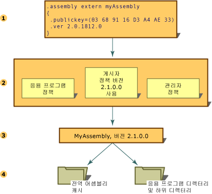

# 어셈블리 버전 관리
공용 언어 런타임을 사용하는 어셈블리에 대한 모든 버전 관리는 어셈블리 수준에서 수행됩니다. 특정 어셈블리의 버전과 해당 종속 어셈블리 버전은 어셈블리 매니페스트에 기록됩니다. 런타임에서의 버전 정책은, 구성 파일(응용 프로그램 구성 파일, 게시자 정책 파일 및 컴퓨터의 관리자 구성 파일)의 명시적인 버전 정책에 의해 재정의된 경우를 제외하고는, 처음 빌드되고 테스트될 때 사용된 버전으로만 응용 프로그램이 실행되도록 합니다.  
  
> [!NOTE]
>  버전 관리는 강력한 이름이 지정된 어셈블리에만 적용됩니다.  
  
 런타임에서는 어셈블리 바인딩 요청을 단계적으로 확인합니다.  
  
1.  바인딩할 어셈블리의 버전을 결정하기 위해 원래의 어셈블리 참조를 확인합니다.  
  
2.  버전 정책을 적용하기 위해 적용 가능한 모든 구성 파일을 확인합니다.  
  
3.  원래의 어셈블리 참조 및 구성 파일에 지정된 모든 리디렉션으로부터 정확한 어셈블리를 확인한 다음 호출 어셈블리에 바인딩할 버전을 결정합니다.  
  
4.  전역 어셈블리 캐시와 구성 파일에 지정된 코드 베이스를 확인한 다음 [런타임에서 어셈블리를 찾는 방법](../../../docs/framework/deployment/how-the-runtime-locates-assemblies.md)에 설명된 규칙에 따라 응용 프로그램의 디렉터리 및 하위 디렉터리를 검색합니다.  
  
 다음 예제에서는 이들 단계를 설명합니다.  
  
   
어셈블리 바인딩 요청 확인  
  
 응용 프로그램 구성에 대한 자세한 내용은 [앱 구성](../../../docs/framework/configure-apps/index.md)을 참조하세요. 바인딩 정책에 대한 자세한 내용은 [런타임에서 어셈블리를 찾는 방법](../../../docs/framework/deployment/how-the-runtime-locates-assemblies.md)을 참조하세요.  
  
## 버전 정보  
 각 어셈블리는 서로 다른 두 가지 방법으로 버전 정보를 표시합니다.  
  
-   어셈블리의 버전 번호는 어셈블리의 이름 및 문화권 정보와 함께 어셈블리 ID를 구성합니다. 이 번호는 런타임에서 버전 정책을 적용하는 데 사용되며 또한 런타임에서의 형식 확인 절차에 중요한 역할을 합니다.  
  
-   정보 버전은 버전에 대한 추가 정보를 나타내는 문자열로서, 정보 제공의 목적으로만 사용됩니다.  
  
### 어셈블리 버전 번호  
 각 어셈블리는 ID의 일부로 버전 정보를 갖습니다. 따라서, 런타임에서는 두 개 어셈블리의 버전 번호가 다르면 이들 어셈블리가 서로 완전히 다른 것으로 간주합니다. 이 버전 번호는 다음과 같은 네 부분의 문자열로 구성됩니다.  
  
 \<*주 버전*>.\<*부 버전*>.\<*빌드 번호*>.\<*수정*>  
  
 예를 들어, 버전 1.5.1254.0에서 1은 주 버전, 5는 부 버전, 1254는 빌드 번호 그리고 0은 수정 번호를 나타냅니다.  
  
 버전 번호는 다른 ID 정보(어셈블리 이름, 공개 키, 해당 응용 프로그램과 연관된 다른 어셈블리의 ID 및 관계 등)와 함께 매니페스트에 저장됩니다.  
  
 어셈블리를 빌드할 때 개발 도구는 참조되는 각 어셈블리에 대한 종속 정보를 어셈블리 매니페스트에 기록합니다. 런타임에서는 관리자, 응용 프로그램 또는 게시자에서 설정한 구성 정보와 함께 이러한 버전 번호를 사용하여, 참조되는 어셈블리의 올바른 버전을 로드합니다.  
  
 런타임에서는 버전 관리를 위해 일반 어셈블리와 강력한 이름의 어셈블리를 구분합니다. 버전 확인은 강력한 이름의 어셈블리에 대해서만 수행됩니다.  
  
 버전 바인딩 정책 지정에 대한 자세한 내용은 [앱 구성](../../../docs/framework/configure-apps/index.md)을 참조하세요. 런타임에서 버전 정보를 사용하여 특정 어셈블리를 찾는 방법에 대한 자세한 내용은 [런타임에서 어셈블리를 찾는 방법](../../../docs/framework/deployment/how-the-runtime-locates-assemblies.md)을 참조하세요.  
  
### 어셈블리 정보 버전  
 정보 버전은 추가적인 버전 정보를 제공하는 문자열로서, 정보 제공의 목적으로만 사용되며 런타임에는 사용되지 않습니다. 이 텍스트 기반 정보 버전에는 제품의 마케팅 정보, 패키징, 제품 이름 등이 포함되며, 런타임에는 사용되지 않습니다. 예를 들어, 정보 버전은 "공용 언어 런타임 버전1.0" 또는 "NET Control SP 2"가 될 수 있습니다. Microsoft Windows의 파일 속성 대화 상자에서 버전 탭의 "제품 버전" 항목에 이 정보가 표시됩니다.  
  
> [!NOTE]
>  임의의 텍스트를 지정할 수 있지만, 문자열이 어셈블리 버전 번호에서 사용하는 형식이 아니거나 이러한 형식이더라도 와일드카드가 포함된 경우 컴파일할 때 경고 메시지가 나타납니다. 이 경고는 무시해도 됩니다.  
  
 정보 버전은 사용자 지정 특성인 <xref:System.Reflection.AssemblyInformationalVersionAttribute?displayProperty=fullName>를 사용하여 나타냅니다. 정보 버전 특성에 대한 자세한 내용은 [어셈블리 특성 설정](../../../docs/framework/app-domains/set-assembly-attributes.md)을 참조하세요.  
  
## 참고 항목  
 [런타임에서 어셈블리를 찾는 방법](../../../docs/framework/deployment/how-the-runtime-locates-assemblies.md)   
 [앱 구성](../../../docs/framework/configure-apps/index.md)   
 [어셈블리 특성 설정](../../../docs/framework/app-domains/set-assembly-attributes.md)   
 [공용 언어 런타임의 어셈블리](../../../docs/framework/app-domains/assemblies-in-the-common-language-runtime.md)

