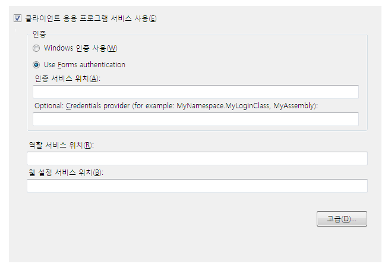
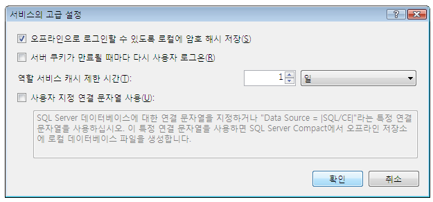

# <a name="how-to-configure-client-application-services"></a><span data-ttu-id="c58d8-102">방법: 클라이언트 응용 프로그램 서비스 구성</span><span class="sxs-lookup"><span data-stu-id="c58d8-102">How to: Configure Client Application Services</span></span>
<span data-ttu-id="c58d8-103">이 항목에서는 [!INCLUDE[vsprvs](../../../includes/vsprvs-md.md)] **프로젝트 디자이너**를 사용하여 클라이언트 응용 프로그램 서비스를 사용하도록 설정하고 구성하는 방법을 설명합니다.</span><span class="sxs-lookup"><span data-stu-id="c58d8-103">This topic describes how to use the [!INCLUDE[vsprvs](../../../includes/vsprvs-md.md)] **Project Designer** to enable and configure client application services.</span></span> <span data-ttu-id="c58d8-104">클라이언트 응용 프로그램 서비스를 사용하면 기존 [!INCLUDE[ajax_current_short](../../../includes/ajax-current-short-md.md)] 응용 프로그램 서비스에서 사용자의 유효성을 검사하고 사용자 역할과 설정을 검색할 수 있습니다.</span><span class="sxs-lookup"><span data-stu-id="c58d8-104">You can use client application services to validate users and retrieve user roles and settings from an existing [!INCLUDE[ajax_current_short](../../../includes/ajax-current-short-md.md)] application service.</span></span> <span data-ttu-id="c58d8-105">구성 후에는 [클라이언트 응용 프로그램 서비스 개요](../../../docs/framework/common-client-technologies/client-application-services-overview.md)의 설명에 따라 응용 프로그램 코드에서 사용하도록 설정된 서비스에 액세스할 수 있습니다.</span><span class="sxs-lookup"><span data-stu-id="c58d8-105">After configuration, you can access the enabled services in your application code as described in [Client Application Services Overview](../../../docs/framework/common-client-technologies/client-application-services-overview.md).</span></span> <span data-ttu-id="c58d8-106">[!INCLUDE[ajax_current_short](../../../includes/ajax-current-short-md.md)] 응용 프로그램 서비스에 대한 자세한 내용은 [ASP.NET 응용 프로그램 서비스 개요](http://msdn.microsoft.com/library/1162e529-0d70-44b2-b3ab-83e60c695013)를 참조하세요.</span><span class="sxs-lookup"><span data-stu-id="c58d8-106">For more information about the [!INCLUDE[ajax_current_short](../../../includes/ajax-current-short-md.md)] application services, see [ASP.NET Application Services Overview](http://msdn.microsoft.com/library/1162e529-0d70-44b2-b3ab-83e60c695013).</span></span>  
  
 <span data-ttu-id="c58d8-107">**프로젝트 디자이너**의 **서비스** 페이지에서 클라이언트 응용 프로그램 서비스를 사용하도록 설정하고 구성할 수 있습니다.</span><span class="sxs-lookup"><span data-stu-id="c58d8-107">You can enable and configure client application services on the **Services** page of the **Project Designer**.</span></span> <span data-ttu-id="c58d8-108">**서비스** 페이지에서 프로젝트 App.config 파일의 값을 업데이트합니다.</span><span class="sxs-lookup"><span data-stu-id="c58d8-108">The **Services** page updates values in your project's App.config file.</span></span> <span data-ttu-id="c58d8-109">**프로젝트 디자이너**에 액세스하려면 **프로젝트** 메뉴의 **속성** 명령을 사용합니다.</span><span class="sxs-lookup"><span data-stu-id="c58d8-109">To access the **Project Designer**, use the **Properties** command on the **Project** menu.</span></span> <span data-ttu-id="c58d8-110">**서비스** 페이지에 대한 자세한 내용은 [프로젝트 디자이너, 서비스 페이지](https://msdn.microsoft.com/library/bb398109)를 참조하세요.</span><span class="sxs-lookup"><span data-stu-id="c58d8-110">For more information about the **Services** page, see [Services Page, Project Designer](https://msdn.microsoft.com/library/bb398109).</span></span>  
  
 <span data-ttu-id="c58d8-111">다음 절차에서는 클라이언트 응용 프로그램 서비스에 대한 기본 구성을 수행하는 방법을 설명합니다.</span><span class="sxs-lookup"><span data-stu-id="c58d8-111">The following procedure describes how to perform basic configuration for client application services.</span></span> <span data-ttu-id="c58d8-112">고급 구성 옵션에 대해서는 이후 섹션에서 설명합니다.</span><span class="sxs-lookup"><span data-stu-id="c58d8-112">Advanced configuration options are described in later sections.</span></span>  
  
### <a name="to-configure-client-application-services"></a><span data-ttu-id="c58d8-113">클라이언트 응용 프로그램 서비스를 구성하려면</span><span class="sxs-lookup"><span data-stu-id="c58d8-113">To configure client application services</span></span>  
  
1.  <span data-ttu-id="c58d8-114">**솔루션 탐색기**에서 프로젝트 노드를 선택하고, **프로젝트** 메뉴에서 **속성**을 클릭합니다.</span><span class="sxs-lookup"><span data-stu-id="c58d8-114">In **Solution Explorer**, select a project node and then on the **Project** menu, click **Properties**.</span></span>  
  
     <span data-ttu-id="c58d8-115">**프로젝트 디자이너**가 표시됩니다.</span><span class="sxs-lookup"><span data-stu-id="c58d8-115">The **Project Designer** appears.</span></span>  
  
2.  <span data-ttu-id="c58d8-116">**서비스** 탭을 클릭합니다. 다음 그림과 같이 **서비스** 페이지가 표시됩니다.</span><span class="sxs-lookup"><span data-stu-id="c58d8-116">Click the **Services** tab. The **Services** page appears, as shown in the following illustration.</span></span>  
  
     <span data-ttu-id="c58d8-117"></span><span class="sxs-lookup"><span data-stu-id="c58d8-117"></span></span>  
  
3.  <span data-ttu-id="c58d8-118">**서비스** 페이지에서 **클라이언트 응용 프로그램 서비스 사용**을 선택합니다.</span><span class="sxs-lookup"><span data-stu-id="c58d8-118">On the **Services** page, select **Enable client application services**.</span></span>  
  
    > [!NOTE]
    >  <span data-ttu-id="c58d8-119">클라이언트 응용 프로그램 서비스를 사용하려면 .NET Framework 정식 버전이 필요합니다. .NET Framework Client Profile에서는 클라이언트 응용 프로그램 서비스가 지원되지 않습니다.</span><span class="sxs-lookup"><span data-stu-id="c58d8-119">Client application services require the full version of the .NET Framework, and are not supported in the .NET Framework Client Profile.</span></span> <span data-ttu-id="c58d8-120">**클라이언트 응용 프로그램 서비스 사용** 확인란이 사용하지 않도록 설정되어 있으면 **대상 프레임워크**가 .NET Framework 3.5 이상으로 설정되어 있는지 확인합니다.</span><span class="sxs-lookup"><span data-stu-id="c58d8-120">If the **Enable client application services** check box is disabled, verify that the **Target framework** is set to the .NET Framework 3.5 or later.</span></span> <span data-ttu-id="c58d8-121">C#에서 **대상 프레임워크** 설정을 확인하려면 프로젝트 디자이너를 열고 **응용 프로그램** 페이지를 클릭합니다.</span><span class="sxs-lookup"><span data-stu-id="c58d8-121">To view the **Target framework** setting in C#, open the Project Designer and then click the **Application** page.</span></span> <span data-ttu-id="c58d8-122">Visual Basic에서 **대상 프레임워크** 설정을 확인하려면 프로젝트 디자이너를 열고 **컴파일** 페이지를 클릭한 다음 **고급 컴파일 옵션**을 클릭합니다.</span><span class="sxs-lookup"><span data-stu-id="c58d8-122">To view the **Target framework** setting in Visual Basic, open the Project Designer, click the **Compile** page, and then click **Advanced Compile Options**.</span></span>  
  
4.  <span data-ttu-id="c58d8-123">고유한 로그인 컨트롤 또는 대화 상자를 제공하려면 **양식 인증 사용**을 선택하고, 운영 체제에서 제공하는 ID를 사용하려면 **Windows 인증 사용**을 선택합니다.</span><span class="sxs-lookup"><span data-stu-id="c58d8-123">Select **Use Forms authentication** if you plan to provide your own login controls or dialog box, or select **Use Windows authentication** to use the identity supplied by the operating system.</span></span> <span data-ttu-id="c58d8-124">자세한 내용은 [클라이언트 응용 프로그램 서비스 개요](../../../docs/framework/common-client-technologies/client-application-services-overview.md)를 참조하세요.</span><span class="sxs-lookup"><span data-stu-id="c58d8-124">For more information, see [Client Application Services Overview](../../../docs/framework/common-client-technologies/client-application-services-overview.md).</span></span>  
  
    > [!NOTE]
    >  <span data-ttu-id="c58d8-125">**Windows 인증 사용**을 선택하는 경우 클라이언트 응용 프로그램 서비스는 SQL Server Compact 데이터베이스를 사용하도록 자동으로 구성됩니다.</span><span class="sxs-lookup"><span data-stu-id="c58d8-125">If you select **Use Windows authentication**, client application services will automatically be configured to use a SQL Server Compact database.</span></span> <span data-ttu-id="c58d8-126">이 설정은 다음 섹션에서 설명하는 것처럼 **서비스의 고급 설정** 대화 상자에 표시됩니다.</span><span class="sxs-lookup"><span data-stu-id="c58d8-126">This is indicated in the **Advanced Settings for Services** dialog box as described in the next section.</span></span> <span data-ttu-id="c58d8-127">**양식 인증 사용**을 선택하는 경우에는 **사용자 지정 연결 문자열 사용** 설정의 선택이 자동으로 취소되지 않습니다.</span><span class="sxs-lookup"><span data-stu-id="c58d8-127">If you then select **Use Forms authentication**, the **Use custom connection string** setting will not be cleared automatically.</span></span> <span data-ttu-id="c58d8-128">Windows 인증에 사용할 [!INCLUDE[ssEW](../../../includes/ssew-md.md)] 데이터베이스가 이미 생성된 경우에는 이로 인해 오류가 발생할 수 있습니다.</span><span class="sxs-lookup"><span data-stu-id="c58d8-128">This could result in errors if the [!INCLUDE[ssEW](../../../includes/ssew-md.md)] database has already been generated for use with Windows authentication.</span></span> <span data-ttu-id="c58d8-129">이러한 오류를 해결하려면 **서비스의 고급 설정** 대화 상자에서 **사용자 지정 연결 문자열 사용** 설정의 선택을 취소합니다.</span><span class="sxs-lookup"><span data-stu-id="c58d8-129">To fix these errors, clear the **Use custom connection string** setting in the **Advanced Settings for Services** dialog box.</span></span>  
  
5.  <span data-ttu-id="c58d8-130">**양식 인증 사용**을 선택한 경우 **인증 서비스 위치** 상자에서 파일 이름을 제외한 서비스 호스트의 URL을 지정합니다.</span><span class="sxs-lookup"><span data-stu-id="c58d8-130">If you selected **Use Forms authentication**, in the **Authentication service location** box, specify the URL of the service host, not including the file name.</span></span> <span data-ttu-id="c58d8-131">디자이너는 값을 구성 파일에 쓸 때 표준 파일 이름(Authentication_JSON_AppService.axd)을 자동으로 추가합니다.</span><span class="sxs-lookup"><span data-stu-id="c58d8-131">The designer will automatically append the standard file name (Authentication_JSON_AppService.axd) when it writes the value to the configuration file.</span></span>  
  
6.  <span data-ttu-id="c58d8-132">**양식 인증 사용**을 선택한 경우 필요에 따라 **자격 증명 공급자** 상자에 값을 지정할 수 있습니다.</span><span class="sxs-lookup"><span data-stu-id="c58d8-132">Optionally, if you selected **Use Forms authentication**, you can specify a value in the **Credentials provider** box.</span></span> <span data-ttu-id="c58d8-133">자격 증명 공급자는 <xref:System.Web.ClientServices.Providers.IClientFormsAuthenticationCredentialsProvider> 인터페이스를 구현해야 합니다.</span><span class="sxs-lookup"><span data-stu-id="c58d8-133">The credentials provider must implement the <xref:System.Web.ClientServices.Providers.IClientFormsAuthenticationCredentialsProvider> interface.</span></span> <span data-ttu-id="c58d8-134">자격 증명 공급자를 사용하면 로그인 사용자 인터페이스를 다른 응용 프로그램 코드와 분리할 수 있습니다.</span><span class="sxs-lookup"><span data-stu-id="c58d8-134">By using a credentials provider, you can separate your login user interface from your other application code.</span></span> <span data-ttu-id="c58d8-135">이렇게 하면 여러 응용 프로그램에 사용할 단일 로그인 대화 상자를 만들 수 있습니다.</span><span class="sxs-lookup"><span data-stu-id="c58d8-135">This enables you to create a single login dialog box for use in multiple applications.</span></span> <span data-ttu-id="c58d8-136">자세한 내용은 [방법: 클라이언트 응용 프로그램 서비스에서 사용자 로그인 구현](../../../docs/framework/common-client-technologies/how-to-implement-user-login-with-client-application-services.md)을 참조하세요.</span><span class="sxs-lookup"><span data-stu-id="c58d8-136">For more information, see [How to: Implement User Login with Client Application Services](../../../docs/framework/common-client-technologies/how-to-implement-user-login-with-client-application-services.md).</span></span>  
  
     <span data-ttu-id="c58d8-137">자격 증명 공급자를 지정하는 경우에는 해당 공급자를 정규화된 어셈블리 형식 이름으로 지정해야 합니다.</span><span class="sxs-lookup"><span data-stu-id="c58d8-137">If you specify a credentials provider, you must specify it as an assembly-qualified type name.</span></span> <span data-ttu-id="c58d8-138">자세한 내용은 <xref:System.Type.AssemblyQualifiedName%2A?displayProperty=nameWithType> 및 [어셈블리 이름](../../../docs/framework/app-domains/assembly-names.md)을 참조하세요.</span><span class="sxs-lookup"><span data-stu-id="c58d8-138">For more information, see <xref:System.Type.AssemblyQualifiedName%2A?displayProperty=nameWithType> and [Assembly Names](../../../docs/framework/app-domains/assembly-names.md).</span></span> <span data-ttu-id="c58d8-139">가장 단순한 형식의 정규화된 어셈블리 형식 이름은 다음 예제와 같습니다.</span><span class="sxs-lookup"><span data-stu-id="c58d8-139">In its simplest form, an assembly-qualified type name looks similar to the following example:</span></span>  
  
    ```  
    MyNamespace.MyLoginClass, MyAssembly  
    ```  
  
7.  <span data-ttu-id="c58d8-140">**역할 서비스 위치** 및 **웹 설정 서비스 위치** 텍스트 상자에서 파일 이름을 제외한 각 서비스의 서비스 위치를 지정합니다.</span><span class="sxs-lookup"><span data-stu-id="c58d8-140">In the **Roles service location** and **Web settings service location** text boxes, specify the service location for each service, not including the file name.</span></span> <span data-ttu-id="c58d8-141">디자이너는 값을 구성 파일에 쓸 때 표준 파일 이름(Role_JSON_AppService.axd 및 Profile_JSON_AppService.axd)을 자동으로 추가합니다.</span><span class="sxs-lookup"><span data-stu-id="c58d8-141">The designer will automatically append the standard file names (Role_JSON_AppService.axd and Profile_JSON_AppService.axd) when it writes the value to the configuration file.</span></span>  
  
8.  <span data-ttu-id="c58d8-142">필요한 경우 **고급**을 클릭하여 로컬 캐싱 동작과 같은 고급 설정을 수정합니다.</span><span class="sxs-lookup"><span data-stu-id="c58d8-142">Optionally, click **Advanced** to modify advanced settings, such as the local caching behavior.</span></span> <span data-ttu-id="c58d8-143">자세한 내용은 다음 절차를 참조하세요.</span><span class="sxs-lookup"><span data-stu-id="c58d8-143">For more information, see the next procedure.</span></span>  
  
## <a name="advanced-configuration"></a><span data-ttu-id="c58d8-144">고급 구성</span><span class="sxs-lookup"><span data-stu-id="c58d8-144">Advanced Configuration</span></span>  
 <span data-ttu-id="c58d8-145">다음 절차에서는 흔하지 않은 시나리오용으로 클라이언트 응용 프로그램 서비스를 구성하는 방법을 설명합니다.</span><span class="sxs-lookup"><span data-stu-id="c58d8-145">The following procedures describe how to configure client application services for less common scenarios.</span></span> <span data-ttu-id="c58d8-146">예를 들어 이러한 구성 옵션은 공공 장소에 배포된 응용 프로그램에 사용할 수도 있고 암호화된 SQL Server Compact 데이터베이스를 로컬 데이터 캐시로 사용하기 위해 사용할 수도 있습니다.</span><span class="sxs-lookup"><span data-stu-id="c58d8-146">For example, you can use these configuration options for applications deployed in public locations, or to use an encrypted SQL Server Compact database as the local data cache.</span></span>  
  
#### <a name="to-configure-advanced-settings-for-client-application-services"></a><span data-ttu-id="c58d8-147">클라이언트 응용 프로그램 서비스에 대한 고급 설정을 구성하려면</span><span class="sxs-lookup"><span data-stu-id="c58d8-147">To configure advanced settings for client application services</span></span>  
  
1.  <span data-ttu-id="c58d8-148">**프로젝트 디자이너**의 **서비스** 페이지에서 **고급**을 클릭합니다.</span><span class="sxs-lookup"><span data-stu-id="c58d8-148">On the **Services** page of the **Project Designer**, click **Advanced**.</span></span>  
  
     <span data-ttu-id="c58d8-149">다음 그림에 나와 있는 것처럼 **서비스의 고급 설정** 대화 상자가 표시됩니다.</span><span class="sxs-lookup"><span data-stu-id="c58d8-149">The **Advanced Settings for Services** dialog box appears, as shown in the following illustration.</span></span> <span data-ttu-id="c58d8-150">이 대화 상자에 대한 자세한 내용은 [서비스의 고급 설정 대화 상자](/visualstudio/ide/reference/advanced-settings-for-services-dialog-box)를 참조하세요.</span><span class="sxs-lookup"><span data-stu-id="c58d8-150">For more information about this dialog box, see [Advanced Settings for Services Dialog Box](/visualstudio/ide/reference/advanced-settings-for-services-dialog-box).</span></span>  
  
     <span data-ttu-id="c58d8-151"></span><span class="sxs-lookup"><span data-stu-id="c58d8-151"></span></span>  
  
2.  <span data-ttu-id="c58d8-152">**오프라인으로 로그인할 수 있도록 로컬에 암호 해시 저장**을 선택하거나 선택을 취소합니다.</span><span class="sxs-lookup"><span data-stu-id="c58d8-152">Select or clear **Save password hash locally to enable offline login**.</span></span> <span data-ttu-id="c58d8-153">이 옵션을 선택하면 암호화된 형식의 사용자 암호가 로컬로 캐시됩니다.</span><span class="sxs-lookup"><span data-stu-id="c58d8-153">When you select this option, an encrypted form of the user's password will be cached locally.</span></span> <span data-ttu-id="c58d8-154">이 옵션은 응용 프로그램에 대해 오프라인 모드를 구현하는 경우 적합합니다.</span><span class="sxs-lookup"><span data-stu-id="c58d8-154">This is useful if you implement offline mode for your application.</span></span> <span data-ttu-id="c58d8-155">이 옵션을 선택하면 <xref:System.Web.ClientServices.ConnectivityStatus.IsOffline%2A> 속성을 `true`로 설정했더라도 사용자의 유효성을 검사할 수 있습니다.</span><span class="sxs-lookup"><span data-stu-id="c58d8-155">With this option selected, you can validate users even when the <xref:System.Web.ClientServices.ConnectivityStatus.IsOffline%2A> property has been set to `true`.</span></span>  
  
3.  <span data-ttu-id="c58d8-156">**서버 쿠키가 만료될 때마다 다시 사용자 로그온**을 선택하거나 선택을 취소합니다.</span><span class="sxs-lookup"><span data-stu-id="c58d8-156">Select or clear **Require users to log on again whenever the server cookie expires**.</span></span> <span data-ttu-id="c58d8-157">인증 쿠키는 원격 서비스에서 구성되며 사용자 로그인이 활성 상태로 유지되는 시간을 나타냅니다.</span><span class="sxs-lookup"><span data-stu-id="c58d8-157">The authentication cookie is configured on the remote service, and indicates how long a user's login will remain active.</span></span> <span data-ttu-id="c58d8-158">쿠키를 구성하는 방법에 대한 자세한 내용은 [authentication 요소에 대한 forms 요소(ASP.NET 설정 스키마)](http://msdn.microsoft.com/en-us/8163b8b5-ea6c-46c8-b5a9-c4c3de31c0b3)의 `timeout` 특성을 참조하세요.</span><span class="sxs-lookup"><span data-stu-id="c58d8-158">For more information about how to configure the cookie, see the `timeout` attribute in [forms Element for authentication (ASP.NET Settings Schema)](http://msdn.microsoft.com/en-us/8163b8b5-ea6c-46c8-b5a9-c4c3de31c0b3).</span></span>  
  
     <span data-ttu-id="c58d8-159">이 옵션을 선택하는 경우 인증 쿠키가 만료된 후 원격 역할 또는 웹 설정 서비스에 액세스하려고 하면 <xref:System.Net.WebException>이 throw됩니다.</span><span class="sxs-lookup"><span data-stu-id="c58d8-159">If you select this option, attempting to access the remote roles or Web settings services after the authentication cookie has expired will throw a <xref:System.Net.WebException>.</span></span> <span data-ttu-id="c58d8-160">이 예외를 처리하고 로그인 대화 상자를 표시하여 사용자의 유효성을 다시 검사할 수 있습니다.</span><span class="sxs-lookup"><span data-stu-id="c58d8-160">You can handle this exception and display a login dialog box to revalidate users.</span></span> <span data-ttu-id="c58d8-161">이 동작의 예는 [연습: 클라이언트 응용 프로그램 서비스 사용](../../../docs/framework/common-client-technologies/walkthrough-using-client-application-services.md)을 참조하세요.</span><span class="sxs-lookup"><span data-stu-id="c58d8-161">For an example of this behavior, see [Walkthrough: Using Client Application Services](../../../docs/framework/common-client-technologies/walkthrough-using-client-application-services.md).</span></span> <span data-ttu-id="c58d8-162">이 옵션은 공공 장소에 배포된 응용 프로그램에서 응용 프로그램을 사용한 후 실행 중인 상태로 유지하는 사용자가 계속 인증된 상태로 유지되지 않도록 하는 데 유용합니다.</span><span class="sxs-lookup"><span data-stu-id="c58d8-162">This option is useful for applications deployed in public locations to make sure that users who leave the application running after use will not remain authenticated indefinitely.</span></span>  
  
     <span data-ttu-id="c58d8-163">이 옵션의 선택을 취소하는 경우 인증 쿠키가 만료된 후 원격 서비스에 액세스하려고 하면 사용자의 유효성을 자동으로 다시 검사합니다.</span><span class="sxs-lookup"><span data-stu-id="c58d8-163">If you clear this option and attempt to access the remote services after the authentication cookie has expired, users will be revalidated automatically.</span></span>  
  
4.  <span data-ttu-id="c58d8-164">**역할 서비스 캐시 제한 시간**의 값을 지정합니다.</span><span class="sxs-lookup"><span data-stu-id="c58d8-164">Specify a value for **Role service cache timeout**.</span></span> <span data-ttu-id="c58d8-165">이 시간 간격은 역할 업데이트 빈도가 높으면 작은 값으로 설정하고 빈도가 낮으면 큰 값으로 설정합니다.</span><span class="sxs-lookup"><span data-stu-id="c58d8-165">Set this time interval to a small value when roles are updated frequently or to a larger value when roles are updated infrequently.</span></span> <span data-ttu-id="c58d8-166">오프라인 모드를 구현하는 경우 응용 프로그램이 오프라인 상태인 동안 역할 정보가 만료되지 않도록 시간 간격을 큰 값으로 설정합니다.</span><span class="sxs-lookup"><span data-stu-id="c58d8-166">If you implement offline mode, set the time interval to a large value to prevent the role information from expiring while the application is offline.</span></span>  
  
     <span data-ttu-id="c58d8-167"><xref:System.Web.Security.RolePrincipal.IsInRole%2A> 메서드를 호출하면 역할 공급자가 캐시된 역할 값 또는 역할 서비스에 액세스합니다.</span><span class="sxs-lookup"><span data-stu-id="c58d8-167">The role provider accesses the cached role values or the roles service when you call the <xref:System.Web.Security.RolePrincipal.IsInRole%2A> method.</span></span> <span data-ttu-id="c58d8-168">프로그래밍 방식으로 캐시를 다시 설정하고 이 메서드가 원격 서비스에 액세스하도록 강제 지정하려면 <xref:System.Web.ClientServices.Providers.ClientRoleProvider.ResetCache%2A> 메서드를 호출합니다.</span><span class="sxs-lookup"><span data-stu-id="c58d8-168">To programmatically reset the cache and force this method to access the remote service, call the <xref:System.Web.ClientServices.Providers.ClientRoleProvider.ResetCache%2A> method.</span></span>  
  
5.  <span data-ttu-id="c58d8-169">**사용자 지정 연결 문자열 사용**을 선택하거나 선택을 취소합니다.</span><span class="sxs-lookup"><span data-stu-id="c58d8-169">Select or clear **Use custom connection string**.</span></span> <span data-ttu-id="c58d8-170">자세한 내용은 다음 절차를 참조하세요.</span><span class="sxs-lookup"><span data-stu-id="c58d8-170">For more information, see the next procedure.</span></span>  
  
#### <a name="to-configure-client-application-services-to-use-a-database-for-the-local-cache"></a><span data-ttu-id="c58d8-171">로컬 캐시에 대해 데이터베이스를 사용하도록 클라이언트 응용 프로그램 서비스를 구성하려면</span><span class="sxs-lookup"><span data-stu-id="c58d8-171">To configure client application services to use a database for the local cache</span></span>  
  
1.  <span data-ttu-id="c58d8-172">**프로젝트 디자이너**의 **서비스** 페이지에서 **고급**을 클릭합니다.</span><span class="sxs-lookup"><span data-stu-id="c58d8-172">On the **Services** page of the **Project Designer**, click **Advanced**.</span></span>  
  
     <span data-ttu-id="c58d8-173">**서비스의 고급 설정** 대화 상자가 나타납니다.</span><span class="sxs-lookup"><span data-stu-id="c58d8-173">The **Advanced Settings for Services** dialog box appears.</span></span>  
  
2.  <span data-ttu-id="c58d8-174">**사용자 지정 연결 문자열 사용**을 선택합니다.</span><span class="sxs-lookup"><span data-stu-id="c58d8-174">Select **Use custom connection string**.</span></span>  
  
     <span data-ttu-id="c58d8-175">기본값인 `Data Source = |SQL/CE|`가 텍스트 상자에 나타납니다.</span><span class="sxs-lookup"><span data-stu-id="c58d8-175">The default value of `Data Source = |SQL/CE|` appears in the text box.</span></span>  
  
3.  <span data-ttu-id="c58d8-176">SQL Server Compact 데이터베이스를 생성 및 사용하려면 기본 연결 문자열 값을 유지합니다.</span><span class="sxs-lookup"><span data-stu-id="c58d8-176">To generate and use a SQL Server Compact database, keep the default connection string value.</span></span> [!INCLUDE[vsprvs](../../../includes/vsprvs-md.md)]<span data-ttu-id="c58d8-177">에서 데이터베이스 파일을 생성하고 <xref:System.Windows.Forms.Application.UserAppDataPath%2A?displayProperty=nameWithType> 속성에 지정된 디렉터리에 넣습니다.</span><span class="sxs-lookup"><span data-stu-id="c58d8-177"> will generate a database file and put it in the directory indicated by the <xref:System.Windows.Forms.Application.UserAppDataPath%2A?displayProperty=nameWithType> property.</span></span>  
  
4.  <span data-ttu-id="c58d8-178">암호화된 [!INCLUDE[ssEW](../../../includes/ssew-md.md)] 데이터베이스를 생성 및 사용하려면 다음 예제에 나와 있는 것처럼 `password` 및 `encrypt database` 값을 연결 문자열에 추가합니다.</span><span class="sxs-lookup"><span data-stu-id="c58d8-178">To generate and use an encrypted [!INCLUDE[ssEW](../../../includes/ssew-md.md)] database, add `password` and `encrypt database` values to the connection string as shown in the following example.</span></span>  
  
    > [!NOTE]
    >  <span data-ttu-id="c58d8-179">강력한 암호를 지정해야 합니다.</span><span class="sxs-lookup"><span data-stu-id="c58d8-179">Be sure to specify a strong password.</span></span> <span data-ttu-id="c58d8-180">데이터베이스가 생성된 후에는 암호를 변경할 수 없습니다.</span><span class="sxs-lookup"><span data-stu-id="c58d8-180">You cannot change the password after the database is generated.</span></span>  
  
    ```  
    Data Source = |SQL/CE|;password=<password>;encrypt database=true  
    ```  
  
5.  <span data-ttu-id="c58d8-181">고유한 [!INCLUDE[ssNoVersion](../../../includes/ssnoversion-md.md)] 데이터베이스를 사용하려면 연결 문자열을 직접 지정합니다.</span><span class="sxs-lookup"><span data-stu-id="c58d8-181">To use your own [!INCLUDE[ssNoVersion](../../../includes/ssnoversion-md.md)] database, specify your own connection string.</span></span> <span data-ttu-id="c58d8-182">유효한 연결 문자열 형식에 대한 자세한 내용은 [!INCLUDE[ssNoVersion](../../../includes/ssnoversion-md.md)] 설명서를 참조하세요.</span><span class="sxs-lookup"><span data-stu-id="c58d8-182">For information about valid connection string formats, see the [!INCLUDE[ssNoVersion](../../../includes/ssnoversion-md.md)] documentation.</span></span> <span data-ttu-id="c58d8-183">이 데이터베이스는 자동으로 생성되지 않습니다.</span><span class="sxs-lookup"><span data-stu-id="c58d8-183">This database is not generated automatically.</span></span> <span data-ttu-id="c58d8-184">연결 문자열은 다음 SQL 문을 사용하여 만들 수 있는 기존 데이터베이스를 참조해야 합니다.</span><span class="sxs-lookup"><span data-stu-id="c58d8-184">The connection string must refer to an existing database that you can create using the following SQL statements.</span></span>  
  
    ```  
    CREATE TABLE ApplicationProperties (PropertyName nvarchar(256),  
        PropertyValue nvarchar(256))  
    CREATE TABLE UserProperties (PropertyName nvarchar(256),  
        PropertyValue nvarchar(256))  
    CREATE TABLE Roles (UserName nvarchar(256),   
        RoleName nvarchar(256))  
    CREATE TABLE Settings (PropertyName nvarchar(256),   
        PropertyStoredAs nvarchar(1), PropertyValue nvarchar(2048))  
    ```  
  
## <a name="using-custom-providers"></a><span data-ttu-id="c58d8-185">사용자 지정 공급자 사용</span><span class="sxs-lookup"><span data-stu-id="c58d8-185">Using Custom Providers</span></span>  
 <span data-ttu-id="c58d8-186">기본적으로 클라이언트 응용 프로그램 서비스 기능은 <xref:System.Web.ClientServices.Providers?displayProperty=nameWithType> 네임스페이스의 공급자를 사용합니다.</span><span class="sxs-lookup"><span data-stu-id="c58d8-186">By default, the client application services feature uses the providers in the <xref:System.Web.ClientServices.Providers?displayProperty=nameWithType> namespace.</span></span> <span data-ttu-id="c58d8-187">**프로젝트 디자이너**의 **서비스** 페이지를 사용하여 응용 프로그램을 구성할 때는 이러한 공급자에 대한 참조가 App.config 파일에 추가됩니다.</span><span class="sxs-lookup"><span data-stu-id="c58d8-187">When you configure your application by using the **Services** page of the **Project Designer**, references to these providers are added to your App.config file.</span></span> <span data-ttu-id="c58d8-188">이러한 기본 공급자는 서버의 해당 공급자에 액세스합니다.</span><span class="sxs-lookup"><span data-stu-id="c58d8-188">These default providers access corresponding providers on the server.</span></span> <span data-ttu-id="c58d8-189">웹 서비스는 <xref:System.Web.Security.SqlMembershipProvider>, <xref:System.Web.Security.SqlRoleProvider> 등의 공급자를 통해 사용자 데이터에 액세스하도록 구성되는 경우가 많습니다.</span><span class="sxs-lookup"><span data-stu-id="c58d8-189">Web services are often configured to access user data through providers such as <xref:System.Web.Security.SqlMembershipProvider> and <xref:System.Web.Security.SqlRoleProvider>.</span></span>  
  
 <span data-ttu-id="c58d8-190">사용자 지정 서비스 공급자를 사용하려면 일반적으로 서버에 액세스하는 모든 클라이언트 응용 프로그램에 변경 내용이 적용되도록 서버 쪽에서 공급자를 변경합니다.</span><span class="sxs-lookup"><span data-stu-id="c58d8-190">If you want to use custom service providers, you will typically change the providers on the server side so that they affect all client applications that access the server.</span></span> <span data-ttu-id="c58d8-191">그러나 클라이언트 쪽에서 기본값이 아닌 공급자를 사용하는 옵션도 있습니다.</span><span class="sxs-lookup"><span data-stu-id="c58d8-191">However, you do have the option of using non-default providers on the client side.</span></span> <span data-ttu-id="c58d8-192">다음 절차에 나와 있는 대로 프로젝트의 App.config 파일에서 사용자 지정 인증 또는 역할 공급자를 지정할 수 있습니다.</span><span class="sxs-lookup"><span data-stu-id="c58d8-192">You can specify custom authentication or roles providers in your project's App.config file, as shown in the following procedure.</span></span> <span data-ttu-id="c58d8-193">사용자 지정 인증 및 역할 공급자를 만드는 방법에 대한 자세한 내용은 [멤버 자격 공급자 구현](http://msdn.microsoft.com/library/d8658b8e-c962-4f64-95e1-4acce35e4582) 및 [역할 공급자 구현](http://msdn.microsoft.com/library/851671ce-bf9b-43f2-aba4-bc9d28b11c7d)을 참조하세요.</span><span class="sxs-lookup"><span data-stu-id="c58d8-193">For information about how to create custom authentication and role providers, see [Implementing a Membership Provider](http://msdn.microsoft.com/library/d8658b8e-c962-4f64-95e1-4acce35e4582) and [Implementing a Role Provider](http://msdn.microsoft.com/library/851671ce-bf9b-43f2-aba4-bc9d28b11c7d).</span></span> <span data-ttu-id="c58d8-194">프로젝트의 `Settings` 클래스(C#에서는 `Properties.Settings.Default`로, `My.Settings`에서는 [!INCLUDE[vbprvb](../../../includes/vbprvb-md.md)]로 액세스함)를 수정하여 사용자 지정 설정 공급자를 사용할 수도 있습니다.</span><span class="sxs-lookup"><span data-stu-id="c58d8-194">You can also use a custom settings provider by modifying your project's `Settings` class (accessed as `Properties.Settings.Default` in C# and `My.Settings` in [!INCLUDE[vbprvb](../../../includes/vbprvb-md.md)]).</span></span> <span data-ttu-id="c58d8-195">자세한 내용은 [응용 프로그램 설정 아키텍처](../../../docs/framework/winforms/advanced/application-settings-architecture.md)를 참조하세요.</span><span class="sxs-lookup"><span data-stu-id="c58d8-195">For more information, see [Application Settings Architecture](../../../docs/framework/winforms/advanced/application-settings-architecture.md).</span></span>  
  
#### <a name="to-configure-client-application-services-to-use-non-default-providers"></a><span data-ttu-id="c58d8-196">기본값이 아닌 공급자를 사용하여 클라이언트 응용 프로그램 서비스를 구성하려면</span><span class="sxs-lookup"><span data-stu-id="c58d8-196">To configure client application services to use non-default providers</span></span>  
  
1.  <span data-ttu-id="c58d8-197">기본값이 아닌 인증 또는 역할 서비스 공급자를 사용하려면 먼저 **서비스** 페이지를 통해 기타 모든 구성 설정을 완료합니다.</span><span class="sxs-lookup"><span data-stu-id="c58d8-197">To use a non-default authentication or roles service provider, first complete all other configuration settings by using the **Services** page.</span></span>  
  
2.  <span data-ttu-id="c58d8-198">**프로젝트 디자이너**를 닫습니다.</span><span class="sxs-lookup"><span data-stu-id="c58d8-198">Close the **Project Designer**.</span></span> <span data-ttu-id="c58d8-199">설정을 수정하지 않더라도 **서비스** 페이지에서는 App.config 파일이 자동으로 업데이트되기 때문입니다.</span><span class="sxs-lookup"><span data-stu-id="c58d8-199">This is necessary because the **Services** page will automatically update your App.config file even if you do not modify any settings.</span></span> <span data-ttu-id="c58d8-200">이 절차에서 설명하는 대로 App.config 파일을 수동으로 수정한 후 **서비스** 페이지로 돌아가면 수정 내용이 다시 설정됩니다.</span><span class="sxs-lookup"><span data-stu-id="c58d8-200">If you manually modify your App.config file as described in this procedure and then return to the **Services** page, your modifications will be reset.</span></span>  
  
3.  <span data-ttu-id="c58d8-201">**솔루션 탐색기**에서 App.config를 두 번 클릭합니다.</span><span class="sxs-lookup"><span data-stu-id="c58d8-201">In **Solution Explorer**, double-click App.config.</span></span>  
  
     <span data-ttu-id="c58d8-202">응용 프로그램 구성 파일이 텍스트 편집기에서 열립니다.</span><span class="sxs-lookup"><span data-stu-id="c58d8-202">The application configuration file opens in the text editor.</span></span>  
  
4.  <span data-ttu-id="c58d8-203">`<providers>` 또는 `<membership>` 요소 내에서 `<roleManager>` 요소를 찾습니다.</span><span class="sxs-lookup"><span data-stu-id="c58d8-203">Find the `<providers>` element within the `<membership>` or `<roleManager>` element.</span></span> <span data-ttu-id="c58d8-204">이러한 요소는 `<system.web>` 요소의 자식입니다.</span><span class="sxs-lookup"><span data-stu-id="c58d8-204">These elements are children of the `<system.web>` element.</span></span> <span data-ttu-id="c58d8-205">`<membership>` 요소는 인증 공급자를 지정하는 데 사용되고 `<roleManager>` 요소는 역할 공급자를 지정하는 데 사용됩니다.</span><span class="sxs-lookup"><span data-stu-id="c58d8-205">The `<membership>` element is used to specify authentication providers, and the `<roleManager>` element is used to specify role providers.</span></span>  
  
5.  <span data-ttu-id="c58d8-206">`<add>` 요소를 `<providers>` 요소의 자식으로 추가합니다.</span><span class="sxs-lookup"><span data-stu-id="c58d8-206">Add an `<add>` element as a child of the `<providers>` element.</span></span> <span data-ttu-id="c58d8-207">다음 예제에 나와 있는 대로 `name` 및 `type` 특성을 지정해야 합니다.</span><span class="sxs-lookup"><span data-stu-id="c58d8-207">You must specify `name` and `type` attributes as shown in the following example.</span></span> <span data-ttu-id="c58d8-208">`type` 특성 값은 정규화된 어셈블리 형식 이름이어야 합니다.</span><span class="sxs-lookup"><span data-stu-id="c58d8-208">The `type` attribute value must be an assembly-qualified type name.</span></span> <span data-ttu-id="c58d8-209">자세한 내용은 <xref:System.Type.AssemblyQualifiedName%2A?displayProperty=nameWithType> 및 [어셈블리 이름](../../../docs/framework/app-domains/assembly-names.md)을 참조하세요.</span><span class="sxs-lookup"><span data-stu-id="c58d8-209">For more information, see <xref:System.Type.AssemblyQualifiedName%2A?displayProperty=nameWithType> and [Assembly Names](../../../docs/framework/app-domains/assembly-names.md).</span></span>  
  
    ```xml  
    <add name="MyCustomRoleProvider" type="MyNamespace.MyRoleProvider, MyAssembly" />  
    ```  
  
6.  <span data-ttu-id="c58d8-210">`defaultProvider` 또는 `<membership>` 요소의 `<roleManager>` 특성을 수정하여 이전 단계에서 추가한 `<add>` 요소에서 이름 값을 지정합니다.</span><span class="sxs-lookup"><span data-stu-id="c58d8-210">Modify the `defaultProvider` attribute of the `<membership>` or `<roleManager>` element to specify the name value from the `<add>` element that you added in the previous step.</span></span>  
  
    ```xml  
    <roleManager enabled="true" defaultProvider="MyCustomRoleProvider">  
    ```  
  
## <a name="see-also"></a><span data-ttu-id="c58d8-211">참고 항목</span><span class="sxs-lookup"><span data-stu-id="c58d8-211">See Also</span></span>  
 [<span data-ttu-id="c58d8-212">클라이언트 응용 프로그램 서비스</span><span class="sxs-lookup"><span data-stu-id="c58d8-212">Client Application Services</span></span>](../../../docs/framework/common-client-technologies/client-application-services.md)  
 [<span data-ttu-id="c58d8-213">클라이언트 응용 프로그램 서비스 개요</span><span class="sxs-lookup"><span data-stu-id="c58d8-213">Client Application Services Overview</span></span>](../../../docs/framework/common-client-technologies/client-application-services-overview.md)  
 [<span data-ttu-id="c58d8-214">프로젝트 디자이너, 서비스 페이지</span><span class="sxs-lookup"><span data-stu-id="c58d8-214">Services Page, Project Designer</span></span>](https://msdn.microsoft.com/library/bb398109)  
 [<span data-ttu-id="c58d8-215">서비스의 고급 설정 대화 상자</span><span class="sxs-lookup"><span data-stu-id="c58d8-215">Advanced Settings for Services Dialog Box</span></span>](/visualstudio/ide/reference/advanced-settings-for-services-dialog-box)  
 [<span data-ttu-id="c58d8-216">방법: 클라이언트 응용 프로그램 서비스에서 사용자 로그인 구현</span><span class="sxs-lookup"><span data-stu-id="c58d8-216">How to: Implement User Login with Client Application Services</span></span>](../../../docs/framework/common-client-technologies/how-to-implement-user-login-with-client-application-services.md)  
 [<span data-ttu-id="c58d8-217">연습: 클라이언트 응용 프로그램 서비스 사용</span><span class="sxs-lookup"><span data-stu-id="c58d8-217">Walkthrough: Using Client Application Services</span></span>](../../../docs/framework/common-client-technologies/walkthrough-using-client-application-services.md)  
 [<span data-ttu-id="c58d8-218">멤버 자격 공급자 구현</span><span class="sxs-lookup"><span data-stu-id="c58d8-218">Implementing a Membership Provider</span></span>](http://msdn.microsoft.com/library/d8658b8e-c962-4f64-95e1-4acce35e4582)  
 [<span data-ttu-id="c58d8-219">역할 공급자 구현</span><span class="sxs-lookup"><span data-stu-id="c58d8-219">Implementing a Role Provider</span></span>](http://msdn.microsoft.com/library/851671ce-bf9b-43f2-aba4-bc9d28b11c7d)  
 [<span data-ttu-id="c58d8-220">응용 프로그램 설정 아키텍처</span><span class="sxs-lookup"><span data-stu-id="c58d8-220">Application Settings Architecture</span></span>](../../../docs/framework/winforms/advanced/application-settings-architecture.md)  
 [<span data-ttu-id="c58d8-221">SQL Server에 대한 응용 프로그램 서비스 데이터베이스 만들기 및 구성</span><span class="sxs-lookup"><span data-stu-id="c58d8-221">Creating and Configuring the Application Services Database for SQL Server</span></span>](http://msdn.microsoft.com/library/ab894e83-7e2f-4af8-a116-b1bff8f815b2)
