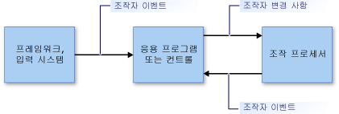

# 조작 및 관성 개요Manipulations and Inertia Overview
*조작*을 통해 사용자는 *조작자*를 사용하여 UI(사용자 인터페이스) 요소를 이동, 회전하고 크기를 조정할 수 있습니다.*Manipulations* enable users to move, rotate, and resize user interface (UI) elements by using *manipulators*. 조작자는 마우스, 터치 사용 시나리오의 스타일러스 또는 손가락을 나타냅니다.A manipulator represents a mouse or (in a touch-enabled scenario) a stylus or a finger.  
  
 *관성*은 요소에 대한 마찰력을 시뮬레이션하여 움직이는 UI 요소의 실시간 동작을 에뮬레이트합니다.*Inertia* emulates real-world behavior for UI elements that are in motion by simulating friction forces on the elements. 이를 통해 요소가 중지하기 전에 움직임(선형 및 각도)을 서서히 늦출 수 있습니다.This enables elements to gradually slow their movement (both linear and angular) before coming to a stop. 이 자료에서는 .NET Framework에 대한 조작 및 관성을 소개합니다.This article provides an introduction to manipulations and inertia for the .NET Framework.  
  
## 조작Manipulations  
 조작은 조작자 컬렉션을 복합 개체로 처리합니다.A manipulation treats a collection of manipulators as a composite object. 응용 프로그램에서는 개별 구성 요소가 아닌 복합 개체의 변경 내용을 추적할 수 있습니다.An application can track the changes to the composite object instead of the individual components.  
  
 다음 그림의 이미지를 고려하세요.Consider the image in the following illustration. 사용자는 조작자 두 개를 사용하여 이미지를 이동 회전하고 크기를 조정할 수 있습니다.A user can use two manipulators to move, rotate, and scale the image. 각 조작자에 대한 변경 내용은 다른 조작자와 함께 해석됩니다.The changes to each manipulator are interpreted together with the other manipulators.  
  
 예를 들어 이미지에 조작자 두 개(1 and 2)가 있을 때 +Y 방향(아래쪽)으로 조작자 1을 이동하면 이미지의 변경 내용은 조작자 2의 동작에 따라 달라집니다.For example, if you have two manipulators (1 and 2) on the image, and you move manipulator 1 in a +Y direction (down), the change to the image depends on what happens to manipulator 2. 조작자 2가 +Y 방향(아래쪽)으로 이동하면 이미지는 단순히 +Y 방향으로 이동합니다.If manipulator 2 also moves in the +Y direction (down), the image simply moves in the +Y direction. 하지만 조작자 2가 변경되지 않거나 -Y 방향(위쪽)으로 이동하면 이미지가 더 작아지거나 회전합니다.But if manipulator 2 does not change, or it moves in a -Y direction (up), the image is made smaller or rotated.  
  
   
  
 조작자 두 개로 조작되는 이미지An image being manipulated by two manipulators  
  
 조작 처리에서는 조작자 하위 집합을 모니터링하고 두 조작자가 독립적으로 작동하지 않고 함께 작동하는 것처럼 해석하는 프레임워크를 제공합니다.Manipulation processing provides a framework that monitors a subset of manipulators and interprets them as if they are acting together, instead of independently. 응용 프로그램에서 조작할 각 UI 요소에 대해 하나씩, 동시에 여러 조작 프로세서 개체를 만들 수 있습니다.You can create several manipulation processor objects simultaneously, one for each UI element to be manipulated in an application. 조작 프로세서에는 관찰할 입력 장치에 대한 정보가 제공되고 조작 프로세서는 [.NET 이벤트](http://msdn.microsoft.com/library/17sde2xt.aspx)를 통해 조작을 보고합니다.A manipulation processor is informed of which input devices to observe and it reports manipulations through [.NET events](http://msdn.microsoft.com/library/17sde2xt.aspx).  
  
 조작 프로세서에는 조작되는 특정 요소에 대한 정보가 없습니다.A manipulation processor does not have information about the particular element that is being manipulated. 응용 프로그램에서는 응용 프로그램별 요소에 변경 내용을 개별적으로 적용합니다.An application separately applies the changes to an application-specific element. 예를 들어 응용 프로그램에서는 이미지에 변형을 적용하거나 이미지를 다시 그려서 새 위치에 표시하거나 새로운 크기나 방향으로 표시합니다.For example, an application applies transformations to an image or redraws it to display it at its new location or with a new size or orientation.  
  
 조작은 2차원(2D) [관계 변환](http://msdn.microsoft.com/library/ms533810\(VS.85\).aspx)용으로 설계되었습니다.Manipulations are designed for two-dimensional (2-D) [affine transformations](http://msdn.microsoft.com/library/ms533810\(VS.85\).aspx). 이들 변형에는 변형, 회전 및 크기 조정이 포함됩니다.These transformations include translate, rotate, and scale.  
  
### 조작 부분Parts of a Manipulation  
 조작은 <xref:System.Windows.Input.Manipulations.Manipulator2D> 개체의 컬렉션입니다.A manipulation is a collection of <xref:System.Windows.Input.Manipulations.Manipulator2D> objects. 이 집계 조작은 원점과 타원으로 표현됩니다.This aggregate manipulation is represented by an origin point and an ellipse. 원점은 요소를 조작 중인 모든 조작자의 평균 위치입니다.The origin point is the average position of all manipulators that are manipulating an element. 타원에는 원점부터 각 <xref:System.Windows.Input.Manipulations.Manipulator2D> 개체까지 평균 거리를 나타내는 반지름이 있습니다.The ellipse has a radius that is the average distance from the origin to each of the <xref:System.Windows.Input.Manipulations.Manipulator2D> objects.  
  
   
  
 조작자 두 개(1 및 2), 원점 및 타원으로 조작 지정Two manipulators (1 and 2), an origin, and an ellipse specify a manipulation  
  
 UI 요소에 대한 조작자를 추가, 이동 또는 제거할 때 응용 프로그램에서는 <xref:System.Windows.Input.Manipulations.ManipulationProcessor2D.ProcessManipulators%2A> 메서드를 호출하여 <xref:System.Windows.Input.Manipulations.ManipulationProcessor2D> 개체를 업데이트합니다.As manipulators are added, moved, or removed for a UI element, an application updates the <xref:System.Windows.Input.Manipulations.ManipulationProcessor2D> object by calling the <xref:System.Windows.Input.Manipulations.ManipulationProcessor2D.ProcessManipulators%2A> method. 조작이 처음 시작되면 <xref:System.Windows.Input.Manipulations.ManipulationProcessor2D.Started> 이벤트가 발생합니다.When the manipulation first begins, the <xref:System.Windows.Input.Manipulations.ManipulationProcessor2D.Started> event is raised.  
  
> [!NOTE]
>  조작 처리는 프레임 기반 업데이트 환경에서 더 효율적으로 사용됩니다.Manipulation processing is more efficient when used in a frame-based update environment. Microsoft XNA 응용 프로그램에서 조작 처리를 사용할 경우 XNA 프레임워크는 [Game.Update](http://msdn.microsoft.com/library/microsoft.xna.framework.game.update.aspx) 메서드를 사용하여 프레임 기반 업데이트를 제공하므로 문제가 되지 않습니다.When using manipulation processing in a Microsoft XNA application, this is not a concern because the XNA framework provides frame-based updates using the [Game.Update](http://msdn.microsoft.com/library/microsoft.xna.framework.game.update.aspx) method. WinForms와 같은 다른 환경에서는 조작을 수집하고 주기적으로 <xref:System.Windows.Input.Manipulations.ManipulationProcessor2D.ProcessManipulators%2A> 메서드에 배치로 전송하려면 고유한 프레임 기반 논리를 제공해야 할 수 있습니다.In another environment (such as WinForms), you might need to provide your own frame-based logic to collect manipulations and periodically send them to the <xref:System.Windows.Input.Manipulations.ManipulationProcessor2D.ProcessManipulators%2A> method as a batch.  
  
 조작자 수나 위치가 변경되면 <xref:System.Windows.Input.Manipulations.ManipulationProcessor2D.Delta> 이벤트가 발생합니다.As the number of manipulators or their position change, the <xref:System.Windows.Input.Manipulations.ManipulationProcessor2D.Delta> event is raised. <xref:System.Windows.Input.Manipulations.ManipulationProcessor2D.Delta> 이벤트 처리기에 전달되는 <xref:System.Windows.Input.Manipulations.Manipulation2DDeltaEventArgs> 개체의 속성은 원점, 크기 조정, 회전 및 변환에서 마지막 이벤트 후에 발생한 변경 내용을 지정합니다.Properties of the <xref:System.Windows.Input.Manipulations.Manipulation2DDeltaEventArgs> object that is passed to the <xref:System.Windows.Input.Manipulations.ManipulationProcessor2D.Delta> event handler specify changes in origin, scale, rotation, and translation that have occurred since the last event. 조작자가 이동할 때, 그리고 조작자가 추가되거나 제거될 때 조작 원점이 변경됩니다.The origin of the manipulation changes when manipulators move, and when manipulators are added or removed. 변환 값은 조작에 포함된 X 또는 Y 이동 정도를 지정합니다.Translation values specify how much X or Y movement the manipulation includes.  
  
 새 값을 사용하면 응용 프로그램에서 UI 요소를 다시 그립니다.Using the new values, an application redraws the UI element.  
  
   
  
 조작자 1은 원점을 이동하여 변경되게 합니다.Manipulator 1 moves and causes the origin to change  
  
 조작과 연결된 마지막 조작자가 <xref:System.Windows.Input.Manipulations.ManipulationProcessor2D> 개체에서 제거되면 <xref:System.Windows.Input.Manipulations.ManipulationProcessor2D.Completed> 이벤트가 발생합니다.When the last manipulator that is associated with the manipulation is removed from the <xref:System.Windows.Input.Manipulations.ManipulationProcessor2D> object, the <xref:System.Windows.Input.Manipulations.ManipulationProcessor2D.Completed> event is raised.  
  
### 조작 처리 모델The Manipulation Processing Model  
 조작 프로세서에서는 직접 사용 모델을 사용합니다.A manipulation processor uses a direct-usage model. 이 단순 모델에서는 응용 프로그램이 입력 이벤트 세부 정보를 조작 프로세서에 전달해야 합니다.With this simple model, an application must pass any input event details to the manipulation processor. 마우스 장치, 스타일러스 또는 손가락과 같은 입력 기본 형식에 의해 입력 이벤트가 발생할 수 있습니다.An input event might be raised by any input primitive, such as a mouse device, a stylus, or a finger. 이 프로세스에서는 직접 필터링 메커니즘과 단순 사용 모델을 제공하므로 응용 프로그램이 필요할 때 입력 이벤트를 일괄 처리할 수 있습니다.This process provides a direct filtering mechanism and a simple usage model, so the application can batch input events when it is necessary.  
  
 응용 프로그램이 조작 프로세스에 입력 기본 형식을 포함할 수 있도록 입력 기본 형식의 세부 정보에서 <xref:System.Windows.Input.Manipulations.Manipulator2D> 구조체를 만들고 <xref:System.Windows.Input.Manipulations.ManipulationProcessor2D.ProcessManipulators%2A> 메서드를 사용하여 구조체를 조작 프로세서에 전달합니다.For an application to include an input primitive in the manipulation process, it creates a <xref:System.Windows.Input.Manipulations.Manipulator2D> structure from the details of the input primitive, and passes the structure to the manipulation processor using the <xref:System.Windows.Input.Manipulations.ManipulationProcessor2D.ProcessManipulators%2A> method. 조작 프로세서에서 이벤트가 발생하고 시각적 구성 요소를 적절한 방법으로 업데이트하려면 응용 프로그램이 이 이벤트를 처리해야 합니다.The manipulation processor then raises events, which the application must handle to update the visual component in an appropriate way.  
  
   
  
 조작 처리 모델The manipulation processing model  
  
## 관성Inertia  
 관성 프로세서를 통해 응용 프로그램은 실제 동작을 시뮬레이션하여 UI 요소의 위치, 방향 및 기타 속성을 추정할 수 있습니다.The inertia processor enables applications to extrapolate location, orientation, and other properties of a UI element by simulating real-world behavior.  
  
 예를 들어 사용자가 요소를 그으면 요소가 계속 이동하다가 느려지고 천천히 중지합니다.For instance, when a user flicks an element, it can continue moving, decelerate, and then slowly stop. 관성 프로세서는 지정된 시간에 걸쳐 지정된 감속 속도로 관계 2-D 값(원점, 크기 조정, 변환 및 회전)이 변경되게 해서 이 동작을 구현합니다.The inertia processor implements this behavior by causing the affine 2-D values (origin, scale, translation, and rotation) to change over a specified time at a specified deceleration rate.  
  
 조작 처리와 같이 관성 프로세서에는 특정 UI 요소에 대한 정보가 없습니다.As with manipulation processing, an inertia processor does not have information about any particular UI element. <xref:System.Windows.Input.Manipulations.InertiaProcessor2D> 개체에서 발생한 이벤트에 대한 응답으로 응용 프로그램은 응용 프로그램별 요소에 변경 내용을 개별적으로 적용합니다.In response to events that are raised on an <xref:System.Windows.Input.Manipulations.InertiaProcessor2D> object, an application separately applies the changes to an application-specific element.  
  
 관성 처리 및 조작 처리는 종종 함께 사용됩니다.Inertia processing and manipulation processing are often used together. 인터페이스가 비슷하고 경우에 따라 발생하는 이벤트가 똑같습니다.Their interfaces are similar, and the events that they raise are (in some cases) identical. 일반적으로 UI 요소 조작이 완료될 때 관성 처리가 시작됩니다.Generally, inertia processing begins when the manipulation of the UI element is completed. 이 작업은 수행하려면 <xref:System.Windows.Input.Manipulations.ManipulationProcessor2D.Completed> 이벤트를 수신 대기하고 해당 이벤트 처리기에서 관성 처리를 시작합니다.This is accomplished by listening to the <xref:System.Windows.Input.Manipulations.ManipulationProcessor2D.Completed> event and starting the inertia processing from that event handler.  
  
## 참고 항목See Also  
 <xref:System.Windows.Input.Manipulations>

