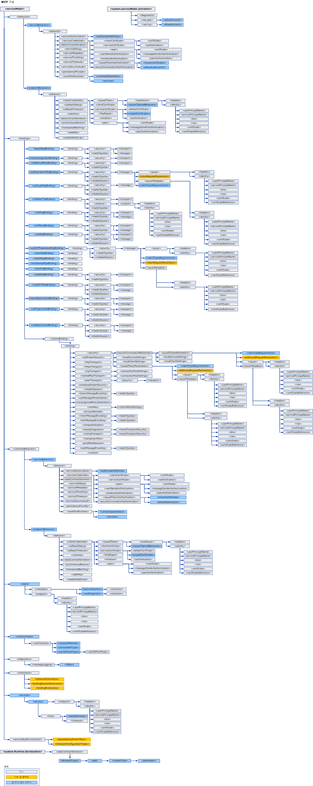

# WCF 구성 스키마WCF Configuration Schema
[!INCLUDE[indigo1](../../../../../includes/indigo1-md.md)] 구성 요소를 사용하면 [!INCLUDE[indigo2](../../../../../includes/indigo2-md.md)] 서비스 및 클라이언트 응용 프로그램을 구성할 수 있습니다. configuration elements enable you to configure [!INCLUDE[indigo2](../../../../../includes/indigo2-md.md)] service and client applications. [구성 편집기 도구(SvcConfigEditor.exe)](../../../../../docs/framework/wcf/configuration-editor-tool-svcconfigeditor-exe.md)를 사용하여 클라이언트 및 서비스에 대한 구성 파일을 만들고 수정할 수 있습니다.You can use the [Configuration Editor Tool (SvcConfigEditor.exe)](../../../../../docs/framework/wcf/configuration-editor-tool-svcconfigeditor-exe.md) to create and modify configuration files for clients and services. 구성 파일은 XML 형식이므로 텍스트 편집기를 사용하여 구성 파일을 수동으로 편집하려면 XML에 익숙해야 합니다.Since the configuration files are formatted as XML, you must be familiar with XML if you want to manually edit them using a text editor. 그렇지 않으면 찾을 수 없는 XML 요소 태그나 특성과 같은 문제가 발생할 수 있습니다.Otherwise, you may run into issues such as an unfound XML element tag or attribute. XML 요소 태그 및 속성이 대소문자를 구분하기 때문입니다.This is because XML element tags and attributes are case-sensitive.  
  
 [!INCLUDE[indigo2](../../../../../includes/indigo2-md.md)] 구성 시스템은 <xref:System.Configuration> 네임스페이스를 기반으로 합니다.The [!INCLUDE[indigo2](../../../../../includes/indigo2-md.md)] configuration system is based on the <xref:System.Configuration> namespace. 따라서 응용 프로그램 및 구성의 보안을 향상시키기 위해 구성 잠금, 암호화 및 병합과 같은 <xref:System.Configuration> 네임스페이스에서 제공하는 표준 기능을 모두 사용할 수 있습니다.Therefore, you can use all the standard features provided by the <xref:System.Configuration> namespace, such as configuration locking, encryption and merging to increase the security of your application and its configuration. 이러한 개념에 대한 자세한 내용은 다음 항목을 참조하세요.For more information on these concepts, see the following topics.  
  
 [구성 정보 암호화Encrypting Configuration Information](http://go.microsoft.com/fwlink/?LinkId=95337)  
  
 [구성 설정 잠금Locking Configuration Settings](http://go.microsoft.com/fwlink/?LinkId=95338)  
  
 이 섹션에서는 각 구성 항목의 가능한 모든 값 및 이 값이 다른 WCF 구성 요소와 상호 작용하는 방법에 대해 설명합니다.This section describes all possible values of each configuration item, and how it interacts with other WCF configuration elements. 다음 맵에서는 WCF 구성 스키마를 보여 줍니다.The following map illustrates the WCF configuration schema.  
  
   
  
> [!CAUTION]
>  잠재적 보안 위협을 방지하려면 응용 프로그램 구성 파일(app.config)에서 적절한 ACL(Access Control 목록)을 사용하여 [!INCLUDE[indigo2](../../../../../includes/indigo2-md.md)] 구성 섹션을 보호해야 합니다.You should protect [!INCLUDE[indigo2](../../../../../includes/indigo2-md.md)] configuration sections in your application configuration files (app.config) with appropriate Access Control Lists (ACL) to prevent any potential security threats.  예를 들어, 적절한 사용자만이 응용 프로그램 바인딩의 보안 설정 또는 서비스에 대한 구성 파일의 서비스 모델 섹션에 액세스하거나 이를 수정할 수 있도록 해야 합니다.For example, you should make sure that only the appropriate people can access or modify the security settings on application bindings, or the service model section of the configuration file for a service.  
  
## 단원 내용In This Section  
 [\<system.serviceModel>\<system.serviceModel>](../../../../../docs/framework/configure-apps/file-schema/wcf/system-servicemodel.md)  
 `ServiceModel` 요소에 대해 설명합니다.Describes the `ServiceModel` element.  
  
 [\<system.serviceModel.activation>\<system.serviceModel.activation>](../../../../../docs/framework/configure-apps/file-schema/wcf/system-servicemodel-activation.md)  
 SMSvcHost.exe 도구를 구성합니다.Configures the SMSvcHost.exe tool.  
  
 [\<system.runtime.serialization>\<system.runtime.serialization>](../../../../../docs/framework/configure-apps/file-schema/wcf/system-runtime-serialization.md)  
 <xref:System.Runtime.Serialization.DataContractSerializer>와 같은 serializer를 사용하는 경우 옵션 설정의 최상위 요소입니다.The top-level element for setting options when using serializers such as the <xref:System.Runtime.Serialization.DataContractSerializer>.  
  
## 관련 단원Related Sections  
 [Windows Communication Foundation 응용 프로그램 구성Configuring Windows Communication Foundation Applications](http://msdn.microsoft.com/en-us/13cb368e-88d4-4c61-8eed-2af0361c6d7a)  
 [!INCLUDE[indigo2](../../../../../includes/indigo2-md.md)] 서비스 및 클라이언트를 구성하는 방법에 대해 설명합니다.Describes how to configure [!INCLUDE[indigo2](../../../../../includes/indigo2-md.md)] services and clients.
