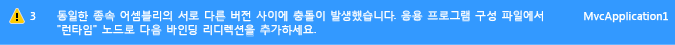

# <a name="how-to-enable-and-disable-automatic-binding-redirection"></a><span data-ttu-id="353e7-102">방법: 자동 바인딩 리디렉션 사용 설정 및 해제</span><span class="sxs-lookup"><span data-stu-id="353e7-102">How to: Enable and Disable Automatic Binding Redirection</span></span>
<span data-ttu-id="353e7-103">[!INCLUDE[vs_dev12](../../../includes/vs-dev12-md.md)]부터 [!INCLUDE[net_v451](../../../includes/net-v451-md.md)]을 대상으로 하는 응용 프로그램을 컴파일할 때, 바인딩 리디렉션이 어셈블리 통합을 재정의하기 위한 응용 프로그램 구성 파일에 자동으로 추가될 수 있습니다.</span><span class="sxs-lookup"><span data-stu-id="353e7-103">Starting with [!INCLUDE[vs_dev12](../../../includes/vs-dev12-md.md)], when you compile apps that target the [!INCLUDE[net_v451](../../../includes/net-v451-md.md)], binding redirects may be automatically added to the app configuration file to override assembly unification.</span></span> <span data-ttu-id="353e7-104">수동으로 바인딩 리디렉션을 응용 프로그램의 구성 파일에 지정할 지라도 응용 프로그램 또는 해당 구성 요소가 동일 어셈블리의 두 개 이상의 버전을 참조할 경우 바인딩 리디렉션을 추가합니다.</span><span class="sxs-lookup"><span data-stu-id="353e7-104">Binding redirects are added if your app or its components reference more than one version of the same assembly, even if you manually specify binding redirects in the configuration file for your app.</span></span> <span data-ttu-id="353e7-105">자동 바인딩 리디렉션 기능은 [!INCLUDE[net_v451](../../../includes/net-v451-md.md)]을 적용 대상으로 하는 전통적인 데스크톱 응용 프로그램 및 웹 응용 프로그램에 영향을 줍니다. 웹 응용 프로그램에서는 동작이 약간 달라집니다.</span><span class="sxs-lookup"><span data-stu-id="353e7-105">The automatic binding redirection feature affects traditional desktop apps and web apps that target the [!INCLUDE[net_v451](../../../includes/net-v451-md.md)], although the behavior is slightly different for a web app.</span></span> <span data-ttu-id="353e7-106">이전 버전의 .NET Framework를 대상으로 하는 기존 응용 프로그램이 있는 경우 자동 바인딩 리디렉션을 사용할 수 있으며, 수동으로 작성되는 바인딩 리디렉션을 유지하려는 경우에는 이 기능을 비활성화할 수 있습니다.</span><span class="sxs-lookup"><span data-stu-id="353e7-106">You can enable automatic binding redirection if you have existing apps that target previous versions of the .NET Framework, or you can disable this feature if you want to keep manually authored binding redirects.</span></span>  
  
## <a name="disabling-automatic-binding-redirects-in-desktop-apps"></a><span data-ttu-id="353e7-107">데스크톱 앱에서 자동 바인딩 리디렉션 사용 안 함</span><span class="sxs-lookup"><span data-stu-id="353e7-107">Disabling automatic binding redirects in desktop apps</span></span>  
 <span data-ttu-id="353e7-108">자동 바인딩 리디렉션은 [!INCLUDE[net_v451](../../../includes/net-v451-md.md)]을 대상으로 하는 기존 데스크톱 앱에 대해 기본적으로 사용하도록 설정됩니다.</span><span class="sxs-lookup"><span data-stu-id="353e7-108">Automatic binding redirects are enabled by default for traditional desktop apps that target the [!INCLUDE[net_v451](../../../includes/net-v451-md.md)] and later versions.</span></span> <span data-ttu-id="353e7-109">응용 프로그램이 컴파일되고 그렇지 않으면 발생할 수 있는 어셈블리 통합을 재정의할 때 바인딩 리디렉션이 출력 구성(app.config) 파일에 추가됩니다.</span><span class="sxs-lookup"><span data-stu-id="353e7-109">The binding redirects are added to the output configuration (app.config) file when the app is compiled and overrides the assembly unification that might otherwise take place.</span></span> <span data-ttu-id="353e7-110">소스 app.config 파일은 수정되지 않습니다.</span><span class="sxs-lookup"><span data-stu-id="353e7-110">The source app.config file is not modified.</span></span> <span data-ttu-id="353e7-111">응용 프로그램에 대한 프로젝트 파일을 수정하여 이 기능을 비활성화할 수 있습니다.</span><span class="sxs-lookup"><span data-stu-id="353e7-111">You can disable this feature by modifying the project file for the app.</span></span>  
  
#### <a name="to-disable-automatic-binding-redirects"></a><span data-ttu-id="353e7-112">자동 바인딩 리디렉션을 비활성화하려면</span><span class="sxs-lookup"><span data-stu-id="353e7-112">To disable automatic binding redirects</span></span>  
  
1.  <span data-ttu-id="353e7-113">Visual Studio에서 프로젝트를 선택 **솔루션 탐색기**를 선택한 후 **파일 탐색기에서 폴더 열기** 바로 가기 메뉴에서.</span><span class="sxs-lookup"><span data-stu-id="353e7-113">In Visual Studio, select the project in **Solution Explorer**, and then choose **Open Folder in File Explorer** from the shortcut menu.</span></span>  
  
2.  <span data-ttu-id="353e7-114">파일 탐색기에서 프로젝트(.csproj 또는 .vbproj) 파일을 찾아서 메모장에서 엽니다.</span><span class="sxs-lookup"><span data-stu-id="353e7-114">In File Explorer, find the project (.csproj or .vbproj) file, and open it in Notepad.</span></span>  
  
3.  <span data-ttu-id="353e7-115">프로젝트 파일에서 다음 속성 항목을 찾습니다.</span><span class="sxs-lookup"><span data-stu-id="353e7-115">In the project file, find the following property entry:</span></span>  
  
     `<AutoGenerateBindingRedirects>true</AutoGenerateBindingRedirects>`  
  
4.  <span data-ttu-id="353e7-116">`true`를 `false`로 변경합니다.</span><span class="sxs-lookup"><span data-stu-id="353e7-116">Change `true` to `false`:</span></span>  
  
     `<AutoGenerateBindingRedirects>false</AutoGenerateBindingRedirects>`  
  
## <a name="enabling-automatic-binding-redirects-manually"></a><span data-ttu-id="353e7-117">수동으로 자동 바인딩 리디렉션 사용</span><span class="sxs-lookup"><span data-stu-id="353e7-117">Enabling automatic binding redirects manually</span></span>  
 <span data-ttu-id="353e7-118">이전 버전의 .NET Framework를 대상으로 하는 기존 앱에서나, 리디렉션을 추가하라는 메시지가 자동으로 나타나지 않는 경우에 자동 바인딩 리디렉션을 사용하도록 설정할 수 있습니다.</span><span class="sxs-lookup"><span data-stu-id="353e7-118">You can enable automatic binding redirects in existing apps that target older versions of the .NET Framework, or in cases where you are not automatically prompted to add a redirect.</span></span> <span data-ttu-id="353e7-119">최신 버전의 Framework를 대상으로 하지만 리디렉션을 추가하라는 메시지가 자동으로 나타나지 않는 경우 어셈블리를 다시 매핑하도록 제안하는 빌드 출력이 표시될 것입니다.</span><span class="sxs-lookup"><span data-stu-id="353e7-119">If you are targeting a newer version of the framework but do not get automatically prompted to add a redirect, you will likely get   build output that suggests you remap assemblies.</span></span>  
  
#### <a name="to-manually-add-an-automatic-binding-redirect-property"></a><span data-ttu-id="353e7-120">수동으로 자동 바인딩 리디렉션 속성을 추가하려면</span><span class="sxs-lookup"><span data-stu-id="353e7-120">To manually add an automatic binding redirect property</span></span>  
  
1.  <span data-ttu-id="353e7-121">Visual Studio에서 프로젝트를 선택 **솔루션 탐색기**를 선택한 후 **파일 탐색기에서 폴더 열기** 바로 가기 메뉴에서.</span><span class="sxs-lookup"><span data-stu-id="353e7-121">In Visual Studio, select the project in **Solution Explorer**, and then choose **Open Folder in File Explorer** from the shortcut menu.</span></span>  
  
2.  <span data-ttu-id="353e7-122">파일 탐색기에서 프로젝트(.csproj 또는 .vbproj) 파일을 찾아서 메모장에서 엽니다.</span><span class="sxs-lookup"><span data-stu-id="353e7-122">In File Explorer, find the project (.csproj or .vbproj) file, and open it in Notepad.</span></span>  
  
3.  <span data-ttu-id="353e7-123">다음 요소를 첫 번째 구성 속성 그룹에 추가 (아래에서 \<PropertyGroup > 태그):</span><span class="sxs-lookup"><span data-stu-id="353e7-123">Add the following element to the first configuration property group (under the \<PropertyGroup> tag):</span></span>  
  
     `<AutoGenerateBindingRedirects>true</AutoGenerateBindingRedirects>`  
  
     <span data-ttu-id="353e7-124">다음은 요소가 삽입된 예제 프로젝트 파일을 보여 줍니다.</span><span class="sxs-lookup"><span data-stu-id="353e7-124">The following shows an example project file with the element inserted.</span></span>  
  
    ```xml  
    <?xml version="1.0" encoding="utf-8"?>  
    <Project ToolsVersion="12.0" DefaultTargets="Build" xmlns="http://schemas.microsoft.com/developer/msbuild/2003">  
      <Import Project="$(MSBuildExtensionsPath)\$(MSBuildToolsVersion)\Microsoft.Common.props" Condition="Exists('$(MSBuildExtensionsPath)\$(MSBuildToolsVersion)\Microsoft.Common.props')" />  
      <PropertyGroup>  
        <Configuration Condition=" '$(Configuration)' == ''     ">Debug</Configuration>  
        <Platform Condition=" '$(Platform)' == '' ">AnyCPU</Platform>  
        <ProjectGuid>{123334}</ProjectGuid>  
        ...  
        <AutoGenerateBindingRedirects>true</AutoGenerateBindingRedirects>  
      </PropertyGroup>  
    ...  
    </Project>  
    ```  
  
4.  <span data-ttu-id="353e7-125">응용 프로그램을 컴파일합니다.</span><span class="sxs-lookup"><span data-stu-id="353e7-125">Compile your app.</span></span>  
  
## <a name="enabling-automatic-binding-redirects-in-web-apps"></a><span data-ttu-id="353e7-126">웹 응용 프로그램에서 자동 바인딩 리디렉션 사용</span><span class="sxs-lookup"><span data-stu-id="353e7-126">Enabling automatic binding redirects in web apps</span></span>  
 <span data-ttu-id="353e7-127">자동 바인딩 리디렉션은 웹 응용 프로그램마다 다르게 구현됩니다.</span><span class="sxs-lookup"><span data-stu-id="353e7-127">Automatic binding redirects are implemented differently for web apps.</span></span> <span data-ttu-id="353e7-128">웹 응용 프로그램에 대한 원본 구성(web.config) 파일을 수정해야 하기 때문에 구성 파일에 바인딩 리디렉션은 자동으로 추가되지 않습니다.</span><span class="sxs-lookup"><span data-stu-id="353e7-128">Because the source configuration (web.config) file must be modified for web apps, binding redirects are not automatically added to the configuration file.</span></span> <span data-ttu-id="353e7-129">하지만 Visual Studio는 바인딩 충돌을 경고하고 충돌 해결을 위해 바인딩 리디렉션을 추가할 수 있습니다.</span><span class="sxs-lookup"><span data-stu-id="353e7-129">However, Visual Studio notifies you of binding conflicts, and you can add binding redirects to resolve the conflicts.</span></span> <span data-ttu-id="353e7-130">항상 바인딩 리디렉션을 추가하려고 하기 때문에 웹 응용 프로그램에서 이 기능을 명시적으로 비활성화할 필요는 없습니다.</span><span class="sxs-lookup"><span data-stu-id="353e7-130">Because you are always prompted to add binding redirects, you do not need to explicitly disable this feature for a web app.</span></span>  
  
#### <a name="to-add-binding-redirects-to-a-webconfig-file"></a><span data-ttu-id="353e7-131">web.config 파일에 바인딩 리디렉션을 추가하려면</span><span class="sxs-lookup"><span data-stu-id="353e7-131">To add binding redirects to a web.config file</span></span>  
  
1.  <span data-ttu-id="353e7-132">Visual Studio에서 응용 프로그램을 컴파일하고 빌드 경고를 확인합니다.</span><span class="sxs-lookup"><span data-stu-id="353e7-132">In Visual Studio, compile the app, and check for build warnings.</span></span>  
  
     <span data-ttu-id="353e7-133"></span><span class="sxs-lookup"><span data-stu-id="353e7-133"></span></span>  
  
2.  <span data-ttu-id="353e7-134">어셈블리 바인딩 충돌이 있을 경우 경고가 나타납니다.</span><span class="sxs-lookup"><span data-stu-id="353e7-134">If there are assembly binding conflicts, a warning appears.</span></span> <span data-ttu-id="353e7-135">경고를 두 번 클릭합니다.</span><span class="sxs-lookup"><span data-stu-id="353e7-135">Double-click the warning.</span></span> <span data-ttu-id="353e7-136">(키보드: 경고 및 키를 눌러 선택 **Enter**.)</span><span class="sxs-lookup"><span data-stu-id="353e7-136">(Keyboard: Select the warning and press **Enter**.)</span></span>  
  
     <span data-ttu-id="353e7-137">필요한 바인딩 리디렉션을 소스 web.config 파일에 자동으로 추가할 수 있는 대화 상자가 나타납니다.</span><span class="sxs-lookup"><span data-stu-id="353e7-137">A dialog box that enables you to automatically add the necessary binding redirects to the source web.config file appears.</span></span>  
  
     <span data-ttu-id="353e7-138"></span><span class="sxs-lookup"><span data-stu-id="353e7-138"></span></span>  
  
## <a name="see-also"></a><span data-ttu-id="353e7-139">참고 항목</span><span class="sxs-lookup"><span data-stu-id="353e7-139">See Also</span></span>  
 [<span data-ttu-id="353e7-140">\<bindingRedirect > 요소</span><span class="sxs-lookup"><span data-stu-id="353e7-140">\<bindingRedirect> Element</span></span>](../../../docs/framework/configure-apps/file-schema/runtime/bindingredirect-element.md)  
 [<span data-ttu-id="353e7-141">어셈블리 버전 리디렉션</span><span class="sxs-lookup"><span data-stu-id="353e7-141">Redirecting Assembly Versions</span></span>](../../../docs/framework/configure-apps/redirect-assembly-versions.md)
