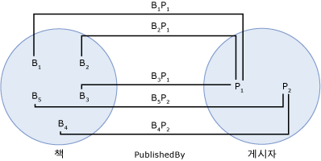

# 연결 집합(association set)association set
*연결 집합* 는 대 한 논리적 컨테이너 [연결](../../../../docs/framework/data/adonet/association-type.md) 동일한 형식의 인스턴스.An *association set* is a logical container for [association](../../../../docs/framework/data/adonet/association-type.md) instances of the same type. 연결 집합은 데이터 모델링 구문이 아니므로 데이터 또는 관계의 구조를 설명하지 않습니다.An association set is not a data modeling construct; that is, it does not describe the structure of data or relationships. 대신 연결 집합은 연결 인스턴스를 그룹화하여 데이터 저장소에 매핑할 수 있도록 호스팅 또는 저장소 환경(예: 공용 언어 런타임 또는 SQL Server 데이터베이스)에 대한 구문을 제공합니다.Instead, an association set provides a construct for a hosting or storage environment (such as the common language runtime or a SQL Server database) to group association instances so that they can be mapped to a data store.  
  
 연결 집합 내에 정의 되어 있는 [엔터티 컨테이너](../../../../docs/framework/data/adonet/entity-container.md)의 논리적 그룹인 [엔터티 집합](../../../../docs/framework/data/adonet/entity-set.md) 및 연결 집합입니다.An association set is defined within an [entity container](../../../../docs/framework/data/adonet/entity-container.md), which is a logical grouping of [entity sets](../../../../docs/framework/data/adonet/entity-set.md) and association sets.  
  
 연결 집합 정의에는 다음 정보가 들어 있습니다.A definition for an association set contains the following information:  
  
-   연결 집합 이름The association set name. (필수)(Required)  
  
-   연결 집합에 인스턴스가 포함될 연결The association of which it will contain instances. (필수)(Required)  
  
-   두 개의 [연결 집합 end](../../../../docs/framework/data/adonet/association-set-end.md)합니다.Two [association set ends](../../../../docs/framework/data/adonet/association-set-end.md).  
  
## 예제Example  
 다음 다이어그램에서는 두 연결 `PublishedBy` 및 `WrittenBy`의 개념적 모델을 보여 줍니다.The diagram below shows a conceptual model with two associations: `PublishedBy`, and `WrittenBy`. 연결 집합에 대한 정보는 다이어그램에 표시되지 않지만 다음 다이어그램에서는 이 모델을 기반으로 하여 연결 집합 및 엔터티 집합의 예제를 보여 줍니다.Although information about association sets is not conveyed in the diagram, the next diagram shows an example of association sets and entity sets based on this model.  
  
   
  
 다음 예제에서는 위에 표시된 개념적 모델을 기반으로 하여 연결 집합(`PublishedBy`) 및 엔터티 집합 두 개(`Books` 및 `Publishers`)를 보여 줍니다.The following example shows an association set (`PublishedBy`) and two entity sets (`Books` and `Publishers`) based on the conceptual model shown above. bi는 `Books` 엔터티 집합의 인스턴스를 나타내며는 `Book` 런타임 시 엔터티 형식입니다.Bi in the `Books` entity set represents an instance of the `Book` entity type at run time. 마찬가지로, Pj 나타냅니다는 `Publisher` 인스턴스는 `Publishers` 엔터티 집합입니다.Similarly, Pj represents a `Publisher` instance in the `Publishers` entity set. BiPj의 인스턴스를 나타내며는 `PublishedBy` 에서 연결의 `PublishedBy` 연결 집합입니다.BiPj represents an instance of the `PublishedBy` association in the `PublishedBy` association set.  
  
   
  
 [ADO.NET Entity Framework](../../../../docs/framework/data/adonet/ef/index.md) 개념 스키마 정의 언어를 호출 하는 도메인 특정 언어 DSL ()를 사용 하 여 ([CSDL](../../../../docs/framework/data/adonet/ef/language-reference/csdl-specification.md)) 개념적 모델을 정의 합니다.The [ADO.NET Entity Framework](../../../../docs/framework/data/adonet/ef/index.md) uses a domain-specific language (DSL) called conceptual schema definition language ([CSDL](../../../../docs/framework/data/adonet/ef/language-reference/csdl-specification.md)) to define conceptual models. 다음 CSDL에서는 위의 다이어그램에 있는 각 연결에 대한 하나의 연결 집합을 사용하여 엔터티 컨테이너를 정의합니다.The following CSDL defines an entity container with one association set for each association in the diagram above. 각 연결 집합의 이름과 연결은 XML 특성을 사용하여 정의됩니다.Note that the name and association for each association set are defined using XML attributes.  
  
 [!code-xml[EDM_Example_Model#EntityContainerExample](../../../../samples/snippets/xml/VS_Snippets_Data/edm_example_model/xml/books.edmx#entitycontainerexample)]  
  
 여러 연결당 연결 집합을 두 개의 연결 집합 공유가 없습니다는 정의할 수는 [연결 집합 end](../../../../docs/framework/data/adonet/association-set-end.md)합니다.It is possible to define multiple association sets per association, as long as no two association sets share an [association set end](../../../../docs/framework/data/adonet/association-set-end.md). 다음 CSDL에서는 `WrittenBy` 연결에 대한 두 개의 연결 집합이 있는 엔터티 컨테이너를 정의합니다.The following CSDL defines an entity container with two association sets for the `WrittenBy` association. `Book` 및 `Author` 엔터티 형식에 대해 엔터티 집합이 여러 개 정의되었으며 어떤 연결 집합도 연결 집합 End를 공유하지 않습니다.Notice that multiple entity sets have been defined for the `Book` and `Author` entity types and that no association set shares an association set end.  
  
 [!code-xml[EDM_Example_Model#MultipleAssociationSets](../../../../samples/snippets/xml/VS_Snippets_Data/edm_example_model/xml/books3.edmx#multipleassociationsets)]  
  
## 참고 항목See Also  
 [엔터티 데이터 모델의 주요 개념Entity Data Model Key Concepts](../../../../docs/framework/data/adonet/entity-data-model-key-concepts.md)  
 [엔터티 데이터 모델Entity Data Model](../../../../docs/framework/data/adonet/entity-data-model.md)  
 [외래 키 속성foreign key property](../../../../docs/framework/data/adonet/foreign-key-property.md)
