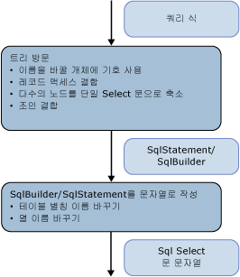

# <a name="architecture-and-design"></a>아키텍처 및 디자인
SQL 생성 모듈은 [샘플 공급자](http://go.microsoft.com/fwlink/?LinkId=180616) 명령 트리를 나타내는 식 트리 방문자로 구현 됩니다. 생성은 식 트리에 대한 단일 패스로 수행됩니다.  
  
 트리의 노드는 아래쪽에서 위쪽으로 처리됩니다. 먼저 중간 구조인 SqlSelectStatement 또는 SqlBuilder가 생성되며, 둘 다 ISqlFragment를 구현합니다. 그런 다음 이 구조에서 SQL 문 문자열이 생성됩니다. 중간 구조를 사용하는 이유는 두 가지입니다.  
  
-   논리적으로 SQL SELECT 문은 순서에 관계없이 채워집니다. FROM 절에 참여하는 노드는 WHERE, GROUP BY 및 ORDER BY 절에 참여하는 노드 전에 방문됩니다.  
  
-   별칭의 이름을 바꾸려면 이름을 바꾸는 동안 충돌을 방지하기 위해 사용되는 모든 별칭을 식별해야 합니다. SqlBuilder에서 이름 바꾸기 선택을 지연하려면 Symbol 개체를 사용하여 이름을 바꿀 후보인 열을 나타냅니다.  
  
   
  
 첫 번째 단계에서는 식 트리를 방문하는 동안 식이 SqlSelectStatement로 그룹화되고 조인이 평면화되며 조인 별칭이 평면화됩니다. 이 단계 중에 Symbol 개체는 이름을 바꿀 수 있는 열 또는 입력 별칭을 나타냅니다.  
  
 두 번째 단계에서는 실제 문자열을 생성하는 동안 별칭의 이름이 바뀝니다.  
  
## <a name="data-structures"></a>데이터 구조  
 이 섹션에 사용 되는 형식에 설명 된 [샘플 공급자](http://go.microsoft.com/fwlink/?LinkId=180616) SQL 문을 작성 하는 데 사용 하 합니다.  
  
### <a name="isqlfragment"></a>ISqlFragment  
 이 단원에서는 다음 두 가지 용도로 사용되는 ISqlFragment 인터페이스를 구현하는 클래스를 살펴봅니다.  
  
-   모든 방문자 메서드에 대한 일반 반환 형식  
  
-   최종 SQL 문자열을 작성하는 메서드 제공  
  
```  
internal interface ISqlFragment {  
   void WriteSql(SqlWriter writer, SqlGenerator sqlGenerator);  
}  
```  
  
#### <a name="sqlbuilder"></a>SqlBuilder  
 SqlBuilder는 StringBuilder와 마찬가지로 최종 SQL 문자열의 수집 장치입니다. SqlBuilder는 문자열로 변환될 수 있는 ISqlFragment와 함께 최종 SQL을 구성하는 문자열로 구성되어 있습니다.  
  
```  
internal sealed class SqlBuilder : ISqlFragment {  
   public void Append(object s)  
   public void AppendLine()  
   public bool IsEmpty  
}  
```  
  
#### <a name="sqlselectstatement"></a>SqlSelectStatement  
 Sqlselectstatement는 "SELECT... 모양의 정식 SQL SELECT 문 보낸 사람.. WHERE... 기준으로 그룹화 하는 중... ORDER BY "입니다.  
  
 각 SQL 절은 StringBuilder에 의해 표현됩니다. 또한 Distinct가 지정되었는지 여부와 문이 맨 위에 있는지 여부를 추적합니다. 문이 맨 위에 없는 경우 문에 TOP 절이 없으면 ORDER BY 절이 생략됩니다.  
  
 FromExtents에는 SELECT 문의 입력 목록이 포함됩니다. 여기에는 요소가 대개 하나만 있습니다. 조인의 SELECT 문에는 일시적으로 요소가 두 개 이상 있을 수 있습니다.  
  
 SELECT 문이 Join 노드에 의해 만들어지면 SqlSelectStatement는 해당 조인에서 평면화된 모든 익스텐트의 목록을 AllJoinExtents에서 유지 관리합니다. OuterExtents는 SqlSelectStatement의 외부 참조를 나타내며 입력 별칭의 이름을 바꾸는 데 사용됩니다.  
  
```  
internal sealed class SqlSelectStatement : ISqlFragment {  
   internal bool IsDistinct { get, set };  
   internal bool IsTopMost  
  
   internal List<Symbol> AllJoinExtents { get, set };  
   internal List<Symbol> FromExtents { get};  
   internal Dictionary<Symbol, bool> OuterExtents { get};  
  
   internal TopClause Top { get, set };  
  
   internal SqlBuilder Select {get};  
   internal SqlBuilder From  
   internal SqlBuilder Where  
   internal SqlBuilder GroupBy  
   public SqlBuilder OrderBy  
}  
```  
  
#### <a name="topclause"></a>TopClause  
 TopClause는 SqlSelectStatement에서 TOP 식을 나타냅니다. TopCount 속성은 선택할 TOP 행의 수를 나타냅니다.  WithTies가 true이면 TopClause는 DbLimitExpession에서 작성된 것입니다.  
  
```  
class TopClause : ISqlFragment {  
   internal bool WithTies {get}  
   internal ISqlFragment TopCount {get}  
   internal TopClause(ISqlFragment topCount, bool withTies)  
   internal TopClause(int topCount, bool withTies)  
}  
```  
  
### <a name="symbols"></a>기호  
 기호 관련 클래스와 기호 테이블은 입력 별칭 이름 바꾸기, 조인 별칭 평면화 및 열 별칭 이름 바꾸기를 수행합니다.  
  
 Symbol 클래스는 익스텐트, 중첩된 SELECT 문 또는 열을 나타냅니다. 이 클래스는 사용된 후 이름 바꾸기를 허용하기 위해 실제 별칭 대신 사용되며 나타내는 아티팩트(형식 등)에 대한 추가 정보도 제공합니다.  
  
```  
class Symbol : ISqlFragment {  
   internal Dictionary<string, Symbol> Columns {get}  
   internal bool NeedsRenaming {get, set}  
   internal bool IsUnnest {get, set}   //not used  
  
   public string Name{get}  
   public string NewName {get,set}  
   internal TypeUsage Type {get, set}  
  
   public Symbol(string name, TypeUsage type)  
}  
```  
  
 Name은 표현된 익스텐트, 중첩된 SELECT 문 또는 열의 원래 별칭을 저장합니다.  
  
 NewName은 SQL SELECT 문에서 사용될 별칭을 저장합니다. NewName은 처음에는 Name으로 설정되며 최종 문자열 쿼리를 생성할 때 필요한 경우에만 이름이 바뀝니다.  
  
 Type은 익스텐트와 중첩된 SELECT 문을 나타내는 기호에만 유용합니다.  
  
#### <a name="symbolpair"></a>SymbolPair  
 SymbolPair 클래스는 레코드 평면화를 처리합니다.  
  
 속성 식 D(v, "j3.j2.j1.a.x")를 살펴보겠습니다. 이 식에서 v는 VarRef이고 j1, j2, j3은 조인이며, a는 익스텐트이고 x는 열입니다.  
  
 이 식은 결국 {j'}.{x'}로 변환되어야 합니다. 원본 필드는 조인 식(예: j2)을 나타내는 가장 바깥쪽의 SqlStatement를 나타내며, 항상 조인 기호입니다. 열 필드는 한 조인 기호에서 다음 조인 기호로 이동하다가 조인 기호가 아닌 기호에서 멈춥니다. 열 필드는 DbPropertyExpression을 방문할 때 반환되지만 SqlBuilder에 추가되지 않습니다.  
  
```  
class SymbolPair : ISqlFragment {  
   public Symbol Source;  
   public Symbol Column;  
   public SymbolPair(Symbol source, Symbol column)  
}  
```  
  
#### <a name="joinsymbol"></a>JoinSymbol  
 조인 기호는 조인 또는 조인 입력과 함께 중첩된 SELECT 문을 나타내는 기호입니다.  
  
```  
internal sealed class JoinSymbol : Symbol {  
   internal List<Symbol> ColumnList {get, set}  
   internal List<Symbol> ExtentList {get}  
   internal List<Symbol> FlattenedExtentList {get, set}  
   internal Dictionary<string, Symbol> NameToExtent {get}  
   internal bool IsNestedJoin {get, set}  
  
   public JoinSymbol(string name, TypeUsage type, List<Symbol> extents)  
}  
```  
  
 ColumnList는 이 기호가 SQL SELECT 문을 나타내는 경우 SELECT 절의 열 목록을 나타냅니다. ExtentList는 SELECT 절의 익스텐트 목록입니다. 조인에 최상위 수준에서 평면화된 여러 익스텐트가 있는 경우 FlattenedExtentList는 익스텐트를 추적하여 익스텐트 별칭의 이름이 올바르게 바뀌도록 합니다.  
  
 NameToExtent의 경우 사전인 ExtentList에 모든 익스텐트가 있습니다. IsNestedJoin은 JoinSymbol이 일반 조인 기호인지 아니면 해당 SqlSelectStatement가 있는 기호인지를 확인하는 데 사용됩니다.  
  
 모든 목록은 한 번만 설정된 다음 조회나 열거에 사용됩니다.  
  
#### <a name="symboltable"></a>SymbolTable  
 SymbolTable은 변수 이름을 기호로 확인하는 데 사용됩니다. SymbolTable은 각 범위에 대한 새 항목이 있는 스택으로 구현됩니다. Lookup은 항목이 발견될 때까지 스택의 위쪽에서 아래쪽까지 검색합니다.  
  
```  
internal sealed class SymbolTable {  
   internal void EnterScope()  
   internal void ExitScope()  
   internal void Add(string name, Symbol value)  
   internal Symbol Lookup(string name)  
}  
```  
  
 SQL 생성 모듈의 인스턴스마다 SymbolTable이 하나만 존재합니다. 각 관계형 노드의 범위에 들어갔다가 나오게 됩니다. 이전 범위에 있는 모든 기호는 동일한 이름의 다른 기호에 의해 숨겨지지 않는 한 이후 범위에 표시됩니다.  
  
### <a name="global-state-for-the-visitor"></a>방문자의 전역 상태  
 별칭과 열의 이름을 쉽게 바꾸도록 하기 위해 쿼리 트리에 대한 첫 번째 패스에서 사용된 모든 열 이름(AllColumnNames) 및 익스텐트 별칭(AllExtentNames)의 목록을 유지 관리합니다.  기호 테이블은 변수 이름을 기호로 확인합니다. IsVarRefSingle은 확인 용도에만 사용되며 반드시 필요하지는 않습니다.  
  
 사용되는 두 스택 CurrentSelectStatement 및 IsParentAJoin은 방문자 패턴이 매개 변수를 전달할 수 있도록 허용하지 않으므로 부모에서 자식 노드로 "매개 변수"를 전달하는 데 사용됩니다.  
  
```  
internal Dictionary<string, int> AllExtentNames {get}  
internal Dictionary<string, int> AllColumnNames {get}  
SymbolTable symbolTable = new SymbolTable();  
bool isVarRefSingle = false;  
  
Stack<SqlSelectStatement> selectStatementStack;  
private SqlSelectStatement CurrentSelectStatement{get}  
  
Stack<bool> isParentAJoinStack;  
private bool IsParentAJoin{get}  
```  
  
## <a name="common-scenarios"></a>일반적인 시나리오  
 이 단원에서는 일반 공급자 시나리오에 대해 설명합니다.  
  
### <a name="grouping-expression-nodes-into-sql-statements"></a>SQL 문으로 식 노드 그룹화  
 SqlSelectStatement는 트리를 아래쪽에서 위쪽으로 방문할 때 첫 번째 관계형 노드(일반적으로 DbScanExpression 익스텐트)를 발견하면 만들어집니다. 중첩 쿼리가 가능한 한 적은 SQL SELECT 문을 생성하려면 해당 SqlSelectStatement에서 가능한 한 많은 부모 노드를 집계합니다.  
  
 지정된(관계형) 노드를 현재 SqlSelectStatement(입력을 방문할 때 반환되는 항목)에 추가할 수 있는지 여부나 새 문을 시작해야 하는지 여부는 IsCompatible 메서드에서 계산되며 지정된 노드 아래에 있던 노드에 따라 SqlSelectStatement에 이미 있는 항목에 따라 달라집니다.  
  
 일반적으로 병합이 고려되는 노드가 비어 있지 않은 절 뒤에서 SQL 문 절이 계산되는 경우 해당 노드를 현재 문에 추가할 수 없습니다. 예를 들어, 다음 노드가 Filter인 경우 다음 조건에 해당하는 경우에만 이 노드를 현재 SqlSelectStatement에 통합할 수 있습니다.  
  
-   SELECT 목록이 비어 있습니다. SELECT 목록이 비어 있지 않으면 필터 앞의 노드에 의해 생성되며 조건자는 해당 SELECT 목록을 통해 생성된 열을 참조할 수 있습니다.  
  
-   GROUPBY가 비어 있습니다. GROUPBY가 비어 있지 않은 경우 필터를 추가하면 그룹화 전의 필터링을 의미하므로 올바르지 않습니다.  
  
-   TOP 절이 비어 있습니다. TOP 절이 비어 있지 않은 경우 필터를 추가하면 TOP을 수행하기 전의 필터링을 의미하므로 올바르지 않습니다.  
  
 이는 산술 식 또는 DbConstantExpression과 같은 관계형 노드가 아닌 노드에는 적용되지 않습니다. 이러한 노드는 항상 기존 SqlSelectStatement의 일부로 포함되기 때문입니다.  
  
 또한 조인 트리의 루트(조인 부모가 없는 조인 노드)를 발견할 때 새 SqlSelectStatement가 시작됩니다. 왼쪽 편에 있는 모든 조인 자식은 이 SqlSelectStatement에 집계됩니다.  
  
 새 SqlSelectStatement가 시작되고 현재 SqlSelectStatement가 입력에 추가될 때마다 프로젝션 열(SELECT 절)이 없는 경우 프로젝션 열을 추가하여 현재 SqlSelectStatement를 완성해야 할 수 있습니다. 이 작업은 AddDefaultColumns 메서드를 사용하여 수행됩니다. 이 메서드는 SqlSelectStatement의 FromExtents를 확인하고 FromExtents가 나타내는 익스텐트의 목록이 범위에서 제공하는 모든 열을 프로젝션된 열의 목록에 추가합니다. 이 작업은 이 시점에서 다른 노드가 참조하는 열을 알 수 없기 때문에 수행되며 나중에 사용될 수 있는 열만 프로젝션하도록 최적화될 수 있습니다.  
  
### <a name="join-flattening"></a>조인 평면화  
 IsParentAJoin 속성은 지정된 조인을 평면화할 수 있는지 여부를 확인하는 데 도움이 됩니다. 특히 IsParentAJoin은 조인의 왼쪽 자식과 조인의 직접 입력인 각 DbScanExpression에 대해서만 `true`를 반환합니다. 이 경우 자식 노드는 부모가 나중에 사용할 동일한 SqlSelectStatement를 다시 사용합니다. 자세한 내용은 "조인 식"을 참조하세요.  
  
### <a name="input-alias-redirecting"></a>입력 별칭 리디렉션  
 입력 별칭 리디렉션은 기호 테이블을 사용하여 수행됩니다.  
  
 첫 번째 예제를 참조 입력된 별칭 리디렉션을 설명, [명령 트리-모범 사례에서에서 sql 문을 생성](../../../../../docs/framework/data/adonet/ef/generating-sql-from-command-trees-best-practices.md)합니다.  이 예제에서 "a"는 프로젝션에서 "b"로 리디렉션되어야 합니다.  
  
 SqlSelectStatement 개체가 만들어지면 노드의 입력인 익스텐트가 SqlSelectStatement의 From 속성에 삽입됩니다. 기호(<symbol_b>)가 이 익스텐트를 나타내기 위해 입력 바인딩 이름("b")을 기반으로 만들어지며 "AS  " + <symbol_b>가 FROM 절에 추가됩니다.  이 기호는 FromExtents 속성에도 추가됩니다.  
  
 이 기호는 입력 바인딩 이름을 해당 기호에 연결하기 위해 기호 테이블에도 추가됩니다("b", <symbol_b>).  
  
 이후의 노드는 이 SqlSelectStatement를 다시 사용하는 경우 입력 바인딩 이름을 해당 기호에 연결하기 위해 기호 테이블에 항목을 추가합니다. 예제에서는 입력된 바인딩 이름이 "a" 인 DbProjectExpression은 SqlSelectStatement를 다시 사용 하 고 추가 ("a", \< symbol_b >) 테이블에 있습니다.  
  
 식에서 SqlSelectStatement를 다시 사용하는 노드의 입력 바인딩 이름을 참조하는 경우 이 참조는 기호 테이블을 사용하여 올바른 리디렉션된 기호로 확인됩니다. "a"를 나타내는 DbVariableReferenceExpression을 방문하는 동안 "a.x"의 "a"가 확인될 때 기호 <symbol_b>로 확인됩니다.  
  
### <a name="join-alias-flattening"></a>조인 별칭 평면화  
 조인 별칭 평면화는 DbPropertyExpression 단원에 설명된 대로 DbPropertyExpression을 방문할 때 수행됩니다.  
  
### <a name="column-name-and-extent-alias-renaming"></a>열 이름 및 익스텐트 별칭 이름 바꾸기  
 열 이름 및 익스텐트 별칭 이름 바꾸기의 문제는 SQL 생성의 두 번째 단계: 문자열 명령 생성 단원에 설명된 대로 생성의 두 번째 단계에서 별칭으로만 대체되는 기호를 사용하여 해결됩니다.  
  
## <a name="first-phase-of-the-sql-generation-visiting-the-expression-tree"></a>SQL 생성의 첫 번째 단계: 식 트리 방문  
 이 단원에서는 쿼리를 나타내는 식이 방문되고 중간 구조 SqlSelectStatement 또는 SqlBuilder가 생성되는 SQL 생성의 첫 번째 단계에 대해 설명합니다.  
  
 이 단원에서는 여러 식 노드 범주의 방문 원칙과 특정 식 형식 방문에 대해 설명합니다.  
  
### <a name="relational-non-join-nodes"></a>관계형(비조인) 노드  
 다음 식 형식은 비조인 노드를 지원합니다.  
  
-   DbDistinctExpression  
  
-   DbFilterExpression  
  
-   DbGroupByExpression  
  
-   DbLimitExpession  
  
-   DbProjectExpression  
  
-   DbSkipExpression  
  
-   DbSortExpression  
  
 이러한 노드 방문은 다음과 같은 패턴을 따릅니다.  
  
1.  관계형 입력을 방문하고 결과로 생성되는 SqlSelectStatement를 가져옵니다. 관계형 노드의 입력은 다음 중 하나일 수 있습니다.  
  
    -   익스텐트(예: DbScanExpression)를 포함하는 관계형 노드. 이러한 노드를 방문하면 SqlSelectStatement가 반환됩니다.  
  
    -   집합 연산 식(예: UNION ALL). 결과는 대괄호로 래핑되어야 하며 새 SqlSelectStatement의 FROM 절에 삽입됩니다.  
  
2.  입력을 통해 생성되는 SqlSelectStatement에 현재 노드를 추가할 수 있는지 여부를 확인합니다. SQL 문으로 식 그룹화 단원에서 이에 대해 설명합니다. 추가할 수 없는 경우에는 다음 작업이 수행됩니다.  
  
    -   현재 SqlSelectStatement 개체를 꺼냅니다.  
  
    -   새 SqlSelectStatement 개체를 만들고 꺼낸 SqlSelectStatement를 새 SqlSelectStatement 개체의 FROM으로 추가합니다.  
  
    -   스택 맨 위에 새 개체를 삽입합니다.  
  
3.  입력에서 올바른 기호로 입력 식 바인딩을 리디렉션합니다. 이 정보는 SqlSelectStatement 개체에서 유지 관리됩니다.  
  
4.  새 SymbolTable 범위를 추가합니다.  
  
5.  식의 비입력 부분(예: Projection 및 Predicate)을 방문합니다.  
  
6.  전역 스택에 추가된 모든 개체를 꺼냅니다.  
  
 DbSkipExpression은 SQL에서 직접 해당하는 항목이 없습니다. 논리적으로 DbSkipExpression은 다음으로 변환됩니다.  
  
```  
SELECT Y.x1, Y.x2, ..., Y.xn  
FROM (  
   SELECT X.x1, X.x2, ..., X.xn, row_number() OVER (ORDER BY sk1, sk2, ...) AS [row_number]   
   FROM input as X   
   ) as Y  
WHERE Y.[row_number] > count   
ORDER BY sk1, sk2, ...  
```  
  
### <a name="join-expressions"></a>조인 식  
 다음은 조인 식으로 간주되며 VisitJoinExpression 메서드에 의해 공통적인 방식으로 처리됩니다.  
  
-   DbApplyExpression  
  
-   DbJoinExpression  
  
-   DbCrossJoinExpression  
  
 방문 단계는 다음과 같습니다.  
  
 첫 번째 단계로, 자식을 방문하기 전에 IsParentAJoin이 호출되어 조인 노드가 왼쪽 편에 있는 조인의 자식인지 여부를 확인합니다. IsParentAJoin이 false를 반환하면 새 SqlSelectStatement가 시작됩니다. 부모(조인 노드)가 자식이 이후에 사용할 수 있도록 SqlSelectStatement를 만들기 때문에 조인은 나머지 노드와 다르게 방문됩니다.  
  
 두 번째 단계로, 입력을 한 번에 하나씩 처리합니다. 각 입력에 대해 다음 작업이 수행됩니다.  
  
1.  입력을 방문합니다.  
  
2.  ProcessJoinInputResult를 호출하여 입력을 방문한 결과를 사후 처리합니다. ProcessJoinInputResult는 조인 식의 자식을 방문하고 자식에 의해 생성된 SqlSelectStatement를 완료한 후 기호 테이블을 유지 관리합니다. 자식의 결과는 다음 중 하나일 수 있습니다.  
  
    -   부모가 추가될 것과 다른 SqlSelectStatement. 이러한 경우에는 기본 열을 추가하여 SqlSelectStatement를 완성해야 할 수 있습니다. 입력이 조인이면 새 조인 기호를 만들어야 하고, 그렇지 않으면 일반 기호를 만듭니다.  
  
    -   부모의 SqlSelectStatement에 대한 입력 목록에 추가되기만 하는 익스텐트(예: DbScanExpression)  
  
    -   SqlSelectStatement 이외의 항목. 이 경우 대괄호로 래핑됩니다.  
  
    -   부모가 추가된 동일한 SqlSelectStatement. 이러한 경우 FromExtents 목록의 기호가 이러한 기호를 모두 나타내는 하나의 새 JoinSymbol로 대체되어야 합니다.  
  
    -   처음 세 경우에는 AddFromSymbol이 호출되어 AS 절을 추가하고 기호 테이블을 업데이트합니다.  
  
 세 번째 단계로, 조인 조건(있는 경우)이 방문됩니다.  
  
### <a name="set-operations"></a>집합 작업  
 집합 연산 DbUnionAllExpression, DbExceptExpression 및 DbIntersectExpression은 VisitSetOpExpression 메서드를 통해 처리되며 모양의 SqlBuilder를 만듭니다.  
  
```xml  
<leftSqlSelectStatement> <setOp> <rightSqlSelectStatement>  
```  
  
 여기서 \<leftSqlSelectStatement > 및 \<rightSqlSelectStatement > 각 입력을 방문 하 여 가져온 Sqlselectstatement는 및 \<setOp >는 해당 작업 (UNION ALL 예:).  
  
### <a name="dbscanexpression"></a>DbScanExpression  
 다른 조인의 왼쪽 자식인 조인에 대한 입력으로 조인 컨텍스트에서 방문되는 경우 DbScanExpression은 정의 쿼리, 테이블 또는 뷰인 해당 대상의 대상 SQL과 함께 SqlBuilder를 반환합니다. 그렇지 않은 경우에는 해당 대상과 일치하도록 FROM 필드가 설정되어 새 SqlSelectStatement가 만들어집니다.  
  
### <a name="dbvariablereferenceexpression"></a>DbVariableReferenceExpression  
 DbVariableReferenceExpression을 방문하면 기호 테이블의 조회에 따라 해당 변수 참조 식에 해당하는 기호가 반환됩니다.  
  
### <a name="dbpropertyexpression"></a>DbPropertyExpression  
 DbPropertyExpression을 방문할 때 조인 별칭 평면화가 식별되고 처리됩니다.  
  
 Instance 속성이 먼저 방문되고 결과는 Symbol, JoinSymbol 또는 SymbolPair입니다. 이러한 세 경우가 처리되는 방식은 다음과 같습니다.  
  
-   JoinSymbol이 반환되는 경우 필요한 속성의 기호가 NameToExtent 속성에 포함됩니다. 조인 기호가 중첩 조인을 나타내면 새 기호 쌍이 인스턴스 별칭으로 사용될 기호를 추적하기 위한 조인 기호 및 이후 확인을 위한 실제 속성을 나타내는 기호와 함께 반환됩니다.  
  
-   SymbolPair가 반환되고 Column 부분이 조인 기호인 경우 조인 기호가 다시 반환되지만 이제 열 속성이 현재 속성 식이 나타내는 속성을 가리키도록 업데이트됩니다. 그렇지 않은 경우에는 SqlBuilder가 별칭인 SymbolPair 원본 및 열인 현재 속성의 기호와 함께 반환됩니다.  
  
-   기호가 반환되면 Visit 메서드에서 별칭인 해당 인스턴스 및 열 이름인 속성 이름과 함께 SqlBuilder 메서드를 반환합니다.  
  
### <a name="dbnewinstanceexpression"></a>DbNewInstanceExpression  
 DbProjectExpression의 Projection 속성으로 사용되는 경우 DbNewInstanceExpression은 프로젝션된 열을 나타내는 인수의 쉼표로 구분된 목록을 생성합니다.  
  
 DbNewInstanceExpression이 컬렉션 반환 형식을 포함하고 인수로 제공되는 식의 새 컬렉션을 정의하는 경우 다음 세 경우가 별도로 처리됩니다.  
  
-   DbNewInstanceExpression이 DbElementExpression을 유일한 인수로 포함하는 경우 다음과 같이 변환됩니다.  
  
    ```  
    NewInstance(Element(X)) =>  SELECT TOP 1 …FROM X  
    ```  
  
 DbNewInstanceExpression이 인수를 포함하지 않는 경우(빈 테이블을 나타냄) 다음과 같이 변환됩니다.  
  
```  
SELECT CAST(NULL AS <primitiveType>) as X  
FROM (SELECT 1) AS Y WHERE 1=0  
```  
  
 위의 두 경우에 해당하지 않으면 DbNewInstanceExpression은 인수의 UNION ALL 사다리를 작성합니다.  
  
```  
SELECT <visit-result-arg1> as X  
UNION ALL SELECT <visit-result-arg2> as X  
UNION ALL …  
UNION ALL SELECT <visit-result-argN> as X  
```  
  
### <a name="dbfunctionexpression"></a>DbFunctionExpression  
 정식 함수와 기본 제공 함수는 동일한 방식으로 처리됩니다. 이러한 함수에 특수 처리(TRIM(string), LTRIM(RTRIM(string) 등)가 필요하면 적절한 처리기가 호출되고, 그렇지 않으면 FunctionName(arg1, arg2, ..., argn)으로 변환됩니다.  
  
 특수 처리와 적절한 처리기가 필요한 함수를 추적하기 위해 사전이 사용됩니다.  
  
 사용자 정의 함수는 NamespaceName.FunctionName(arg1, arg2, ..., argn)으로 변환됩니다.  
  
### <a name="dbelementexpression"></a>DbElementExpression  
 DbElementExpression을 방문하는 메서드는 스칼라 하위 쿼리를 나타내는 데 사용되는 경우 DbElementExpression을 방문하기 위해서만 호출됩니다. 따라서 DbElementExpression은 완전한 SqlSelectStatement로 변환되며 주위에 대괄호를 추가합니다.  
  
### <a name="dbquantifierexpression"></a>DbQuantifierExpression  
 식 형식(Any 또는 All)에 따라 DbQuantifierExpression은 다음과 같이 변환됩니다.  
  
```  
Any(input, x) => Exists(Filter(input,x))  
All(input, x) => Not Exists(Filter(input, not(x))  
```  
  
### <a name="dbnotexpression"></a>DbNotExpression  
 경우에 따라 입력 식을 사용하여 DbNotExpression의 변환을 축소할 수 있습니다. 예를 들면 다음과 같습니다.  
  
```  
Not(IsNull(a)) =>  "a IS NOT NULL"  
Not(All(input, x) => Not (Not Exists(Filter(input, not(x))) => Exists(Filter(input, not(x))  
```  
  
 두 번째 축소가 수행되는 이유는 All 형식의 DbQuantifierExpression을 변환할 때 공급자로 인해 발생하는 비효율성 때문입니다. 따라서 Entity Framework에서 단순화를 수행하지 않았을 수 있습니다.  
  
### <a name="dbisemptyexpression"></a>DbIsEmptyExpression  
 DbIsEmptyExpression은 다음과 같이 변환됩니다.  
  
```  
IsEmpty(inut) = Not Exists(input)  
```  
  
## <a name="second-phase-of-sql-generation-generating-the-string-command"></a>SQL 생성의 두 번째 단계: 문자열 명령 생성  
 문자열 SQL 명령을 생성할 때 SqlSelectStatement는 기호의 실제 별칭을 생성합니다. 이를 통해 열 이름 및 익스텐트 별칭 이름 바꾸기 문제가 해결됩니다.  
  
 익스텐트 별칭 이름 바꾸기는 SqlSelectStatement 개체를 문자열에 쓰는 동안 발생합니다. 먼저 외부 익스텐트에서 사용하는 모든 별칭의 목록을 만듭니다. FromExtents(또는 null이 아닌 경우 AllJoinExtents)의 각 기호가 외부 익스텐트와 충돌하면 해당 기호의 이름이 바뀝니다. 이름을 바꿔야 하는 경우 AllExtentNames에서 수집된 모든 익스텐트와 충돌하지 않아야 합니다.  
  
 열 이름 바꾸기는 Symbol 개체를 문자열에 쓰는 동안 발생합니다. 첫 번째 단계의 AddDefaultColumns는 특정 열 기호의 이름을 바꿔야 하는지 여부를 확인합니다. 두 번째 단계에서는 생성된 이름이 AllColumnNames에서 사용되는 모든 이름과 충돌하지 않도록 하기 위해서만 이름 바꾸기가 발생합니다.  
  
 익스텐트 별칭과 열에 고유한 이름을 생성하려면 <existing_name>_n을 사용합니다. 여기서 n은 아직 사용되지 않은 가장 작은 별칭입니다. 모든 별칭의 전역 목록을 사용하면 연속된 이름 바꾸기의 필요성이 증가합니다.  
  
## <a name="see-also"></a>참고 항목  
 [샘플 공급자의 SQL 생성](../../../../../docs/framework/data/adonet/ef/sql-generation-in-the-sample-provider.md)
