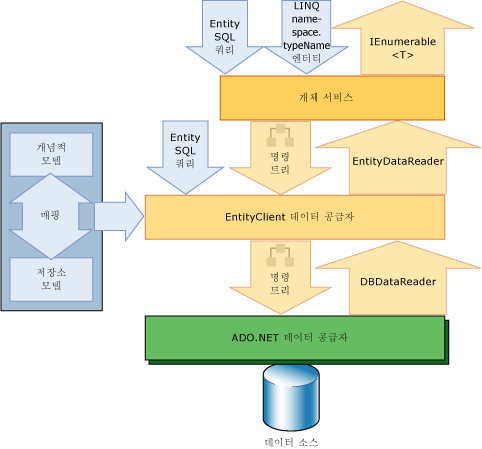

# Entity Framework 개요
[!INCLUDE[adonet_ef](../../../../../includes/adonet-ef-md.md)]는 데이터 지향 소프트웨어 응용 프로그램의 개발을 지원하는 ADO.NET의 기술 집합입니다. 데이터 지향 응용 프로그램의 설계자와 개발자는 두 가지 다른 목적을 달성하기 위해 노력해 왔습니다. 해결 중인 비즈니스 문제의 엔터티, 관계 및 논리를 모델링해야 하며, 데이터를 저장 및 검색하는 데 사용되는 데이터 엔진도 사용해야 합니다. 데이터는 각각 해당 프로토콜을 가진 여러 개의 저장소 시스템에 걸쳐 있을 수 있습니다. 단일 저장소 시스템에서 작동하는 응용 프로그램도 저장소 시스템의 요구 사항 및 효율적이고 유지 가능한 응용 프로그램 코드를 작성하기 위한 요구 사항의 균형을 조정해야 합니다.  
  
 그러나 [!INCLUDE[adonet_ef](../../../../../includes/adonet-ef-md.md)]를 사용하면 개발자가 기본 데이터베이스 테이블과 해당 데이터가 저장된 열을 고려할 필요 없이 고객이나 고객 주소와 같은 데이터를 도메인 특정 개체 및 속성의 형태로 다룰 수 있습니다. [!INCLUDE[adonet_ef](../../../../../includes/adonet-ef-md.md)]를 사용하면 개발자가 데이터를 처리할 때 보다 높은 추상 수준에서 작업할 수 있으며, 기존의 응용 프로그램에서보다 적은 코드로 데이터 지향 응용 프로그램을 만들고 유지 관리할 수 있습니다. 때문에 [!INCLUDE[adonet_ef](../../../../../includes/adonet-ef-md.md)] 의 구성 요소인는 [!INCLUDE[dnprdnshort](../../../../../includes/dnprdnshort-md.md)], [!INCLUDE[adonet_ef](../../../../../includes/adonet-ef-md.md)] 응용 프로그램 수 있는 모든 컴퓨터에서 실행는 [!INCLUDE[dnprdnshort](../../../../../includes/dnprdnshort-md.md)] 버전 3.5 s p 1 부터는 설치 되어 있습니다.  
  
 이 항목의 다음 단원에서는 [!INCLUDE[adonet_ef](../../../../../includes/adonet-ef-md.md)]에 대해 좀 더 자세히 설명합니다.  
  
-   [모델 활성화](#LifeToModels)  
  
-   [데이터에 개체 매핑](#MappingObjectsToData)  
  
-   [엔터티 데이터 액세스 및 변경](#AccessingData)  
  
-   [데이터 공급자](#DataProviders)  
  
-   [엔터티 데이터 모델 도구](#Tools)  
  
-   [추가 정보](#LearnMore)  
  
   
## 모델 활성화  
 응용 프로그램 또는 서비스를 만들 때의 오랫동안 지속된 일반적인 디자인 방법은 응용 프로그램 또는 서비스를 도메인 모델, 논리 모델 및 실제 모델의 세 부분으로 나누는 것입니다. 도메인 모델은 모델링되는 시스템의 엔터티 및 관계를 정의합니다. 관계형 데이터베이스에 대한 논리 모델은 FOREIGN KEY 제약 조건이 있는 테이블로 엔터티와 관계를 정규화합니다. 실제 모델은 분할 및 인덱싱과 같은 저장소 세부 정보를 지정하여 특정 데이터 엔진의 기능을 다룹니다.  
  
 데이터베이스 관리자는 성능 향상을 위해 실제 모델을 미세 조정하지만, 응용 프로그램 코드를 작성하는 프로그래머는 주로 SQL 쿼리를 작성하고 저장 프로시저를 호출하여 논리 모델에서 작업합니다. 도메인 모델은 일반적으로 응용 프로그램 요구 사항을 파악하고 전달하기 위한 도구로 사용되며, 프로젝트의 초기 단계에서 확인하고 토론한 다음 버려지는 단순한 다이어그램으로 사용되는 경우가 많습니다. 대부분의 개발 팀에서는 개념적 모델을 만드는 단계를 생략하고 관계형 데이터베이스의 테이블, 열 및 키를 지정하는 단계에서 작업을 시작합니다.  
  
 [!INCLUDE[adonet_ef](../../../../../includes/adonet-ef-md.md)] 개발자가 쿼리 엔터티와 도메인 모델에서 관계를 사용 하 여 모델에에서는 (라는 *개념적* 모델에 [!INCLUDE[adonet_ef](../../../../../includes/adonet-ef-md.md)])에 의존 하는 동안는 [!INCLUDE[adonet_ef](../../../../../includes/adonet-ef-md.md)] 변환 하는 것 데이터 원본에 따른 특정 명령에 대 한 작업입니다. 이렇게 하면 응용 프로그램이 하드 코딩 방식으로 특정 데이터 소스에 종속되지 않습니다.  
  
 Code First를 사용하여 작업할 때 개념적 모델이 저장소 모델에 코드로 매핑됩니다. [!INCLUDE[adonet_ef](../../../../../includes/adonet-ef-md.md)]는 정의한 추가 구성과 개체 형식을 기반으로 한 개념적 모델을 유추할 수 있습니다. 매핑 메타데이터는 사용자가 코드로 제공한 추가 구성 정보와 도메인 형식을 정의하는 방법을 기반으로 런타임 중 생성됩니다. [!INCLUDE[adonet_ef](../../../../../includes/adonet-ef-md.md)]에서는 메타데이터를 기반으로 필요에 따라 데이터베이스를 생성합니다. 자세한 내용은 참조 [만들고 개념적 모델을 매핑하여](http://go.microsoft.com/fwlink/?LinkID=235382)합니다.  
  
 엔터티 데이터 모델 도구를 사용하여 작업할 때 개념적 모델, 저장소 모델 및 이 두 모델 간의 매핑은 XML 기반 스키마로 표현되고 해당 확장명의 파일에 정의됩니다.  
  
-   CSDL(개념 스키마 정의 언어)은 개념적 모델을 정의합니다. CSDL은는 [!INCLUDE[adonet_ef](../../../../../includes/adonet-ef-md.md)]의 구현에서 [엔터티 데이터 모델](../../../../../docs/framework/data/adonet/entity-data-model.md)합니다. 파일 확장명은 .csdl입니다.  
  
-   SSDL(저장소 스키마 정의 언어)은 논리 모델이라고도 하는 저장소 모델을 정의합니다. 파일 확장명은 .ssdl입니다.  
  
-   MSL(매핑 사양 언어)은 저장소 모델과 개념적 모델 간의 매핑을 정의합니다. 파일 확장명은 .msl입니다.  
  
 저장소 모델과 매핑은 개념적 모델, 데이터 클래스 또는 응용 프로그램 코드를 변경하지 않고도 필요에 따라 변경할 수 있습니다. 저장소 모델은 공급자와 관련이 있으므로 다양한 데이터 소스에서 일관성 있는 개념적 모델을 사용할 수 있습니다.  
  
 [!INCLUDE[adonet_ef](../../../../../includes/adonet-ef-md.md)] 사용 하 여 이러한 모델 및 매핑 파일을 만들려면 읽기, 업데이트 및 데이터 원본에 해당 하는 작업은 개념적 모델의 엔터티 및 관계에 대 한 작업을 삭제 합니다. [!INCLUDE[adonet_ef](../../../../../includes/adonet-ef-md.md)] 개념적 모델을 데이터 원본에서 저장된 프로시저에는 매핑 엔터티 기능도 지원 합니다. 자세한 내용은 참조 [CSDL, SSDL 및 MSL 사양](../../../../../docs/framework/data/adonet/ef/language-reference/csdl-ssdl-and-msl-specifications.md)합니다.  
  
   
## 데이터에 개체 매핑  
 개체 지향 프로그래밍을 사용하는 경우 데이터 저장소 시스템과 상호 작용해야 합니다. 클래스의 구성은 관계형 데이터베이스 테이블의 구성을 미러링하는 경우가 많지만 완전히 일치하지는 않습니다. 여러 개의 정규화된 테이블이 하나의 클래스에 해당하는 경우가 많으며 클래스 간의 관계가 테이블 간의 관계와 다르게 표현되기도 합니다. 예를 들어 판매 주문의 고객을 나타내기 위해 `Order` 클래스는 `Customer` 클래스 인스턴스에 대한 참조가 포함된 속성을 사용할 수 있지만, 데이터베이스의 `Order` 테이블 행에는 `Customer` 테이블의 기본 키 값에 해당하는 값을 가진 외래 키 열(또는 열 집합)이 포함됩니다. `Customer` 클래스는 `Orders` 클래스 인스턴스의 컬렉션이 포함된 `Order` 속성을 가질 수 있는 반면, 데이터베이스의 `Customer` 테이블에는 해당하는 열이 없습니다. [!INCLUDE[adonet_ef](../../../../../includes/adonet-ef-md.md)]를 사용하면 개발자는 보다 융통성 있게 관계를 이 방식으로 표현하거나 데이터베이스에서 표현되는 방식과 보다 가깝게 관계를 모델링할 수 있습니다.  
  
 기존 솔루션은 개체 지향 클래스와 속성을 관계형 테이블과 열에 매핑만 하여 흔히 "임피던스 불일치"라고 하는 이 간격을 연결하려고 했습니다. 기존의이 방법 대신는 [!INCLUDE[adonet_ef](../../../../../includes/adonet-ef-md.md)] 관계형 테이블, 열 및 논리 모델에 외래 키 제약 조건을 개념적 모델의 엔터티 및 관계에 매핑합니다. 이렇게 하면 보다 유연성 있게 개체를 정의하고 논리 모델을 최적화할 수 있습니다. [!INCLUDE[adonet_edm](../../../../../includes/adonet-edm-md.md)] 도구는 개념적 모델을 기반으로 확장 가능한 데이터 클래스를 생성합니다. 이러한 클래스는 개발자가 추가하는 멤버로 확장할 수 있는 부분 클래스입니다. 기본적으로, 특정 개념적 모델에 대해 생성되는 클래스는 엔터티를 개체로 구체화하고 변경 내용을 추적 및 저장하기 위한 서비스를 제공하는 기본 클래스에서 파생됩니다. 개발자는 이러한 클래스를 통해 엔터티 및 관계를 연결에 의해 관련된 개체로 사용할 수 있습니다. 또한 개발자는 개념적 모델에 대해 생성된 클래스를 사용자 지정할 수도 있습니다. 자세한 내용은 참조 [개체 작업](../../../../../docs/framework/data/adonet/ef/working-with-objects.md)합니다.  
  
   
## 엔터티 데이터 액세스 및 변경  
 단순한 개체-관계형 매핑 솔루션 이상의 의미가 있는 [!INCLUDE[adonet_ef](../../../../../includes/adonet-ef-md.md)]는 근본적으로 응용 프로그램이 개념적 모델의 엔터티 및 관계로 표현된 데이터에 액세스하여 변경할 수 있도록 합니다. [!INCLUDE[adonet_ef](../../../../../includes/adonet-ef-md.md)]는 모델 및 매핑 파일의 정보를 사용하여 개념적 모델로 표현된 엔터티 형식에 대한 개체 쿼리를 데이터 소스에 대한 쿼리로 변환합니다. 쿼리 결과 개체로 구체화 하는 [!INCLUDE[adonet_ef](../../../../../includes/adonet-ef-md.md)] 를 관리 합니다. [!INCLUDE[adonet_ef](../../../../../includes/adonet-ef-md.md)] 개념적 모델을 쿼리하고 개체를 반환 하려면 다음과 같은 방법을 제공 합니다.  
  
-   [!INCLUDE[linq_entities](../../../../../includes/linq-entities-md.md)]. 개념적 모델에 정의된 엔터티 형식을 쿼리하기 위한 LINQ(Language-Integrated Query) 지원을 제공합니다. 자세한 내용은 참조 [LINQ to Entities](../../../../../docs/framework/data/adonet/ef/language-reference/linq-to-entities.md)합니다.  
  
-   [!INCLUDE[esql](../../../../../includes/esql-md.md)]. 개념적 모델의 엔터티와 직접 작동 하 고 지 원하는 sql 저장소에 독립적인 언어 [!INCLUDE[adonet_edm](../../../../../includes/adonet-edm-md.md)] 개념입니다. [!INCLUDE[esql](../../../../../includes/esql-md.md)]개체 쿼리와 EntityClient 공급자를 사용 하 여 실행 된 쿼리를 모두 사용 됩니다. 자세한 내용은 참조 [Entity SQL 개요](../../../../../docs/framework/data/adonet/ef/language-reference/entity-sql-overview.md)합니다.  
  
 [!INCLUDE[adonet_ef](../../../../../includes/adonet-ef-md.md)]에는 EntityClient 데이터 공급자가 포함되어 있습니다. 이 공급자는 연결을 관리하고, 엔터티 쿼리를 데이터 소스 특정 쿼리로 변환하며, [!INCLUDE[adonet_ef](../../../../../includes/adonet-ef-md.md)]에서 엔터티 데이터를 개체로 구체화할 때 사용하는 데이터 판독기를 반환합니다. 표준와 같이 EntityClient 공급자를 사용할 수도 있습니다 개체 구체화가 필요 하지 않을 경우 [!INCLUDE[vstecado](../../../../../includes/vstecado-md.md)] 응용 프로그램 실행을 사용 하 여 데이터 공급자 [!INCLUDE[esql](../../../../../includes/esql-md.md)] 쿼리하고 반환 된 읽기 전용 데이터 판독기를 사용 합니다. 자세한 내용은 참조 [Entity Framework 용 EntityClient 공급자](../../../../../docs/framework/data/adonet/ef/entityclient-provider-for-the-entity-framework.md)합니다.  
  
 다음 다이어그램에서는 데이터 액세스를 위한 [!INCLUDE[adonet_ef](../../../../../includes/adonet-ef-md.md)] 아키텍처를 보여 줍니다.  
  
   
  
 [!INCLUDE[adonet_edm](../../../../../includes/adonet-edm-md.md)] 도구는 개념적 모델의 엔터티 컨테이너를 나타내며 `System.Data.Objects.ObjectContext` 또는 `System.Data.Entity.DbContext`에서 파생된 클래스를 생성할 수 있습니다. 이 개체 컨텍스트는 변경 내용을 추적하고 ID, 동시성 및 관계를 관리하기 위한 기능을 제공합니다. 또한 이 클래스는 데이터 소스에 삽입, 업데이트 및 삭제를 쓰는 `SaveChanges` 메서드를 노출합니다. 쿼리와 마찬가지로, 이러한 변경 작업은 시스템에서 자동으로 생성된 명령이나 개발자가 지정한 저장 프로시저로 수행됩니다.  
  
   
## 데이터 공급자  
 `EntityClient` 공급자는 개념적 엔터티 및 관계 측면에서 데이터에 액세스하여 [!INCLUDE[vstecado](../../../../../includes/vstecado-md.md)] 공급자 모델을 확장합니다. [!INCLUDE[esql](../../../../../includes/esql-md.md)]을 사용하는 쿼리를 실행합니다. [!INCLUDE[esql](../../../../../includes/esql-md.md)]에서는 `EntityClient`가 데이터베이스와 통신할 수 있도록 기본 쿼리 언어를 제공합니다. 자세한 내용은 참조 [Entity Framework 용 EntityClient 공급자](../../../../../docs/framework/data/adonet/ef/entityclient-provider-for-the-entity-framework.md)합니다.  
  
 [!INCLUDE[adonet_ef](../../../../../includes/adonet-ef-md.md)]에는 정식 명령 트리를 지원하는 업데이트된 SqlClient 데이터 공급자가 있습니다. 자세한 내용은 참조 [Entity Framework 용 SqlClient](../../../../../docs/framework/data/adonet/ef/sqlclient-for-the-entity-framework.md)합니다.  
  
   
## 엔터티 데이터 모델 도구  
 [!INCLUDE[adonet_ef](../../../../../includes/adonet-ef-md.md)] 런타임과 함께, [!INCLUDE[vs_current_long](../../../../../includes/vs-current-long-md.md)]에서는 매핑 및 모델링 도구가 포함되어 있습니다. 자세한 내용은 참조 [모델링 및 매핑](../../../../../docs/framework/data/adonet/ef/modeling-and-mapping.md)합니다.  
  
   
## 자세한 정보  
 다음 항목을 사용하여 [!INCLUDE[adonet_ef](../../../../../includes/adonet-ef-md.md)]에 대해 자세히 알아볼 수 있습니다.  
  
 [시작](../../../../../docs/framework/data/adonet/ef/getting-started.md)  
 시작 하는 방법에 대 한 정보를 제공 하 고 신속 하 게 사용 하 여 실행는 [퀵 스타트](http://msdn.microsoft.com/en-us/0bc534be-789f-4819-b9f6-76e51d961675), 간단한을 만드는 방법을 보여 주는 [!INCLUDE[adonet_ef](../../../../../includes/adonet-ef-md.md)] 응용 프로그램입니다.  
  
 [Entity Framework 용어](../../../../../docs/framework/data/adonet/ef/terminology.md)  
 엔터티 데이터 모델 및 [!INCLUDE[adonet_ef](../../../../../includes/adonet-ef-md.md)]에서 도입되었으며 [!INCLUDE[adonet_ef](../../../../../includes/adonet-ef-md.md)] 설명서에서 사용된 대부분의 용어를 정의합니다.  
  
 [Entity Framework 리소스](../../../../../docs/framework/data/adonet/ef/resources.md)  
 개념 항목에 대한 링크와 [!INCLUDE[adonet_ef](../../../../../includes/adonet-ef-md.md)] 응용 프로그램을 빌드하기 위한 외부 항목 및 리소스에 대한 링크를 제공합니다.  
  
## 참고 항목  
 [ADO.NET Entity Framework](../../../../../docs/framework/data/adonet/ef/index.md)
