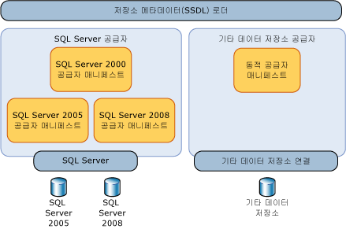
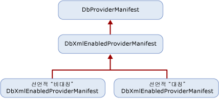

# <a name="provider-manifest-specification"></a>공급자 매니페스트 지정
이 단원에서는 데이터 저장소 공급자가 데이터 저장소의 형식 및 함수를 지원하는 방법에 대해 설명합니다.  
  
 엔터티 서비스는 특정 데이터 저장소 공급자와 독립적으로 작동하지만 모델, 매핑 및 쿼리가 기본 데이터 저장소와 상호 작용하는 방식을 데이터 공급자가 명시적으로 정의할 수 있도록 합니다. 추상 계층이 없는 경우 엔터티 서비스는 특정 데이터 저장소 또는 데이터 공급자에서만 대상으로 할 수 있습니다.  
  
 공급자가 지원하는 형식은 기본 데이터베이스에서 직접 또는 간접적으로 지원됩니다. 이러한 형식은 정확한 저장소 형식일 필요는 없으며 공급자가 [!INCLUDE[adonet_ef](../../../../../includes/adonet-ef-md.md)]를 지원하기 위해 사용하는 형식입니다. 공급자/저장소 형식은 EDM(엔터티 데이터 모델) 측면에서 설명됩니다.  
  
 데이터 저장소에서 지원되는 함수의 매개 변수 및 반환 형식은 EDM 측면에서 지정됩니다.  
  
## <a name="requirements"></a>요구 사항  
 [!INCLUDE[adonet_ef](../../../../../includes/adonet-ef-md.md)] 및 데이터 저장소는 데이터 손실이나 잘림 없이 알려진 형식으로 데이터를 전달하고 받을 수 있어야 합니다.  
  
 공급자 매니페스트는 데이터 저장소에 대한 연결을 열 필요 없이 디자인 타임에 도구를 통해 로드할 수 있어야 합니다.  
  
 [!INCLUDE[adonet_ef](../../../../../includes/adonet-ef-md.md)] 가 대/소문자 구분, 하지만 기본 데이터 저장소 되지 않을 수 있습니다. EDM 아티팩트(식별자, 형식 이름 등)가 매니페스트에서 정의되고 사용되는 경우 [!INCLUDE[adonet_ef](../../../../../includes/adonet-ef-md.md)] 대/소문자 구분을 사용해야 합니다. 대/소문자를 구분할 수 있는 데이터 저장소 요소가 공급자 매니페스트에 나타나는 경우 해당 대/소문자 구분이 공급자 매니페스트에서 유지 관리되어야 합니다.  
  
 [!INCLUDE[adonet_ef](../../../../../includes/adonet-ef-md.md)]에서는 모든 데이터 공급자에 대한 공급자 매니페스트를 요구합니다. 공급자가 없는 공급자를 사용 하려는 경우와 매니페스트는 [!INCLUDE[adonet_ef](../../../../../includes/adonet-ef-md.md)], 오류가 발생 합니다.  
  
 다음 표에서는 공급자 상호 작용을 통해 예외가 발생하는 경우 [!INCLUDE[adonet_ef](../../../../../includes/adonet-ef-md.md)]에서 throw되는 예외의 종류에 대해 설명합니다.  
  
|문제|예외|  
|-----------|---------------|  
|공급자가 DbProviderServices의 GetProviderManifest를 지원하지 않습니다.|ProviderIncompatibleException|  
|공급자 매니페스트가 없습니다. 공급자 매니페스트를 검색하려고 할 때 공급자가 `null`을 반환합니다.|ProviderIncompatibleException|  
|공급자 매니페스트가 잘못되었습니다. 공급자 매니페스트를 검색하려고 할 때 공급자가 잘못된 XML을 반환합니다.|ProviderIncompatibleException|  
  
## <a name="scenarios"></a>시나리오  
 공급자는 다음 시나리오를 지원해야 합니다.  
  
### <a name="writing-a-provider-with-symmetric-type-mapping"></a>대칭 형식 매핑을 사용하여 공급자 작성  
 에 대 한 공급자를 작성할 수 있습니다는 [!INCLUDE[adonet_ef](../../../../../includes/adonet-ef-md.md)] 각 저장소 형식이 매핑됩니다 매핑 방향에 관계 없이 단일 EDM 형식입니다. EDM 형식에 해당하는 가장 단순한 매핑이 있는 공급자 형식의 경우 형식 시스템이 단순하거나 EDM 형식과 일치하기 때문에 대칭 솔루션을 사용할 수 있습니다.  
  
 해당 도메인의 단순성을 사용하고 정적 선언적 공급자 매니페스트를 생성할 수 있습니다.  
  
 다음 두 섹션이 있는 XML 파일을 작성합니다.  
  
-   저장소 형식 또는 함수의 "해당하는 EDM 항목" 측면에서 표현된 공급자 형식의 목록. 저장소 형식에는 해당하는 EDM 형식이 있고, 저장소 함수에는 해당하는 EDM 함수가 있습니다. 예를 들어, varchar은 SQL Server 형식이지만 해당하는 EDM 형식은 string입니다.  
  
-   매개 변수와 반환 형식이 EDM 측면에서 표현된, 공급자가 지원하는 함수의 목록  
  
### <a name="writing-a-provider-with-asymmetric-type-mapping"></a>비대칭 형식 매핑을 사용하여 공급자 작성  
 [!INCLUDE[adonet_ef](../../../../../includes/adonet-ef-md.md)]에 대한 데이터 저장소 공급자를 작성하는 경우 일부 형식에 대한 EDM-공급자 형식 매핑은 공급자-EDM 형식 매핑과 다를 수 있습니다. 예를 들어, 바인딩되지 않은 EDM PrimitiveTypeKind.String은 공급자에서 nvarchar(4000)에 매핑될 수 있지만 nvarchar(4000)은 EDM PrimitiveTypeKind.String(MaxLength=4000)에 매핑됩니다.  
  
 다음 두 섹션이 있는 XML 파일을 작성합니다.  
  
-   EDM 측면에서 표현되고 양방향(EDM-공급자 및 공급자-EDM)의 매핑을 정의하는 공급자 형식의 목록  
  
-   매개 변수와 반환 형식이 EDM 측면에서 표현된, 공급자가 지원하는 함수의 목록  
  
## <a name="provider-manifest-discoverability"></a>공급자 매니페스트 검색 기능  
 매니페스트는 엔터티 서비스의 몇 가지 구성 요소 형식(도구 또는 쿼리 등)에서 간접적으로 사용되지만 데이터 저장소 메타데이터 로더의 사용을 통해 메타데이터에서 보다 직접적으로 활용됩니다.  
  
   
  
 그러나 지정된 공급자가 여러 저장소나 여러 버전의 동일한 저장소를 지원할 수 있습니다. 따라서 공급자는 지원되는 데이터 저장소마다 다른 매니페스트를 보고해야 합니다.  
  
### <a name="provider-manifest-token"></a>공급자 매니페스트 토큰  
 데이터 저장소 연결이 열린 경우 공급자가 올바른 매니페스트를 반환하기 위해 정보를 쿼리할 수 있습니다. 이는 연결 정보를 사용할 수 없거나 저장소에 연결할 수 없는 오프라인 시나리오에서는 가능하지 않을 수 있습니다. .ssdl 파일에서 `ProviderManifestToken` 요소의 `Schema` 특성을 사용하여 매니페스트를 식별할 수 있습니다. 이 특성에는 필수 형식이 없습니다. 공급자는 저장소에 대한 연결을 열지 않고 매니페스트를 식별하는 데 필요한 최소한의 정보를 선택합니다.  
  
 예를 들면 다음과 같습니다.  
  
```xml  
<Schema Namespace="Northwind" Provider="System.Data.SqlClient" ProviderManifestToken="2005" xmlns:edm="http://schemas.microsoft.com/ado/2006/04/edm/ssdl" xmlns="http://schemas.microsoft.com/ado/2006/04/edm/ssdl">  
```  
  
## <a name="provider-manifest-programming-model"></a>공급자 매니페스트 프로그래밍 모델  
 공급자는 <xref:System.Data.Common.DbXmlEnabledProviderManifest>에서 파생되므로 매니페스트를 선언적으로 지정할 수 있습니다. 다음 그림에서는 공급자의 클래스 계층 구조를 보여 줍니다.  
  
   
  
### <a name="discoverability-api"></a>검색 기능 API  
 공급자 매니페스트는 데이터 저장소 연결이나 공급자 매니페스트 토큰을 사용하여 저장소 메타데이터 로더(StoreItemCollection)에 의해 로드됩니다.  
  
#### <a name="using-a-data-store-connection"></a>데이터 저장소 연결 사용  
 데이터 저장소 연결을 사용할 수 있는 경우 DbProvderServices.GetProviderManifestToken을 호출하여 GetProviderManifest 메서드에 전달되는 토큰을 반환합니다. GetProviderManifest 메서드는 DbProviderManifest를 반환합니다. 이 메서드는 공급자의 GetDbProviderManifestToken 구현에 작업을 위임합니다.  
  
```  
public string GetProviderManifestToken(DbConnection connection);  
public DbProviderManifest GetProviderManifest(string manifestToken);  
```  
  
#### <a name="using-a-provider-manifest-token"></a>공급자 매니페스트 토큰 사용  
 오프라인 시나리오의 경우 토큰이 SSDL 표현에서 선택됩니다. SSDL을 사용 하면 한 ProviderManifestToken를 지정할 수 있습니다 (참조 [스키마 요소 (SSDL)](http://msdn.microsoft.com/library/fec75ae4-7f16-4421-9265-9dac61509222) 자세한 정보에 대 한). 예를 들어, 연결을 열 수 없는 경우 SSDL에는 매니페스트에 대한 정보를 지정하는 공급자 매니페스트 토큰이 있습니다.  
  
```  
public DbProviderManifest GetProviderManifest(string manifestToken);  
```  
  
### <a name="provider-manifest-schema"></a>공급자 매니페스트 스키마  
 각 공급자에 대해 정의된 정보의 스키마에는 메타데이터에서 사용할 정적 정보가 포함되어 있습니다.  
  
```xml  
<?xml version="1.0" encoding="utf-8"?>  
<xs:schema elementFormDefault="qualified"  
   xmlns:xs="http://www.w3.org/2001/XMLSchema"  
   targetNamespace="http://schemas.microsoft.com/ado/2006/04/edm/providermanifest"  
   xmlns:pm="http://schemas.microsoft.com/ado/2006/04/edm/providermanifest">  
  
  <xs:element name="ProviderManifest">  
    <xs:complexType>  
      <xs:sequence>  
        <xs:element name="Types" type="pm:TTypes" minOccurs="1" maxOccurs="1" />  
        <xs:element name="Functions" type="pm:TFunctions" minOccurs="0" maxOccurs="1"/>  
      </xs:sequence>  
      <xs:attribute name="Namespace" type="xs:string" use="required"/>  
    </xs:complexType>  
  </xs:element>  
  <xs:complexType name="TVersion">  
    <xs:attribute name="Major" type="xs:int" use="required" />  
    <xs:attribute name="Minor" type="xs:int" use="required" />  
    <xs:attribute name="Build" type="xs:int" use="required" />  
    <xs:attribute name="Revision" type="xs:int" use="required" />  
  </xs:complexType>  
  
  <xs:complexType name="TIntegerFacetDescription">  
    <xs:attribute name="Minimum" type="xs:int" use="optional" />  
    <xs:attribute name="Maximum" type="xs:int" use="optional" />  
    <xs:attribute name="DefaultValue" type="xs:int" use="optional" />  
    <xs:attribute name="Constant" type="xs:boolean" default="false" />  
  </xs:complexType>  
  
  <xs:complexType name="TBooleanFacetDescription">  
    <xs:attribute name="DefaultValue" type="xs:boolean" use="optional" />  
    <xs:attribute name="Constant" type="xs:boolean" default="true" />  
  </xs:complexType>  
  
  <xs:complexType name="TDateTimeFacetDescription">  
    <xs:attribute name="Constant" type="xs:boolean" default="false" />  
  </xs:complexType>  
  
  <xs:complexType name="TFacetDescriptions">  
    <xs:choice maxOccurs="unbounded">  
      <xs:element name="Precision" minOccurs="0" maxOccurs="1" type="pm:TIntegerFacetDescription"/>  
      <xs:element name="Scale" minOccurs="0" maxOccurs="1" type="pm:TIntegerFacetDescription"/>  
      <xs:element name="MaxLength" minOccurs="0" maxOccurs="1" type="pm:TIntegerFacetDescription"/>  
      <xs:element name="Unicode" minOccurs="0" maxOccurs="1" type="pm:TBooleanFacetDescription"/>  
      <xs:element name="FixedLength" minOccurs="0" maxOccurs="1" type="pm:TBooleanFacetDescription"/>  
    </xs:choice>  
  </xs:complexType>  
  
  <xs:complexType name="TType">  
    <xs:sequence>  
      <xs:element name="FacetDescriptions" type="pm:TFacetDescriptions" minOccurs="0" maxOccurs="1"/>  
    </xs:sequence>  
    <xs:attribute name="Name" type="xs:string" use="required"/>  
    <xs:attribute name="PrimitiveTypeKind" type="pm:TPrimitiveTypeKind" use="required" />  
  </xs:complexType>  
  
  <xs:complexType name="TTypes">  
    <xs:sequence>  
      <xs:element name="Type" type="pm:TType" minOccurs="0" maxOccurs="unbounded"/>  
    </xs:sequence>  
  </xs:complexType>  
  
  <xs:attributeGroup name="TFacetAttribute">  
    <xs:attribute name="Precision" type="xs:int" use="optional"/>  
    <xs:attribute name="Scale" type="xs:int" use="optional"/>  
    <xs:attribute name="MaxLength" type="xs:int" use="optional"/>  
    <xs:attribute name="Unicode" type="xs:boolean" use="optional"/>  
    <xs:attribute name="FixedLength" type="xs:boolean" use="optional"/>  
  </xs:attributeGroup>  
  
  <xs:complexType name="TFunctionParameter">  
    <xs:attribute name="Name" type="xs:string" use="required" />  
    <xs:attribute name="Type" type="xs:string" use="required" />  
    <xs:attributeGroup ref="pm:TFacetAttribute" />  
    <xs:attribute name="Mode" type="pm:TParameterDirection" use="required" />  
  </xs:complexType>  
  
  <xs:complexType name="TReturnType">  
    <xs:attribute name="Type" type="xs:string" use="required" />  
    <xs:attributeGroup ref="pm:TFacetAttribute" />  
  </xs:complexType>  
  
  <xs:complexType name="TFunction">  
    <xs:choice minOccurs="0" maxOccurs ="unbounded">  
      <xs:element name ="ReturnType" type="pm:TReturnType" minOccurs="0" maxOccurs="1" />  
      <xs:element name="Parameter" type="pm:TFunctionParameter" minOccurs="0" maxOccurs="unbounded"/>  
    </xs:choice>  
    <xs:attribute name="Name" type="xs:string" use="required" />  
    <xs:attribute name="Aggregate" type="xs:boolean" use="optional" />  
    <xs:attribute name="BuiltIn" type="xs:boolean" use="optional" />  
    <xs:attribute name="StoreFunctionName" type="xs:string" use="optional" />  
    <xs:attribute name="NiladicFunction" type="xs:boolean" use="optional" />  
    <xs:attribute name="ParameterTypeSemantics" type="pm:TParameterTypeSemantics" use="optional" default="AllowImplicitConversion" />  
  </xs:complexType>  
  
  <xs:complexType name="TFunctions">  
    <xs:sequence>  
      <xs:element name="Function" type="pm:TFunction" minOccurs="0" maxOccurs="unbounded"/>  
    </xs:sequence>  
  </xs:complexType>  
  
  <xs:simpleType name="TPrimitiveTypeKind">  
    <xs:restriction base="xs:string">  
      <xs:enumeration value="Binary"/>  
      <xs:enumeration value="Boolean"/>  
      <xs:enumeration value="Byte"/>  
      <xs:enumeration value="Decimal"/>  
      <xs:enumeration value="DateTime"/>  
      <xs:enumeration value="Time"/>  
      <xs:enumeration value="DateTimeOffset"/>          
      <xs:enumeration value="Double"/>  
      <xs:enumeration value="Guid"/>  
      <xs:enumeration value="Single"/>  
      <xs:enumeration value="SByte"/>  
      <xs:enumeration value="Int16"/>  
      <xs:enumeration value="Int32"/>  
      <xs:enumeration value="Int64"/>  
      <xs:enumeration value="String"/>  
    </xs:restriction>  
  </xs:simpleType>  
  
  <xs:simpleType name="TParameterDirection">  
    <xs:restriction base="xs:string">  
      <xs:enumeration value="In"/>  
      <xs:enumeration value="Out"/>  
      <xs:enumeration value="InOut"/>  
    </xs:restriction>  
  </xs:simpleType>  
  
  <xs:simpleType name="TParameterTypeSemantics">  
    <xs:restriction base="xs:string">  
      <xs:enumeration value="ExactMatchOnly" />  
      <xs:enumeration value="AllowImplicitPromotion" />  
      <xs:enumeration value="AllowImplicitConversion" />  
    </xs:restriction>  
  </xs:simpleType>  
</xs:schema>  
```  
  
#### <a name="types-node"></a>Types 노드  
 공급자 매니페스트의 Types 노드에는 공급자를 통해서나 데이터 저장소에서 기본적으로 지원하는 형식에 대한 정보가 포함되어 있습니다.  
  
##### <a name="type-node"></a>Type 노드  
 각 Type 노드는 EDM 측면에서 공급자 형식을 정의합니다. Type 노드는 공급자 형식의 이름, 매핑하는 모델 형식과 관련된 정보 및 해당 형식 매핑을 설명하기 위한 패싯을 설명합니다.  
  
 공급자 매니페스트에서 이 형식 정보를 표현하기 위해 각 TypeInformation 선언은 각 형식에 대한 몇 가지 패싯 설명을 정의해야 합니다.  
  
|특성 이름|데이터 형식|필수|기본값|설명|  
|--------------------|---------------|--------------|-------------------|-----------------|  
|이름|문자열|예|해당 없음|공급자별 데이터 형식 이름|  
|PrimitiveTypeKind|PrimitiveTypeKind|예|해당 없음|EDM 형식 이름|  
  
###### <a name="function-node"></a>Function 노드  
 각 Function은 공급자를 통해 사용할 수 있는 단일 함수를 정의합니다.  
  
|특성 이름|데이터 형식|필수|기본값|설명|  
|--------------------|---------------|--------------|-------------------|-----------------|  
|이름|문자열|예|해당 없음|함수의 식별자/이름입니다.|  
|ReturnType|문자열|아니요|Void|함수의 EDM 반환 형식입니다.|  
|Aggregate|Boolean|아니요|False|함수가 집계 함수인 경우 True입니다.|  
|BuiltIn|Boolean|아니요|True|함수가 데이터 저장소에 기본 제공되는 경우 True입니다.|  
|StoreFunctionName|문자열|아니요|\<이름 >|데이터 저장소의 함수 이름입니다.  함수 이름의 리디렉션 수준을 허용합니다.|  
|NiladicFunction|Boolean|아니요|False|함수가 매개 변수를 필요로 하지 않고 매개 변수 없이 호출되는 경우 True입니다.|  
|ParameterType<br /><br /> 의미 체계|ParameterSemantics|아니요|AllowImplicit<br /><br /> 변환|쿼리 파이프라인에서 매개 변수 형식 대체를 처리할 방법에 대한 선택 항목:<br /><br /> -   ExactMatchOnly<br />-   AllowImplicitPromotion<br />-AllowImplicitConversion|  
  
 **매개 변수 노드**  
  
 각 함수에는 하나 이상의 Parameter 노드로 구성된 컬렉션이 있습니다.  
  
|특성 이름|데이터 형식|필수|기본값|설명|  
|--------------------|---------------|--------------|-------------------|-----------------|  
|이름|문자열|예|해당 없음|매개 변수의 식별자/이름입니다.|  
|형식|문자열|예|해당 없음|매개 변수의 EDM 형식입니다.|  
|모드|매개 변수<br /><br /> 방향|예|해당 없음|매개 변수의 방향:<br /><br /> -에서<br />-out<br />-inout|  
  
##### <a name="namespace-attribute"></a>Namespace 특성  
 각 데이터 저장소 공급자는 매니페스트에서 정의된 정보에 대한 네임스페이스 또는 네임스페이스 그룹을 정의해야 합니다. 이 네임스페이스를 Entity SQL 쿼리에서 사용하여 함수 및 형식의 이름을 확인할 수 있습니다(예: SqlServer). 해당 네임스페이스는 Entity SQL 쿼리에서 표준 함수를 지원할 수 있도록 엔터티 서비스에서 정의하는 정식 네임스페이스인 EDM과 달라야 합니다.  
  
## <a name="see-also"></a>참고 항목  
 [Entity Framework 데이터 공급자 작성](../../../../../docs/framework/data/adonet/ef/writing-an-ef-data-provider.md)
