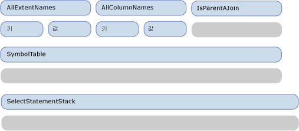
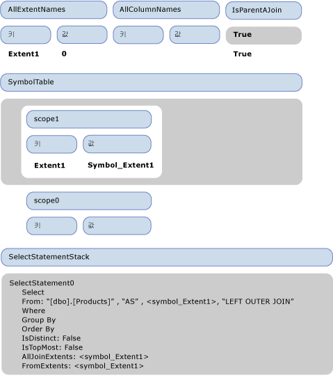
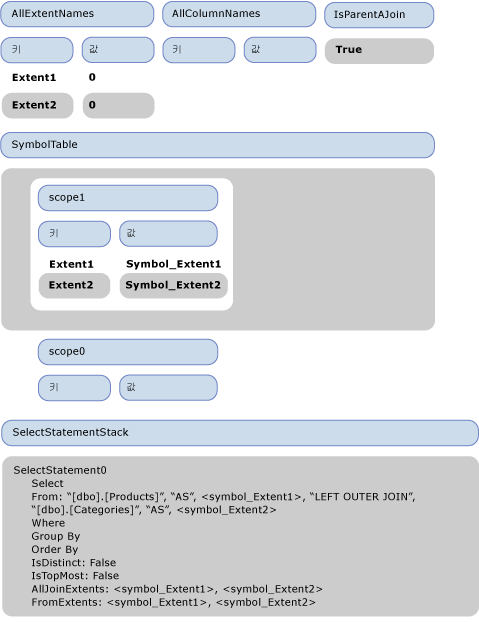
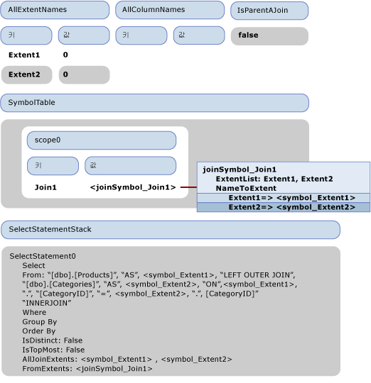
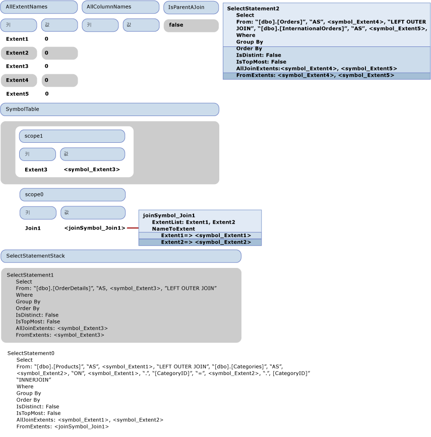
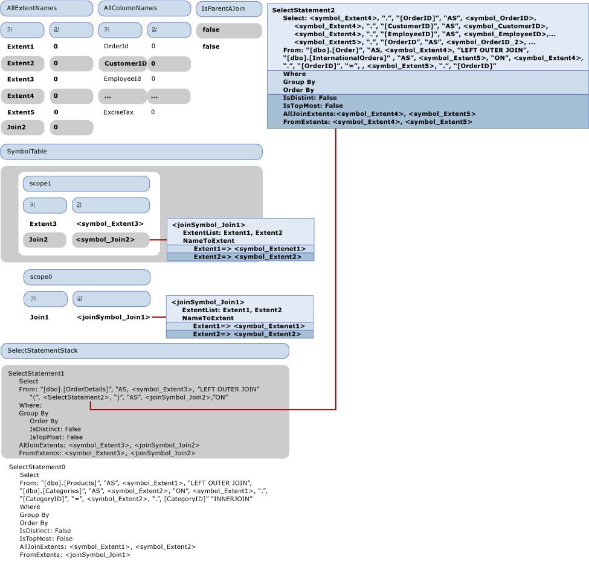

# 연습: SQL 생성
이 항목에서는 [샘플 공급자](http://go.microsoft.com/fwlink/?LinkId=180616)\(영문\)에서 SQL 생성이 발생하는 방식을 보여 줍니다.  다음 Entity SQL 쿼리는 샘플 공급자에 포함된 모델을 사용합니다.  
  
```  
SELECT  j1.ProductId, j1.ProductName, j1.CategoryName, j2.ShipCountry, j2.ProductId  
FROM (  SELECT P.ProductName, P.ProductId, P.Category.CategoryName  
        FROM NorthwindEntities.Products AS P) as j1  
INNER JOIN (SELECT OD.ProductId, OD.Order.ShipCountry as ShipCountry  
            FROM NorthwindEntities.OrderDetails AS OD) as j2  
            ON j1.ProductId == j2.ProductId   
```  
  
 이 쿼리는 공급자에 전달되는 다음 출력 명령 트리를 생성합니다.  
  
```  
DbQueryCommandTree  
|_Parameters  
|_Query : Collection{Record['C1'=Edm.Int32, 'ProductID'=Edm.Int32, 'ProductName'=Edm.String, 'CategoryName'=Edm.String, 'ShipCountry'=Edm.String, 'ProductID1'=Edm.Int32]}  
  |_Project  
    |_Input : 'Join4'  
    | |_InnerJoin  
    |   |_Left : 'Join1'  
    |   | |_LeftOuterJoin  
    |   |   |_Left : 'Extent1'  
    |   |   | |_Scan : dbo.Products  
    |   |   |_Right : 'Extent2'  
    |   |   | |_Scan : dbo.Categories  
    |   |   |_JoinCondition  
    |   |     |_  
    |   |       |_Var(Extent1).CategoryID  
    |   |       |_=  
    |   |       |_Var(Extent2).CategoryID  
    |   |_Right : 'Join3'  
    |   | |_LeftOuterJoin  
    |   |   |_Left : 'Extent3'  
    |   |   | |_Scan : dbo.OrderDetails  
    |   |   |_Right : 'Join2'  
    |   |   | |_LeftOuterJoin  
    |   |   |   |_Left : 'Extent4'  
    |   |   |   | |_Scan : dbo.Orders  
    |   |   |   |_Right : 'Extent5'  
    |   |   |   | |_Scan : dbo.InternationalOrders  
    |   |   |   |_JoinCondition  
    |   |   |     |_  
    |   |   |       |_Var(Extent4).OrderID  
    |   |   |       |_=  
    |   |   |       |_Var(Extent5).OrderID  
    |   |   |_JoinCondition  
    |   |     |_  
    |   |       |_Var(Extent3).OrderID  
    |   |       |_=  
    |   |       |_Var(Join2).Extent4.OrderID  
    |   |_JoinCondition  
    |     |_  
    |       |_Var(Join1).Extent1.ProductID  
    |       |_=  
    |       |_Var(Join3).Extent3.ProductID  
    |_Projection  
      |_NewInstance : Record['C1'=Edm.Int32, 'ProductID'=Edm.Int32, 'ProductName'=Edm.String, 'CategoryName'=Edm.String, 'ShipCountry'=Edm.String, 'ProductID1'=Edm.Int32]  
        |_Column : 'C1'  
        | |_1  
        |_Column : 'ProductID'  
        | |_Var(Join4).Join1.Extent1.ProductID  
        |_Column : 'ProductName'  
        | |_Var(Join4).Join1.Extent1.ProductName  
        |_Column : 'CategoryName'  
        | |_Var(Join4).Join1.Extent2.CategoryName  
        |_Column : 'ShipCountry'  
        | |_Var(Join4).Join3.Join2.Extent4.ShipCountry  
        |_Column : 'ProductID1'  
          |_Var(Join4).Join3.Extent3.ProductID  
```  
  
 이 항목에서는 이 출력 명령 트리를 다음 SQL 문으로 변환하는 방법에 대해 설명합니다.  
  
```  
SELECT   
1 AS [C1],   
[Extent1].[ProductID] AS [ProductID],   
[Extent1].[ProductName] AS [ProductName],   
[Extent2].[CategoryName] AS [CategoryName],   
[Join3].[ShipCountry] AS [ShipCountry],   
[Join3].[ProductID] AS [ProductID1]  
FROM   [dbo].[Products] AS [Extent1]  
LEFT OUTER JOIN [dbo].[Categories] AS [Extent2] ON [Extent1].[CategoryID] = [Extent2].[CategoryID]  
INNER JOIN    
(SELECT [Extent3].[OrderID] AS [OrderID1], [Extent3].[ProductID] AS [ProductID], [Extent3].[UnitPrice] AS [UnitPrice], [Extent3].[Quantity] AS [Quantity], [Extent3].[Discount] AS [Discount], [Join2].[OrderID2], [Join2].[CustomerID], [Join2].[EmployeeID], [Join2].[OrderDate], [Join2].[RequiredDate], [Join2].[ShippedDate], [Join2].[Freight], [Join2].[ShipName], [Join2].[ShipAddress], [Join2].[ShipCity], [Join2].[ShipRegion], [Join2].[ShipPostalCode], [Join2].[ShipCountry], [Join2].[OrderID3], [Join2].[CustomsDescription], [Join2].[ExciseTax]  
FROM  [dbo].[OrderDetails] AS [Extent3]  
LEFT OUTER JOIN    
      (SELECT [Extent4].[OrderID] AS [OrderID2], [Extent4].[CustomerID] AS [CustomerID], [Extent4].[EmployeeID] AS [EmployeeID], [Extent4].[OrderDate] AS [OrderDate], [Extent4].[RequiredDate] AS [RequiredDate], [Extent4].[ShippedDate] AS [ShippedDate], [Extent4].[Freight] AS [Freight], [Extent4].[ShipName] AS [ShipName], [Extent4].[ShipAddress] AS [ShipAddress], [Extent4].[ShipCity] AS [ShipCity], [Extent4].[ShipRegion] AS [ShipRegion], [Extent4].[ShipPostalCode] AS [ShipPostalCode], [Extent4].[ShipCountry] AS [ShipCountry], [Extent5].[OrderID] AS [OrderID3], [Extent5].[CustomsDescription] AS [CustomsDescription], [Extent5].[ExciseTax] AS [ExciseTax]  
FROM  [dbo].[Orders] AS [Extent4]  
LEFT OUTER JOIN [dbo].[InternationalOrders] AS [Extent5] ON [Extent4].[OrderID] = [Extent5].[OrderID]   
      ) AS [Join2] ON [Extent3].[OrderID] = [Join2].[OrderID2]   
   ) AS [Join3] ON [Extent1].[ProductID] = [Join3].[ProductID]  
```  
  
## SQL 생성의 첫 번째 단계: 식 트리 방문  
 다음 그림에서는 방문자의 비어 있는 초기 상태를 보여 줍니다.  이 항목 전반에서는 연습에 대한 설명과 관련된 속성만 표시됩니다.  
  
   
  
 Project 노드를 방문하면 VisitInputExpression이 입력\(Join4\)을 통해 호출되어 VisitJoinExpression 메서드에 의한 Join4의 방문을 트리거합니다.  Join4가 맨 위의 조인이기 때문에 IsParentAJoin은 false를 반환하고 새 SqlSelectStatement\(SelectStatement0\)가 만들어져 SELECT 문 스택에 제공됩니다.  또한 새 범위\(scope0\)가 기호 테이블에 입력됩니다.  조인의 첫 번째\(왼쪽\) 입력을 방문하기 전에 'true'가 IsParentAJoin 스택에 제공됩니다.  Join4의 왼쪽 입력인 Join1을 방문하기 직전의 방문자의 상태가 다음 그림에 표시되어 있습니다.  
  
   
  
 조인 방문 메서드가 Join4를 통해 호출되면 IsParentAJoin이 true이므로 현재 SELECT 문인 SelectStatement0를 다시 사용합니다.  새 범위\(scope1\)가 입력됩니다.  왼쪽 자식인 Extent1을 방문하기 전에 또 다른 true가 IsParentAJoin 스택에 제공됩니다.  
  
 Extent1을 방문하면 IsParentAJoin이 true를 반환하기 때문에 "\[dbo\].\[Products\]"가 포함된 SqlBuilder가 반환됩니다.  Join4를 방문하는 메서드로 제어가 반환됩니다.  항목이 IsParentAJoin에서 제공되며, ProcessJoinInputResult가 호출되어 방문하는 Extent1의 결과를 SelectStatement0의 FROM 절에 추가합니다.  입력 바인딩 이름 "Extent1"에 대한 새로운 기호 symbol\_Extent1이 만들어져 SelectStatement0의 FromExtents에 추가되며, "As" 및 symbol\_Extent1도 FROM 절에 추가됩니다.  "Extent1"에 대한 AllExtentNames에 값이 0인 새 항목이 추가됩니다.  "Extent1"을 symbol\_Extent1 기호와 연결하기 위해 기호 테이블의 현재 범위에 새 항목이 추가됩니다.  또한 symbol\_Extent1이 SqlSelectStatement의 AllJoinExtents에 추가됩니다.  
  
 Join1의 오른쪽 입력을 방문하기 전에 "LEFT OUTER JOIN"이 SelectStatement0의 FROM 절에 추가됩니다.  오른쪽 입력이 Scan 식이기 때문에 true가 다시 IsParentAJoin 스택에 제공됩니다.  오른쪽 입력을 방문하기 전의 상태가 다음 그림에 표시되어 있습니다.  
  
   
  
 오른쪽 입력은 왼쪽 입력과 동일한 방식으로 처리됩니다.  오른쪽 입력을 방문한 후의 상태가 다음 그림에 표시되어 있습니다.  
  
   
  
 다음으로, "false"가 IsParentAJoin 스택에 제공되고 조인 조건 Var\(Extent1\).CategoryID \=\= Var\(Extent2\).CategoryID가 처리됩니다.  기호 테이블에서 조회한 후 Var\(Extenent1\)이 \<symbol\_Extent1\>로 확인됩니다.  Var\(Extent1\).CategoryID를 처리한 결과로 인스턴스가 단순한 기호로 확인되기 때문에 \<symbol1\>."CategoryID"가 포함된 SqlBuilder가 반환됩니다.  마찬가지로 비교의 다른 쪽이 처리되며, 조인 조건을 방문한 결과가 SelectStatement1의 FROM 절에 추가되고 "false" 값이 IsParentAJoin 스택에서 제공됩니다.  
  
 이를 통해 Join1이 완전히 처리되었으며 범위가 기호 테이블에서 제공됩니다.  
  
 Join1의 부모인 Join4의 처리로 제어가 반환됩니다.  자식이 SELECT 문을 다시 사용했기 때문에 Join1 익스텐트가 단일 조인 기호 \<joinSymbol\_Join1\>로 대체됩니다.  또한 Join1을 \<joinSymbol\_Join1\>과 연결하기 위해 기호 테이블에 새 항목이 추가됩니다.  
  
 처리할 다음 노드는 Join4의 두 번째 자식인 Join3입니다.  Join3이 오른쪽 자식이므로 "false"가 IsParentAJoin 스택에 제공됩니다.  이 시점에서 방문자의 상태가 다음 그림에 나와 있습니다.  
  
   
  
 Join3에 대해 IsParentAJoin은 false를 반환하고 새 SqlSelectStatement\(SelectStatement1\)를 시작하여 스택에 제공해야 합니다.  이전의 조인을 처리할 때와 마찬가지로 처리가 계속되며 새 범위가 스택에 제공되고 자식이 처리됩니다.  왼쪽 자식이 익스텐트\(Extent3\)이고 오른쪽 자식이 조인\(Join2\)이며, 이 오른쪽 자식 역시 새 SqlSelectStatement\(SelectStatement2\)를 시작해야 합니다.  Join2의 자식도 익스텐트이며 SelectStatement2로 집계됩니다.  
  
 Join2를 방문한 직후, 사후 처리\(ProcessJoinInputResult\)가 수행되기 전의 방문자의 상태가 다음 그림에 표시되어 있습니다.  
  
   
  
 위의 그림에서 SelectStatement2는 스택에서 제공되었지만 아직 부모에 의해 사후 처리되지 않았기 때문에 자유 부동으로 표시되어 있습니다.  SelectStatement2는 부모의 FROM 부분에 추가되어야 하지만 SELECT 절이 없으면 완전한 SQL 문이 아닙니다.  따라서 이 시점에서 기본 열\(입력에 의해 생성된 모든 열\)이 AddDefaultColumns 메서드에 의해 선택 목록에 추가됩니다.  AddDefaultColumns는 FromExtents에서 기호를 반복하여 각 기호에 대해 범위로 가져온 모든 열을 추가합니다.  단순한 기호의 경우 기호 형식을 확인하여 추가할 모든 속성을 검색하고,  AllColumnNames 사전을 열 이름으로 채웁니다.  완성된 SelectStatement2가 SelectStatement1의 FROM 절에 추가됩니다.  
  
 다음으로, Join2를 나타내는 새 조인 기호가 만들어집니다. 이 기호는 중첩 조인으로 표시되어 SelectStatement1의 AllJoinExtents에 추가되며 기호 테이블에 추가됩니다.  이제 Join3의 조인 조건인 Var\(Extent3\).OrderID \=  Var\(Join2\).Extent4.OrderID가 처리되어야 합니다.  왼쪽 편의 처리는 Join1의 조인 조건과 유사합니다.  그러나 오른쪽 편인 "Var\(Join2\).Extent4.OrderID"의 경우 조인 평면화가 필요하기 때문에 다르게 처리됩니다.  
  
 다음 그림에는 DbPropertyExpression "Var\(Join2\).Extent4.OrderID"가 처리되기 직전의 방문자의 상태가 나와 있습니다.  
  
 "Var\(Join2\).Extent4.OrderID"를 방문하는 방식을 살펴보겠습니다.  먼저, 인스턴스 속성 "Var\(Join2\).Extent4"를 방문합니다. 이 속성은 또 다른 DbPropertyExpression이며 먼저 해당 인스턴스 "Var\(Join2\)"를 방문합니다.  기호 테이블의 맨 위 범위에서 "Join2"가 \<joinSymbol\_join2\>로 확인됩니다.  "Var\(Join2\).Extent4"를 처리하는 DbPropertyExpression의 방문 메서드에서 인스턴스 방문과 평면화가 필요할 때 조인 기호가 반환되었음을 확인할 수 있습니다.  
  
 중첩 조인이므로 조인 기호의 NameToExtent 사전에서 "Extent4" 속성을 조회하여 \<symbol\_Extent4\>로 확인하고 새 기호 쌍\(\<joinSymbol\_join2\>, \<symbol\_Extent4\>\)을 반환합니다.  기호 쌍이 "Var\(Join2\).Extent4.OrderID"의 인스턴스 처리에서 반환되므로 "OrderID" 속성이 해당 기호 쌍\(\<symbol\_Extent4\>\)의 ColumnPart에서 확인됩니다. 여기에는 해당 익스텐트의 열 목록이 있습니다.  따라서 "Var\(Join2\).Extent4.OrderID"는 { \<joinSymbol\_Join2\>, ".", \<symbol\_OrderID\>}로 확인됩니다.  
  
 Join4의 조인 조건은 유사하게 처리됩니다.  맨 위의 프로젝트를 처리한 VisitInputExpression 메서드에 제어가 반환됩니다.  반환된 SelectStatement0의 FromExtents를 살펴보면, 입력이 조인으로 식별되며 원래 익스텐트를 제거하고 조인 기호만 포함된 새 익스텐트로 바꿉니다.  기호 테이블도 업데이트되고 그 다음으로 Project의 Projection 부분이 처리됩니다.  속성 확인과 조인 익스텐트 평면화는 앞에서 설명한 바와 같습니다.  
  
   
  
 마지막으로 다음 SqlSelectStatement가 생성됩니다.  
  
```  
SELECT:   
  "1", " AS ", "[C1]",  
  <symbol_Extent1>, ".", "[ProductID]", " AS ", "[ProductID]",   
  <symbol_Extent1>, ".", "[ProductName]", " AS ", "[ProductName]",  
  <symbol_Extent2>, ".", "[CategoryName]", " AS ", "[CategoryName]",  
  <joinSymbol_Join3>, ".", <symbol_ShipCountry>, " AS ", "[ShipCountry]",   
  <joinSymbol_Join3>, ".", <symbol_ProductID>, " AS ", "[ProductID1]"  
FROM: "[dbo].[Products]", " AS ", <symbol_Extent1>,   
        "LEFT OUTER JOIN ""[dbo].[Categories]", " AS ", <symbol_Extent2>, " ON ", <symbol_Extent1>, ".", "[CategoryID]", " = ", <symbol_Extent2>, ".", "[CategoryID]",   
        "INNER JOIN ",   
        " (", SELECT:   
           <symbol_Extent3>, ".", "[OrderID]", " AS ", <symbol_OrderID>, ",   
              <symbol_Extent3>, ".", "[ProductID]", " AS ", <symbol_ProductID>, ...,  
         <joinSymbol_Join2>, ".", <symbol_OrderID_2>, ", ",   
           <joinSymbol_Join2>, ".", <symbol_CustomerID>, ....,    
        <joinSymbol_Join2>, ".", <symbol_OrderID_3>,   
<joinSymbol_Join2>, ".", <symbol_CustomsDescription>,   
<joinSymbol_Join2>, ".", <symbol_ExciseTax>  
FROM: "[dbo].[OrderDetails]", " AS ", <symbol_Extent3>,   
"LEFT OUTER JOIN ",   
" (", SELECT:   
<symbol_Extent4>, ".", "[OrderID]", " AS ", <symbol_OrderID_2>,   
<symbol_Extent4>, ".", "[CustomerID]", " AS ", <symbol_CustomerID>, ...  
<symbol_Extent5>, ".", "[OrderID]", " AS ", <symbol_OrderID_3>,  
<symbol_Extent5>, ".", "[CustomsDescription]", " AS ", <symbol_CustomsDescription>,  
<symbol_Extent5>, ".", "[ExciseTax]", " AS ", <symbol_ExciseTax>  
FROM: "[dbo].[Orders]", " AS ", <symbol_Extent4>,  
"LEFT OUTER JOIN ", , "[dbo].[InternationalOrders]", " AS ", <symbol_Extent5>,   
" ON ", <symbol_Extent4>, ".", "[OrderID]", " = ", , <symbol_Extent5>, ".", "[OrderID]"  
" )", " AS ", <joinSymbol_Join2>, " ON ", , , <symbol_Extent3>, ".", "[OrderID]", " = ", , <joinSymbol_Join2>, ".", <symbol_OrderID_2>  
" )", " AS ", <joinSymbol_Join3>, " ON ", , , <symbol_Extent1>, ".", "[ProductID]", " = ", , <joinSymbol_Join3>, ".", <symbol_ProductID>  
```  
  
### SQL 생성의 두 번째 단계: 문자열 명령 생성  
 두 번째 단계에서는 기호의 실제 이름을 생성합니다. 이 경우에는 충돌을 해결해야 하므로 "OrderID"라는 열을 나타내는 기호만 중점적으로 살펴봅니다.  이러한 기호가 SqlSelectStatement에서 강조 표시되어 있습니다.  그림에서 사용된 접미사는 이러한 기호가 서로 다른 인스턴스임을 강조하기 위한 것이며, 새로운 이름을 나타내는 것은 아닙니다. 이 단계에서는 최종 이름\(원래 이름과 다를 수 있음\)이 아직 할당되지 않았습니다.  
  
 이름을 바꿔야 하는 발견된 첫 번째 기호는 \<symbol\_OrderID\>입니다.  새 이름이 "OrderID1"로 할당됩니다. 1은 "OrderID"에 마지막으로 사용된 접미사로 표시되며 기호는 이름 바꾸기가 필요하지 않은 것으로 표시됩니다.  다음으로, 처음 사용한 \<symbol\_OrderID\_2\>가 발견됩니다.  이 항목은 사용 가능한 다음 접미사\("OrderID2"\)를 사용하도록 이름이 바뀌며, 또한 다음에 사용될 때 이름이 바뀌지 않도록 이름 바꾸기가 필요하지 않은 것으로 표시됩니다.  \<symbol\_OrderID\_3\>에 대해서도 동일한 작업이 수행됩니다.  
  
 두 번째 단계가 끝날 때 최종 SQL 문이 생성됩니다.  
  
## 참고 항목  
 [샘플 공급자의 SQL 생성](../../../../../docs/framework/data/adonet/ef/sql-generation-in-the-sample-provider.md)