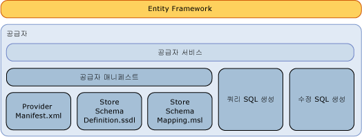

# Entity Framework 데이터 공급자 작성
이 섹션에서는 작성 하는 방법을 설명는 [!INCLUDE[adonet_ef](../../../../../includes/adonet-ef-md.md)] SQL Server 이외의 데이터 소스를 지 원하는 공급자를 합니다. [!INCLUDE[adonet_ef](../../../../../includes/adonet-ef-md.md)] 지 원하는 SQL Server 공급자가 포함 되어 있습니다.  
  
## Entity Framework 공급자 모델 소개  
 [!INCLUDE[adonet_ef](../../../../../includes/adonet-ef-md.md)]는 데이터베이스와 독립적이므로 다양한 데이터 소스 집합에 연결하기 위해 ADO.NET 공급자 모델을 사용하여 공급자를 작성할 수 있습니다.  
  
 Entity Framework 데이터 공급자(ADO.NET 데이터 공급자 모델을 사용하여 작성됨)는 다음과 같은 기능을 수행합니다.  
  
-   EDM(엔터티 데이터 모델) 기본 형식을 공급자 형식에 매핑합니다.  
  
-   공급자별 함수를 노출합니다.  
  
-   [!INCLUDE[adonet_ef](../../../../../includes/adonet-ef-md.md)] 쿼리를 지원하기 위해 지정된 DbQueryCommandTree에 대한 공급자별 명령을 생성합니다.  
  
-   [!INCLUDE[adonet_ef](../../../../../includes/adonet-ef-md.md)]를 통한 업데이트를 지원하기 위해 지정된 DbModificationCommandTree에 대한 공급자별 업데이트 명령을 생성합니다.  
  
-   데이터베이스 기반의 모델 생성을 지원하기 위해 저장소 스키마 정의에 대한 매핑 파일을 노출합니다.  
  
-   개념적 모델을 통해 메타데이터(예: 테이블 및 뷰)를 노출합니다.  
  
   
  
## 샘플  
 참조는 [Entity Framework 샘플 공급자](http://go.microsoft.com/fwlink/?LinkId=180616) 의 샘플는 [!INCLUDE[adonet_ef](../../../../../includes/adonet-ef-md.md)] SQL Server 이외의 데이터 소스를 지 원하는 공급자입니다.  
  
## 섹션 내용  
 [SQL 생성](../../../../../docs/framework/data/adonet/ef/sql-generation.md)  
  
 [수정 SQL 생성](../../../../../docs/framework/data/adonet/ef/modification-sql-generation.md)  
  
 [공급자 매니페스트 지정](../../../../../docs/framework/data/adonet/ef/provider-manifest-specification.md)  
  
## 참고 항목  
 [데이터 공급자 작업](../../../../../docs/framework/data/adonet/ef/working-with-data-providers.md)
