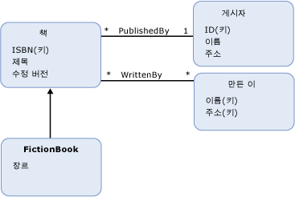

# 엔터티 데이터 모델: 상속Entity Data Model: Inheritance
(EDM (엔터티 데이터 모델)에 대 한 상속 지원 [엔터티 형식](../../../../docs/framework/data/adonet/entity-type.md)합니다.The Entity Data Model (EDM) supports inheritance for [entity types](../../../../docs/framework/data/adonet/entity-type.md). EDM의 상속은 개체 지향 프로그래밍 언어의 클래스에 대한 상속과 유사합니다.Inheritance in the EDM is similar to inheritance for classes in object-oriented programming languages. 개체 지향 언어의 클래스와 함께 개념적 모델에서 정의한 엔터티 형식 처럼 (한 *파생 형식*) 다른 엔터티 형식에서 상속 되는 (의 *기본 형식*).Like with classes in object-oriented languages, in a conceptual model you can define an entity type (a *derived type*) that inherits from another entity type (the *base type*). 그러나 개체 지향 프로그래밍의 클래스와 달리 개념적 모델에서 파생 된 형식 항상 모든 상속 된 [속성](../../../../docs/framework/data/adonet/property.md) 및 [탐색 속성](../../../../docs/framework/data/adonet/navigation-property.md) 기본 형식입니다.However, unlike classes in object-oriented programming, in a conceptual model the derived type always inherits all the [properties](../../../../docs/framework/data/adonet/property.md) and [navigation properties](../../../../docs/framework/data/adonet/navigation-property.md) of the base type. 파생 형식에서 상속된 속성을 재정의할 수는 없습니다.You cannot override inherited properties in a derived type.  
  
 개념적 모델에서는 파생 형식이 다른 파생 형식으로부터 상속받는 상속 계층 구조를 작성할 수 있습니다.In a conceptual model you can build inheritance hierarchies in which a derived type inherits from another derived type. 계층 (파생 형식이 아닌 계층의 한 유형)의 최상위에 있는 형식의 라고는 *루트 형식*합니다.The type at the top of the hierarchy (the one type in the hierarchy that is not a derived type) is called the *root type*. 상속 계층 구조의 [엔터티 키](../../../../docs/framework/data/adonet/entity-key.md) 루트 형식에서 정의 되어야 합니다.In an inheritance hierarchy, the [entity key](../../../../docs/framework/data/adonet/entity-key.md) must be defined on the root type.  
  
 파생 형식이 둘 이상의 형식으로부터 상속받는 상속 계층 구조는 작성할 수 없습니다.You cannot build inheritance hierarchies in which a derived type inherits from more than one type. 예를 들어, `Book` 엔터티 형식이 포함된 개념적 모델에서는 각각 `FictionBook`으로부터 상속되는 파생 형식 `NonFictionBook`과 `Book`을 정의할 수 있습니다.For example, in a conceptual model with a `Book` entity type, you could define derived types `FictionBook` and `NonFictionBook` that each inherit from `Book`. 그러나 `FictionBook` 및 `NonFictionBook` 형식에서 모두 상속되는 형식을 정의할 수는 없습니다.However, you could not then define a type that inherits from both the `FictionBook` and `NonFictionBook` types.  
  
## 예제Example  
 다음 다이어그램에서는 네 가지 엔터티 형식 `Book`, `FictionBook`, `Publisher` 및 `Author`가 포함된 개념적 모델을 보여 줍니다.The diagram below shows a conceptual model with four entity types: `Book`, `FictionBook`, `Publisher`, and `Author`. `FictionBook` 엔터티 형식은 `Book` 엔터티 형식에서 상속되는 파생 형식입니다.The `FictionBook` entity type is a derived type, inheriting from the `Book` entity type. `FictionBook` 형식은 `ISBN (Key)`, `Title` 및 `Revision` 속성을 상속하고 `Genre`라는 추가 속성을 정의합니다.The `FictionBook` type inherits the `ISBN (Key)`, `Title`, and `Revision` properties, and defines an additional property called `Genre`.  
  
   
  
 [ADO.NET Entity Framework](../../../../docs/framework/data/adonet/ef/index.md) 개념 스키마 정의 언어를 호출 하는 도메인 특정 언어 DSL ()를 사용 하 여 ([CSDL](../../../../docs/framework/data/adonet/ef/language-reference/csdl-specification.md)) 개념적 모델을 정의 합니다.The [ADO.NET Entity Framework](../../../../docs/framework/data/adonet/ef/index.md) uses a domain-specific language (DSL) called conceptual schema definition language ([CSDL](../../../../docs/framework/data/adonet/ef/language-reference/csdl-specification.md)) to define conceptual models. 다음 CSDL에서는 위의 다이어그램에 표시된 `FictionBook` 형식에서 상속되는 엔터티 형식 `Book`을 정의합니다.The following CSDL defines an entity type, `FictionBook`, that inherits from the `Book` type (as in the diagram above):  
  
 [!code-xml[EDM_Example_Model#DerivedType](../../../../samples/snippets/xml/VS_Snippets_Data/edm_example_model/xml/books5.edmx#derivedtype)]  
  
## 참고 항목See Also  
 [엔터티 데이터 모델의 주요 개념Entity Data Model Key Concepts](../../../../docs/framework/data/adonet/entity-data-model-key-concepts.md)  
 [엔터티 데이터 모델Entity Data Model](../../../../docs/framework/data/adonet/entity-data-model.md)
