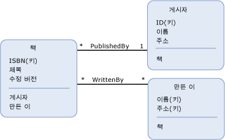

# 엔터티 데이터 모델의 주요 개념Entity Data Model Key Concepts
(EDM (엔터티 데이터 모델) 세 가지 주요 개념을 사용 하 여 데이터의 구조를 설명할: *엔터티 형식*, *연결 형식*, 및 *속성*합니다.The Entity Data Model (EDM) uses three key concepts to describe the structure of data: *entity type*, *association type*, and *property*. 이는 모든 EDM 구현의 데이터 구조 설명에 가장 중요한 개념입니다.These are the most important concepts in describing the structure of data in any implementation of the EDM.  
  
## 엔터티 형식Entity Type  
 [엔터티 형식](../../../../docs/framework/data/adonet/entity-type.md) 는 엔터티 데이터 모델을 사용 하 여 데이터의 구조를 설명 하기 위한 기본적인 빌딩 블록입니다.The [entity type](../../../../docs/framework/data/adonet/entity-type.md) is the fundamental building block for describing the structure of data with the Entity Data Model. 개념적 모델의 엔터티 형식에서 생성 되는 [속성](../../../../docs/framework/data/adonet/property.md) 고객 같은 최상위 개념의 구조를 설명 하 고 및 비즈니스 응용 프로그램에서 주문을 합니다.In a conceptual model, entity types are constructed from [properties](../../../../docs/framework/data/adonet/property.md) and describe the structure of top-level concepts, such as a customers and orders in a business application. 컴퓨터 프로그램의 클래스 정의가 클래스 인스턴스의 템플릿인 것과 동일한 방식으로 엔터티 형식은 엔터티의 템플릿입니다.In the same way that a class definition in a computer program is a template for instances of the class, an entity type is a template for entities. 엔터티는 특정 고객 또는 주문과 같은 특정 개체를 나타냅니다.An entity represents a specific object (such as a specific customer or order). 각 엔터티에 고유 해야 합니다. [엔터티 키](../../../../docs/framework/data/adonet/entity-key.md) 내는 [엔터티 집합](../../../../docs/framework/data/adonet/entity-set.md)합니다.Each entity must have a unique [entity key](../../../../docs/framework/data/adonet/entity-key.md) within an [entity set](../../../../docs/framework/data/adonet/entity-set.md).  엔터티 집합은 특정 엔터티 형식 인스턴스의 컬렉션입니다.An entity set is a collection of instances of a specific entity type. 엔터티 집합 (및 [연결 집합](../../../../docs/framework/data/adonet/association-set.md))에 논리적으로 그룹화 되는 [엔터티 컨테이너](../../../../docs/framework/data/adonet/entity-container.md)합니다.Entity sets (and [association sets](../../../../docs/framework/data/adonet/association-set.md)) are logically grouped in an [entity container](../../../../docs/framework/data/adonet/entity-container.md).  
  
 엔터티 형식에 대해 상속이 지원되므로 한 엔터티 형식에서 다른 엔터티 형식이 파생될 수 있습니다.Inheritance is supported with entity types: that is, one entity type can be derived from another. 자세한 내용은 참조 [엔터티 데이터 모델: 상속](../../../../docs/framework/data/adonet/entity-data-model-inheritance.md)합니다.For more information, see [Entity Data Model: Inheritance](../../../../docs/framework/data/adonet/entity-data-model-inheritance.md).  
  
## 연결 형식Association Type  
 [연결 형식](../../../../docs/framework/data/adonet/association-type.md) (연결이 라고도 함)는 엔터티 데이터 모델에서 관계를 설명 하기 위한 기본적인 빌딩 블록입니다.An [association type](../../../../docs/framework/data/adonet/association-type.md) (also called an association) is the fundamental building block for describing relationships in the Entity Data Model. 개념적 모델에서 연결은 두 엔터티 형식(예: Customer 및 Order) 간의 관계를 나타냅니다.In a conceptual model, an association represents a relationship between two entity types (such as Customer and Order). 각 연결에는 두 개의 [연결 end](../../../../docs/framework/data/adonet/association-end.md) 연결과 관련 된 엔터티 형식을 지정 하는 합니다.Every association has two [association ends](../../../../docs/framework/data/adonet/association-end.md) that specify the entity types involved in the association. 각 연결 end도 지정는 [연결 end 복합성](../../../../docs/framework/data/adonet/association-end-multiplicity.md) 연결의 해당 end에 있을 수 있는 엔터티 수를 나타내는입니다.Each association end also specifies an [association end multiplicity](../../../../docs/framework/data/adonet/association-end-multiplicity.md) that indicates the number of entities that can be at that end of the association. 연결 End의 복합성 값은 한 개(1), 0개 또는 한 개(0..1) 또는 다수(*)일 수 있습니다.An association end multiplicity can have a value of one (1), zero or one (0..1), or many (*). 연결의 한쪽 end에 엔터티를 통해 액세스할 수 [탐색 속성](../../../../docs/framework/data/adonet/navigation-property.md), 또는 엔터티 형식에서 노출 된 경우 외래 키입니다.Entities at one end of an association can be accessed through [navigation properties](../../../../docs/framework/data/adonet/navigation-property.md), or through foreign keys if they are exposed on an entity type. 자세한 내용은 참조 [외래 키 속성](../../../../docs/framework/data/adonet/foreign-key-property.md)합니다.For more information, see [foreign key property](../../../../docs/framework/data/adonet/foreign-key-property.md).  
  
 응용 프로그램에서 연결 인스턴스는 특정 연결(예: 고객 인스턴스와 주문 인스턴스 간의 연결)을 나타냅니다.In an application, an instance of an association represents a specific association (such as an association between an instance of Customer and instances of Order). 연결 인스턴스는 논리적으로 그룹화는 [연결 집합](../../../../docs/framework/data/adonet/association-set.md)합니다.Association instances are logically grouped in an [association set](../../../../docs/framework/data/adonet/association-set.md). 연결 집합 (및 [엔터티 집합](../../../../docs/framework/data/adonet/entity-set.md))에 논리적으로 그룹화 되는 [엔터티 컨테이너](../../../../docs/framework/data/adonet/entity-container.md)합니다.Association sets (and [entity sets](../../../../docs/framework/data/adonet/entity-set.md)) are logically grouped in an [entity container](../../../../docs/framework/data/adonet/entity-container.md).  
  
## 속성Property  
 [엔터티 형식](../../../../docs/framework/data/adonet/entity-type.md) 포함 [속성](../../../../docs/framework/data/adonet/property.md) 는 구조와 특징을 정의 하는 합니다.[Entity types](../../../../docs/framework/data/adonet/entity-type.md) contain [properties](../../../../docs/framework/data/adonet/property.md) that define their structure and characteristics. 예를 들어, Customer 엔터티 형식에는 CustomerId, Name, Address 등의 속성이 있을 수 있습니다.For example, a Customer entity type may have properties such as CustomerId, Name, and Address.  
  
 개념적 모델의 속성은 컴퓨터 프로그램의 클래스에 정의된 속성과 유사합니다.Properties in a conceptual model are analogous to properties defined on a class in a computer program. 클래스의 속성이 클래스의 모양을 정의하고 개체에 대한 정보를 전달하는 것과 동일한 방식으로, 개념적 모델의 속성은 엔터티 형식의 모양을 정의하고 엔터티 형식 인스턴스에 대한 정보를 전달합니다.In the same way that properties on a class define the shape of the class and carry information about objects, properties in a conceptual model define the shape of an entity type and carry information about entity type instances.  
  
 속성에는 기본 데이터(예: 문자열, 정수 또는 부울 값) 또는 구조적 데이터(예: 복합 형식)가 포함될 수 있습니다.A property can contain primitive data (such as a string, an integer, or a Boolean value), or structured data (such as a complex type). 자세한 내용은 참조 [엔터티 데이터 모델: 기본 데이터 형식](../../../../docs/framework/data/adonet/entity-data-model-primitive-data-types.md)합니다.For more information, see [Entity Data Model: Primitive Data Types](../../../../docs/framework/data/adonet/entity-data-model-primitive-data-types.md).  
  
## 개념적 모델의 표현Representations of a Conceptual Model  
 A *개념적 모델* 엔터티 및 관계로 서의 일부 데이터 구조의 특정 표현입니다.A *conceptual model* is a specific representation of the structure of some data as entities and relationships. 개념적 모델을 나타내는 한 가지 방법은 다이어그램을 사용하는 것입니다.One way to represent a conceptual model is with a diagram. 다음 다이어그램에서는 엔터티 형식 세 개(`Book`, `Publisher` 및 `Author`)와 연결 두 개(`PublishedBy` 및 `WrittenBy`)가 있는 개념적 모델을 나타냅니다.The following diagram represents a conceptual model with three entity types (`Book`, `Publisher`, and `Author`) and two associations (`PublishedBy` and `WrittenBy`):  
  
   
  
 그러나 이 표현은 모델에 대한 일부 세부 정보의 표시와 관련하여 몇 가지 단점이 있습니다.This representation, however, has some shortcomings when it comes to conveying some details about the model. 예를 들어, 속성 형식과 엔터티 집합 정보가 다이어그램에 표시되지 않습니다.For example, property type and entity set information are not conveyed in the diagram. DSL(Domain-Specific Language)을 사용하면 개념적 모델의 세부 정보를 보다 명확하게 표시할 수 있습니다.The richness of a conceptual model can be conveyed more clearly with a domain-specific language (DSL). [ADO.NET Entity Framework](../../../../docs/framework/data/adonet/ef/index.md) 이라는 XML 기반 DSL을 사용 하 여 *개념 스키마 정의 언어* ([CSDL](../../../../docs/framework/data/adonet/ef/language-reference/csdl-specification.md)) 개념적 모델을 정의 합니다.The [ADO.NET Entity Framework](../../../../docs/framework/data/adonet/ef/index.md) uses an XML-based DSL called *conceptual schema definition language* ([CSDL](../../../../docs/framework/data/adonet/ef/language-reference/csdl-specification.md)) to define conceptual models. 다음은 위의 다이어그램에 표시된 개념적 모델의 CSDL 정의입니다.The following is the CSDL definition of the conceptual model in the diagram above:  
  
 [!code-xml[EDM_Example_Model#EDMExampleCSDL](../../../../samples/snippets/xml/VS_Snippets_Data/edm_example_model/xml/books.edmx#edmexamplecsdl)]  
  
## 참고 항목See Also  
 [엔터티 데이터 모델Entity Data Model](../../../../docs/framework/data/adonet/entity-data-model.md)
