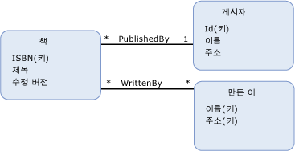

# 엔터티 키entity key
*엔터티 키* 는 [속성](../../../../docs/framework/data/adonet/property.md) 또는의 속성 집합은 [엔터티 형식](../../../../docs/framework/data/adonet/entity-type.md) 신분을 확인 하는 데 사용 되는 합니다.An *entity key* is a [property](../../../../docs/framework/data/adonet/property.md) or a set of properties of an [entity type](../../../../docs/framework/data/adonet/entity-type.md) that are used to determine identity. 엔터티 키를 구성하는 속성은 디자인 타임에 선택됩니다.The properties that make up an entity key are chosen at design time. 엔터티 키 속성의 값 내에서 엔터티 형식 인스턴스를 고유 하 게 식별 해야 합니다는 [엔터티 집합](../../../../docs/framework/data/adonet/entity-set.md) 런타임 시.The values of entity key properties must uniquely identify an entity type instance within an [entity set](../../../../docs/framework/data/adonet/entity-set.md) at run time. 엔터티 키를 구성하는 속성을 선택하여 엔터티 집합에서 인스턴스의 고유성을 보장해야 합니다.The properties that make up an entity key should be chosen to guarantee uniqueness of instances in an entity set.  
  
 다음은 속성 집합이 엔터티 키가 되기 위한 요구 사항입니다.The following are the requirements for a set of properties to be an entity key:  
  
-   엔터티 집합 내의 두 엔터티 키는 같지 않아야 합니다.No two entity keys within an entity set can be identical. 즉, 엔터티 집합 내의 두 엔터티에서 키를 구성하는 모든 속성 값은 달라야 합니다.That is, for any two entities within an entity set, the values for all of the properties that constitute a key cannot be the same. 그러나 엔터티 키를 구성하는 일부 값은 같을 수 있습니다.However, some (but not all) of the values that make up an entity key can be the same.  
  
-   Nullable이 아닌, 변경할 수 없는 집합이 엔터티 키로 구성 되도록 [기본 형식 속성](../../../../docs/framework/data/adonet/entity-data-model-primitive-data-types.md)합니다.An entity key must consist of a set of non-nullable, immutable, [primitive type properties](../../../../docs/framework/data/adonet/entity-data-model-primitive-data-types.md).  
  
-   지정된 엔터티 형식의 엔터티 키를 구성하는 속성은 변경할 수 없습니다.The properties that make up an entity key for a given entity type cannot change. 지정된 엔터티 형식에 사용 가능한 엔터티 키를 여러 개 허용할 수는 없습니다. 서로게이트 키는 지원되지 않습니다.You cannot allow more than one possible entity key for a given entity type; surrogate keys are not supported.  
  
-   엔터티가 상속 계층 구조에 포함되어 있는 경우 루트 엔터티는 엔터티 키를 구성하는 모든 속성을 포함해야 하며, 루트 엔터티 형식에 엔터티 키를 정의해야 합니다.When an entity is involved in an inheritance hierarchy, the root entity must contain all the properties that make up the entity key, and the entity key must be defined on the root entity type. 자세한 내용은 참조 [엔터티 데이터 모델: 상속](../../../../docs/framework/data/adonet/entity-data-model-inheritance.md)합니다.For more information, see [Entity Data Model: Inheritance](../../../../docs/framework/data/adonet/entity-data-model-inheritance.md).  
  
## 예제Example  
 다음 다이어그램에서는 세 가지 엔터티 형식 `Book`, `Publisher` 및 `Author`가 포함된 개념적 모델을 보여 줍니다.The diagram below shows a conceptual model with three entity types: `Book`, `Publisher`, and `Author`. 엔터티 키를 구성하는 각 엔터티 형식의 속성은 "(키)"로 표시됩니다.The properties of each entity type that make up its entity key are denoted with "(Key)". `Author` 엔터티 형식에는 두 가지 속성 `Name` 및 `Address`로 구성된 엔터티 키가 있습니다.Note that the `Author` entity type has an entity key that consists of two properties, `Name` and `Address`.  
  
   
  
 [ADO.NET Entity Framework](../../../../docs/framework/data/adonet/ef/index.md) 개념 스키마 정의 언어를 호출 하는 도메인 특정 언어 DSL ()를 사용 하 여 ([CSDL](../../../../docs/framework/data/adonet/ef/language-reference/csdl-specification.md)) 개념적 모델을 정의 합니다.The [ADO.NET Entity Framework](../../../../docs/framework/data/adonet/ef/index.md) uses a domain-specific language (DSL) called conceptual schema definition language ([CSDL](../../../../docs/framework/data/adonet/ef/language-reference/csdl-specification.md)) to define conceptual models. 다음 CSDL에서는 위의 다이어그램에 표시된 `Book` 엔터티 형식을 정의합니다.The CSDL below defines the `Book` entity type shown in the diagram above. 엔터티 키는 엔터티 형식의 `ISBN` 속성을 참조하여 정의됩니다.Note that the entity key is defined by referencing the `ISBN` property of the entity type.  
  
 [!code-xml[EDM_Example_Model#EntityExample](../../../../samples/snippets/xml/VS_Snippets_Data/edm_example_model/xml/books.edmx#entityexample)]  
  
 ISBN(International Standard Book Number)은 책을 고유하게 식별하므로 엔터티 키에 대해 `ISBN` 속성을 사용하는 것이 좋습니다.The `ISBN` property is a good choice for the entity key because an International Standard Book Number (ISBN) uniquely identifies a book.  
  
 다음 CSDL에서는 위의 다이어그램에 표시된 `Author` 엔터티 형식을 정의합니다.The CSDL below defines the `Author` entity type shown in the diagram above. 엔터티 키는 두 가지 속성 `Name` 및 `Address`로 구성됩니다.Note that the entity key consists of two properties, `Name` and `Address`.  
  
 [!code-xml[EDM_Example_Model#CompositeKeyExample](../../../../samples/snippets/xml/VS_Snippets_Data/edm_example_model/xml/books.edmx#compositekeyexample)]  
  
 이름이 같은 두 저자가 같은 주소지에서 거주할 가능성은 없으므로 엔터티 키에 대해 `Name` 및 `Address`를 사용하는 것이 좋습니다.Using `Name` and `Address` for the entity key is a reasonable choice, because two authors of the same name are unlikely to live at the same address. 그러나 이러한 엔터티 키 선택이 엔터티 집합에서의 고유한 엔터티 키를 절대적으로 보장하지는 않습니다.However, this choice for an entity key does not absolutely guarantee unique entity keys in an entity set. 이 경우에는 저자를 고유하게 식별하는 데 사용할 수 있는 `AuthorId`와 같은 속성을 추가하는 것이 좋습니다.Adding a property, such as `AuthorId`, that could be used to uniquely identify an author would be recommended in this case.  
  
## 참고 항목See Also  
 [엔터티 데이터 모델의 주요 개념Entity Data Model Key Concepts](../../../../docs/framework/data/adonet/entity-data-model-key-concepts.md)  
 [엔터티 데이터 모델Entity Data Model](../../../../docs/framework/data/adonet/entity-data-model.md)
