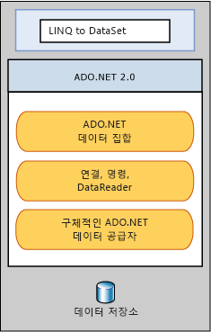

# LINQ to DataSet
[!INCLUDE[linq_dataset](../../../../includes/linq-dataset-md.md)]을 사용하면 <xref:System.Data.DataSet> 개체에 캐시된 데이터를 쉽고 빠르게 쿼리할 수 있습니다.  특히, [!INCLUDE[linq_dataset](../../../../includes/linq-dataset-md.md)]을 사용하면 별도의 쿼리 언어를 사용하는 대신 프로그래밍 언어 자체에서 쿼리를 작성할 수 있으므로 간편하게 쿼리할 수 있습니다.  이 기능은 [!INCLUDE[vsprvs](../../../../includes/vsprvs-md.md)]에서 제공되는 컴파일 타임 구문 검사, 정적 입력 및 IntelliSense 지원을 해당 쿼리에 사용할 수 있는 [!INCLUDE[vsprvs](../../../../includes/vsprvs-md.md)] 개발자에게 특히 유용합니다.  
  
 [!INCLUDE[linq_dataset](../../../../includes/linq-dataset-md.md)]은 하나 이상의 데이터 소스에서 통합된 데이터를 쿼리하는 데도 사용할 수 있습니다.  이 기능은 논리적으로 집계된 데이터 쿼리, 웹 응용 프로그램의 중간 계층 캐시 등과 같이 유연하게 데이터를 표현하고 처리해야 하는 여러 시나리오에 사용될 수 있습니다.  이러한 조작 방법은 일반적인 보고, 분석 및 비즈니스 인텔리전스 응용 프로그램에 특히 필요합니다.  
  
 [!INCLUDE[linq_dataset](../../../../includes/linq-dataset-md.md)] 기능은 주로 <xref:System.Data.DataRowExtensions> 및 <xref:System.Data.DataTableExtensions> 클래스의 확장 메서드를 통해 노출됩니다. [!INCLUDE[linq_dataset](../../../../includes/linq-dataset-md.md)]은 기존 [!INCLUDE[ado_whidbey_long](../../../../includes/ado-whidbey-long-md.md)] 아키텍처를 기반으로 사용하지만 응용 프로그램 코드에서 [!INCLUDE[ado_whidbey_long](../../../../includes/ado-whidbey-long-md.md)]을 대체하지는 않습니다.  기존 ADO.NET 2.0 코드는 [!INCLUDE[linq_dataset](../../../../includes/linq-dataset-md.md)] 응용 프로그램에서 계속 사용됩니다. 다음 다이어그램에서는 [!INCLUDE[linq_dataset](../../../../includes/linq-dataset-md.md)]에 대한 [!INCLUDE[ado_whidbey_long](../../../../includes/ado-whidbey-long-md.md)]과 데이터 저장소의 관계를 보여 줍니다.  
  
   
  
## 단원 내용  
 [시작](../../../../docs/framework/data/adonet/getting-started-linq-to-dataset.md)  
  
 [프로그래밍 가이드](../../../../docs/framework/data/adonet/programming-guide-linq-to-dataset.md)  
  
## 참조  
 <xref:System.Data.DataTableExtensions>  
  
 <xref:System.Data.DataRowExtensions>  
  
 <xref:System.Data.DataRowComparer>  
  
## 참고 항목  
 [LINQ \(Language\-Integrated Query\)](../Topic/LINQ%20\(Language-Integrated%20Query\).md)   
 [LINQ 및 ADO.NET](../../../../docs/framework/data/adonet/linq-and-ado-net.md)   
 [ADO.NET](../../../../docs/framework/data/adonet/index.md)