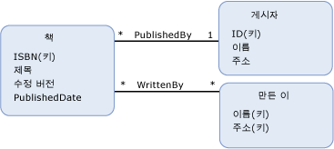

# 모델 정의 함수model-defined function
A *모델 정의 함수* 는 개념적 모델에 정의 된 함수입니다.A *model-defined function* is a function that is defined in a conceptual model. 모델 정의 함수의 본문을 단위로 [Entity SQL](../../../../docs/framework/data/adonet/ef/language-reference/entity-sql-language.md), 규칙을 허용 하는 함수를 독립적으로 표현할 수에 대 한 또는 데이터 원본에서 지원 되는 언어입니다.The body of a model-defined function is expressed in [Entity SQL](../../../../docs/framework/data/adonet/ef/language-reference/entity-sql-language.md), which allows for the function to be expressed independently of rules or languages supported in the data source.  
  
 모델 정의 함수 정의에는 다음 정보가 들어 있습니다.A definition for a model-defined function contains the following information:  
  
-   함수 이름A function name. (필수)(Required)  
  
-   반환 값의 형식The type of the return value. 이 매개 변수는 선택 사항입니다.(Optional)  
  
    > [!NOTE]
    >  반환 형식을 지정하지 않으면 반환 값은 void입니다.If no return type is specified, the return value is void.  
  
-   매개 변수 정보Parameter information. 이 매개 변수는 선택 사항입니다.(Optional)  
  
-   [Entity SQL](../../../../docs/framework/data/adonet/ef/language-reference/entity-sql-language.md) 함수 본문을 정의 하는 식입니다.An [Entity SQL](../../../../docs/framework/data/adonet/ef/language-reference/entity-sql-language.md) expression that defines the body of the function.  
  
 모델 정의 함수는 출력 매개 변수를 지원하지 않습니다.Note that model-defined functions do not support output parameters. 모델 정의 함수를 작성할 수 있도록 이러한 제한이 적용됩니다.This restriction is in place so that model-defined functions can be composed.  
  
## 예제Example  
 다음 다이어그램에서는 세 가지 엔터티 형식 `Book`, `Publisher` 및 `Author`가 포함된 개념적 모델을 보여 줍니다.The diagram below shows a conceptual model with three entity types: `Book`, `Publisher`, and `Author`.  
  
   
  
 [ADO.NET Entity Framework](../../../../docs/framework/data/adonet/ef/index.md) 개념 스키마 정의 언어를 호출 하는 도메인 특정 언어 DSL ()를 사용 하 여 ([CSDL](../../../../docs/framework/data/adonet/ef/language-reference/csdl-specification.md)) 개념적 모델을 정의 합니다.The [ADO.NET Entity Framework](../../../../docs/framework/data/adonet/ef/index.md) uses a domain-specific language (DSL) called conceptual schema definition language ([CSDL](../../../../docs/framework/data/adonet/ef/language-reference/csdl-specification.md)) to define conceptual models. 다음 CSDL에서는 위 다이어그램의 `Book` 인스턴스가 출판된 이후의 년 수를 반환하는 함수를 개념적 모델에 정의합니다.The following CSDL defines a function in the conceptual model that returns the numbers of years since an instance of a `Book` (in the diagram above) was published.  
  
 [!code-xml[EDM_Example_Model#ModelDefinedFunction](../../../../samples/snippets/xml/VS_Snippets_Data/edm_example_model/xml/books4.edmx#modeldefinedfunction)]  
  
## 참고 항목See Also  
 [엔터티 데이터 모델의 주요 개념Entity Data Model Key Concepts](../../../../docs/framework/data/adonet/entity-data-model-key-concepts.md)  
 [엔터티 데이터 모델Entity Data Model](../../../../docs/framework/data/adonet/entity-data-model.md)  
 [엔터티 데이터 모델: 기본 데이터 형식Entity Data Model: Primitive Data Types](../../../../docs/framework/data/adonet/entity-data-model-primitive-data-types.md)
