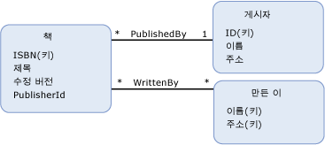

# 참조 무결성 제약 조건
A *참조 무결성 제약 조건을* 엔터티 데이터 모델 (EDM)에 관계형 데이터베이스의 참조 무결성 제약 조건을 비슷합니다. 데이터베이스 테이블에서 열 (또는 열) 다른 테이블의 기본 키를 참조할 수 있도록 동일한 방법으로 [속성](../../../../docs/framework/data/adonet/property.md) (또는 속성)의 [엔터티 형식](../../../../docs/framework/data/adonet/entity-type.md) 참조할 수는 [엔터티 키 ](../../../../docs/framework/data/adonet/entity-key.md) 다른 엔터티 형식의 합니다. 참조 되는 엔터티 형식 라고는 *주 끝* 제약 조건입니다. 주 끝을 참조 하는 엔터티 형식은 라고는 *종속 끝* 제약 조건입니다.  
  
 참조 무결성 제약 조건을의 일부로 정의 되는 [연결](../../../../docs/framework/data/adonet/association-type.md) 두 엔터티 형식 사이입니다. 참조 무결성 제약 조건 정의에서는 다음 정보를 지정합니다.  
  
-   제약 조건의 주 끝 (엔터티 키가 종속 끝에서 참조되는 엔터티 형식)  
  
-   주 끝의 엔터티 키  
  
-   제약 조건의 종속 끝 (주 끝의 엔터티 키를 참조하는 속성이 있는 엔터티 형식)  
  
-   종속 끝의 참조 속성  
  
 EDM의 참조 무결성 제약 조건은 항상 올바른 연결이 존재하도록 보장하는 데 사용됩니다. 자세한 내용은 참조 [외래 키 속성](../../../../docs/framework/data/adonet/foreign-key-property.md)합니다.  
  
## 예  
 다음 다이어그램에서는 두 연결 `WrittenBy` 및 `PublishedBy`의 개념적 모델을 보여 줍니다. `Book` 엔터티 형식에는 `PublisherId` 연결에 참조 무결성 제약 조건을 정의할 때 `Publisher` 엔터티 형식의 엔터티 키를 참조하는 `PublishedBy` 속성이 있습니다.  
  
   
  
 [ADO.NET Entity Framework](../../../../docs/framework/data/adonet/ef/index.md) 개념 스키마 정의 언어를 호출 하는 도메인 특정 언어 DSL ()를 사용 하 여 ([CSDL](../../../../docs/framework/data/adonet/ef/language-reference/csdl-specification.md)) 개념적 모델을 정의 합니다. 다음 CSDL에서는 위의 개념적 모델에 표시된 `PublishedBy` 연결에 참조 무결성 제약 조건을 정의합니다.  
  
 [!code-xml[EDM_Example_Model#RefConstraint](../../../../samples/snippets/xml/VS_Snippets_Data/edm_example_model/xml/books4.edmx#refconstraint)]  
  
## 참고 항목  
 [엔터티 데이터 모델의 주요 개념](../../../../docs/framework/data/adonet/entity-data-model-key-concepts.md)  
 [엔터티 데이터 모델](../../../../docs/framework/data/adonet/entity-data-model.md)
