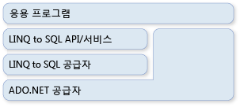

# ADO.NET 및 LINQ to SQLADO.NET and LINQ to SQL
[!INCLUDE[vbtecdlinq](../../../../../../includes/vbtecdlinq-md.md)] 일부는 [!INCLUDE[vstecado](../../../../../../includes/vstecado-md.md)] 기술 제품군의 합니다. is part of the [!INCLUDE[vstecado](../../../../../../includes/vstecado-md.md)] family of technologies. [!INCLUDE[vstecado](../../../../../../includes/vstecado-md.md)] 공급자 모델에 의해 제공된 서비스에 기반을 두기 때문에It is based on services provided by the [!INCLUDE[vstecado](../../../../../../includes/vstecado-md.md)] provider model. [!INCLUDE[vbtecdlinq](../../../../../../includes/vbtecdlinq-md.md)] 코드를 기존 [!INCLUDE[vstecado](../../../../../../includes/vstecado-md.md)] 응용 프로그램과 조합하고 현재 [!INCLUDE[vstecado](../../../../../../includes/vstecado-md.md)] 솔루션을 [!INCLUDE[vbtecdlinq](../../../../../../includes/vbtecdlinq-md.md)]로 마이그레이션할 수 있습니다.You can therefore mix [!INCLUDE[vbtecdlinq](../../../../../../includes/vbtecdlinq-md.md)] code with existing [!INCLUDE[vstecado](../../../../../../includes/vstecado-md.md)] applications and migrate current [!INCLUDE[vstecado](../../../../../../includes/vstecado-md.md)] solutions to [!INCLUDE[vbtecdlinq](../../../../../../includes/vbtecdlinq-md.md)]. 다음 그림에서는 이 관계를 간략하게 보여 줍니다.The following illustration provides a high-level view of the relationship.  
  
   
  
## 연결Connections  
 [!INCLUDE[vstecado](../../../../../../includes/vstecado-md.md)] [!INCLUDE[vbtecdlinq](../../../../../../includes/vbtecdlinq-md.md)]를 만들 때 기존 <xref:System.Data.Linq.DataContext> 연결을 제공할 수 있습니다.You can supply an existing [!INCLUDE[vstecado](../../../../../../includes/vstecado-md.md)] connection when you create a [!INCLUDE[vbtecdlinq](../../../../../../includes/vbtecdlinq-md.md)] <xref:System.Data.Linq.DataContext>. 쿼리를 포함한 <xref:System.Data.Linq.DataContext>에 대한 모든 작업은 제공된 이 연결을 사용합니다.All operations against the <xref:System.Data.Linq.DataContext> (including queries) use this provided connection. 연결이 이미 열려 있는 경우 [!INCLUDE[vbtecdlinq](../../../../../../includes/vbtecdlinq-md.md)]은 사용자의 작업이 끝났을 때 연결을 그대로 둡니다.If the connection is already open, [!INCLUDE[vbtecdlinq](../../../../../../includes/vbtecdlinq-md.md)] leaves it as is when you are finished with it.  
  
 [!code-csharp[DLinqCommunicatingWithDatabase#4](../../../../../../samples/snippets/csharp/VS_Snippets_Data/DLinqCommunicatingWithDatabase/cs/Program.cs#4)]
 [!code-vb[DLinqCommunicatingWithDatabase#4](../../../../../../samples/snippets/visualbasic/VS_Snippets_Data/DLinqCommunicatingWithDatabase/vb/Module1.vb#4)]  
  
 다음 코드와 같이 <xref:System.Data.Linq.DataContext.Connection%2A> 속성을 사용하여 항상 연결에 액세스하고 연결을 닫을 수 있습니다.You can always access the connection and close it yourself by using the <xref:System.Data.Linq.DataContext.Connection%2A> property, as in the following code:  
  
 [!code-csharp[DLinqAdoNet#1](../../../../../../samples/snippets/csharp/VS_Snippets_Data/DLinqAdoNet/cs/Program.cs#1)]
 [!code-vb[DLinqAdoNet#1](../../../../../../samples/snippets/visualbasic/VS_Snippets_Data/DLinqAdoNet/vb/Module1.vb#1)]  
  
## 트랜잭션Transactions  
 응용 프로그램에서 이미 고유한 데이터베이스 트랜잭션을 시작했으며 <xref:System.Data.Linq.DataContext>를 관련시키려는 경우 해당 트랜잭션을 <xref:System.Data.Linq.DataContext>에 제공할 수 있습니다.You can supply your <xref:System.Data.Linq.DataContext> with your own database transaction when your application has already initiated the transaction and you want your <xref:System.Data.Linq.DataContext> to be involved.  
  
 [!INCLUDE[dnprdnshort](../../../../../../includes/dnprdnshort-md.md)]와 함께 트랜잭션을 수행하는 기본 방법은 <xref:System.Transactions.TransactionScope> 개체를 사용하는 것입니다.The preferred method of doing transactions with the [!INCLUDE[dnprdnshort](../../../../../../includes/dnprdnshort-md.md)] is to use the <xref:System.Transactions.TransactionScope> object. 이 방법을 사용하면 데이터베이스 및 다른 메모리 상주 리소스 관리자 사이에서 작동하는 분산 트랜잭션을 만들 수 있습니다.By using this approach, you can make distributed transactions that work across databases and other memory-resident resource managers. 트랜잭션 범위는 시작하는 데 리소스가 거의 필요하지 않습니다.Transaction scopes require few resources to start. 트랜잭션 범위는 해당 범위 내에 여러 연결이 있는 경우에만 분산 트랜잭션으로 승격됩니다.They promote themselves to distributed transactions only when there are multiple connections within the scope of the transaction.  
  
 [!code-csharp[DLinqAdoNet#2](../../../../../../samples/snippets/csharp/VS_Snippets_Data/DLinqAdoNet/cs/Program.cs#2)]
 [!code-vb[DLinqAdoNet#2](../../../../../../samples/snippets/visualbasic/VS_Snippets_Data/DLinqAdoNet/vb/Module1.vb#2)]  
  
 이 방법을 모든 데이터베이스에 사용할 수 있는 것은 아닙니다.You cannot use this approach for all databases. 예를 들어 SqlClient 연결은 [!INCLUDE[ss2k](../../../../../../includes/ss2k-md.md)] 서버에 대해 작동할 경우 시스템 트랜잭션을 승격할 수 없습니다.For example, the SqlClient connection cannot promote system transactions when it works against a [!INCLUDE[ss2k](../../../../../../includes/ss2k-md.md)] server. 대신에 사용 중인 트랜잭션 범위가 있을 때마다 완전한 분산 트랜잭션에 자동으로 참여합니다.Instead, it automatically enlists to a full, distributed transaction whenever it sees a transaction scope being used.  
  
## SQL 명령 직접 실행Direct SQL Commands  
 <xref:System.Data.Linq.DataContext>를 사용하여 변경 내용을 쿼리하거나 전송하는 기능으로는 원하는 특수한 작업을 수행할 수 없는 경우가 종종 있습니다.At times you can encounter situations where the ability of the <xref:System.Data.Linq.DataContext> to query or submit changes is insufficient for the specialized task you want to perform. 이러한 상황에서는 <xref:System.Data.Linq.DataContext.ExecuteQuery%2A> 메서드를 사용하여 SQL 명령을 데이터베이스에 대해 실행하고 쿼리 결과를 개체로 변환할 수 있습니다.In these circumstances you can use the <xref:System.Data.Linq.DataContext.ExecuteQuery%2A> method to issue SQL commands to the database and convert the query results to objects.  
  
 예를 들어 `Customer` 클래스의 데이터가 두 개의 테이블(customer1 및 customer2)에 퍼져 있다고 가정해 봅니다.For example, assume that the data for the `Customer` class is spread over two tables (customer1 and customer2). 다음 쿼리는 `Customer` 개체의 시퀀스를 반환합니다.The following query returns a sequence of `Customer` objects:  
  
 [!code-csharp[DLinqAdoNet#3](../../../../../../samples/snippets/csharp/VS_Snippets_Data/DLinqAdoNet/cs/Program.cs#3)]
 [!code-vb[DLinqAdoNet#3](../../../../../../samples/snippets/visualbasic/VS_Snippets_Data/DLinqAdoNet/vb/Module1.vb#3)]  
  
 표 형식 결과의 열 이름이 엔터티 클래스의 열 속성과 일치할 경우 [!INCLUDE[vbtecdlinq](../../../../../../includes/vbtecdlinq-md.md)]은 모든 SQL 쿼리에서 개체를 만듭니다.As long as the column names in the tabular results match column properties of your entity class, [!INCLUDE[vbtecdlinq](../../../../../../includes/vbtecdlinq-md.md)] creates your objects out of any SQL query.  
  
### 매개 변수Parameters  
 <xref:System.Data.Linq.DataContext.ExecuteQuery%2A> 메서드에서는 매개 변수가 허용됩니다.The <xref:System.Data.Linq.DataContext.ExecuteQuery%2A> method accepts parameters. 다음 코드는 매개 변수화된 쿼리를 실행합니다.The following code executes a parameterized query:  
  
 [!code-csharp[DlinqAdoNet#4](../../../../../../samples/snippets/csharp/VS_Snippets_Data/DLinqAdoNet/cs/Program.cs#4)]
 [!code-vb[DlinqAdoNet#4](../../../../../../samples/snippets/visualbasic/VS_Snippets_Data/DLinqAdoNet/vb/Module1.vb#4)]  
  
> [!NOTE]
>  매개 변수는 `Console.WriteLine()` 및 `String.Format()`에서 사용되는 동일한 중괄호 표기법을 사용하여 쿼리 텍스트에서 표현됩니다.Parameters are expressed in the query text by using the same curly notation used by `Console.WriteLine()` and `String.Format()`. `String.Format()`은 제공된 쿼리 문자열을 가지며 중괄호로 묶인 매개 변수를 `@p0`, `@p1` …, `@p(n)` 등과 같은 생성된 매개 변수 이름으로 대체합니다.`String.Format()` takes the query string you provide and substitutes the curly-braced parameters with generated parameter names such as `@p0`, `@p1` …, `@p(n)`.  
  
## 참고 항목See Also  
 [배경 정보Background Information](../../../../../../docs/framework/data/adonet/sql/linq/background-information.md)  
 [방법: ADO.NET 명령 및 DataContext 사이에 연결 다시 사용How to: Reuse a Connection Between an ADO.NET Command and a DataContext](../../../../../../docs/framework/data/adonet/sql/linq/how-to-reuse-a-connection-between-an-ado-net-command-and-a-datacontext.md)
