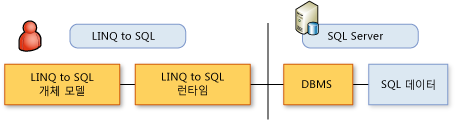

# LINQ to SQL 사용을 위한 일반 단계
[!INCLUDE[vbtecdlinq](../../../../../../includes/vbtecdlinq-md.md)] 응용 프로그램을 구현하려면 이 항목에 설명된 단계를 따릅니다. 대부분의 단계는 선택 사항이며 고유한 개체 모델을 기본 상태에서 사용할 수 있습니다.  
  
 빠른 시작을 위해 [!INCLUDE[vs_ordesigner_long](../../../../../../includes/vs-ordesigner-long-md.md)]를 사용하여 개체 모델을 만들고 쿼리 코딩을 시작합니다.  
  
## 개체 모델 만들기  
 첫 번째 단계는 기존 관계형 데이터베이스의 메타데이터에서 개체 모델을 만드는 것입니다. 개체 모델은 개발자의 프로그래밍 언어에 따라 데이터베이스를 나타냅니다. 자세한 내용은 참조 [LINQ to SQL 개체 모델](../../../../../../docs/framework/data/adonet/sql/linq/the-linq-to-sql-object-model.md)합니다.  
  
### 1. 모델을 만들기 위한 도구를 선택합니다.  
 모델을 만들기 위한 세 가지 도구를 사용할 수 있습니다.  
  
-   [!INCLUDE[vs_ordesigner_long](../../../../../../includes/vs-ordesigner-long-md.md)]  
  
     이 디자이너는 기존 데이터베이스에서 개체 모델을 만들기 위한 풍부한 사용자 인터페이스를 제공합니다. 이 도구는 [!INCLUDE[vs_current_short](../../../../../../includes/vs-current-short-md.md)] IDE의 일부이며 중소 규모의 데이터베이스에 가장 적합합니다.  
  
-   SQLMetal 코드 생성 도구  
  
     이 명령줄 유틸리티는 [!INCLUDE[vs_ordesigner_short](../../../../../../includes/vs-ordesigner-short-md.md)]와 약간 다른 옵션 집합을 제공합니다. 대규모 데이터베이스 모델링에는 이 도구를 사용하는 것이 가장 좋습니다. 자세한 내용은 [SqlMetal.exe(코드 생성 도구)](../../../../../../docs/framework/tools/sqlmetal-exe-code-generation-tool.md)를 참조하세요.  
  
-   코드 편집기  
  
     [!INCLUDE[vs_current_short](../../../../../../includes/vs-current-short-md.md)] 코드 편집기나 다른 편집기를 사용하여 고유한 코드를 작성할 수 있습니다. 그러나 기존 데이터베이스가 있고 [!INCLUDE[vs_ordesigner_short](../../../../../../includes/vs-ordesigner-short-md.md)] 또는 SQLMetal 도구를 사용할 수 있는 경우 이 방법은 오류가 발생하기 쉽기 때문에 사용하지 않는 것이 좋습니다. 단, 다른 도구를 사용하여 이미 생성한 코드를 구체화하거나 수정하려는 경우 코드 편집기가 유용할 수 있습니다. 자세한 내용은 참조 [하는 방법: 코드 편집기를 사용 하 여 엔터티 클래스 사용자 지정](../../../../../../docs/framework/data/adonet/sql/linq/how-to-customize-entity-classes-by-using-the-code-editor.md)합니다.  
  
### 2. 생성할 코드의 종류를 선택합니다.  
  
-   특성 기반 매핑을 위한 C# 또는 [!INCLUDE[vbprvb](../../../../../../includes/vbprvb-md.md)] 소스 코드 파일  
  
     이 코드 파일을 [!INCLUDE[vs_current_short](../../../../../../includes/vs-current-short-md.md)] 프로젝트에 포함합니다. 자세한 내용은 참조 [특성 기반 매핑](../../../../../../docs/framework/data/adonet/sql/linq/attribute-based-mapping.md)합니다.  
  
-   외부 매핑을 위한 XML 파일  
  
     이 방법을 사용하면 응용 프로그램 코드 외부에 매핑 메타데이터를 둘 수 있습니다. 자세한 내용은 참조 [외부 매핑](../../../../../../docs/framework/data/adonet/sql/linq/external-mapping.md)합니다.  
  
    > [!NOTE]
    >  [!INCLUDE[vs_ordesigner_short](../../../../../../includes/vs-ordesigner-short-md.md)]에서는 외부 매핑 파일의 생성이 지원되지 않습니다. SQLMetal 도구를 사용하여 이 기능을 구현해야 합니다.  
  
-   최종 코드 파일을 생성하기 전에 수정할 수 있는 DBML 파일  
  
     이는 고급 기능에 해당합니다.  
  
### 3. 응용 프로그램의 요구 사항을 반영하도록 코드 파일을 구체화합니다.  
 이 작업을 위해 [!INCLUDE[vs_ordesigner_short](../../../../../../includes/vs-ordesigner-short-md.md)] 또는 코드 편집기를 사용할 수 있습니다.  
  
## 개체 모델 사용  
 다음 그림에서는 2계층 시나리오에서 개발자와 데이터 간의 관계를 보여 줍니다. 다른 시나리오에 대 한 참조 [N 계층 및 LINQ 사용 하 여 원격 응용 프로그램을 SQL](../../../../../../docs/framework/data/adonet/sql/linq/n-tier-and-remote-applications-with-linq-to-sql.md)합니다.  
  
   
  
 이제 개체 모델이 있으므로 해당 모델 내에서 정보 요청을 설명하고 데이터를 조작할 차례입니다. 데이터베이스의 행과 열이 아니라 개체 모델의 개체와 속성을 고려합니다. 데이터베이스를 직접 다루지는 않습니다.  
  
 설명한 쿼리를 실행하거나 조작한 데이터에서 [!INCLUDE[vbtecdlinq](../../../../../../includes/vbtecdlinq-md.md)]를 호출하도록 `SubmitChanges()`에 지시할 경우 [!INCLUDE[vbtecdlinq](../../../../../../includes/vbtecdlinq-md.md)]은 데이터베이스 언어로 데이터베이스와 통신합니다.  
  
 만들어진 개체 모델을 사용하기 위한 일반적인 단계는 다음과 같습니다.  
  
### 1. 데이터베이스에서 정보를 검색하기 위해 쿼리를 만듭니다.  
 자세한 내용은 참조 [쿼리 개념](../../../../../../docs/framework/data/adonet/sql/linq/query-concepts.md) 및 [쿼리 예제](../../../../../../docs/framework/data/adonet/sql/linq/query-examples.md)합니다.  
  
### 2. Insert, Update 및 Delete의 기본 동작을 재정의합니다.  
 이 단계는 선택 사항입니다. 자세한 내용은 참조 [사용자 지정 Insert, Update 및 Delete 작업](../../../../../../docs/framework/data/adonet/sql/linq/customizing-insert-update-and-delete-operations.md)합니다.  
  
### 3. 동시성 충돌을 탐지 및 보고하기 위해 적절한 옵션을 설정합니다.  
 모델에서 동시성 충돌을 처리하기 위한 기본값을 유지하거나 원하는 목적에 맞게 변경할 수 있습니다. 자세한 내용은 참조 [하는 방법: 지정는 테스트할 멤버 동시성 충돌에 대 한](../../../../../../docs/framework/data/adonet/sql/linq/how-to-specify-which-members-are-tested-for-concurrency-conflicts.md) 및 [하는 방법: 지정 때 동시성 예외가 Throw 됩니다](../../../../../../docs/framework/data/adonet/sql/linq/how-to-specify-when-concurrency-exceptions-are-thrown.md)합니다.  
  
### 4. 상속 계층 구조를 설정합니다.  
 이 단계는 선택 사항입니다. 자세한 내용은 참조 [상속 지원](../../../../../../docs/framework/data/adonet/sql/linq/inheritance-support.md)합니다.  
  
### 5. 적절한 사용자 인터페이스를 제공합니다.  
 이 단계는 선택 사항이며 응용 프로그램이 사용될 방법에 따라 달라집니다.  
  
### 6. 응용 프로그램을 디버깅 및 테스트합니다.  
 자세한 내용은 참조 [디버깅 지원](../../../../../../docs/framework/data/adonet/sql/linq/debugging-support.md)합니다.  
  
## 참고 항목  
 [시작](../../../../../../docs/framework/data/adonet/sql/linq/getting-started.md)  
 [개체 모델 만들기](../../../../../../docs/framework/data/adonet/sql/linq/creating-the-object-model.md)  
 [저장된 프로시저](../../../../../../docs/framework/data/adonet/sql/linq/stored-procedures.md)
