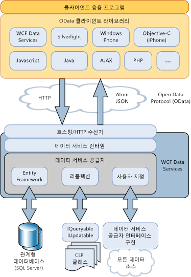

# WCF Data Services 개요
[!INCLUDE[ssAstoria](../../../../includes/ssastoria-md.md)]사용 하 여 만들고 웹 또는 인트라넷용 데이터 서비스를 사용할 수 있습니다는 [!INCLUDE[ssODataFull](../../../../includes/ssodatafull-md.md)]합니다. [!INCLUDE[ssODataShort](../../../../includes/ssodatashort-md.md)]Uri로 주소를 지정할 수 있는 리소스로 데이터를 노출할 수 있습니다. 이렇게 하면 REST(Representational State Transfer)의 의미 체계, 특히 GET, PUT, POST, DELETE 등의 표준 HTTP 동사를 사용하여 데이터에 액세스하고 변경할 수 있습니다. 이 항목에서는 [!INCLUDE[ssODataShort](../../../../includes/ssodatashort-md.md)]에서 정의된 패턴 및 유용한 정보와 .NET Framework 기반 응용 프로그램에서 [!INCLUDE[ssAstoria](../../../../includes/ssastoria-md.md)]를 활용하기 위해 [!INCLUDE[ssODataShort](../../../../includes/ssodatashort-md.md)]에서 제공하는 기능에 대해 간략하게 설명합니다.  
  
## 리소스로 데이터 주소 지정  
 [!INCLUDE[ssODataShort](../../../../includes/ssodatashort-md.md)]는 URI로 주소를 지정할 수 있는 리소스로 데이터를 노출합니다. 리소스 경로는 엔터티 데이터 모델의 엔터티-관계 규칙을 기반으로 생성됩니다. 이 모델에서 엔터티는 고객, 주문, 항목 및 제품 같은 응용 프로그램 도메인의 데이터 운영 단위를 나타냅니다. 자세한 내용은 참조 [엔터티 데이터 모델](../../../../docs/framework/data/adonet/entity-data-model.md)합니다.  
  
 [!INCLUDE[ssODataShort](../../../../includes/ssodatashort-md.md)]에서는 엔터티 형식 인스턴스가 포함된 엔터티 집합으로 엔터티 리소스의 주소를 지정합니다. 예를 들어 URI `http://services.odata.org/Northwind/Northwind.svc/Customers('ALFKI')/Orders` 모두의 주문을 반환 된 `Northwind` 고객에 게 관련 된 데이터 서비스는 `CustomerID` 의 값`ALFKI.`  
  
 쿼리 식을 사용하면 필터링, 정렬 및 페이징과 같은 일반적인 쿼리 작업을 리소스에 대해 수행할 수 있습니다. 예를 들어, URI `http://services.odata.org/Northwind/Northwind.svc/Customers('ALFKI')/Orders?$filter=Freight gt 50`은 운송료가 $50보다 많은 주문만 반환하도록 리소스를 필터링합니다. 자세한 내용은 참조 [데이터 서비스 리소스 액세스](../../../../docs/framework/data/wcf/accessing-data-service-resources-wcf-data-services.md)합니다.  
  
## 상호 운용 가능한 데이터 액세스  
 [!INCLUDE[ssODataShort](../../../../includes/ssodatashort-md.md)]데이터 서비스를.NET Framework를 사용 하지 않는 응용 프로그램 상호 운용할 수 있도록 하는 표준 인터넷 프로토콜 기반으로 합니다. 주소 데이터에 대 한 표준 Uri를 사용할 수 있으므로 응용 프로그램에 액세스할 수 및 변경 데이터의 표준 HTTP 동사 특히 representational state transfer (REST)의 의미 체계를 사용 하 여 GET, PUT, POST 및 삭제 합니다. 이렇게 하면 표준 HTTP 프로토콜을 통해 전송되는 데이터를 구문 분석하고 액세스할 수 있는 모든 클라이언트에서 해당 서비스에 액세스할 수 있습니다.  
  
 [!INCLUDE[ssODataShort](../../../../includes/ssodatashort-md.md)]는 AtomPub(Atom Publishing Protocol)의 확장 집합을 정의합니다. 또한 다양한 클라이언트 응용 프로그램 및 플랫폼을 고려하여 HTTP 요청 및 응답에 대해 여러 데이터 형식을 지원합니다. [!INCLUDE[ssODataShort](../../../../includes/ssodatashort-md.md)] 피드는 Atom, JSON(JavaScript Object Notation) 및 일반 XML로 데이터를 나타낼 수 있습니다. Atom이 기본 형식이지만 피드의 형식은 HTTP 요청의 헤더에서 지정됩니다. 자세한 내용은 참조 [OData: 원자 형식](http://go.microsoft.com/fwlink/?LinkID=185794) 및 [OData: JSON 형식](http://go.microsoft.com/fwlink/?LinkID=185795)합니다.  
  
 데이터를 게시 하는 경우는 [!INCLUDE[ssODataShort](../../../../includes/ssodatashort-md.md)] 피드, [!INCLUDE[ssAstoria](../../../../includes/ssastoria-md.md)] 캐싱, 인증 등의 작업에 대 한 기존의 다른 인터넷 기능에 의존 합니다. 이를 위해 [!INCLUDE[ssAstoria](../../../../includes/ssastoria-md.md)] 기존 호스팅 응용 프로그램 및 ASP.NET, Windows Communication Foundation (WCF) 및 인터넷 정보 서비스 (IIS)와 같은 서비스를 통합 합니다.  
  
## 저장소 독립성  
 리소스는 엔터티-관계 모델을 기반으로 주소가 지정되지만 [!INCLUDE[ssAstoria](../../../../includes/ssastoria-md.md)]는 기본 데이터 소스에 관계없이 [!INCLUDE[ssODataShort](../../../../includes/ssodatashort-md.md)] 피드를 노출합니다. [!INCLUDE[ssAstoria](../../../../includes/ssastoria-md.md)]가 URI로 식별된 리소스에 대한 HTTP 요청을 수락하면 해당 요청이 deserialize되고 요청의 표현이 [!INCLUDE[ssAstoria](../../../../includes/ssastoria-md.md)] 공급자에게 전달됩니다. 이 공급자는 요청을 데이터 소스와 관련된 형식으로 변환하고 기본 데이터 소스에서 요청을 실행합니다. [!INCLUDE[ssAstoria](../../../../includes/ssastoria-md.md)]는 [!INCLUDE[ssODataShort](../../../../includes/ssodatashort-md.md)]에 규정된 대로 리소스의 주소를 지정하는 개념적 모델과 기본 데이터 소스의 특정 스키마를 구분하여 저장소 독립성을 실현합니다.  
  
 [!INCLUDE[ssAstoria](../../../../includes/ssastoria-md.md)]는 ADO.NET Entity Framework와 통합되므로 관계형 데이터를 노출하는 데이터 서비스를 만들 수 있습니다. 엔터티 데이터 모델 도구를 사용하여 주소 지정 가능한 리소스를 엔터티로 포함하는 데이터 모델을 만드는 동시에 이 모델과 기본 데이터베이스의 테이블 간에 매핑을 정의할 수 있습니다. 자세한 내용은 참조 [Entity Framework 공급자](../../../../docs/framework/data/wcf/entity-framework-provider-wcf-data-services.md)합니다.  
  
 [!INCLUDE[ssAstoria](../../../../includes/ssastoria-md.md)]또한의 구현을 반환 하는 모든 데이터 구조를 노출 하는 데이터 서비스를 만들 수 있습니다는 <xref:System.Linq.IQueryable%601> 인터페이스입니다. 이렇게 하면 .NET Framework 형식의 데이터를 노출하는 데이터 서비스를 만들 수 있습니다. <xref:System.Data.Services.IUpdatable> 인터페이스도 구현하는 경우 만들기, 업데이트 및 삭제 작업이 지원됩니다. 자세한 내용은 참조 [리플렉션 공급자](../../../../docs/framework/data/wcf/reflection-provider-wcf-data-services.md)합니다.  
  
 방법에 대 한 예제 [!INCLUDE[ssAstoria](../../../../includes/ssastoria-md.md)] 통합 이러한 데이터 공급자와이 항목의 뒷부분에 나오는 아키텍처 다이어그램을 참조 하세요.  
  
## 사용자 지정 비즈니스 논리  
 [!INCLUDE[ssAstoria](../../../../includes/ssastoria-md.md)]하면 쉽게 서비스 작업과 인터셉터를 통해 데이터 서비스에 사용자 지정 비즈니스 논리를 추가할 수 있습니다. 서비스 작업은 데이터 리소스와 동일한 형식으로 URI를 통해 주소를 지정할 수 있는 메서드로, 서버에서 정의됩니다. 서비스 작업에서 쿼리 식 구문을 사용하여 작업에 의해 반환되는 데이터를 필터링, 정렬 및 페이징할 수도 있습니다. 예를 들어, URI `http://localhost:12345/Northwind.svc/GetOrdersByCity?city='London'&$orderby=OrderDate&$top=10&$skip=10`은 Northwind 데이터 서비스에서 런던 고객의 주문을 반환하고 페이징 결과가 `GetOrdersByCity`를 기준으로 정렬되는 `OrderDate`라는 서비스 작업에 대한 호출을 나타냅니다. 자세한 내용은 참조 [서비스 작업](../../../../docs/framework/data/wcf/service-operations-wcf-data-services.md)합니다.  
  
 인터셉터를 사용하면 사용자 지정 응용 프로그램 논리를 데이터 서비스에 의한 요청 또는 응답 메시지 처리에 통합할 수 있습니다. 인터셉터는 지정된 엔터티 집합에 대해 쿼리, 삽입, 업데이트 또는 삭제 동작이 발생할 때 호출됩니다. 그러면 인터셉터가 데이터를 변경하거나, 사용 권한 정책을 적용하거나, 작업을 종료할 수 있습니다. 인터셉터 메서드는 데이터 서비스에서 노출하는 특정 엔터티 집합에 대해 명시적으로 등록되어야 합니다. 자세한 내용은 참조 [인터셉터](../../../../docs/framework/data/wcf/interceptors-wcf-data-services.md)합니다.  
  
## 클라이언트 라이브러리  
 [!INCLUDE[ssODataShort](../../../../includes/ssodatashort-md.md)]데이터 서비스와 상호 작용 하기 위한 균일 한 패턴 집합을 정의 합니다. 보다 쉽게 데이터 서비스를 사용할 수 있도록 하는 클라이언트 쪽 라이브러리 등의 이러한 서비스를 기반으로 하는 재사용 가능한 구성 요소를 만들 수 있는 기회를 제공 합니다.  
  
 [!INCLUDE[ssAstoria](../../../../includes/ssastoria-md.md)]에는 .NET Framework 기반 및 Silverlight 기반 클라이언트 응용 프로그램용 클라이언트 라이브러리가 모두 포함되어 있습니다. 이러한 클라이언트 라이브러리를 사용하면 .NET Framework 개체를 사용하여 데이터 서비스와 상호 작용할 수 있습니다. 클라이언트 라이브러리는 개체 기반 쿼리와 LINQ 쿼리, 관련 개체 로드, 변경 내용 추적 및 ID 확인도 지원합니다. 자세한 내용은 참조 [WCF Data Services 클라이언트 라이브러리](../../../../docs/framework/data/wcf/wcf-data-services-client-library.md)합니다.  
  
 이외에 [!INCLUDE[ssODataShort](../../../../includes/ssodatashort-md.md)] .NET framework 및 Silverlight, 포함 된 클라이언트 라이브러리는 사용할 수 있도록 하는 다른 클라이언트 라이브러리는 [!INCLUDE[ssODataShort](../../../../includes/ssodatashort-md.md)] PHP, AJAX 및 Java 응용 프로그램과 같은 클라이언트 응용 프로그램에서 피드입니다. 자세한 내용은 참조는 [OData SDK](http://go.microsoft.com/fwlink/?LinkID=185796)합니다.  
  
## 아키텍처 개요  
 다음 다이어그램에서는 [!INCLUDE[ssAstoria](../../../../includes/ssastoria-md.md)] 노출 하기 위한 아키텍처 [!INCLUDE[ssODataShort](../../../../includes/ssodatashort-md.md)] 피드 및에서 이러한 피드를 사용 하 여 [!INCLUDE[ssODataShort](../../../../includes/ssodatashort-md.md)]-지원 클라이언트 라이브러리:  
  
   
  
## 참고 항목  
 [WCF Data Services 4.5](../../../../docs/framework/data/wcf/index.md)  
 [시작](../../../../docs/framework/data/wcf/getting-started-with-wcf-data-services.md)  
 [WCF Data Services 정의](../../../../docs/framework/data/wcf/defining-wcf-data-services.md)  
 [데이터 서비스 (WCF Data Services)에 액세스](http://msdn.microsoft.com/en-us/1e54a2b9-2ec6-4002-b8f8-c1d8df37c350)  
 [WCF Data Services 클라이언트 라이브러리](../../../../docs/framework/data/wcf/wcf-data-services-client-library.md)  
 [REST(Representational State Transfer)](http://go.microsoft.com/fwlink/?LinkId=113919)
