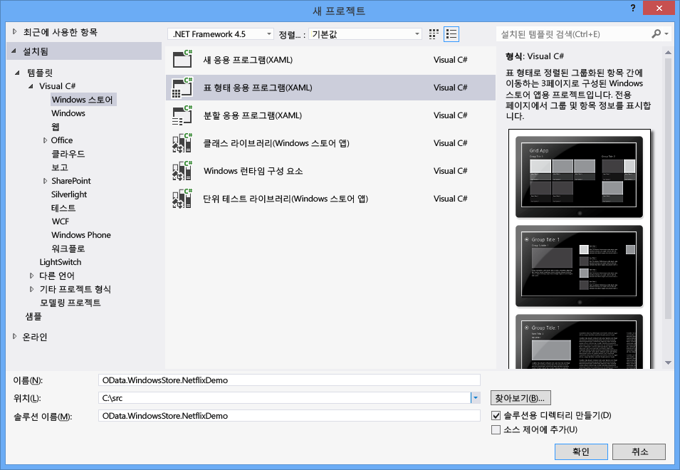
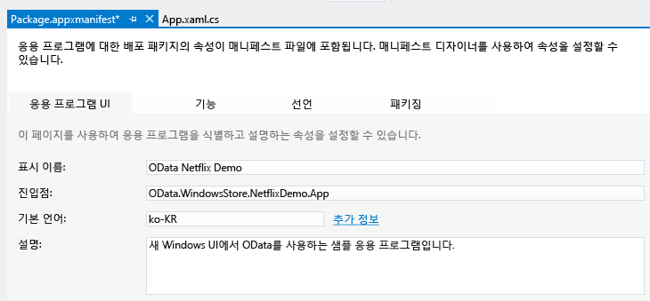
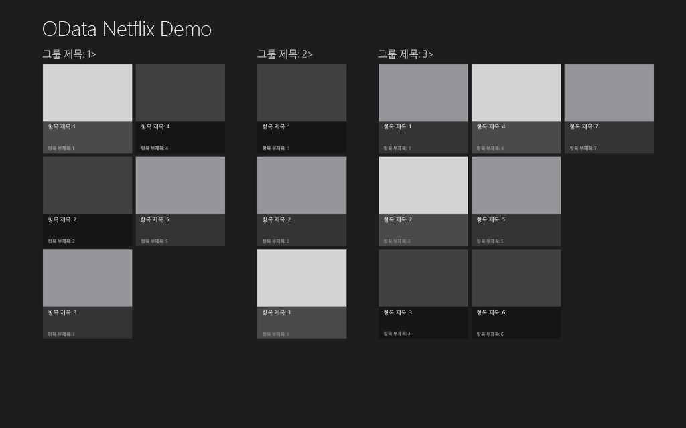
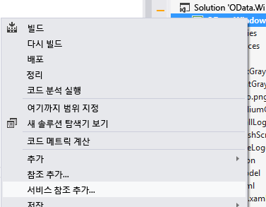
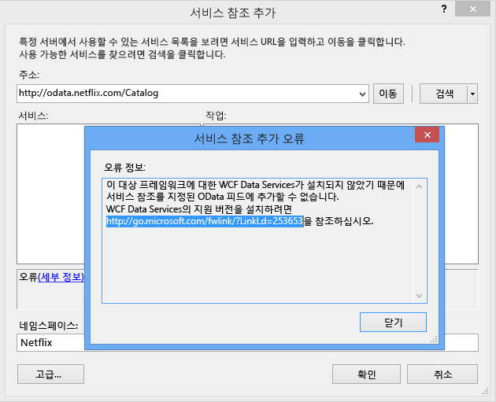
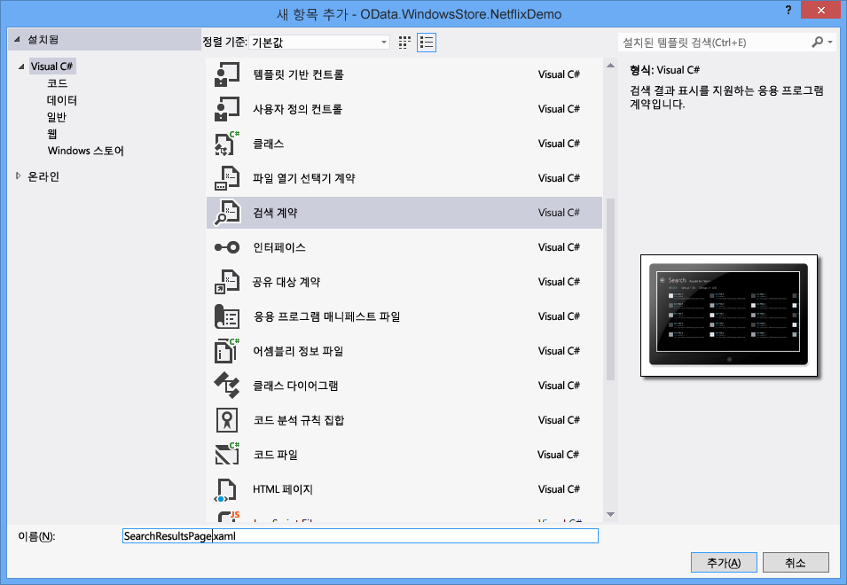

# <a name="writing-a-windows-store-app-that-consumes-an-odata-service"></a><span data-ttu-id="8a83f-102">OData 서비스를 사용하는 Windows 스토어 앱 작성</span><span class="sxs-lookup"><span data-stu-id="8a83f-102">Writing a Windows Store App that consumes an OData Service</span></span>
<span data-ttu-id="8a83f-103">Windows 8에는 응용 프로그램의 새로운 종류: Windows 스토어 응용 프로그램입니다.</span><span class="sxs-lookup"><span data-stu-id="8a83f-103">Windows 8 introduces a new type of application: the Windows Store app.</span></span> <span data-ttu-id="8a83f-104">완전히 새로운 모양과 느낌의 Windows 스토어 앱은 다양한 장치에서 실행되며 Windows 스토어에서 구할 수 있습니다.</span><span class="sxs-lookup"><span data-stu-id="8a83f-104">Windows Store apps have a brand new look and feel, run on a variety of devices, and are made available on the Windows Store.</span></span> <span data-ttu-id="8a83f-105">이 항목에서는 OData 서비스, 특히 NetFlix Catalog OData 서비스를 사용하는 Windows 스토어 앱을 작성하는 방법을 설명합니다.</span><span class="sxs-lookup"><span data-stu-id="8a83f-105">This topic describes how to write a Windows Store app that consumes an OData service, specifically the NetFlix Catalog OData service.</span></span> <span data-ttu-id="8a83f-106">Windows 스토어 앱에 대 한 자세한 내용은 읽으십시오 [Windows 스토어 앱 시작](http://msdn.microsoft.com/library/windows/apps/br211386.aspx)합니다.</span><span class="sxs-lookup"><span data-stu-id="8a83f-106">For more information about Windows Store Apps, please read [Getting Started with Windows Store apps](http://msdn.microsoft.com/library/windows/apps/br211386.aspx).</span></span>  
  
## <a name="prerequisites"></a><span data-ttu-id="8a83f-107">필수 구성 요소</span><span class="sxs-lookup"><span data-stu-id="8a83f-107">Prerequisites</span></span>  
  
1.  [<span data-ttu-id="8a83f-108">Microsoft Windows 8</span><span class="sxs-lookup"><span data-stu-id="8a83f-108">Microsoft Windows 8</span></span>](http://go.microsoft.com/fwlink/p/?LinkId=266654)  
  
2.  [<span data-ttu-id="8a83f-109">Microsoft Visual Studio 2012</span><span class="sxs-lookup"><span data-stu-id="8a83f-109">Microsoft Visual Studio 2012</span></span>](http://go.microsoft.com/fwlink/p/?LinkId=266655)  
  
3.  [<span data-ttu-id="8a83f-110">WCF 데이터 서비스</span><span class="sxs-lookup"><span data-stu-id="8a83f-110">WCF Data Services</span></span>](http://msdn.microsoft.com/data/bb931106)  
  
#### <a name="creating-the-default-windows-store-grid-application"></a><span data-ttu-id="8a83f-111">기본 Windows 스토어 표 형태 응용 프로그램 만들기</span><span class="sxs-lookup"><span data-stu-id="8a83f-111">Creating the default Windows Store Grid Application</span></span>  
  
1.  <span data-ttu-id="8a83f-112">C# 및 XAML을 사용하여 새 Windows 스토어 표 형태 응용 프로그램을 만들고</span><span class="sxs-lookup"><span data-stu-id="8a83f-112">Create a new Windows Store Grid Application using C# and XAML.</span></span> <span data-ttu-id="8a83f-113">이름을 OData.WindowsStore.NetflixDemo로 지정합니다.</span><span class="sxs-lookup"><span data-stu-id="8a83f-113">Name the application OData.WindowsStore.NetflixDemo:</span></span>  
  
     <span data-ttu-id="8a83f-114"></span><span class="sxs-lookup"><span data-stu-id="8a83f-114"></span></span>  
  
2.  <span data-ttu-id="8a83f-115">Package.appxmanifest를 열고 표시 이름 텍스트 상자에 이름을 입력합니다.</span><span class="sxs-lookup"><span data-stu-id="8a83f-115">Open the Package.appxmanifest and enter a friendly name in the Display name text box.</span></span> <span data-ttu-id="8a83f-116">이 이름은 Windows 8 검색 기능에 사용되는 응용 프로그램 이름입니다.</span><span class="sxs-lookup"><span data-stu-id="8a83f-116">This specifies the application name used with the Windows 8 search functionality.</span></span>  
  
     <span data-ttu-id="8a83f-117"></span><span class="sxs-lookup"><span data-stu-id="8a83f-117"></span></span>  
  
3.  <span data-ttu-id="8a83f-118">에 친숙 한 이름을 입력는 \<응용 프로그램 이름 > App.xaml 파일의 요소입니다.</span><span class="sxs-lookup"><span data-stu-id="8a83f-118">Enter a friendly name in the \<AppName> element in the App.xaml file.</span></span> <span data-ttu-id="8a83f-119">이렇게 하면 응용 프로그램이 시작될 때 표시되는 응용 프로그램 이름이 설정됩니다.</span><span class="sxs-lookup"><span data-stu-id="8a83f-119">This sets the application name that is displayed when the application is launched:</span></span>  
  
     <span data-ttu-id="8a83f-120"></span><span class="sxs-lookup"><span data-stu-id="8a83f-120"></span></span>  
  
4.  <span data-ttu-id="8a83f-121">응용 프로그램을 빌드하고 시작합니다.</span><span class="sxs-lookup"><span data-stu-id="8a83f-121">Build and launch the application.</span></span> <span data-ttu-id="8a83f-122">먼저 응용 프로그램 시작 화면이 표시됩니다.</span><span class="sxs-lookup"><span data-stu-id="8a83f-122">You first see the application’s splash screen.</span></span> <span data-ttu-id="8a83f-123">아래 스크린샷은 기본 시작 화면입니다.</span><span class="sxs-lookup"><span data-stu-id="8a83f-123">The screenshot below displays the default splash screen.</span></span> <span data-ttu-id="8a83f-124">사용되는 이미지는 프로젝트의 Assets 폴더에 저장됩니다.</span><span class="sxs-lookup"><span data-stu-id="8a83f-124">The image used is stored in the project’s Assets folder.</span></span>  
  
     <span data-ttu-id="8a83f-125"></span><span class="sxs-lookup"><span data-stu-id="8a83f-125"></span></span>  
  
     <span data-ttu-id="8a83f-126">그런 다음 응용 프로그램이 표시됩니다.</span><span class="sxs-lookup"><span data-stu-id="8a83f-126">Then the application will be displayed.</span></span>  
  
     <span data-ttu-id="8a83f-127"></span><span class="sxs-lookup"><span data-stu-id="8a83f-127"></span></span>  
  
     <span data-ttu-id="8a83f-128">기본 응용 프로그램은 SampleDataSource.cs: SampleDataGroup 및 SampleDataItem에 클래스 집합을 정의합니다. SampleDataSource.cs: SampleDataGroup 및 SampleDataItem은 모두 SampleDataCommon에서 파생되며 SampleDataCommon은 BindableBase에서 파생됩니다.</span><span class="sxs-lookup"><span data-stu-id="8a83f-128">The default application defines a set of classes in SampleDataSource.cs: SampleDataGroup and SampleDataItem, both of which are derived from SampleDataCommon, which itself is derived from BindableBase.</span></span> <span data-ttu-id="8a83f-129">SampleDataGroup 및 SampleDataItem은 기본 GridView에 바인딩됩니다.</span><span class="sxs-lookup"><span data-stu-id="8a83f-129">SampleDataGroup and SampleDataItem are bound to the default GridView.</span></span> <span data-ttu-id="8a83f-130">SampleDataSource.cs는 NetflixDemo 프로젝트 내의 DataModel 폴더에 있습니다.</span><span class="sxs-lookup"><span data-stu-id="8a83f-130">SampleDataSource.cs is located in the DataModel folder within the NetflixDemo project.</span></span> <span data-ttu-id="8a83f-131">응용 프로그램에 그룹화된 컬렉션이 표시됩니다.</span><span class="sxs-lookup"><span data-stu-id="8a83f-131">The application displays a grouped collection.</span></span> <span data-ttu-id="8a83f-132">각 그룹에는 각각 SampleDataGroup 및 SampleDataItem으로 나타나는 임의 개수의 항목이 있습니다.</span><span class="sxs-lookup"><span data-stu-id="8a83f-132">Each group contains any number of items, represented by SampleDataGroup and SampleDataItem, respectively.</span></span> <span data-ttu-id="8a83f-133">위의 스크린샷을 보면 Group Title 1이라는 그룹이 있고 이 그룹의 모든 항목은 함께 표시됩니다.</span><span class="sxs-lookup"><span data-stu-id="8a83f-133">In the previous screen shot you can see a group called Group Title 1 and all of the items in the group displayed together.</span></span>  
  
     <span data-ttu-id="8a83f-134">응용 프로그램의 기본 페이지는 GroupedItemsPage.xaml입니다.</span><span class="sxs-lookup"><span data-stu-id="8a83f-134">The main page of the application is GroupedItemsPage.xaml.</span></span> <span data-ttu-id="8a83f-135">이 페이지에는 SampleDataSource.cs 클래스에서 만든 샘플 데이터가 표시되는 GridView가 있습니다.</span><span class="sxs-lookup"><span data-stu-id="8a83f-135">It contains a GridView that displays the sample data created by the SampleDataSource.cs class.</span></span> <span data-ttu-id="8a83f-136">GroupedItemsPage는 rootFrame.Navigate가 호출될 때 App.xaml.cs에 의해 로드됩니다.</span><span class="sxs-lookup"><span data-stu-id="8a83f-136">The GroupedItemsPage is loaded by the App.xaml.cs in a call to rootFrame.Navigate:</span></span>  
  
    ```csharp  
    if (!rootFrame.Navigate(typeof(GroupedItemsPage), "AllGroups"))  
    {  
        throw new Exception("Failed to create initial page");  
    }  
    ```  
  
     <span data-ttu-id="8a83f-137">따라서 GroupedItemsPage가 인스턴스화되고 해당 LoadState 메서드가 호출됩니다.</span><span class="sxs-lookup"><span data-stu-id="8a83f-137">This causes the GroupedItemsPage to be instantiated and it’s LoadState method is called.</span></span> <span data-ttu-id="8a83f-138">LoadState로 인해 정적 SampleDataSource 인스턴스가 생성되고 SampleDataSource 인스턴스는 SampleDataGroup 개체 컬렉션을 만듭니다.</span><span class="sxs-lookup"><span data-stu-id="8a83f-138">LoadState causes the static SampleDataSource instance to be created, which creates a collection of SampleDataGroup objects.</span></span> <span data-ttu-id="8a83f-139">각 SampleDataGroup 개체는 SampleDataItem 개체 컬렉션을 포함합니다.</span><span class="sxs-lookup"><span data-stu-id="8a83f-139">Each SampleDataGroup object contains a collection of SampleDataItem objects.</span></span> <span data-ttu-id="8a83f-140">LoadState는 SampleDataGroup 개체 컬렉션을 DefaultViewModel에 저장합니다.</span><span class="sxs-lookup"><span data-stu-id="8a83f-140">LoadState stores the collection of SampleDataGroup objects in the DefaultViewModel:</span></span>  
  
    ```csharp  
    protected override void LoadState(Object navigationParameter, Dictionary<String, Object> pageState)  
    {  
        var sampleDataGroups = SampleDataSource.GetGroups((String)navigationParameter);  
        this.DefaultViewModel["Groups"] = sampleDataGroups;  
    }  
    ```  
  
     <span data-ttu-id="8a83f-141">그런 다음 DefaultViewModel이 GridView에 바인딩됩니다.</span><span class="sxs-lookup"><span data-stu-id="8a83f-141">The DefaultViewModel is then bound to the GridView.</span></span> <span data-ttu-id="8a83f-142">이 바인딩은 데이터 바인딩을 구성할 때 GroupedItemsPage.xaml 파일에서 참조됩니다.</span><span class="sxs-lookup"><span data-stu-id="8a83f-142">This is referenced in the GroupedItemsPage.xaml file when configuring the data binding.</span></span>  
  
    ```xaml
    <CollectionViewSource  
                x:Name="groupedItemsViewSource"  
                Source="{Binding Groups}"  
                IsSourceGrouped="true"  
                ItemsPath="TopItems"  
                d:Source="{Binding AllGroups, Source={d:DesignInstance Type=data:SampleDataSource, IsDesignTimeCreatable=True}}"/>  
    ```  
  
     <span data-ttu-id="8a83f-143">CollectionViewSource는 그룹화된 컬렉션 처리를 위한 프록시로 사용됩니다.</span><span class="sxs-lookup"><span data-stu-id="8a83f-143">The CollectionViewSource is used as a proxy for handling grouped collections.</span></span> <span data-ttu-id="8a83f-144">바인딩이 수행될 때 CollectionViewSource는 SampleDataGroup 개체 컬렉션을 반복하여 GridView를 채웁니다.</span><span class="sxs-lookup"><span data-stu-id="8a83f-144">When binding occurs, it iterates through the collection of SampleDataGroup objects to populate the GridView.</span></span>  <span data-ttu-id="8a83f-145">ItemsPath 특성은 각 SampleDataGroup 개체가 포함하는 SampleDataItems 항목을 찾기 위해 사용할 SampleDataGroup 개체 속성을 CollectionViewSource에 알려 줍니다.</span><span class="sxs-lookup"><span data-stu-id="8a83f-145">The ItemsPath attribute tells the CollectionViewSource what property on each SampleDataGroup object to use to find the SampleDataItems it contains.</span></span> <span data-ttu-id="8a83f-146">이 예에서는 각 SampleDataGroup 개체가 SampleDataItem 개체의 TopItems 컬렉션을 포함하고 있습니다.</span><span class="sxs-lookup"><span data-stu-id="8a83f-146">In this case each SampleDataGroup object contains a TopItems collection of SampleDataItem objects.</span></span>  
  
     <span data-ttu-id="8a83f-147">Netflix 응용 프로그램에서는 영화가 장르별로 그룹화됩니다.</span><span class="sxs-lookup"><span data-stu-id="8a83f-147">For the Netflix application, movies are grouped by genre.</span></span> <span data-ttu-id="8a83f-148">따라서 응용 프로그램에 수많은 장르와 해당 장르의 영화 목록이 표시됩니다.</span><span class="sxs-lookup"><span data-stu-id="8a83f-148">So the application displays a number of genres and a list of movies within that genre.</span></span>  
  
#### <a name="add-a-service-reference-to-the-netflix-odata-service"></a><span data-ttu-id="8a83f-149">Netflix OData Service에 대한 서비스 참조 추가</span><span class="sxs-lookup"><span data-stu-id="8a83f-149">Add a Service Reference to the Netflix OData Service</span></span>  
  
1.  <span data-ttu-id="8a83f-150">Netflix OData Service를 호출하려면 서비스 참조를 추가해야 합니다.</span><span class="sxs-lookup"><span data-stu-id="8a83f-150">Before we can make any calls to the Netflix OData service we need to add a service reference.</span></span> <span data-ttu-id="8a83f-151">솔루션 탐색기에서 프로젝트를 마우스 오른쪽 단추로 클릭하고 서비스 참조 추가...를 선택합니다.</span><span class="sxs-lookup"><span data-stu-id="8a83f-151">Right-click the project in the Solution Explorer and select Add Service Reference…</span></span>  
  
     <span data-ttu-id="8a83f-152"></span><span class="sxs-lookup"><span data-stu-id="8a83f-152"></span></span>  
  
2.  <span data-ttu-id="8a83f-153">주소 표시줄에 Netflix OData Service의 URL을 입력하고 이동을 클릭합니다.</span><span class="sxs-lookup"><span data-stu-id="8a83f-153">Enter the URL for the Netflix OData service in the Address bar and click Go.</span></span> <span data-ttu-id="8a83f-154">Netflix에 대한 서비스 참조 네임스페이스를 설정하고 확인을 클릭합니다.</span><span class="sxs-lookup"><span data-stu-id="8a83f-154">Set the Namespace of the service reference to Netflix and click OK.</span></span>  
  
     <span data-ttu-id="8a83f-155"></span><span class="sxs-lookup"><span data-stu-id="8a83f-155"></span></span>  
  
    > [!NOTE]
    >  <span data-ttu-id="8a83f-156">아직 설치 하지 않은 경우 [WCF 데이터 서비스 도구 Windows 스토어 앱 용](http://go.microsoft.com/fwlink/p/?LinkId=266652)을 위와 같은 메시지와 함께 나타납니다.</span><span class="sxs-lookup"><span data-stu-id="8a83f-156">If you have not yet installed [WCF Data Services Tools for Windows Store Apps](http://go.microsoft.com/fwlink/p/?LinkId=266652), you will be prompted with a message such as the one above.</span></span> <span data-ttu-id="8a83f-157">계속하려면 링크에 표시된 도구를 다운로드하여 설치해야 합니다.</span><span class="sxs-lookup"><span data-stu-id="8a83f-157">You will need to download and install the tools referenced in the link to continue.</span></span>  
  
 <span data-ttu-id="8a83f-158">서비스 참조를 추가하면 WCF Data Services가 Netflix OData Service에서 반환한 OData를 분석하는 데 사용하는 강력한 형식의 클래스가 생성됩니다.</span><span class="sxs-lookup"><span data-stu-id="8a83f-158">Adding a service reference generates strongly typed classes that WCF Data Services will use to parse the OData returned by the Netflix OData service.</span></span> <span data-ttu-id="8a83f-159">SampleDataSource.cs에 정의된 클래스는 GridView에 바인딩될 수 있으므로 생성된 OData 클라이언트 클래스의 데이터를 SampleDataSource.cs에 정의된 바인딩 가능한 클래스로 전송해야 합니다.</span><span class="sxs-lookup"><span data-stu-id="8a83f-159">The classes defined in SampleDataSource.cs can be bound to the GridView so we need to transfer the data from the generated OData client classes into the bindable classes defined in SampleDataSource.cs.</span></span>  <span data-ttu-id="8a83f-160">이렇게 하려면 SampleDataSource.cs에 정의된 데이터 모델을 변경해야 합니다.</span><span class="sxs-lookup"><span data-stu-id="8a83f-160">In order to do this, we need to make some changes to the data model defined in SampleDataSource.cs.</span></span>  
  
#### <a name="update-the-data-model-for-the-application"></a><span data-ttu-id="8a83f-161">응용 프로그램에 맞게 데이터 모델 업데이트</span><span class="sxs-lookup"><span data-stu-id="8a83f-161">Update the data model for the application</span></span>  
  
1.  <span data-ttu-id="8a83f-162">SampleDataSource.cs의 기존 코드에서 코드로 대체 [이 요점](https://gist.github.com/3419288)합니다.</span><span class="sxs-lookup"><span data-stu-id="8a83f-162">Replace the existing code in SampleDataSource.cs with the code from [this gist](https://gist.github.com/3419288).</span></span> <span data-ttu-id="8a83f-163">업데이트된 코드는 Netflix OData Service에 대해 쿼리를 수행하는 LoadMovies 메서드를 SampleDataSource 클래스에 추가하고 장르 목록(allGroups) 및 각 장르의 영화 목록을 생성합니다.</span><span class="sxs-lookup"><span data-stu-id="8a83f-163">The updated code adds a LoadMovies method (to the SampleDataSource class)  that performs a query against the Netflix OData service and populates a list of genres (allGroups) and within each genre a list of movies.</span></span> <span data-ttu-id="8a83f-164">SampleDataGroup 클래스는 장르를 나타내는 데 사용되고 SampleDataItem 클래스는 영화를 나타내는 데 사용됩니다.</span><span class="sxs-lookup"><span data-stu-id="8a83f-164">The SampleDataGroup class is used to represent a genre and the SampleDataItem class is used to represent a movie.</span></span>  
  
    ```csharp  
    public static async void LoadMovies()  
    {  
        IEnumerable<Title> titles = await ((DataServiceQuery<Title>)Context.Titles  
            .Expand("Genres,AudioFormats,AudioFormats/Language,Awards,Cast")  
            .Where(t => t.Rating == "PG")  
            .OrderByDescending(t => t.ReleaseYear)  
            .Take(300)).ExecuteAsync();  
  
        foreach (Title title in titles)  
        {  
            foreach (Genre netflixGenre in title.Genres)  
            {  
                SampleDataGroup genre = GetGroup(netflixGenre.Name);  
                if (genre == null)  
                {  
                    genre = new SampleDataGroup(netflixGenre.Name, netflixGenre.Name, String.Empty, title.BoxArt.LargeUrl, String.Empty);  
                    Instance.AllGroups.Add(genre);  
                }  
                var content = new StringBuilder();  
                // Write additional things to content here if you want them to display in the item detail.  
                genre.Items.Add(new SampleDataItem(title.Id, title.Name, String.Format("{0}rnrn{1} ({2})", title.Synopsis, title.Rating, title.ReleaseYear), title.BoxArt.HighDefinitionUrl ?? title.BoxArt.LargeUrl, "Description", content.ToString()));  
            }  
        }  
    }  
    ```  
  
     <span data-ttu-id="8a83f-165">[작업 기반 비동기 패턴](http://go.microsoft.com/fwlink/p/?LinkId=266651) (TAP) 하는 데 비동기적으로 가져오기 300 (Take) 최신 (OrderByDescending) PG 등급 (Where) 영화 Netflix에서 합니다.</span><span class="sxs-lookup"><span data-stu-id="8a83f-165">The [Task-based Asynchronous Pattern](http://go.microsoft.com/fwlink/p/?LinkId=266651) (TAP) is used to asynchronously get 300 (Take) recent (OrderByDescending) PG-rated (Where) movies back from Netflix.</span></span> <span data-ttu-id="8a83f-166">코드의 나머지 부분은 OData 피드에 반환된 엔터티에서 SimpleDataItems 및 SimpleDataGroups를 생성합니다.</span><span class="sxs-lookup"><span data-stu-id="8a83f-166">The rest of the code constructs SimpleDataItems and SimpleDataGroups from the entities that were returned in the OData feed.</span></span>  
  
     <span data-ttu-id="8a83f-167">또한 SampleDataSource 클래스는 단순 검색 메서드를 구현합니다.</span><span class="sxs-lookup"><span data-stu-id="8a83f-167">The SampleDataSource class also implements a simple search method.</span></span> <span data-ttu-id="8a83f-168">이 예에서는 단순 메모리 내 검색으로 로드된 영화를 검색합니다.</span><span class="sxs-lookup"><span data-stu-id="8a83f-168">In this case, it does a simple in-memory search of the loaded movies.</span></span>  
  
    ```csharp  
    public static IEnumerable<SampleDataItem> Search(string searchString)  
    {  
            var regex = new Regex(searchString, RegexOptions.CultureInvariant | RegexOptions.IgnoreCase | RegexOptions.IgnorePatternWhitespace);  
            return Instance.AllGroups  
                .SelectMany(g => g.Items)  
                .Where(m => regex.IsMatch(m.Title) || regex.IsMatch(m.Subtitle))  
                    .Distinct(new SampleDataItemComparer());  
    }  
    ```  
  
     <span data-ttu-id="8a83f-169">SampleDataSource.cs에는 ExtensionMethods라는 클래스도 정의되어 있습니다.</span><span class="sxs-lookup"><span data-stu-id="8a83f-169">Also in SampleDataSource.cs a class called ExtensionMethods is defined.</span></span> <span data-ttu-id="8a83f-170">이러한 각 확장 메서드는 TAP 패턴을 사용하여 SampleDataSource가 UI를 차단하지 않고 OData 쿼리를 실행할 수 있도록 합니다.</span><span class="sxs-lookup"><span data-stu-id="8a83f-170">Each of these extension methods uses the TAP pattern to allow the SampleDataSource to execute an OData query without blocking the UI.</span></span> <span data-ttu-id="8a83f-171">예를 들어 다음 코드에서는 Task.Factory.FromAsync 메서드를 사용하여 TAP를 구현합니다.</span><span class="sxs-lookup"><span data-stu-id="8a83f-171">For example, the following code uses the Task.Factory.FromAsync method to implement TAP.</span></span>  
  
    ```csharp  
    public static async Task<IEnumerable<T>> ExecuteAsync<T>(this DataServiceQuery<T> query)  
    {  
        return await Task.Factory.FromAsync<IEnumerable<T>>(query.BeginExecute(null, null), query.EndExecute);  
    }  
    ```  
  
     <span data-ttu-id="8a83f-172">기본 응용 프로그램과 마찬가지로 응용 프로그램의 기본 페이지는 GroupedItemsPage입니다.</span><span class="sxs-lookup"><span data-stu-id="8a83f-172">As in the default application, the main page of the application is GroupedItemsPage.</span></span> <span data-ttu-id="8a83f-173">하지만 현재는 Netflix에서 검색된 영화가 장르별로 그룹화된 상태로 표시됩니다.</span><span class="sxs-lookup"><span data-stu-id="8a83f-173">This time, however, it displays the movies retrieved from Netflix grouped by genre.</span></span>  <span data-ttu-id="8a83f-174">GroupedItemsPage가 인스턴스화될 때 해당 LoadState 메서드가 호출됩니다.</span><span class="sxs-lookup"><span data-stu-id="8a83f-174">When the GroupedItemsPage is instantiated, its LoadState method is called.</span></span> <span data-ttu-id="8a83f-175">앞에서 설명한 대로 LoadState로 인해 정적 SampleDataSource 인스턴스가 생성되고 Netflix OData Service가 호출됩니다.</span><span class="sxs-lookup"><span data-stu-id="8a83f-175">LoadState causes the static SampleDataSource instance to be created, making a call to the Netflix OData service as discussed previously.</span></span> <span data-ttu-id="8a83f-176">LoadState는 장르(SampleDataGroup 개체) 컬렉션을 DefaultViewModel에 저장합니다.</span><span class="sxs-lookup"><span data-stu-id="8a83f-176">LoadState stores the collection of genres (SampleDataGroup objects) in the DefaultViewModel:</span></span>  
  
    ```csharp  
    protected override void LoadState(Object navigationParameter, Dictionary<String, Object> pageState)  
    {  
  
        var sampleDataGroups = SampleDataSource.GetGroups((String)navigationParameter);  
        this.DefaultViewModel["Groups"] = sampleDataGroups;  
    }  
    ```  
  
     <span data-ttu-id="8a83f-177">그런 다음에는 앞에서 설명한 대로 DefaultViewModel을 사용하여 데이터가 GridView에 바인딩됩니다.</span><span class="sxs-lookup"><span data-stu-id="8a83f-177">As described previously, the DefaultViewModel is then used to bind the data to the GridView.</span></span>  
  
#### <a name="add-a-search-contract-to-allow-the-application-to-participate-in-windows-search"></a><span data-ttu-id="8a83f-178">응용 프로그램이 Windows 검색에 참가할 수 있도록 검색 계약 추가</span><span class="sxs-lookup"><span data-stu-id="8a83f-178">Add a search contract to allow the application to participate in Windows search</span></span>  
  
1.  <span data-ttu-id="8a83f-179">응용 프로그램에 검색 계약을 추가합니다.</span><span class="sxs-lookup"><span data-stu-id="8a83f-179">Add a search contract to the application.</span></span> <span data-ttu-id="8a83f-180">이렇게 하면 응용 프로그램이 Windows 8 검색 환경에 통합됩니다.</span><span class="sxs-lookup"><span data-stu-id="8a83f-180">This allows the application to integrate with the Windows 8 search experience.</span></span> <span data-ttu-id="8a83f-181">검색 계약 이름을 SearchResultsPage.xaml로 지정합니다.</span><span class="sxs-lookup"><span data-stu-id="8a83f-181">Name the search contract SearchResultsPage.xaml</span></span>  
  
     <span data-ttu-id="8a83f-182"></span><span class="sxs-lookup"><span data-stu-id="8a83f-182"></span></span>  
  
2.  <span data-ttu-id="8a83f-183">SearchResultsPage.xaml.cs의 58번째 줄에서 queryText를 묶는 따옴표를 제거하여 줄을 수정합니다.</span><span class="sxs-lookup"><span data-stu-id="8a83f-183">Modify line 58 of SearchResultsPage.xaml.cs by removing the embedded quotes around queryText.</span></span>  
  
    ```csharp  
    // Communicate results through the view model  
    this.DefaultViewModel["QueryText"] = queryText;  
    this.DefaultViewModel["Filters"] = filterList;  
    this.DefaultViewModel["ShowFilters"] = filterList.Count > 1;  
    ```  
  
3.  <span data-ttu-id="8a83f-184">SearchResultsPage.xaml.cs의 81번째 줄에 다음 두 코드 줄을 삽입하여 검색 결과를 검색합니다.</span><span class="sxs-lookup"><span data-stu-id="8a83f-184">Insert the following two lines of code at line 81 in SearchResultsPage.xaml.cs to retrieve the search results.</span></span>  
  
    ```csharp  
    // TODO: Respond to the change in active filter by setting this.DefaultViewModel["Results"]  
                    //       to a collection of items with bindable Image, Title, Subtitle, and Description properties  
                    var searchValue = (string)this.DefaultViewModel["QueryText"];  
                    this.DefaultViewModel["Results"] = new List<SampleDataItem>(SampleDataSource.Search(searchValue));  
    ```  
  
 <span data-ttu-id="8a83f-185">사용자는 Windows 검색을 실행할 때 검색 용어를 입력한 다음 검색 표시줄에서 Netflix Demo 응용 프로그램 아이콘을 터치합니다. 그러면 SearchResultsPage의 LoadState 메서드가 실행됩니다.</span><span class="sxs-lookup"><span data-stu-id="8a83f-185">When a user invokes Windows search, types in a search term and then touches the Netflix Demo app icon in the search bar, the LoadState method of the SearchResultsPage is executed.</span></span> <span data-ttu-id="8a83f-186">LoadState로 전송된 탐색 매개 변수에 쿼리 텍스트가 포함됩니다.</span><span class="sxs-lookup"><span data-stu-id="8a83f-186">The navigation parameter sent to LoadState contains the query text.</span></span> <span data-ttu-id="8a83f-187">그 다음에는 Filter_SelectionChanged 메서드가 호출되고 이 메서드는 SampleDataSource 클래스에 대해 Search 메서드를 호출합니다.</span><span class="sxs-lookup"><span data-stu-id="8a83f-187">Next the Filter_SelectionChanged method is called which then calls the Search method on the SampleDataSource class.</span></span> <span data-ttu-id="8a83f-188">SearchResultsPage.xaml 페이지에 결과가 반환되고 표시됩니다.</span><span class="sxs-lookup"><span data-stu-id="8a83f-188">The results are returned and displayed in the SearchResultsPage.xaml page.</span></span>  
  
```csharp  
/// <summary>  
        /// Invoked when a filter is selected using the ComboBox in snapped view state.  
        /// </summary>  
        /// <param name="sender">The ComboBox instance.</param>  
        /// <param name="e">Event data describing how the selected filter was changed.</param>  
        void Filter_SelectionChanged(object sender, SelectionChangedEventArgs e)  
        {  
            // Determine what filter was selected  
            var selectedFilter = e.AddedItems.FirstOrDefault() as Filter;  
            if (selectedFilter != null)  
            {  
                // Mirror the results into the corresponding Filter object to allow the  
                // RadioButton representation used when not snapped to reflect the change  
                selectedFilter.Active = true;  
  
                // TODO: Respond to the change in active filter by setting this.DefaultViewModel["Results"]  
                //       to a collection of items with bindable Image, Title, Subtitle, and Description properties  
                var searchValue = (string)this.DefaultViewModel["QueryText"];  
                this.DefaultViewModel["Results"] = new List<SampleDataItem>(SampleDataSource.Search(searchValue));  
  
                // Ensure results are found  
                object results;  
                ICollection resultsCollection;  
                if (this.DefaultViewModel.TryGetValue("Results", out results) &&  
                    (resultsCollection = results as ICollection) != null &&  
                    resultsCollection.Count != 0)  
                {  
                    VisualStateManager.GoToState(this, "ResultsFound", true);  
                    return;  
                }  
            }  
  
            // Display informational text when there are no search results.  
            VisualStateManager.GoToState(this, "NoResultsFound", true);  
        }  
```  
  
 <span data-ttu-id="8a83f-189">에 응용 프로그램 참조 검색을 통합에 대 한 자세한 내용은 [검색: Windows 8 검색 환경에 통합](http://go.microsoft.com/fwlink/p/?LinkId=266650)합니다.</span><span class="sxs-lookup"><span data-stu-id="8a83f-189">For more information on integrating search into an application see, [Search: integrating into the Windows 8 search experience](http://go.microsoft.com/fwlink/p/?LinkId=266650).</span></span>  
  
## <a name="run-the-application"></a><span data-ttu-id="8a83f-190">응용 프로그램 실행</span><span class="sxs-lookup"><span data-stu-id="8a83f-190">Run the application</span></span>  
 <span data-ttu-id="8a83f-191">F5 키를 눌러 응용 프로그램을 시작합니다.</span><span class="sxs-lookup"><span data-stu-id="8a83f-191">Launch the application by pressing F5.</span></span> <span data-ttu-id="8a83f-192">응용 프로그램을 시작할 때 이미지를 로드하는 데 몇 초 정도 걸릴 수 있습니다.</span><span class="sxs-lookup"><span data-stu-id="8a83f-192">Note that it will take a few seconds to load the images upon application launch.</span></span> <span data-ttu-id="8a83f-193">또한 첫 번째 검색에서는 결과가 반환되지 않을 수 있습니다.</span><span class="sxs-lookup"><span data-stu-id="8a83f-193">Also, your first search attempt may not return any results.</span></span> <span data-ttu-id="8a83f-194">실제 응용 프로그램에서는 이 두 문제를 모두 처리할 수 있습니다.</span><span class="sxs-lookup"><span data-stu-id="8a83f-194">In a real-world application, you would want to deal with both of these issues.</span></span>  
  
 <span data-ttu-id="8a83f-195">응용 프로그램에서 Netflix OData Service를 호출하고, 생성된 OData 클라이언트 클래스의 데이터를 받은 다음 해당 데이터를 바인딩 가능한 데이터 클래스(SampleDataSource, SampleDataGroup 및 SampleDataItem)로 전송합니다.</span><span class="sxs-lookup"><span data-stu-id="8a83f-195">The application calls the Netflix OData service, receives the data in the generated OData client classes and then transfers that data to bindable data classes (SampleDataSource, SampleDataGroup, and SampleDataItem).</span></span> <span data-ttu-id="8a83f-196">응용 프로그램에서는 이러한 바인딩 가능한 클래스를 사용하여 데이터를 GridView에 바인딩합니다.</span><span class="sxs-lookup"><span data-stu-id="8a83f-196">It uses these bindable classes to bind the data to the GridView.</span></span> <span data-ttu-id="8a83f-197">XAML 데이터 바인딩의 참조를 작동 하는 방법을 모르는 경우 [항목 목록 또는 표 (C# /vb/c + + 및 XAML을 사용 하 여 Windows 스토어 앱)을 그룹화 하는 방법을](http://msdn.microsoft.com/library/windows/apps/xaml/hh780627)합니다.</span><span class="sxs-lookup"><span data-stu-id="8a83f-197">If you are unfamiliar with how XAML databinding works see [How to group items in a list or grid (Windows Store apps using C#/VB/C++ and XAML)](http://msdn.microsoft.com/library/windows/apps/xaml/hh780627).</span></span>
