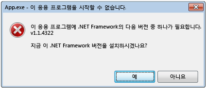
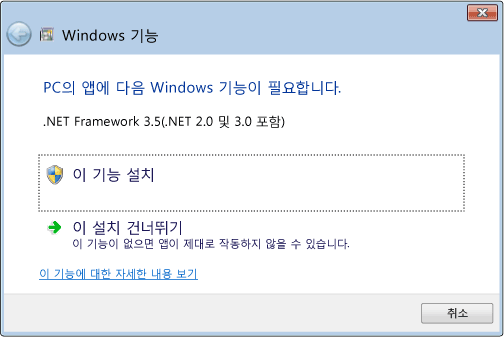

# .NET Framework 초기화 오류: 사용자 환경 관리
CLR(공용 언어 런타임) 활성화 시스템은 관리되는 응용 프로그램 코드를 실행하는 데 사용할 CLR 버전을 결정합니다. 경우에 따라 활성화 시스템이 로드할 CLR 버전을 찾지 못할 수도 있습니다. 일반적으로 이런 상황은 응용 프로그램에 필요한 CLR 버전이 잘못되었거나 지정된 컴퓨터에 설치되지 않은 경우에 발생합니다. 요청된 버전이 없는 경우 CLR 활성화 시스템은 호출된 함수 또는 인터페이스에서 HRESULT 오류 코드를 반환하며, 응용 프로그램을 실행하는 사용자에게 오류 메시지를 표시할 수 있습니다. 이 문서에서는 HRESULT 코드 목록을 제공하며 오류 메시지가 표시되지 않도록 하는 방법을 설명합니다.  
  
 [방법: CLR 활성화 문제 디버깅](../../../docs/framework/deployment/how-to-debug-clr-activation-issues.md)에 설명된 대로 CLR은 CLR 활성화 문제를 디버그하는 데 유용한 로깅 인프라를 제공합니다. 이 인프라와 [어셈블리 바인딩 로그](../../../docs/framework/tools/fuslogvw-exe-assembly-binding-log-viewer.md)는 완전히 다르므로 혼동하면 안 됩니다.  
  
## CLR 활성화 HRESULT 코드  
 CLR 활성화 API는 HRESULT 코드를 반환하여 활성화 작업의 결과를 호스트에 보고합니다. CLR 호스트는 추가 작업을 진행하기 전에 이러한 반환 값을 항상 확인해야 합니다.  
  
-   CLR_E_SHIM_RUNTIMELOAD  
  
-   CLR_E_SHIM_RUNTIMEEXPORT  
  
-   CLR_E_SHIM_INSTALLROOT  
  
-   CLR_E_SHIM_INSTALLCOMP  
  
-   CLR_E_SHIM_LEGACYRUNTIMEALREADYBOUND  
  
-   CLR_E_SHIM_SHUTDOWNINPROGRESS  
  
## 초기화 오류에 대한 UI  
 CLR 활성화 시스템이 응용 프로그램에 필요한 올바른 버전의 런타임을 로드할 수 없는 경우 컴퓨터가 응용 프로그램을 실행하도록 제대로 구성되어 있지 않다고 알리는 오류 메시지를 사용자에게 표시하고 문제를 해결할 수 있는 기회를 제공합니다. 이러한 상황에서는 일반적으로 다음과 같은 오류 메시지가 표시됩니다. 사용자는 **예**를 선택하여 응용 프로그램에 맞는 .NET Framework 버전을 다운로드할 수 있는 Microsoft 웹 사이트로 이동할 수 있습니다.  
  
   
초기화 오류에 대한 일반적인 오류 메시지  
  
## 초기화 오류 해결  
 개발자는 .NET Framework 초기화 오류 메시지를 제어하기 위한 다양한 옵션을 사용할 수 있습니다. 예를 들어 다음 섹션에 설명된 대로 API 플래그를 사용하여 메시지가 표시되지 않도록 방지할 수 있습니다. 그러나 응용 프로그램이 요청된 런타임을 로드할 수 없도록 하는 문제를 해결해야 합니다. 해결하지 않으면 응용 프로그램이 실행되지 않거나 일부 기능을 사용하지 못할 수도 있습니다.  
  
 근본적인 문제를 해결하고 최상의 사용자 환경(적은 오류 메시지)을 제공하려면 다음 권장 사항을 따르세요.  
  
-   .NET Framework 3.5(및 이전 버전) 응용 프로그램: .NET Framework 4 또는 4.5를 지원하도록 응용 프로그램을 구성합니다([지침](../../../docs/framework/migration-guide/how-to-configure-an-app-to-support-net-framework-4-or-4-5.md) 참조).  
  
-   .NET Framework 4 응용 프로그램: 응용 프로그램 설치의 일부로 .NET Framework 4 재배포 가능 패키지를 설치합니다. [개발자를 위한 배포 가이드](../../../docs/framework/deployment/deployment-guide-for-developers.md)를 참조하세요.  
  
## 오류 메시지 제어  
 요청된 .NET Framework 버전을 찾을 수 없다고 알리는 오류 메시지를 표시하는 것은 사용자에 대한 최소한의 불편이나 유용한 서비스로 간주될 수 있습니다. 두 경우 모두 활성화 API에 플래그를 전달하여 이 UI를 제어할 수 있습니다.  
  
 [ICLRMetaHostPolicy::GetRequestedRuntime](../../../docs/framework/unmanaged-api/hosting/iclrmetahostpolicy-getrequestedruntime-method.md) 메서드는 [METAHOST_POLICY_FLAGS](../../../docs/framework/unmanaged-api/hosting/metahost-policy-flags-enumeration.md) 열거형 멤버를 입력으로 허용합니다. METAHOST_POLICY_SHOW_ERROR_DIALOG 플래그를 포함하면 요청된 버전의 CLR을 찾을 수 없는 경우 오류 메시지를 요청할 수 있습니다. 기본적으로 오류 메시지는 표시되지 않습니다. [ICLRMetaHost::GetRuntime](../../../docs/framework/unmanaged-api/hosting/iclrmetahost-getruntime-method.md) 메서드는 이 플래그를 허용하지 않으며 오류 메시지를 표시하는 다른 방법도 제공하지 않습니다.  
  
 Windows에서는 프로세스 내에서 실행되는 코드의 결과로 오류 메시지를 표시할지 여부를 선언하는 데 사용할 수 있는 [SetErrorMode](http://go.microsoft.com/fwlink/p/?LinkID=255242) 함수를 제공합니다. SEM_FAILCRITICALERRORS 플래그를 지정하면 오류 메시지가 표시되지 않도록 방지할 수 있습니다.  
  
 그러나 일부 시나리오에서는 응용 프로그램 프로세스에서 지정한 SEM_FAILCRITICALERRORS 설정을 재정의하는 것이 중요합니다. 예를 들어 CLR을 호스트하고 SEM_FAILCRITICALERRORS가 설정되어 있는 프로세스에 호스트된 네이티브 COM 구성 요소가 있는 경우 해당 특정 응용 프로그램 프로세스 내에서 오류 메시지를 표시할 경우의 영향에 따라 플래그를 재정의하는 것이 좋습니다. 이 경우 다음 플래그 중 하나를 사용하여 SEM_FAILCRITICALERRORS를 재정의할 수 있습니다.  
  
-   [ICLRMetaHostPolicy::GetRequestedRuntime](../../../docs/framework/unmanaged-api/hosting/iclrmetahostpolicy-getrequestedruntime-method.md) 메서드에 METAHOST_POLICY_IGNORE_ERROR_MODE를 사용합니다.  
  
-   [GetRequestedRuntimeInfo](../../../docs/framework/unmanaged-api/hosting/getrequestedruntimeinfo-function.md) 함수에 RUNTIME_INFO_IGNORE_ERROR_MODE를 사용합니다.  
  
## CLR에서 제공하는 호스트에 대한 UI 정책  
 CLR은 다양한 시나리오에 대한 호스트 집합을 포함하며, 이러한 호스트는 필요한 버전의 런타임을 로드하는 데 문제가 있을 경우 모두 오류 메시지를 표시합니다. 다음 표에서는 호스트 및 해당 오류 메시지 정책 목록을 제공합니다.  
  
|CLR 호스트|설명|오류 메시지 정책|오류 메시지를 사용하지 않도록 설정할 수 있는지 여부|  
|--------------|-----------------|--------------------------|------------------------------------|  
|관리되는 EXE 호스트|관리되는 EXE를 시작합니다.|.NET Framework 버전이 없는 경우 표시됩니다.|아니요|  
|관리되는 COM 호스트|관리되는 COM 구성 요소를 프로세스에 로드합니다.|.NET Framework 버전이 없는 경우 표시됩니다.|예, SEM_FAILCRITICALERRORS 플래그를 설정합니다.|  
|ClickOnce 호스트|ClickOnce 응용 프로그램을 시작합니다.|[!INCLUDE[net_v45](../../../includes/net-v45-md.md)]부터 .NET Framework 버전이 없는 경우 표시됩니다.|아니요|  
|XBAP 호스트|WPF XBAP 응용 프로그램을 시작합니다.|[!INCLUDE[net_v45](../../../includes/net-v45-md.md)]부터 .NET Framework 버전이 없는 경우 표시됩니다.|아니요|  
  
## [!INCLUDE[win8](../../../includes/win8-md.md)] 동작 및 UI  
 CLR 활성화 시스템은 CLR 2.0을 로드하는 데 문제가 있는 점을 제외하고 다른 버전의 Windows 운영 체제에서와 동일한 동작 및 UI를 [!INCLUDE[win8](../../../includes/win8-md.md)]에서 제공합니다. [!INCLUDE[win8](../../../includes/win8-md.md)]에는 CLR 4.5를 사용하는 [!INCLUDE[net_v45](../../../includes/net-v45-md.md)]가 포함되어 있습니다. 그러나 [!INCLUDE[win8](../../../includes/win8-md.md)]에 CLR 2.0을 사용하는 .NET Framework 2.0, 3.0 또는 3.5는 포함되어 있지 않습니다. 따라서 CLR 2.0을 사용하는 응용 프로그램은 기본적으로 [!INCLUDE[win8](../../../includes/win8-md.md)]에서 실행되지 않습니다. 대신, 사용자가 .NET Framework 3.5를 설치할 수 있는 다음과 같은 대화 상자를 표시합니다. 사용자는 제어판에서 .NET Framework 3.5를 사용하도록 설정할 수도 있습니다. 두 옵션 모두 [Windows 10, Windows 8.1 및 Windows 8에 .NET Framework 3.5 설치](../../../docs/framework/install/dotnet-35-windows-10.md) 문서에서 설명합니다.  
  
   
요청 시 .NET Framework 3.5를 설치하도록 메시지 표시  
  
> [!NOTE]
>  [!INCLUDE[net_v45](../../../includes/net-v45-md.md)]가 사용자 컴퓨터의 .NET Framework 4(CLR 4)를 대체합니다. 따라서 .NET Framework 4 응용 프로그램이 [!INCLUDE[win8](../../../includes/win8-md.md)]에서 이 대화 상자를 표시하지 않고 매끄럽게 실행됩니다.  
  
 .NET Framework 3.5가 설치되어 있으면 사용자가 해당 [!INCLUDE[win8](../../../includes/win8-md.md)] 컴퓨터에서 .NET Framework 2.0, 3.0 또는 3.5를 사용하는 응용 프로그램을 실행할 수 있습니다. 응용 프로그램이 .NET Framework 1.0 또는 1.1에서만 실행되도록 명시적으로 구성되지 않은 경우 .NET Framework 1.0 및 1.1 응용 프로그램도 실행할 수 있습니다. [.NET Framework 1.1에서 마이그레이션](../../../docs/framework/migration-guide/migrating-from-the-net-framework-1-1.md)을 참조하세요.  
  
 [!INCLUDE[net_v45](../../../includes/net-v45-md.md)]부터 CLR 활성화 로깅이 초기화 오류 메시지가 표시되는 시기 및 이유를 기록하는 로그 항목을 포함하도록 향상되었습니다. 자세한 내용은 [방법: CLR 활성화 문제 디버깅](../../../docs/framework/deployment/how-to-debug-clr-activation-issues.md)을 참조하세요.  
  
## 참고 항목  
 [개발자를 위한 배포 가이드](../../../docs/framework/deployment/deployment-guide-for-developers.md)  
 [방법: .NET Framework 4 또는 4.5를 지원하도록 앱 구성](../../../docs/framework/migration-guide/how-to-configure-an-app-to-support-net-framework-4-or-4-5.md)  
 [방법: CLR 활성화 문제 디버그](../../../docs/framework/deployment/how-to-debug-clr-activation-issues.md)  
 [Windows 10, Windows 8.1 및 Windows 8에 .NET Framework 3.5 설치](../../../docs/framework/install/dotnet-35-windows-10.md)
