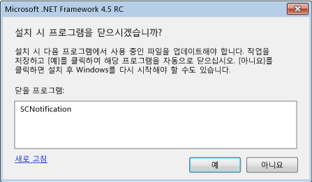

# .NET Framework 4.5를 설치하는 동안 시스템 다시 시작 줄이기
[!INCLUDE[net_v45](../../../includes/net-v45-md.md)] 설치 관리자는 설치 과정에서 가능할 때마다 시스템이 다시 시작되지 않도록 [다시 시작 관리자](http://go.microsoft.com/fwlink/?LinkId=231425)를 사용합니다. 앱 설치 프로그램이 .NET Framework를 설치하는 경우 이 기능을 활용하기 위해 다시 시작 관리자와 인터페이스할 수 있습니다. 자세한 내용은 [방법: .NET Framework 4.5 설치 관리자에서 진행률 가져오기](../../../docs/framework/deployment/how-to-get-progress-from-the-dotnet-installer.md)를 참조하세요.  
  
## 다시 시작하는 이유  
 [!INCLUDE[net_v45](../../../includes/net-v45-md.md)]를 설치하려면 설치 과정에서 .NET Framework 4 앱이 사용 중일 경우 시스템을 다시 시작해야 합니다. 이는 [!INCLUDE[net_v45](../../../includes/net-v45-md.md)]가 .NET Framework 4 파일을 대체하며, 설치 과정에서 해당 파일을 사용할 수 있어야 하기 때문입니다. 대부분의 경우 사용 중인 .NET Framework 4 앱을 미리 검색하고 닫으면 다시 시작을 방지할 수 있습니다. 그러나 일부 시스템 앱은 닫으면 안 됩니다. 이러한 경우 다시 시작을 피할 수 없습니다.  
  
## 최종 사용자 경험  
 [!INCLUDE[net_v45](../../../includes/net-v45-md.md)]를 전체 설치하는 최종 사용자에게는 설치 관리자가 사용 중인 .NET Framework 4 앱을 검색할 경우 시스템 다시 시작을 방지할 수 있는 기회가 제공됩니다. 메시지를 통해 실행 중인 모든 .NET Framework 4 앱이 나열되고, 설치 전에 이러한 앱을 닫을 수 있는 옵션이 제공됩니다. 사용자가 확인하면 설치 관리자가 해당 앱을 종료하며, 시스템이 다시 시작되지 않습니다. 사용자가 일정 기간 내에서 메시지에 응답하지 않으면 앱을 닫지 않고 설치가 계속됩니다.  
  
 다시 시작 관리자가 실행 중인 앱을 닫아도 시스템을 다시 시작해야 하는 상황을 검색할 경우에는 메시지가 표시되지 않습니다.  
  
   
사용 중인 .NET Framework 앱 닫기 확인 메시지  
  
## 연결된 설치 관리자 사용  
 앱과 함께 .NET Framework를 재배포하지만 사용자 고유의 설치 프로그램 및 UI를 사용하려면 설치 프로세스에 .NET Framework 설치 프로세스를 포함(연결)할 수 있습니다. 연결된 설치에 대한 자세한 내용은 [개발자를 위한 배포 가이드](../../../docs/framework/deployment/deployment-guide-for-developers.md)를 참조하세요. 연결된 설치에서 시스템 다시 시작을 줄이기 위해 .NET Framework 설치 관리자는 설치 프로그램에 닫을 앱 목록을 제공합니다. 설치 프로그램은 메시지 상자와 같은 사용자 인터페이스를 통해 이 정보를 사용자에게 제공하고, 사용자 응답을 받은 후 .NET Framework 설치 관리자에 다시 전달해야 합니다. 연결된 설치 관리자의 예는 [방법: .NET Framework 4.5 설치 관리자에서 진행률 가져오기](../../../docs/framework/deployment/how-to-get-progress-from-the-dotnet-installer.md) 문서를 참조하세요.  
  
 연결된 설치 관리자를 사용하지만 앱을 닫기 위한 고유한 메시지 상자를 제공하지 않으려면 .NET Framework 설치 프로세스를 연결할 때 명령줄에서 `/showrmui` 및 `/passive` 옵션을 사용할 수 있습니다. 이러한 옵션을 함께 사용하면 설치 관리자에서 시스템 다시 시작을 방지하기 위해 닫을 수 있는 경우 앱을 닫기 위한 메시지 상자를 표시합니다. 이 메시지 상자는 수동 모드에서도 전체 사용자 인터페이스에서와 동일하게 동작합니다. .NET Framework 재배포 가능 패키지에 대한 명령줄 옵션의 전체 집합은 [개발자를 위한 배포 가이드](../../../docs/framework/deployment/deployment-guide-for-developers.md)를 참조하세요.  
  
## 참고 항목  
 [배포](../../../docs/framework/deployment/index.md)  
 [개발자를 위한 배포 가이드](../../../docs/framework/deployment/deployment-guide-for-developers.md)  
 [방법: .NET Framework 4.5 설치 관리자에서 진행률 가져오기](../../../docs/framework/deployment/how-to-get-progress-from-the-dotnet-installer.md)
