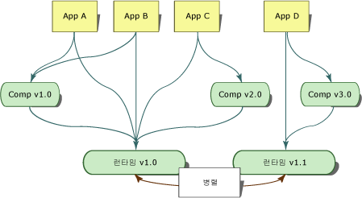

# <a name="side-by-side-execution-in-the-net-framework"></a><span data-ttu-id="43842-102">.NET Framework의 Side-by-Side 실행</span><span class="sxs-lookup"><span data-stu-id="43842-102">Side-by-Side Execution in the .NET Framework</span></span>
<span data-ttu-id="43842-103">Side-by-side 실행은 동일한 컴퓨터에서 여러 버전의 응용 프로그램 또는 구성 요소를 실행하는 기능입니다.</span><span class="sxs-lookup"><span data-stu-id="43842-103">Side-by-side execution is the ability to run multiple versions of an application or component on the same computer.</span></span> <span data-ttu-id="43842-104">동일한 컴퓨터에서 여러 버전의 공용 언어 런타임과, 하나의 런타임 버전을 사용하는 여러 버전의 응용 프로그램 및 구성 요소를 동시에 사용할 수 있습니다.</span><span class="sxs-lookup"><span data-stu-id="43842-104">You can have multiple versions of the common language runtime, and multiple versions of applications and components that use a version of the runtime, on the same computer at the same time.</span></span>  
  
 <span data-ttu-id="43842-105">다음 그림에서는 동일한 컴퓨터에서 두 가지 다른 버전의 런타임을 사용하는 여러 응용 프로그램을 보여 줍니다.</span><span class="sxs-lookup"><span data-stu-id="43842-105">The following illustration shows several applications using two different versions of the runtime on the same computer.</span></span> <span data-ttu-id="43842-106">응용 프로그램 A, B, C는 런타임 버전 1.0을 사용하지만 응용 프로그램 D는 런타임 버전 1.1을 사용합니다.</span><span class="sxs-lookup"><span data-stu-id="43842-106">Applications A, B, and C use runtime version 1.0, while application D uses runtime version 1.1.</span></span>  
  
 <span data-ttu-id="43842-107"></span><span class="sxs-lookup"><span data-stu-id="43842-107"></span></span>  
<span data-ttu-id="43842-108">두 가지 버전의 런타임에 대한 Side-by-Side 실행</span><span class="sxs-lookup"><span data-stu-id="43842-108">Side-by-side execution of two versions of the runtime</span></span>  
  
 <span data-ttu-id="43842-109">.NET Framework는 공용 언어 런타임과 API 형식이 포함된 어셈블리의 컬렉션으로 구성되어 있습니다.</span><span class="sxs-lookup"><span data-stu-id="43842-109">The .NET Framework consists of the common language runtime and a collection of assemblies that contain the API types.</span></span> <span data-ttu-id="43842-110">런타임과 .NET Framework 어셈블리의 버전은 별도로 관리됩니다.</span><span class="sxs-lookup"><span data-stu-id="43842-110">The runtime and the .NET Framework assemblies are versioned separately.</span></span> <span data-ttu-id="43842-111">예를 들어, 런타임 버전 4.0은 실제로 버전 4.0.319이며 .NET Framework 어셈블리 버전 1.0은 버전 1.0.3300.0입니다.</span><span class="sxs-lookup"><span data-stu-id="43842-111">For example, version 4.0 of the runtime is actually version 4.0.319, while version 1.0 of the .NET Framework assemblies is version 1.0.3300.0.</span></span>  
  
 <span data-ttu-id="43842-112">다음 그림에서는 동일한 컴퓨터에서 두 가지 다른 버전의 구성 요소를 사용하는 여러 응용 프로그램을 보여 줍니다.</span><span class="sxs-lookup"><span data-stu-id="43842-112">The following illustration shows several applications using two different versions of a component on the same computer.</span></span> <span data-ttu-id="43842-113">응용 프로그램 A와 B는 구성 요소 버전 1.0을 사용하지만 응용 프로그램 C는 동일한 구성 요소의 버전 2.0을 사용합니다.</span><span class="sxs-lookup"><span data-stu-id="43842-113">Application A and B use version 1.0 of the component while Application C uses version 2.0 of the same component.</span></span>  
  
 <span data-ttu-id="43842-114"></span><span class="sxs-lookup"><span data-stu-id="43842-114"></span></span>  
<span data-ttu-id="43842-115">두 가지 버전의 구성 요소에 대한 Side-by-Side 실행</span><span class="sxs-lookup"><span data-stu-id="43842-115">Side-by-side execution of two versions of a component</span></span>  
  
 <span data-ttu-id="43842-116">Side-by-Side 실행을 사용하면 응용 프로그램이 바인딩하는 구성 요소 버전과 응용 프로그램이 사용하는 런타임 버전을 보다 강력하게 제어할 수 있습니다.</span><span class="sxs-lookup"><span data-stu-id="43842-116">Side-by-side execution gives you more control over which versions of a component an application binds to, and more control over which version of the runtime an application uses.</span></span>  
  
## <a name="benefits-of-side-by-side-execution"></a><span data-ttu-id="43842-117">Side-by-Side 실행의 장점</span><span class="sxs-lookup"><span data-stu-id="43842-117">Benefits of Side-by-Side Execution</span></span>  
 <span data-ttu-id="43842-118">Windows XP 및 .NET Framework 이전에는 응용 프로그램이 동일한 코드의 호환되지 않는 여러 버전을 구분할 수 없었으므로 DLL 충돌이 발생했습니다.</span><span class="sxs-lookup"><span data-stu-id="43842-118">Prior to Windows XP and the .NET Framework, DLL conflicts occurred because applications were unable to distinguish between incompatible versions of the same code.</span></span> <span data-ttu-id="43842-119">DLL에 포함된 형식 정보는 파일 이름에만 바인딩되었습니다.</span><span class="sxs-lookup"><span data-stu-id="43842-119">Type information contained in a DLL was bound only to a file name.</span></span> <span data-ttu-id="43842-120">응용 프로그램은 DLL에 포함된 형식이 응용 프로그램을 빌드할 때 사용된 형식과 같은지를 알 수 없었습니다.</span><span class="sxs-lookup"><span data-stu-id="43842-120">An application had no way of knowing if the types contained in a DLL were the same types that the application was built with.</span></span> <span data-ttu-id="43842-121">따라서 새 버전의 구성 요소가 이전 버전을 덮어쓰고 응용 프로그램을 중단시킬 수 있었습니다.</span><span class="sxs-lookup"><span data-stu-id="43842-121">As a result, a new version of a component could overwrite an older version and break applications.</span></span>  
  
 <span data-ttu-id="43842-122">Side-by-Side 실행 및 .NET Framework는 DLL 충돌을 없애기 위한 다음과 같은 기능을 제공합니다.</span><span class="sxs-lookup"><span data-stu-id="43842-122">Side-by-side execution and the .NET Framework provide the following features to eliminate DLL conflicts:</span></span>  
  
-   <span data-ttu-id="43842-123">강력한 이름의 어셈블리</span><span class="sxs-lookup"><span data-stu-id="43842-123">Strong-named assemblies.</span></span>  
  
     <span data-ttu-id="43842-124">Side-by-Side 실행은 강력한 이름의 어셈블리를 사용하여 형식 정보를 특정 버전의 어셈블리에 바인딩합니다.</span><span class="sxs-lookup"><span data-stu-id="43842-124">Side-by-side execution uses strong-named assemblies to bind type information to a specific version of an assembly.</span></span> <span data-ttu-id="43842-125">이렇게 하면 응용 프로그램이나 구성 요소가 잘못된 버전의 어셈블리에 바인딩되지 않도록 할 수 있습니다.</span><span class="sxs-lookup"><span data-stu-id="43842-125">This prevents an application or component from binding to an invalid version of an assembly.</span></span> <span data-ttu-id="43842-126">또한, 강력한 이름의 어셈블리를 사용하면 동일한 컴퓨터에 여러 버전의 파일이 함께 있을 수 있으며 응용 프로그램에서 이러한 파일을 사용할 수 있습니다.</span><span class="sxs-lookup"><span data-stu-id="43842-126">Strong-named assemblies also allow multiple versions of a file to exist on the same computer and to be used by applications.</span></span> <span data-ttu-id="43842-127">자세한 내용은 [강력한 이름의 어셈블리](../../../docs/framework/app-domains/strong-named-assemblies.md)를 참조하세요.</span><span class="sxs-lookup"><span data-stu-id="43842-127">For more information, see [Strong-Named Assemblies](../../../docs/framework/app-domains/strong-named-assemblies.md).</span></span>  
  
-   <span data-ttu-id="43842-128">버전 인식 코드 저장소</span><span class="sxs-lookup"><span data-stu-id="43842-128">Version-aware code storage.</span></span>  
  
     <span data-ttu-id="43842-129">.NET Framework에서는 전역 어셈블리 캐시에 버전 인식 코드 저장소를 제공합니다.</span><span class="sxs-lookup"><span data-stu-id="43842-129">The .NET Framework provides version-aware code storage in the global assembly cache.</span></span> <span data-ttu-id="43842-130">전역 어셈블리 캐시는 .NET Framework가 설치된 모든 컴퓨터에 있는 컴퓨터 수준의 코드 캐시입니다.</span><span class="sxs-lookup"><span data-stu-id="43842-130">The global assembly cache is a computer-wide code cache present on all computers with the .NET Framework installed.</span></span> <span data-ttu-id="43842-131">이 캐시는 버전, 문화권 및 게시자 정보에 따라 어셈블리를 저장하며 여러 버전의 구성 요소와 응용 프로그램을 지원합니다.</span><span class="sxs-lookup"><span data-stu-id="43842-131">It stores assemblies based on version, culture, and publisher information, and supports multiple versions of components and applications.</span></span> <span data-ttu-id="43842-132">자세한 내용은 [전역 어셈블리 캐시](../../../docs/framework/app-domains/gac.md)를 참조하세요.</span><span class="sxs-lookup"><span data-stu-id="43842-132">For more information, see [Global Assembly Cache](../../../docs/framework/app-domains/gac.md).</span></span>  
  
-   <span data-ttu-id="43842-133">격리.</span><span class="sxs-lookup"><span data-stu-id="43842-133">Isolation.</span></span>  
  
     <span data-ttu-id="43842-134">.NET Framework를 사용하면 격리 상태로 실행되는 응용 프로그램과 구성 요소를 만들 수 있습니다.</span><span class="sxs-lookup"><span data-stu-id="43842-134">Using the .NET Framework, you can create applications and components that execute in isolation.</span></span> <span data-ttu-id="43842-135">이러한 격리성은 Side-by-Side 실행의 필수 요소입니다.</span><span class="sxs-lookup"><span data-stu-id="43842-135">Isolation is an essential component of side-by-side execution.</span></span> <span data-ttu-id="43842-136">격리성을 통해 사용 중인 리소스를 인식하고 여러 버전의 응용 프로그램 또는 구성 요소 간에 리소스를 안전하게 공유할 수 있습니다.</span><span class="sxs-lookup"><span data-stu-id="43842-136">It involves being aware of the resources you are using and sharing resources with confidence among multiple versions of an application or component.</span></span> <span data-ttu-id="43842-137">또한 버전 고유의 방식으로 파일이 저장됩니다.</span><span class="sxs-lookup"><span data-stu-id="43842-137">Isolation also includes storing files in a version-specific way.</span></span> <span data-ttu-id="43842-138">격리에 대한 자세한 내용은 [Side-by-Side 실행용 구성 요소를 만들기 위한 지침](../../../docs/framework/deployment/guidelines-for-creating-components-for-side-by-side-execution.md)을 참조하세요.</span><span class="sxs-lookup"><span data-stu-id="43842-138">For more information about isolation, see [Guidelines for Creating Components for Side-by-Side Execution](../../../docs/framework/deployment/guidelines-for-creating-components-for-side-by-side-execution.md).</span></span>  
  
## <a name="version-compatibility"></a><span data-ttu-id="43842-139">버전 호환성</span><span class="sxs-lookup"><span data-stu-id="43842-139">Version Compatibility</span></span>  
 <span data-ttu-id="43842-140">.NET Framework 버전 1.0과 1.1은 서로 호환되도록 디자인되었습니다.</span><span class="sxs-lookup"><span data-stu-id="43842-140">Versions 1.0 and 1.1 of the .NET Framework are designed to be compatible with one another.</span></span> <span data-ttu-id="43842-141">.NET Framework 버전 1.0으로 빌드한 응용 프로그램을 버전 1.1에서 실행하거나 .NET Framework 버전 1.1로 빌드한 응용 프로그램을 버전 1.0에서 실행할 수 있습니다.</span><span class="sxs-lookup"><span data-stu-id="43842-141">An application built with the .NET Framework version 1.0 should run on version 1.1, and an application built with the .NET Framework version 1.1 should run on version 1.0.</span></span> <span data-ttu-id="43842-142">그러나 .NET Framework 버전 1.1에 추가된 API 기능은 .NET Framework 버전 1.0에서 작동되지 않습니다.</span><span class="sxs-lookup"><span data-stu-id="43842-142">Note, however, that API features added in version 1.1 of the .NET Framework will not work with version 1.0 of the .NET Framework.</span></span> <span data-ttu-id="43842-143">버전 2.0에서 만든 응용 프로그램은 버전 2.0에서만 실행됩니다.</span><span class="sxs-lookup"><span data-stu-id="43842-143">Applications created with version 2.0 will run on version 2.0 only.</span></span> <span data-ttu-id="43842-144">버전 2.0 응용 프로그램은 버전 1.1 이하에서 실행되지 않습니다.</span><span class="sxs-lookup"><span data-stu-id="43842-144">Version 2.0 applications will not run on version 1.1 or earlier.</span></span>  
  
 <span data-ttu-id="43842-145">.NET Framework 버전은 런타임과 관련 .NET Framework 어셈블리로 구성되는 하나의 단위로 취급됩니다. 이러한 개념을 어셈블리 통합이라고 합니다.</span><span class="sxs-lookup"><span data-stu-id="43842-145">Versions of the .NET Framework are treated as a single unit consisting of the runtime and its associated .NET Framework assemblies (a concept referred to as assembly unification).</span></span> <span data-ttu-id="43842-146">다른 버전의 .NET Framework 어셈블리를 포함하도록 어셈블리 바인딩을 리디렉션할 수 있지만 기본 어셈블리 바인딩을 재정의하는 것은 위험할 수 있으며 배포 전에 엄격한 테스트 과정이 필요합니다.</span><span class="sxs-lookup"><span data-stu-id="43842-146">You can redirect assembly binding to include other versions of the .NET Framework assemblies, but overriding the default assembly binding can be risky and must be rigorously tested before deployment.</span></span>  
  
## <a name="locating-runtime-version-information"></a><span data-ttu-id="43842-147">런타임 버전 정보 찾기</span><span class="sxs-lookup"><span data-stu-id="43842-147">Locating Runtime Version Information</span></span>  
 <span data-ttu-id="43842-148">응용 프로그램 또는 구성 요소가 컴파일된 런타임 버전 및 응용 프로그램을 실행하는 데 필요한 런타임 버전에 대한 정보는 두 위치에 저장됩니다.</span><span class="sxs-lookup"><span data-stu-id="43842-148">Information on which runtime version an application or component was compiled with and which versions of the runtime the application requires to run are stored in two locations.</span></span> <span data-ttu-id="43842-149">응용 프로그램 또는 구성 요소를 컴파일하면 컴파일에 사용된 런타임 버전에 대한 정보가 관리되는 실행 파일에 저장됩니다.</span><span class="sxs-lookup"><span data-stu-id="43842-149">When an application or component is compiled, information on the runtime version used to compile it is stored in the managed executable.</span></span> <span data-ttu-id="43842-150">응용 프로그램 또는 구성 요소에 필요한 런타임 버전에 대한 정보는 응용 프로그램 구성 파일에 저장됩니다.</span><span class="sxs-lookup"><span data-stu-id="43842-150">Information on the runtime versions the application or component requires is stored in the application configuration file.</span></span>  
  
### <a name="runtime-version-information-in-the-managed-executable"></a><span data-ttu-id="43842-151">관리되는 실행 파일의 런타임 버전 정보</span><span class="sxs-lookup"><span data-stu-id="43842-151">Runtime Version Information in the Managed Executable</span></span>  
 <span data-ttu-id="43842-152">각 관리되는 응용 프로그램과 구성 요소의 PE(이식 가능한 실행) 파일 헤더에는 빌드 시 사용된 런타임 버전에 대한 정보가 포함됩니다.</span><span class="sxs-lookup"><span data-stu-id="43842-152">The portable executable (PE) file header of each managed application and component contains information about the runtime version it was built with.</span></span> <span data-ttu-id="43842-153">공용 언어 런타임은 이 정보를 사용하여 응용 프로그램을 실행하는 데 필요할 가능성이 가장 큰 런타임 버전을 확인합니다.</span><span class="sxs-lookup"><span data-stu-id="43842-153">The common language runtime uses this information to determine the most likely version of the runtime the application needs to run.</span></span>  
  
### <a name="runtime-version-information-in-the-application-configuration-file"></a><span data-ttu-id="43842-154">응용 프로그램 구성 파일의 런타임 버전 정보</span><span class="sxs-lookup"><span data-stu-id="43842-154">Runtime Version Information in the Application Configuration File</span></span>  
 <span data-ttu-id="43842-155">PE 파일 헤더의 정보 외에도 런타임 버전 정보를 제공하는 응용 프로그램 구성 파일을 사용하여 응용 프로그램을 배포할 수 있습니다.</span><span class="sxs-lookup"><span data-stu-id="43842-155">In addition to the information in the PE file header, an application can be deployed with an application configuration file that provides runtime version information.</span></span> <span data-ttu-id="43842-156">응용 프로그램 구성 파일은 응용 프로그램과 함께 제공되는, 응용 프로그램 개발자가 만든 XML 기반 파일입니다.</span><span class="sxs-lookup"><span data-stu-id="43842-156">The application configuration file is an XML-based file that is created by the application developer and that ships with an application.</span></span> <span data-ttu-id="43842-157">[\<startup> 섹션](../../../docs/framework/configure-apps/file-schema/startup/startup-element.md)의 [\<requiredRuntime> 요소](../../../docs/framework/configure-apps/file-schema/startup/requiredruntime-element.md)(이 파일에 있는 경우)는 응용 프로그램이 지원하는 구성 요소 버전 및 런타임 버전을 지정합니다.</span><span class="sxs-lookup"><span data-stu-id="43842-157">The [\<requiredRuntime> Element](../../../docs/framework/configure-apps/file-schema/startup/requiredruntime-element.md) of the [\<startup> section](../../../docs/framework/configure-apps/file-schema/startup/startup-element.md), if it is present in this file, specifies which versions of the runtime and which versions of a component the application supports.</span></span> <span data-ttu-id="43842-158">다양한 런타임 버전과 응용 프로그램 간의 호환성을 테스트하는 데 이 파일을 사용할 수도 있습니다.</span><span class="sxs-lookup"><span data-stu-id="43842-158">You can also use this file in testing to test an application's compatibility with different versions of the runtime.</span></span>  
  
 <span data-ttu-id="43842-159">COM 및 COM + 응용 프로그램을 비롯한 비관리 코드에는 런타임에서 관리 코드와 상호 작용하는 데 사용하는 응용 프로그램 구성 파일이 포함될 수 있습니다.</span><span class="sxs-lookup"><span data-stu-id="43842-159">Unmanaged code, including COM and COM+ applications, can have application configuration files that the runtime uses for interacting with managed code.</span></span> <span data-ttu-id="43842-160">응용 프로그램 구성 파일은 COM을 통해 활성화하는 모든 관리 코드에 영향을 줍니다.</span><span class="sxs-lookup"><span data-stu-id="43842-160">The application configuration file affects any managed code that you activate through COM.</span></span> <span data-ttu-id="43842-161">파일에서 지원하는 런타임 버전 및 어셈블리 리디렉션을 지정할 수 있습니다.</span><span class="sxs-lookup"><span data-stu-id="43842-161">The file can specify which runtime versions it supports, as well as assembly redirects.</span></span> <span data-ttu-id="43842-162">기본적으로 관리 코드를 호출하는 COM interop 응용 프로그램은 컴퓨터에 설치된 최신 버전의 런타임을 사용합니다.</span><span class="sxs-lookup"><span data-stu-id="43842-162">By default, COM interop applications calling to managed code use the latest version of the runtime installed on the computer.</span></span>  
  
 <span data-ttu-id="43842-163">응용 프로그램 구성 파일에 대한 자세한 내용은 [앱 구성](../../../docs/framework/configure-apps/index.md)을 참조하세요.</span><span class="sxs-lookup"><span data-stu-id="43842-163">For more information about the application configuration files, see [Configuring Apps](../../../docs/framework/configure-apps/index.md).</span></span>  
  
## <a name="determining-which-version-of-the-runtime-to-load"></a><span data-ttu-id="43842-164">로드할 런타임 버전 결정</span><span class="sxs-lookup"><span data-stu-id="43842-164">Determining Which Version of the Runtime to Load</span></span>  
 <span data-ttu-id="43842-165">공용 언어 런타임은 다음 정보를 사용하여 응용 프로그램을 위해 로드할 런타임 버전을 확인합니다.</span><span class="sxs-lookup"><span data-stu-id="43842-165">The common language runtime uses the following information to determine which version of the runtime to load for an application:</span></span>  
  
-   <span data-ttu-id="43842-166">사용할 수 있는 런타임 버전</span><span class="sxs-lookup"><span data-stu-id="43842-166">The runtime versions that are available.</span></span>  
  
-   <span data-ttu-id="43842-167">응용 프로그램에서 지원하는 런타임 버전</span><span class="sxs-lookup"><span data-stu-id="43842-167">The runtime versions that an application supports.</span></span>  
  
### <a name="supported-runtime-versions"></a><span data-ttu-id="43842-168">지원되는 런타임 버전</span><span class="sxs-lookup"><span data-stu-id="43842-168">Supported Runtime Versions</span></span>  
 <span data-ttu-id="43842-169">런타임은 응용 프로그램 구성 파일 및 PE(이식 가능한 실행 ) 파일 헤더를 사용하여 응용 프로그램이 지원하는 런타임 버전을 확인합니다.</span><span class="sxs-lookup"><span data-stu-id="43842-169">The runtime uses the application configuration file and the portable executable (PE) file header to determine which version of the runtime an application supports.</span></span> <span data-ttu-id="43842-170">응용 프로그램 구성 파일이 없으면 런타임은 해당 버전을 사용할 수 있는 경우 응용 프로그램의 PE 파일 헤더에 지정된 런타임 버전을 로드합니다.</span><span class="sxs-lookup"><span data-stu-id="43842-170">If no application configuration file is present, the runtime loads the runtime version specified in the application's PE file header, if that version is available.</span></span>  
  
 <span data-ttu-id="43842-171">응용 프로그램 구성 파일이 있으면 런타임은 다음 프로세스의 결과에 따라 로드할 적절한 런타임 버전을 결정합니다.</span><span class="sxs-lookup"><span data-stu-id="43842-171">If an application configuration file is present, the runtime determines the appropriate runtime version to load based on the results of the following process:</span></span>  
  
1.  <span data-ttu-id="43842-172">런타임이 응용 프로그램 구성 파일에서 [\<supportedRuntime>](../../../docs/framework/configure-apps/file-schema/startup/supportedruntime-element.md) 요소를 검사합니다.</span><span class="sxs-lookup"><span data-stu-id="43842-172">The runtime examines the [\<supportedRuntime> Element](../../../docs/framework/configure-apps/file-schema/startup/supportedruntime-element.md) element in the application configuration file.</span></span> <span data-ttu-id="43842-173">**\<supportedRuntime>** 요소에 지정되어 있는 지원되는 런타임 버전이 하나 이상 있으면 런타임은 첫 번째 **\<supportedRuntime>** 요소에서 지정하는 런타임 버전을 로드합니다.</span><span class="sxs-lookup"><span data-stu-id="43842-173">If one or more of the supported runtime versions specified in the **\<supportedRuntime>** element are present, the runtime loads the runtime version specified by the first **\<supportedRuntime>** element.</span></span> <span data-ttu-id="43842-174">이 버전을 사용할 수 없으면 런타임은 다음 **\<supportedRuntime>** 요소를 확인하고 지정된 런타임 버전을 로드하려고 시도합니다.</span><span class="sxs-lookup"><span data-stu-id="43842-174">If this version is not available, the runtime examines the next **\<supportedRuntime>** element and attempts to load the runtime version specified.</span></span> <span data-ttu-id="43842-175">이 런타임 버전을 사용할 수 없으면 그다음 **\<supportedRuntime>** 요소를 확인합니다.</span><span class="sxs-lookup"><span data-stu-id="43842-175">If this runtime version is not available, subsequent **\<supportedRuntime>** elements are examined.</span></span> <span data-ttu-id="43842-176">지원되는 런타임 버전을 사용할 수 없으면 런타임에서 런타임 버전을 로드하지 못하고 사용자에게 메시지를 표시합니다(3단계 참조).</span><span class="sxs-lookup"><span data-stu-id="43842-176">If none of the supported runtime versions are available, the runtime fails to load a runtime version and displays a message to the user (see step 3).</span></span>  
  
2.  <span data-ttu-id="43842-177">런타임이 응용 프로그램 실행 파일의 PE 파일 헤더를 읽습니다.</span><span class="sxs-lookup"><span data-stu-id="43842-177">The runtime reads the PE file header of the application's executable file.</span></span> <span data-ttu-id="43842-178">PE 파일 헤더에 지정된 런타임 버전을 사용할 수 있으면 런타임에서 해당 버전을 로드합니다.</span><span class="sxs-lookup"><span data-stu-id="43842-178">If the runtime version specified by the PE file header is available, the runtime loads that version.</span></span> <span data-ttu-id="43842-179">지정된 런타임 버전을 사용할 수 없으면 런타임이 Microsoft에서 PE 헤더의 런타임 버전과 호환되는 것으로 확인된 런타임 버전을 검색합니다.</span><span class="sxs-lookup"><span data-stu-id="43842-179">If the runtime version specified is not available, the runtime searches for a runtime version determined by Microsoft to be compatible with the runtime version in the PE header.</span></span> <span data-ttu-id="43842-180">해당 버전이 없으면 프로세스가 3단계로 넘어갑니다.</span><span class="sxs-lookup"><span data-stu-id="43842-180">If that version is not found, the process continues to step 3.</span></span>  
  
3.  <span data-ttu-id="43842-181">런타임이 응용 프로그램에서 지원하는 런타임 버전을 사용할 수 없다는 메시지를 표시합니다.</span><span class="sxs-lookup"><span data-stu-id="43842-181">The runtime displays a message stating that the runtime version supported by the application is unavailable.</span></span> <span data-ttu-id="43842-182">런타임이 로드되지 않습니다.</span><span class="sxs-lookup"><span data-stu-id="43842-182">The runtime is not loaded.</span></span>  
  
    > [!NOTE]
    >  <span data-ttu-id="43842-183">HKLM\Software\Microsoft\\.NETFramework 레지스트리 키 아래에 있는 NoGuiFromShim 값을 사용하거나 COMPLUS_NoGuiFromShim 환경 변수를 사용하여 이 메시지가 표시되지 않도록 할 수 있습니다.</span><span class="sxs-lookup"><span data-stu-id="43842-183">You can suppress the display of this message by using the NoGuiFromShim value under the registry key HKLM\Software\Microsoft\\.NETFramework or using the environment variable COMPLUS_NoGuiFromShim.</span></span> <span data-ttu-id="43842-184">예를 들어 무인 설치 또는 Windows 서비스와 같이 일반적으로 사용자와 상호 작용하지 않는 응용 프로그램에 대한 메시지가 표시되지 않도록 할 수 있습니다.</span><span class="sxs-lookup"><span data-stu-id="43842-184">For example, you can suppress the message for applications that do not typically interact with the user, such as unattended installations or Windows services.</span></span> <span data-ttu-id="43842-185">이 메시지가 표시되지 않도록 설정된 경우 런타임은 이벤트 로그에 메시지를 씁니다.</span><span class="sxs-lookup"><span data-stu-id="43842-185">When this message display is suppressed, the runtime writes a message to the event log.</span></span>  <span data-ttu-id="43842-186">컴퓨터의 모든 응용 프로그램에 대해 이 메시지가 표시되지 않게 하려면 NoGuiFromShim 레지스트리 값을 1로 설정합니다.</span><span class="sxs-lookup"><span data-stu-id="43842-186">Set the registry value NoGuiFromShim to 1 to suppress this message for all applications on a computer.</span></span> <span data-ttu-id="43842-187">또는 특정 사용자 컨텍스트에서 실행되는 응용 프로그램에 대해 메시지가 표시되지 않게 하려면 COMPLUS_NoGuiFromShim 환경 변수를 1로 설정합니다.</span><span class="sxs-lookup"><span data-stu-id="43842-187">Alternately, set the COMPLUS_NoGuiFromShim environment variable to 1 to suppress the message for applications running in a particular user context.</span></span>  
  
> [!NOTE]
>  <span data-ttu-id="43842-188">런타임 버전이 로드된 후 어셈블리 바인딩 리디렉션에서 다른 버전의 개별 .NET Framework 어셈블리가 로드되도록 지정할 수 있습니다.</span><span class="sxs-lookup"><span data-stu-id="43842-188">After a runtime version is loaded, assembly binding redirects can specify that a different version of an individual .NET Framework assembly be loaded.</span></span> <span data-ttu-id="43842-189">이러한 바인딩 리디렉션은 리디렉션되는 특정 어셈블리에만 영향을 줍니다.</span><span class="sxs-lookup"><span data-stu-id="43842-189">These binding redirects affect only the specific assembly that is redirected.</span></span>  
  
## <a name="partially-qualified-assembly-names-and-side-by-side-execution"></a><span data-ttu-id="43842-190">부분적으로 정규화된 어셈블리 이름 및 Side-by-Side 실행</span><span class="sxs-lookup"><span data-stu-id="43842-190">Partially Qualified Assembly Names and Side-by-Side Execution</span></span>  
 <span data-ttu-id="43842-191">Side-by-Side 문제의 잠재적 소스이므로 부분적으로 정규화된 어셈블리 참조는 응용 프로그램 디렉터리 내의 어셈블리에 바인딩하는 데만 사용할 수 있습니다.</span><span class="sxs-lookup"><span data-stu-id="43842-191">Because they are a potential source of side-by-side problems, partially qualified assembly references can be used only to bind to assemblies within an application directory.</span></span> <span data-ttu-id="43842-192">부분적으로 정규화된 어셈블리 참조를 코드에서 사용하지 마세요.</span><span class="sxs-lookup"><span data-stu-id="43842-192">Avoid partially qualified assembly references in your code.</span></span>  
  
 <span data-ttu-id="43842-193">코드에서 부분적으로 정규화된 어셈블리 참조를 줄이려면 응용 프로그램 구성 파일에서 [\<qualifyAssembly>](../../../docs/framework/configure-apps/file-schema/runtime/qualifyassembly-element.md) 요소를 사용하여 코드에 나타나는 부분적으로 정규화된 어셈블리 참조를 완전히 정규화할 수 있습니다.</span><span class="sxs-lookup"><span data-stu-id="43842-193">To mitigate partially qualified assembly references in code, you can use the [\<qualifyAssembly>](../../../docs/framework/configure-apps/file-schema/runtime/qualifyassembly-element.md) element in an application configuration file to fully qualify partially qualified assembly references that occur in code.</span></span> <span data-ttu-id="43842-194">**\<qualifyAssembly>** 요소를 사용하여 부분 참조에 설정되지 않은 필드만 지정합니다.</span><span class="sxs-lookup"><span data-stu-id="43842-194">Use the **\<qualifyAssembly>** element to specify only fields that were not set in the partial reference.</span></span> <span data-ttu-id="43842-195">**fullName** 특성에 나열된 어셈블리 ID는 어셈블리 이름을 정규화하는 데 필요한 모든 정보, 즉 어셈블리 이름, 공개 키, 문화권 및 버전을 포함해야 합니다.</span><span class="sxs-lookup"><span data-stu-id="43842-195">The assembly identity listed in the **fullName** attribute must contain all the information needed to fully qualify the assembly name: assembly name, public key, culture, and version.</span></span>  
  
 <span data-ttu-id="43842-196">다음 예제에서는 `myAssembly`라는 어셈블리를 정규화하는 응용 프로그램 구성 파일 항목을 보여 줍니다.</span><span class="sxs-lookup"><span data-stu-id="43842-196">The following example shows the application configuration file entry to fully qualify an assembly called `myAssembly`.</span></span>  
  
```xml  
<assemblyBinding xmlns="urn:schemas-microsoft-com:asm.v1">   
<qualifyAssembly partialName="myAssembly"   
fullName="myAssembly,  
      version=1.0.0.0,   
publicKeyToken=...,   
      culture=neutral"/>   
</assemblyBinding>   
```  
  
 <span data-ttu-id="43842-197">어셈블리 로드 문이 `myAssembly`를 참조할 때마다 이러한 구성 파일 설정으로 인해 런타임이 부분적으로 정규화된 `myAssembly` 참조를 정규화된 참조로 자동으로 변환합니다.</span><span class="sxs-lookup"><span data-stu-id="43842-197">Whenever an assembly load statement references `myAssembly`, these configuration file settings cause the runtime to automatically translate the partially qualified `myAssembly` reference to a fully qualified reference.</span></span> <span data-ttu-id="43842-198">예를들어 Assembly.Load("myAssembly")가 Assembly.Load("myAssembly, version=1.0.0.0, publicKeyToken=..., culture=neutral")이 됩니다.</span><span class="sxs-lookup"><span data-stu-id="43842-198">For example, Assembly.Load("myAssembly") becomes Assembly.Load("myAssembly, version=1.0.0.0, publicKeyToken=..., culture=neutral").</span></span>  
  
> [!NOTE]
>  <span data-ttu-id="43842-199">**LoadWithPartialName** 메서드를 사용하여 부분적으로 참조된 어셈블리가 전역 어셈블리 캐시에서 로드되지 않도록 하는 공용 언어 런타임 제한을 건너뛸 수 있습니다.</span><span class="sxs-lookup"><span data-stu-id="43842-199">You can use the **LoadWithPartialName** method to bypass the common language runtime restriction that prohibits partially referenced assemblies from being loaded from the global assembly cache.</span></span> <span data-ttu-id="43842-200">이 메서드는 Side-by-Side 실행에서 쉽게 문제를 발생시킬 수 있으므로 원격 시나리오에서만 사용해야 합니다.</span><span class="sxs-lookup"><span data-stu-id="43842-200">This method should be used only in remoting scenarios as it can easily cause problems in side-by-side execution.</span></span>  
  
## <a name="related-topics"></a><span data-ttu-id="43842-201">관련 항목</span><span class="sxs-lookup"><span data-stu-id="43842-201">Related Topics</span></span>  
  
|<span data-ttu-id="43842-202">제목</span><span class="sxs-lookup"><span data-stu-id="43842-202">Title</span></span>|<span data-ttu-id="43842-203">설명</span><span class="sxs-lookup"><span data-stu-id="43842-203">Description</span></span>|  
|-----------|-----------------|  
|[<span data-ttu-id="43842-204">방법: 자동 바인딩 리디렉션 사용 설정 및 해제</span><span class="sxs-lookup"><span data-stu-id="43842-204">How to: Enable and Disable Automatic Binding Redirection</span></span>](../../../docs/framework/configure-apps/how-to-enable-and-disable-automatic-binding-redirection.md)|<span data-ttu-id="43842-205">특정 버전의 어셈블리에 응용 프로그램을 바인딩하는 방법에 대해 설명합니다.</span><span class="sxs-lookup"><span data-stu-id="43842-205">Describes how to bind an application to a specific version of an assembly.</span></span>|  
|[<span data-ttu-id="43842-206">어셈블리 바인딩 리디렉션 구성</span><span class="sxs-lookup"><span data-stu-id="43842-206">Configuring Assembly Binding Redirection</span></span>](../../../docs/framework/deployment/configuring-assembly-binding-redirection.md)|<span data-ttu-id="43842-207">.NET Framework 어셈블리의 특정 버전에 대한 어셈블리 바인딩 참조를 리디렉션하는 방법을 설명합니다.</span><span class="sxs-lookup"><span data-stu-id="43842-207">Explains how to redirect assembly binding references to a specific version of the .NET Framework assemblies.</span></span>|  
|[<span data-ttu-id="43842-208">In-Process Side-by-Side 실행</span><span class="sxs-lookup"><span data-stu-id="43842-208">In-Process Side-by-Side Execution</span></span>](../../../docs/framework/deployment/in-process-side-by-side-execution.md)|<span data-ttu-id="43842-209">In-Process Side-by-Side 런타임 호스트 활성화를 사용하여 단일 프로세스에서 여러 버전의 CLR을 실행하는 방법을 설명합니다.</span><span class="sxs-lookup"><span data-stu-id="43842-209">Discusses how you can use in-process side-by-side runtime host activation to run multiple versions of the CLR in a single process.</span></span>|  
|[<span data-ttu-id="43842-210">공용 언어 런타임의 어셈블리</span><span class="sxs-lookup"><span data-stu-id="43842-210">Assemblies in the Common Language Runtime</span></span>](../../../docs/framework/app-domains/assemblies-in-the-common-language-runtime.md)|<span data-ttu-id="43842-211">어셈블리에 대해 개념적으로 설명합니다.</span><span class="sxs-lookup"><span data-stu-id="43842-211">Provides a conceptual overview of assemblies.</span></span>|  
|[<span data-ttu-id="43842-212">응용 프로그램 도메인</span><span class="sxs-lookup"><span data-stu-id="43842-212">Application Domains</span></span>](../../../docs/framework/app-domains/application-domains.md)|<span data-ttu-id="43842-213">응용 프로그램 도메인에 대해 개념적으로 설명합니다.</span><span class="sxs-lookup"><span data-stu-id="43842-213">Provides a conceptual overview of application domains.</span></span>|  
  
## <a name="reference"></a><span data-ttu-id="43842-214">참조</span><span class="sxs-lookup"><span data-stu-id="43842-214">Reference</span></span>  
 [<span data-ttu-id="43842-215">\<supportedRuntime> 요소</span><span class="sxs-lookup"><span data-stu-id="43842-215">\<supportedRuntime> Element</span></span>](../../../docs/framework/configure-apps/file-schema/startup/supportedruntime-element.md)
