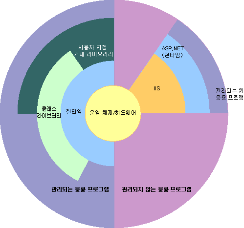

# .NET Framework의 개요

.NET Framework는 차세대 앱 및 XML 웹 서비스의 빌드 및 실행을 지원하는 기술입니다. .NET Framework는 다음과 같은 목적을 달성하기 위해 디자인되었습니다.

- 개체 코드가 로컬로 저장 및 실행되든, 로컬로 실행되지만 인터넷을 통해 분산되든, 원격으로 실행되든 상관 없이 일관된 개체 지향 프로그래밍 환경을 제공합니다.

- 소프트웨어 배포 및 버전 관리 충돌을 최소화하는 코드 실행 환경을 제공합니다.

- 알 수 없거나 일부 신뢰할 수 있는 타사에서 만든 코드를 포함하여 안전하게 코드를 실행할 수 있는 코드 실행 환경을 제공합니다.

- 스크립트 또는 해석 환경의 성능 문제를 제거하는 코드 실행 환경을 제공합니다.

- Windows 기반 앱 및 웹 기반 앱 같은 다양한 형식의 앱에서 개발자가 일관된 경험을 가질 수 있도록 합니다.

- .NET Framework를 기반으로 하는 코드가 다른 모든 코드와 통합되도록 모든 통신을 산업 표준을 토대로 빌드합니다.

> [!NOTE]
> 사용자와 개발자 모두를 위한 .NET Framework에 대한 일반적인 소개는 [시작](../../../docs/framework/get-started/index.md)을 참조하십시오.

.NET Framework는 CLR(공용 언어 런타임)과 .NET Framework 클래스 라이브러리로 구성되어 있습니다. 공용 언어 런타임은 .NET Framework의 기초입니다. 런타임은 실행 시 코드를 관리하는 에이전트로서, 메모리 관리, 스레드 관리, 원격 서비스 등의 핵심 서비스를 제공하며 동시에 엄격한 형식 안전성 및 다른 형태의 코드 정확성을 유지하므로 보안과 안정성을 강화합니다. 사실, 코드 관리의 개념은 런타임의 기본 원칙입니다. 런타임을 대상으로 하는 코드는 관리 코드라고 하지만, 런타임을 대상으로 하지 않는 코드는 비관리 코드라고 합니다. 클래스 라이브러리는 재사용 가능 형식의 포괄적 개체 지향 컬렉션으로, 기존 명령줄 또는 GUI(그래픽 사용자 인터페이스) 앱에서 ASP.NET이 제공하는 Web Forms 및 XML Web services 같은 최신의 혁신적인 기능을 기반으로 하는 앱에 이르기까지 다양한 앱을 개발하는 데 사용할 수 있습니다.

.NET Framework는 공용 언어 런타임을 해당 프로세스로 로드하고 관리 코드의 실행을 시작하는 관리되지 않는 구성 요소에 의해 호스팅되므로, 관리되는 기능과 관리되지 않는 기능을 모두 사용하는 소프트웨어 환경을 만들 수 있습니다. .NET Framework에서는 몇 가지 런타임 호스트를 제공할 뿐만 아니라 타사 런타임 호스트의 개발도 지원합니다.

예를 들어, ASP.NET에서는 런타임을 호스팅하여 관리 코드에 대해 확장 가능한 서버 쪽 환경을 제공합니다. ASP.NET은 런타임과 함께 직접 작동하여 ASP.NET 앱 및 XML Web services를 활성화합니다. 이 둘에 대한 내용은 이 항목의 뒷부분에서 설명합니다.

Internet Explorer는 MIME 형식 확장의 형식으로 런타임을 호스트하는 관리되지 않는 앱의 예입니다. Internet Explorer를 사용하여 런타임을 호스팅하면 HTML 문서에 관리되는 구성 요소 또는 Windows Forms 컨트롤을 포함시킬 수 있습니다. 이러한 방식으로 런타임을 호스트하면 관리되는 모바일 코드를 사용할 수 있게 되며, 관리 코드에서만 제공하는 부분 신뢰 실행 및 격리된 파일 저장소 등의 획기적으로 향상된 기능도 사용할 수 있습니다.

다음 그림에서는 앱 및 전체 시스템에 대한 공용 언어 런타임과 클래스 라이브러리의 관계를 보여 줍니다. 이 그림에서는 관리 코드가 보다 큰 아키텍처에서 작동하는 방식도 보여 줍니다.

 컨텍스트에 있는 .NET Framework

다음 섹션에서는 .NET Framework의 기본 기능에 대해 보다 자세히 설명합니다.

## 공용 언어 런타임의 기능

공용 언어 런타임에서는 메모리, 스레드 실행, 코드 실행, 코드 안전성 확인, 컴파일 및 기타 시스템 서비스를 관리합니다. 이러한 기능은 공용 언어 런타임에서 실행되는 관리 코드의 기본 기능입니다.

보안과 관련하여 관리되는 구성 요소에는 인터넷, 기업 네트워크 및 로컬 컴퓨터 등 해당 출처를 비롯한 여러 요소에 따라 다양한 신뢰도가 부여됩니다. 이는 관리되는 구성 요소가 동일한 활성 앱에 사용되는 경우에도 파일 액세스 작업, 레지스트리 액세스 작업 또는 기타 중요한 기능을 수행할 수 있을 수도 있고 수행할 수 없을 수도 있음을 의미합니다.

또한 런타임에서는 CTS(공용 형식 시스템)라고 하는 엄격한 형식 및 코드 확인 인프라를 구현하여 코드 견고성을 유지합니다. CTS는 모든 관리 코드가 자체 설명 방식이 되도록 합니다. Microsoft와 타사의 다양한 언어 컴파일러에서는 CTS에 맞는 관리 코드를 생성합니다. 따라서 관리 코드에서는 형식 준수성 및 형식 안전성을 엄격하게 유지하면서 다른 관리되는 형식 및 인스턴스를 소비할 수 있습니다.

또한 런타임의 관리되는 환경에서는 일반적인 소프트웨어 문제를 대부분 제거합니다. 예를 들어, 런타임에서는 개체가 더 이상 사용되지 않을 때 해당 개체를 해제하면서 자동으로 개체 레이아웃을 처리하고 개체에 대한 참조를 관리합니다. 이 자동 메모리 관리 기능은 앱의 두 가지 일반적인 오류인 메모리 누수와 잘못된 메모리 참조 문제를 해결합니다.

런타임에서는 개발자의 생산성도 향상시킵니다. 예를 들어, 프로그래머는 자신이 선택한 개발 언어로 앱을 작성하면서도 다른 개발자가 다른 언어로 작성한 런타임, 클래스 라이브러리 및 구성 요소를 최대한 활용할 수 있습니다. 이는 런타임을 대상으로 하는 모든 컴파일러 공급업체에게 해당됩니다. .NET Framework를 대상으로 하는 언어 컴파일러에서는 기존 앱에 대한 마이그레이션 프로세스를 매우 쉽게 함으로써 .NET Framework의 기능을 해당 언어로 작성된 기존 코드에서 사용할 수 있도록 합니다.

런타임은 미래의 소프트웨어를 위해 디자인되었지만 현재 또는 과거의 소프트웨어도 지원합니다. 관리 코드와 비관리 코드 간의 상호 운용성을 통해 개발자는 필요한 COM 구성 요소 및 DLL을 계속 사용할 수 있습니다.

런타임은 성능 향상을 목적으로 디자인되었습니다. 공용 언어 런타임에서는 다양한 표준 런타임 서비스를 제공하지만 관리 코드는 절대 해석되지 않습니다. JIT(Just-In-Time) 컴파일이라는 기능을 사용하면 모든 관리 코드는 해당 코드가 실행되는 시스템의 네이티브 기계어 코드로 실행될 수 있습니다. 동시에, 메모리 관리자는 조각화된 메모리가 발생할 가능성을 제거하고 메모리의 참조 집약성을 높여 성능을 더 향상시킵니다.

마지막으로, 런타임은 Microsoft SQL Server 및 IIS(인터넷 정보 서비스)와 같은 고성능의 서버 쪽 앱을 통해 호스트될 수 있습니다. 이 인프라를 사용하면 관리 코드로 비즈니스 논리를 작성하면서, 런타임 호스팅을 지원하는 우수한 엔터프라이즈 서버의 뛰어난 성능을 경험할 수 있습니다.

## .NET Framework 클래스 라이브러리

.NET Framework 클래스 라이브러리는 공용 언어 런타임과 강력하게 통합된 다시 사용할 수 있는 형식의 컬렉션입니다. 클래스 라이브러리는 개체 지향적이며, 사용자 고유의 관리 코드는 이 라이브러리에서 제공하는 형식에서 기능을 파생합니다. 클래스 라이브러리를 사용하면 .NET Framework 형식을 사용하기가 쉬워질 뿐만 아니라 .NET Framework의 새로운 기능을 익히는 데 필요한 시간도 줄어듭니다. 타사 구성 요소도 .NET Framework의 클래스와 원활하게 통합됩니다.

예를 들어, .NET Framework 컬렉션 클래스에서는 사용자 고유의 컬렉션 클래스를 개발하기 위한 인터페이스 집합을 구현합니다. 사용자의 컬렉션 클래스는 .NET Framework의 클래스와 매끄럽게 결합됩니다.

개체 지향 클래스 라이브러리에서와 마찬가지로, .NET Framework 형식을 사용하면 문자열 관리, 데이터 수집, 데이터베이스 연결, 파일 액세스 등의 작업을 비롯한 일반적인 범위의 프로그래밍 작업을 수행할 수 있습니다. 이러한 일반적인 작업 외에도 클래스 라이브러리에는 특수화된 다양한 개발 시나리오를 지원하는 형식이 포함되어 있습니다. .NET Framework를 사용하여 다음과 같은 종류의 앱 및 서비스를 개발할 수 있습니다.

- 콘솔 앱. [콘솔 응용 프로그램 만들기](../../../docs/standard/building-console-apps.md)를 참조하세요.

- Windows GUI 앱(Windows Forms). [Windows Forms](../../../docs/framework/winforms/index.md)를 참조하세요.

- WPF(Windows Presentation Foundation) 앱. [Windows Presentation Foundation](../../../docs/framework/wpf/index.md)을 참조하세요.

- ASP.NET 앱. [ASP.NET을 사용하여 개발한 웹 응용 프로그램](../../../docs/framework/develop-web-apps-with-aspnet.md)을 참조하세요.

- Windows 서비스. [Windows 서비스 응용 프로그램 소개](../../../docs/framework/windows-services/introduction-to-windows-service-applications.md)를 참조하세요.

- WCF(Windows Communication Foundation )를 사용하는 서비스 기반 앱. [WCF를 사용하여 개발한 서비스 기반 응용 프로그램](../../../docs/framework/wcf/index.md)을 참조하세요.

- Windows WF(Workflow Foundation)를 사용하는 워크플로 사용 앱. [.NET Framework에서 워크플로 만들기](http://msdn.microsoft.com/en-us/cbf3880f-dc7b-466d-b808-1109b1223f4a)를 참조하세요.

Windows Forms 클래스는 Windows GUI 개발을 매우 단순하게 하는 다시 사용할 수 있는 형식의 포괄적인 집합입니다. ASP.NET Web Form 앱을 작성하는 경우 Web Forms 클래스를 사용할 수 있습니다.

## 참고 항목

[시스템 요구 사항](../../../docs/framework/get-started/system-requirements.md)   
[설치 가이드](../../../docs/framework/install/index.md)   
[개발 가이드](../../../docs/framework/development-guide.md)   
[도구](../../../docs/framework/tools/index.md)   
[.NET Framework 샘플](http://msdn.microsoft.com/en-us/177055f8-4a1f-43e7-aee6-995c196079b1)   
[.NET Framework 클래스 라이브러리](http://go.microsoft.com/fwlink/?LinkID=227195)

