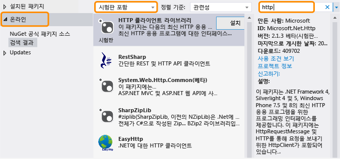

# .NET Framework 및 번외 릴리스
.NET Framework는 기존의 데스크톱 및 웹 응용 프로그램뿐만 아니라 Windows Phone 및 Windows 스토어 앱과 같은 서로 다른 플랫폼을 수용하고 코드 재사용을 최대화하는 방향으로 발전하고 있습니다. 정기적인 .NET Framework 릴리스 이외에 새로운 기능인 OOB(Out Of Band)도 릴리스하여 플랫폼 간 개발을 향상시키거나 새 기능을 도입합니다. 이 항목에서는 .NET Framework 및 해당 OOB 릴리스의 향후 방향에 대해 설명합니다.  
  
## OOB 릴리스의 장점  
 Microsoft는 새 구성 요소 또는 구성 요소 Out of Band에 대한 업데이트를 제공함으로써 .NET Framework를 보다 자주 업데이트할 수 있습니다. 또한 보다 신속하게 고객 의견을 수집하고 대응할 수 있습니다.  
  
 응용 프로그램에서 OOB 기능을 사용하면 OOB 어셈블리가 응용 프로그램 패키지와 함께 배포되므로 사용자는 응용 프로그램을 실행하기 위해 최신 버전의 .NET Framework를 설치할 필요가 없습니다.  
  
## OOB 패키지 분산 방식  
 핵심 CLR(공용 언어 런타임) 구성 요소에 대한 OOB 릴리스는 오픈 소스 Visual Studio 확장인 [NuGet 패키지 관리자](http://nuget.codeplex.com/)를 통해 제공됩니다. NuGet을 사용하면 Visual Studio의 솔루션 탐색기에서 간단하게 라이브러리를 찾아보고 해당 라이브러리를 .NET Framework 프로젝트에 추가할 수 있습니다. NuGet은 Visual Studio 2012부터 Visual Studio의 모든 버전에 포함되어 있습니다. NuGet이 설치되어 있는지 확인하려면 Visual Studio **도구** 메뉴에서 **라이브러리 패키지 관리자**를 찾습니다. NuGet이 설치되어 있지 않은 경우  
  
1.  Visual Studio 메뉴 모음에서 **도구**, **확장명 및 업데이트**를 선택합니다(Visual Studio 2010에서는 **확장명 관리자** 선택.)  
  
     **확장명 및 업데이트** 대화 상자가 열립니다.  
  
2.  **온라인**, **NuGet 패키지 관리자**를 선택한 다음 **다운로드**를 선택합니다.  
  
3.  다운로드가 완료된 후 Visual Studio를 다시 시작합니다.  
  
 자세한 설치 지침은 NuGet 문서 웹 사이트에서 [NuGet 설치](http://docs.nuget.org/docs/start-here/installing-nuget)를 참조하세요. NuGet에 대한 자세한 내용은 [NuGet 설명서](http://docs.nuget.org/)를 참조하세요.  
  
## NuGet OOB 패키지 사용  
 NuGet을 설치한 후 Visual Studio의 솔루션 탐색기를 사용하여 NuGet 패키지에 대한 참조를 찾아보고 추가할 수 있습니다.  
  
1.  Visual Studio에서 프로젝트의 바로 가기 메뉴를 열고 **NuGet 패키지 관리**를 선택합니다. (이 옵션은 **프로젝트** 메뉴에서도 사용 가능합니다.)  
  
2.  왼쪽 창에서 **온라인**을 선택합니다.  
  
3.  시험판 패키지를 사용할 경우 중간 창의 드롭다운 목록 상자에서 **안정된 상태만** 대신 **시험판 포함**을 선택합니다.  
  
4.  오른쪽 창에서 **검색** 상자를 사용하여 사용하려는 패키지를 찾습니다. 일부 Microsoft 패키지는 Microsoft .NET Framework 로고로 식별되며 모두 Microsoft를 게시자로 식별합니다.  
  
   
  
 앞에서 언급했듯이 OOB 패키지를 사용하는 응용 프로그램을 배포하면 응용 프로그램 패키지와 함께 OOB 어셈블리가 제공됩니다.  
  
## OOB 릴리스 형식  
 일반적으로 OOB 패키지에는 하나 이상의 시험판 버전 및 안정적인 버전이 있습니다. 시험판과 함께 제공되는 라이선스는 일반적으로 재배포할 수 없지만 패키지를 사용해 보고 피드백을 제공할 수 있습니다. 피드백이 패키지의 모든 업데이트에 통합됩니다. 최종 릴리스는 NuGet과 함께 안정적인 패키지로 분산되며 응용 프로그램과 함께 NuGet 패키지를 재배포할 수 있는 라이선스를 포함합니다. 안정적인 패키지가 Microsoft에서 지원됩니다. Microsoft는 모든 패키지에 대한 블로그 게시물 및 포럼 답변과 같은 다른 유형의 문서는 물론 IntelliSense 지원도 제공합니다. 또한 소스 코드는 전부는 아니지만 일부 패키지에서 제공될 수 있습니다. [.NET Framework 블로그](http://blogs.msdn.com/b/dotnet/)를 구독하면 새 패키지 및 업데이트된 패키지에 대한 알림을 받아볼 수 있습니다.  
  
 시험판과 안정적인 패키지를 둘 다 찾아보려면 NuGet 패키지 관리자에서 **시험판 포함**을 선택합니다.  
  
 안정적인 패키지 릴리스에 대한 알림을 받아보려면 [.NET Framework 피드](https://nuget.org/api/v2/curated-feeds/dotnetframework/Packages/)를 구독하세요.  
  
## 참고 항목  
 [시작](../../../docs/framework/get-started/index.md)
