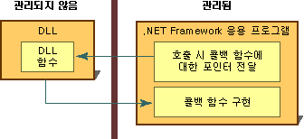

# 콜백 함수
콜백 함수는 관리되지 않는 DLL 함수가 작업을 완료하는 데 도움이 되는, 관리되는 응용 프로그램 내의 코드입니다. 콜백 함수 호출은 관리되는 응용 프로그램에서 간접적으로, DLL 함수를 통해, 그리고 다시 관리되는 구현으로 전달됩니다. 플랫폼 호출을 사용하여 호출되는 많은 DLL 함수 중 일부는 제대로 실행되기 위해 관리 코드에 콜백 함수가 있어야 합니다.  
  
 관리 코드에서 대부분의 DLL 함수를 호출하려면 관리되는 함수 정의를 만든 후 호출합니다. 프로세스는 간단합니다.  
  
 콜백 함수가 필요한 DLL 함수를 사용하는 경우 몇 가지 추가 단계가 있습니다. 먼저, 함수에 대한 설명서를 확인하여 함수에 콜백이 필요한지 여부를 확인해야 합니다. 다음으로, 관리되는 응용 프로그램에서 콜백 함수를 만들어야 합니다. 마지막으로, 콜백 함수에 대한 포인터를 인수로 전달하여 DLL 함수를 호출합니다. 다음 그림에서는 이 단계를 요약합니다.  
  
   
콜백 함수 및 구현  
  
 콜백 함수는 작업이 반복적으로 수행되는 경우 사용하기에 적합합니다. 또한 일반적으로 Win32 API에서 **EnumFontFamilies**, **EnumPrinters**, **EnumWindows** 등의 열거형 함수에 사용됩니다. **EnumWindows** 함수는 컴퓨터의 모든 기존 창을 열거하고 콜백 함수를 호출하여 각 창에서 작업을 수행합니다. 자세한 내용과 예제는 [방법: 콜백 함수 구현](../../../docs/framework/interop/how-to-implement-callback-functions.md)을 참조하세요.  
  
## 참고 항목  
 [방법: 콜백 함수 구현](../../../docs/framework/interop/how-to-implement-callback-functions.md)  
 [DLL 함수 호출](../../../docs/framework/interop/calling-a-dll-function.md)
