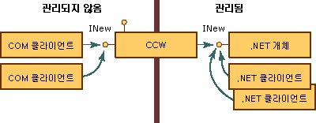
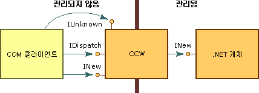

# <a name="com-callable-wrapper"></a><span data-ttu-id="bce67-102">CCW</span><span class="sxs-lookup"><span data-stu-id="bce67-102">COM Callable Wrapper</span></span>
<span data-ttu-id="bce67-103">COM 클라이언트가.NET 개체를 호출할 때 공용 언어 런타임에서는 관리되는 개체 및 개체에 대한 COM 호출 가능 래퍼(CCW)를 만듭니다.</span><span class="sxs-lookup"><span data-stu-id="bce67-103">When a COM client calls a .NET object, the common language runtime creates the managed object and a COM callable wrapper (CCW) for the object.</span></span> <span data-ttu-id="bce67-104">.NET 개체를 직접 참조할 수는 없으며, COM 클라이언트는 CCW를 관리되는 개체에 대한 프록시로 사용합니다.</span><span class="sxs-lookup"><span data-stu-id="bce67-104">Unable to reference a .NET object directly, COM clients use the CCW as a proxy for the managed object.</span></span>  
  
 <span data-ttu-id="bce67-105">런타임에서는 서비스를 요청하는 COM 클라이언트 수와 관계없이 관리되는 개체에 대한 CCW를 하나만 만듭니다.</span><span class="sxs-lookup"><span data-stu-id="bce67-105">The runtime creates exactly one CCW for a managed object, regardless of the number of COM clients requesting its services.</span></span> <span data-ttu-id="bce67-106">다음 그림과 같이 INew 인터페이스를 노출하는 CCW에 대한 참조가 여러 COM 클라이언트에 포함될 수 있습니다.</span><span class="sxs-lookup"><span data-stu-id="bce67-106">As the following illustration shows, multiple COM clients can hold a reference to the CCW that exposes the INew interface.</span></span> <span data-ttu-id="bce67-107">반대로 CCW에는 인터페이스를 구현하고 수집된 가비지인 관리되는 개체에 대한 참조 하나가 포함됩니다.</span><span class="sxs-lookup"><span data-stu-id="bce67-107">The CCW, in turn, holds a single reference to the managed object that implements the interface and is garbage collected.</span></span> <span data-ttu-id="bce67-108">COM 및 .NET 클라이언트는 둘 다 동시에 같은 관리되는 개체에 대한 요청을 수행할 수 있습니다.</span><span class="sxs-lookup"><span data-stu-id="bce67-108">Both COM and .NET clients can make requests on the same managed object simultaneously.</span></span>  
  
 <span data-ttu-id="bce67-109"></span><span class="sxs-lookup"><span data-stu-id="bce67-109"></span></span>  
<span data-ttu-id="bce67-110">COM 호출 가능 래퍼를 통해 .NET 개체 액세스</span><span class="sxs-lookup"><span data-stu-id="bce67-110">Accessing .NET objects through COM callable wrapper</span></span>  
  
 <span data-ttu-id="bce67-111">COM 호출 가능 래퍼는 .NET Framework 내에서 실행되는 다른 클래스에 표시되지 않습니다.</span><span class="sxs-lookup"><span data-stu-id="bce67-111">COM callable wrappers are invisible to other classes running within the .NET Framework.</span></span> <span data-ttu-id="bce67-112">주요 용도는 관리 및 비관리 코드 간의 호출을 마샬링하는 것이지만 CCW는 래핑하고 있는 관리되는 개체의 개체 ID 및 개체 수명도 관리합니다.</span><span class="sxs-lookup"><span data-stu-id="bce67-112">Their primary purpose is to marshal calls between managed and unmanaged code; however, CCWs also manage the object identity and object lifetime of the managed objects they wrap.</span></span>  
  
## <a name="object-identity"></a><span data-ttu-id="bce67-113">개체 ID</span><span class="sxs-lookup"><span data-stu-id="bce67-113">Object Identity</span></span>  
 <span data-ttu-id="bce67-114">런타임에서는 런타임에 필요에 따라 개체가 메모리 내에서 이동할 수 있도록 하는 가비지 수집된 힙에서 .NET 개체에 대한 메모리를 할당합니다.</span><span class="sxs-lookup"><span data-stu-id="bce67-114">The runtime allocates memory for the .NET object from its garbage-collected heap, which enables the runtime to move the object around in memory as necessary.</span></span> <span data-ttu-id="bce67-115">반면 런타임에서는 수집되지 않은 힙에서 CCW에 대한 메모리를 할당하므로 COM 클라이언트가 래퍼를 직접 참조할 수 있습니다.</span><span class="sxs-lookup"><span data-stu-id="bce67-115">In contrast, the runtime allocates memory for the CCW from a noncollected heap, making it possible for COM clients to reference the wrapper directly.</span></span>  
  
## <a name="object-lifetime"></a><span data-ttu-id="bce67-116">개체 수명</span><span class="sxs-lookup"><span data-stu-id="bce67-116">Object Lifetime</span></span>  
 <span data-ttu-id="bce67-117">CCW는 래핑하고 있는 .NET 클라이언트와 달리 기존 COM 방식으로 참조 횟수가 계산됩니다.</span><span class="sxs-lookup"><span data-stu-id="bce67-117">Unlike the .NET client it wraps, the CCW is reference-counted in traditional COM fashion.</span></span> <span data-ttu-id="bce67-118">CCW의 참조 횟수가 0에 도달하면 래퍼는 관리되는 개체에 대한 참조를 해제합니다.</span><span class="sxs-lookup"><span data-stu-id="bce67-118">When the reference count on the CCW reaches zero, the wrapper releases its reference on the managed object.</span></span> <span data-ttu-id="bce67-119">남은 참조가 없는 관리되는 개체는 다음 가비지 수집 주기 동안 수집됩니다.</span><span class="sxs-lookup"><span data-stu-id="bce67-119">A managed object with no remaining references is collected during the next garbage-collection cycle.</span></span>  
  
## <a name="simulating-com-interfaces"></a><span data-ttu-id="bce67-120">COM 인터페이스 시뮬레이션</span><span class="sxs-lookup"><span data-stu-id="bce67-120">Simulating COM interfaces</span></span>  
 <span data-ttu-id="bce67-121">CCW([COM 호출 가능 래퍼](../../../docs/framework/interop/com-callable-wrapper.md))는 COM에 표시되는 인터페이스 데이터 형식 및 반환 값을 모두 COM의 인터페이스 기반 조작 적용과 일치하는 방식으로 COM 클라이언트에 노출합니다.</span><span class="sxs-lookup"><span data-stu-id="bce67-121">The [COM callable wrapper](../../../docs/framework/interop/com-callable-wrapper.md) (CCW) exposes all public, COM-visible interfaces, data types, and return values to COM clients in a manner that is consistent with COM's enforcement of interface-based interaction.</span></span> <span data-ttu-id="bce67-122">COM 클라이언트의 경우 .NET Framework 개체에서 메서드를 호출하는 것은 COM 개체에서 메서드를 호출하는 것과 같습니다.</span><span class="sxs-lookup"><span data-stu-id="bce67-122">For a COM client, invoking methods on a .NET Framework object is identical to invoking methods on a COM object.</span></span>  
  
 <span data-ttu-id="bce67-123">이 원활한 접근 방식을 만들기 위해 CCW는 **IUnknown** 및 **IDispatch**와 같은 기존 COM 인터페이스를 만듭니다.</span><span class="sxs-lookup"><span data-stu-id="bce67-123">To create this seamless approach, the CCW manufactures traditional COM interfaces, such as **IUnknown** and **IDispatch**.</span></span> <span data-ttu-id="bce67-124">다음 그림과 같이 CCW는 래핑하고 있는 .NET 개체에 대한 단일 참조를 유지 관리합니다.</span><span class="sxs-lookup"><span data-stu-id="bce67-124">As the following illustration shows, the CCW maintains a single reference on the .NET object that it wraps.</span></span> <span data-ttu-id="bce67-125">COM 클라이언트 및 .NET 개체는 CCW의 프록시 및 스텁 생성을 통해 서로 상호 작용합니다.</span><span class="sxs-lookup"><span data-stu-id="bce67-125">Both the COM client and .NET object interact with each other through the proxy and stub construction of the CCW.</span></span>  
  
 <span data-ttu-id="bce67-126"></span><span class="sxs-lookup"><span data-stu-id="bce67-126"></span></span>  
<span data-ttu-id="bce67-127">Com 인터페이스 및 COM 호출 가능 래퍼</span><span class="sxs-lookup"><span data-stu-id="bce67-127">Com interfaces and the COM callable wrapper</span></span>  
  
 <span data-ttu-id="bce67-128">관리되는 환경에서 클래스에 의해 명시적으로 구현되는 인터페이스를 노출하는 것 외에도 .NET Framework는 개체 대신에 다음 표에 나열된 COM 인터페이스의 구현을 제공합니다.</span><span class="sxs-lookup"><span data-stu-id="bce67-128">In addition to exposing the interfaces that are explicitly implemented by a class in the managed environment, the .NET Framework supplies implementations of the COM interfaces listed in the following table on behalf of the object.</span></span> <span data-ttu-id="bce67-129">.NET 클래스는 이러한 인터페이스의 자체 구현을 제공하여 기본 동작을 재정의할 수 있습니다.</span><span class="sxs-lookup"><span data-stu-id="bce67-129">A .NET class can override the default behavior by providing its own implementation of these interfaces.</span></span> <span data-ttu-id="bce67-130">그러나 런타임에서는 항상 **IUnknown** 및 **IDispatch** 인터페이스에 대한 구현을 제공합니다.</span><span class="sxs-lookup"><span data-stu-id="bce67-130">However, the runtime always provides the implementation for the **IUnknown** and **IDispatch** interfaces.</span></span>  
  
|<span data-ttu-id="bce67-131">인터페이스</span><span class="sxs-lookup"><span data-stu-id="bce67-131">Interface</span></span>|<span data-ttu-id="bce67-132">설명</span><span class="sxs-lookup"><span data-stu-id="bce67-132">Description</span></span>|  
|---------------|-----------------|  
|<span data-ttu-id="bce67-133">**Idispatch**</span><span class="sxs-lookup"><span data-stu-id="bce67-133">**Idispatch**</span></span>|<span data-ttu-id="bce67-134">입력할 런타임 바인딩을 위한 메커니즘을 제공합니다.</span><span class="sxs-lookup"><span data-stu-id="bce67-134">Provides a mechanism for late binding to type.</span></span>|  
|<span data-ttu-id="bce67-135">**IerrorInfo**</span><span class="sxs-lookup"><span data-stu-id="bce67-135">**IerrorInfo**</span></span>|<span data-ttu-id="bce67-136">오류, 소스, 도움말 파일, 도움말 컨텍스트에 대한 설명과 오류를 정의한 인터페이스의 GUID를 제공합니다(.NET 클래스의 경우 항상 **GUID_NULL**).</span><span class="sxs-lookup"><span data-stu-id="bce67-136">Provides a textual description of the error, its source, a Help file, Help context, and the GUID of the interface that defined the error (always **GUID_NULL** for .NET classes).</span></span>|  
|<span data-ttu-id="bce67-137">**IprovideClassInfo**</span><span class="sxs-lookup"><span data-stu-id="bce67-137">**IprovideClassInfo**</span></span>|<span data-ttu-id="bce67-138">COM 클라이언트가 관리되는 클래스에 의해 구현된 **ITypeInfo** 인터페이스에 액세스할 수 있도록 합니다.</span><span class="sxs-lookup"><span data-stu-id="bce67-138">Enables COM clients to gain access to the **ITypeInfo** interface implemented by a managed class.</span></span>|  
|<span data-ttu-id="bce67-139">**IsupportErrorInfo**</span><span class="sxs-lookup"><span data-stu-id="bce67-139">**IsupportErrorInfo**</span></span>|<span data-ttu-id="bce67-140">관리 개체에서 **IErrorInfo** 인터페이스를 지원할지 여부를 COM 클라이언트가 결정하도록 합니다.</span><span class="sxs-lookup"><span data-stu-id="bce67-140">Enables a COM client to determine whether the managed object supports the **IErrorInfo** interface.</span></span> <span data-ttu-id="bce67-141">지원하도록 하면 클라이언트가 최신 예외 개체에 대한 포인터를 가져올 수 있습니다.</span><span class="sxs-lookup"><span data-stu-id="bce67-141">If so, enables the client to obtain a pointer to the latest exception object.</span></span> <span data-ttu-id="bce67-142">관리되는 모든 형식이 **IErrorInfo** 인터페이스를 지원합니다.</span><span class="sxs-lookup"><span data-stu-id="bce67-142">All managed types support the **IErrorInfo** interface.</span></span>|  
|<span data-ttu-id="bce67-143">**ItypeInfo**</span><span class="sxs-lookup"><span data-stu-id="bce67-143">**ItypeInfo**</span></span>|<span data-ttu-id="bce67-144">Tlbexp.exe에서 생성된 형식 정보와 똑같은 클래스에 대한 형식 정보를 제공합니다.</span><span class="sxs-lookup"><span data-stu-id="bce67-144">Provides type information for a class that is exactly the same as the type information produced by Tlbexp.exe.</span></span>|  
|<span data-ttu-id="bce67-145">**Iunknown**</span><span class="sxs-lookup"><span data-stu-id="bce67-145">**Iunknown**</span></span>|<span data-ttu-id="bce67-146">COM 클라이언트가 CCW 수명을 관리하고 형식 강제 변환을 제공하는 데 사용하는 **IUnknown** 인터페이스의 표준 구현을 제공합니다.</span><span class="sxs-lookup"><span data-stu-id="bce67-146">Provides the standard implementation of the **IUnknown** interface with which the COM client manages the lifetime of the CCW and provides type coercion.</span></span>|  
  
 <span data-ttu-id="bce67-147">관리되는 클래스는 다음 표에 설명된 COM 인터페이스를 제공할 수도 있습니다.</span><span class="sxs-lookup"><span data-stu-id="bce67-147">A managed class can also provide the COM interfaces described in the following table.</span></span>  
  
|<span data-ttu-id="bce67-148">인터페이스</span><span class="sxs-lookup"><span data-stu-id="bce67-148">Interface</span></span>|<span data-ttu-id="bce67-149">설명</span><span class="sxs-lookup"><span data-stu-id="bce67-149">Description</span></span>|  
|---------------|-----------------|  
|<span data-ttu-id="bce67-150">(_*classname*) 클래스 인터페이스</span><span class="sxs-lookup"><span data-stu-id="bce67-150">The (_*classname*) class interface</span></span>|<span data-ttu-id="bce67-151">관리되는 개체에서 명시적으로 노출되는 모든 공용 인터페이스, 메서드, 속성 및 필드를 노출하는, 런타임에서 노출되고 명시적으로 정의되지 않는 인터페이스입니다.</span><span class="sxs-lookup"><span data-stu-id="bce67-151">Interface, exposed by the runtime and not explicitly defined, that exposes all public interfaces, methods, properties, and fields that are explicitly exposed on a managed object.</span></span>|  
|<span data-ttu-id="bce67-152">**IConnectionPoint** 및 **IconnectionPointContainer**</span><span class="sxs-lookup"><span data-stu-id="bce67-152">**IConnectionPoint** and **IconnectionPointContainer**</span></span>|<span data-ttu-id="bce67-153">대리자 기반 이벤트(이벤트 구독자를 등록하기 위한 인터페이스)의 소스가 되는 개체에 대한 인터페이스입니다.</span><span class="sxs-lookup"><span data-stu-id="bce67-153">Interface for objects that source delegate-based events (an interface for registering event subscribers).</span></span>|  
|<span data-ttu-id="bce67-154">**IdispatchEx**</span><span class="sxs-lookup"><span data-stu-id="bce67-154">**IdispatchEx**</span></span>|<span data-ttu-id="bce67-155">클래스가 **IExpando**를 구현하는 경우 런타임에서 제공되는 인터페이스입니다.</span><span class="sxs-lookup"><span data-stu-id="bce67-155">Interface supplied by the runtime if the class implements **IExpando**.</span></span> <span data-ttu-id="bce67-156">**IDispatchEx** 인터페이스는 **IDispatch**와 달리 멤버의 대/소문자 구분 호출, 열거형, 추가, 삭제를 가능하게 하는 **IDispatch** 인터페이스의 확장입니다.</span><span class="sxs-lookup"><span data-stu-id="bce67-156">The **IDispatchEx** interface is an extension of the **IDispatch** interface that, unlike **IDispatch**, enables enumeration, addition, deletion, and case-sensitive calling of members.</span></span>|  
|<span data-ttu-id="bce67-157">**IEnumVARIANT**</span><span class="sxs-lookup"><span data-stu-id="bce67-157">**IEnumVARIANT**</span></span>|<span data-ttu-id="bce67-158">클래스가 **IEnumerable**을 구현하는 경우 컬렉션에서 개체를 열거하는 컬렉션 형식 클래스에 대한 인터페이스입니다.</span><span class="sxs-lookup"><span data-stu-id="bce67-158">Interface for collection-type classes, which enumerates the objects in the collection if the class implements **IEnumerable**.</span></span>|  
  
## <a name="introducing-the-class-interface"></a><span data-ttu-id="bce67-159">클래스 인터페이스 소개</span><span class="sxs-lookup"><span data-stu-id="bce67-159">Introducing the class interface</span></span>  
 <span data-ttu-id="bce67-160">관리 코드에서 명시적으로 정의되지 않은 클래스 인터페이스는 .NET 개체에서 명시적으로 노출되는 모든 공용 메서드, 속성, 필드, 이벤트를 노출하는 인터페이스입니다.</span><span class="sxs-lookup"><span data-stu-id="bce67-160">The class interface, which is not explicitly defined in managed code, is an interface that exposes all public methods, properties, fields, and events that are explicitly exposed on the .NET object.</span></span> <span data-ttu-id="bce67-161">이 인터페이스는 이중 인터페이스이거나 디스패치 전용 인터페이스입니다.</span><span class="sxs-lookup"><span data-stu-id="bce67-161">This interface can be a dual or dispatch-only interface.</span></span> <span data-ttu-id="bce67-162">클래스 인터페이스는 앞에 밑줄이 추가된 .NET 클래스 자체의 이름을 수신합니다.</span><span class="sxs-lookup"><span data-stu-id="bce67-162">The class interface receives the name of the .NET class itself, preceded by an underscore.</span></span> <span data-ttu-id="bce67-163">예를 들어 Mammal 클래스의 클래스 인터페이스는 _Mammal입니다.</span><span class="sxs-lookup"><span data-stu-id="bce67-163">For example, for class Mammal, the class interface is _Mammal.</span></span>  
  
 <span data-ttu-id="bce67-164">파생 클래스의 클래스 인터페이스는 기본 클래스의 모든 공용 메서드, 속성 및 필드도 노출합니다.</span><span class="sxs-lookup"><span data-stu-id="bce67-164">For derived classes, the class interface also exposes all public methods, properties, and fields of the base class.</span></span> <span data-ttu-id="bce67-165">파생 클래스는 각 기본 클래스의 클래스 인터페이스도 노출합니다.</span><span class="sxs-lookup"><span data-stu-id="bce67-165">The derived class also exposes a class interface for each base class.</span></span> <span data-ttu-id="bce67-166">예를 들어 System.Object를 확장하는 MammalSuperclass 클래스를 Mammal 클래스가 확장하면 .NET 개체는 _Mammal, _MammalSuperclass 및 _Object라는 세 개의 인터페이스를 COM 클라이언트에 노출합니다.</span><span class="sxs-lookup"><span data-stu-id="bce67-166">For example, if class Mammal extends class MammalSuperclass, which itself extends System.Object, the .NET object exposes to COM clients three class interfaces named _Mammal, _MammalSuperclass, and _Object.</span></span>  
  
 <span data-ttu-id="bce67-167">예를 들어 다음 .NET 클래스를 예로 들어 봅니다.</span><span class="sxs-lookup"><span data-stu-id="bce67-167">For example, consider the following .NET class:</span></span>  
  
```vb  
' Applies the ClassInterfaceAttribute to set the interface to dual.  
<ClassInterface(ClassInterfaceType.AutoDual)> _  
' Implicitly extends System.Object.  
Public Class Mammal  
    Sub Eat()  
    Sub Breathe()  
    Sub Sleep()  
End Class  
```  
  
```csharp  
// Applies the ClassInterfaceAttribute to set the interface to dual.  
[ClassInterface(ClassInterfaceType.AutoDual)]  
// Implicitly extends System.Object.  
public class Mammal  
{  
    void  Eat();  
    void  Breathe():  
    void  Sleep();  
}  
```  
  
 <span data-ttu-id="bce67-168">COM 클라이언트는 [형식 라이브러리 내보내기(Tlbexp.exe)](../../../docs/framework/tools/tlbexp-exe-type-library-exporter.md) 도구에서 생성한 형식 라이브러리에 설명된 `_Mammal`이라는 클래스 인터페이스에 대한 포인터를 가져올 수 있습니다.</span><span class="sxs-lookup"><span data-stu-id="bce67-168">The COM client can obtain a pointer to a class interface named `_Mammal`, which is described in the type library that the [Type Library Exporter (Tlbexp.exe)](../../../docs/framework/tools/tlbexp-exe-type-library-exporter.md) tool generates.</span></span> <span data-ttu-id="bce67-169">`Mammal` 클래스가 인터페이스를 하나 이상 구현하면 인터페이스가 coclass 아래에 표시됩니다.</span><span class="sxs-lookup"><span data-stu-id="bce67-169">If the `Mammal` class implemented one or more interfaces, the interfaces would appear under the coclass.</span></span>  
  
```  
[odl, uuid(…), hidden, dual, nonextensible, oleautomation]  
interface _Mammal : IDispatch  
{  
    [id(0x00000000), propget] HRESULT ToString([out, retval] BSTR*  
        pRetVal);  
    [id(0x60020001)] HRESULT Equals([in] VARIANT obj, [out, retval]  
        VARIANT_BOOL* pRetVal);  
    [id(0x60020002)] HRESULT GetHashCode([out, retval] short* pRetVal);  
    [id(0x60020003)] HRESULT GetType([out, retval] _Type** pRetVal);  
    [id(0x6002000d)] HRESULT Eat();  
    [id(0x6002000e)] HRESULT Breathe();  
    [id(0x6002000f)] HRESULT Sleep();  
}  
[uuid(…)]  
coclass Mammal   
{  
    [default] interface _Mammal;  
}  
```  
  
 <span data-ttu-id="bce67-170">클래스 인터페이스 생성은 선택 사항입니다.</span><span class="sxs-lookup"><span data-stu-id="bce67-170">Generating the class interface is optional.</span></span> <span data-ttu-id="bce67-171">기본적으로 COM interop는 형식 라이브러리로 내보내는 각 클래스에 대한 디스패치 전용 인터페이스를 생성합니다.</span><span class="sxs-lookup"><span data-stu-id="bce67-171">By default, COM interop generates a dispatch-only interface for each class you export to a type library.</span></span> <span data-ttu-id="bce67-172"><xref:System.Runtime.InteropServices.ClassInterfaceAttribute>를 클래스에 적용하여 이 인터페이스의 자동 만들기를 방지하거나 수정할 수 있습니다.</span><span class="sxs-lookup"><span data-stu-id="bce67-172">You can prevent or modify the automatic creation of this interface by applying the <xref:System.Runtime.InteropServices.ClassInterfaceAttribute> to your class.</span></span> <span data-ttu-id="bce67-173">클래스 인터페이스를 사용하면 관리되는 클래스를 COM에 간편하게 노출할 수 있지만 사용이 제한됩니다.</span><span class="sxs-lookup"><span data-stu-id="bce67-173">Although the class interface can ease the task of exposing managed classes to COM, its uses are limited.</span></span>  
  
> [!CAUTION]
>  <span data-ttu-id="bce67-174">고유 인터페이스를 명시적으로 정의하지 않고 클래스 인터페이스를 사용하면 관리되는 클래스의 미래 버전 관리가 복잡해질 수 있습니다.</span><span class="sxs-lookup"><span data-stu-id="bce67-174">Using the class interface, instead of explicitly defining your own, can complicate the future versioning of your managed class.</span></span> <span data-ttu-id="bce67-175">클래스 인터페이스를 사용하기 전에 다음 지침을 참조하세요.</span><span class="sxs-lookup"><span data-stu-id="bce67-175">Please read the following guidelines before using the class interface.</span></span>  
  
### <a name="define-an-explicit-interface-for-com-clients-to-use-rather-than-generating-the-class-interface"></a><span data-ttu-id="bce67-176">클래스 인터페이스를 사용하는 대신 COM 클라이언트가 사용할 명시적 인터페이스를 정의하세요.</span><span class="sxs-lookup"><span data-stu-id="bce67-176">Define an explicit interface for COM clients to use rather than generating the class interface.</span></span>  
 <span data-ttu-id="bce67-177">COM interop는 클래스 인터페이스를 자동으로 생성하므로 클래스에 대한 사무 버전 변경으로 공용 언어 런타임에서 노출하는 클래스 인터페이스의 레이아웃이 변경될 수 있습니다.</span><span class="sxs-lookup"><span data-stu-id="bce67-177">Because COM interop generates a class interface automatically, post-version changes to your class can alter the layout of the class interface exposed by the common language runtime.</span></span> <span data-ttu-id="bce67-178">일반적으로 COM 클라이언트는 인터페이스 레이아웃에서 변경 내용을 처리하도록 준비되지 않으므로 클래스의 멤버를 변경하면 COM 클라이언트가 중단됩니다.</span><span class="sxs-lookup"><span data-stu-id="bce67-178">Since COM clients are typically unprepared to handle changes in the layout of an interface, they break if you change the member layout of the class.</span></span>  
  
 <span data-ttu-id="bce67-179">이 지침은 COM 클라이언트에 노출되는 인터페이스를 변경할 수 없어야 한다는 개념을 적용합니다.</span><span class="sxs-lookup"><span data-stu-id="bce67-179">This guideline reinforces the notion that interfaces exposed to COM clients must remain unchangeable.</span></span> <span data-ttu-id="bce67-180">실수로 인터페이스 레이아웃을 다시 정렬함으로써 COM 클라이언트가 중단되는 위험을 줄이려면 인터페이스를 명시적으로 정의하여 클래스에 대한 모든 변경 내용과 인터페이스 레이아웃을 분리합니다.</span><span class="sxs-lookup"><span data-stu-id="bce67-180">To reduce the risk of breaking COM clients by inadvertently reordering the interface layout, isolate all changes to the class from the interface layout by explicitly defining interfaces.</span></span>  
  
 <span data-ttu-id="bce67-181">**ClassInterfaceAttribute**를 사용하여 클래스 인터페이스의 자동 생성을 해제하고 다음 코드 조각과 같이 클래스에 대한 명시적 인터페이스를 구현합니다.</span><span class="sxs-lookup"><span data-stu-id="bce67-181">Use the **ClassInterfaceAttribute** to disengage the automatic generation of the class interface and implement an explicit interface for the class, as the following code fragment shows:</span></span>  
  
```vb  
<ClassInterface(ClassInterfaceType.None)>Public Class LoanApp  
    Implements IExplicit  
    Sub M() Implements IExplicit.M  
…  
End Class  
```  
  
```csharp  
[ClassInterface(ClassInterfaceType.None)]  
public class LoanApp : IExplicit {  
    void M();  
}  
```  
  
 <span data-ttu-id="bce67-182">**ClassInterfaceType.None** 값은 클래스 메타데이터가 형식 라이브러리에 노출될 때 클래스 인터페이스가 생성되지 않도록 방지합니다.</span><span class="sxs-lookup"><span data-stu-id="bce67-182">The **ClassInterfaceType.None** value prevents the class interface from being generated when the class metadata is exported to a type library.</span></span> <span data-ttu-id="bce67-183">이전 예제에서 COM 클라이언트는 `IExplicit` 인터페이스를 통해서만 `LoanApp` 클래스에 액세스할 수 있습니다.</span><span class="sxs-lookup"><span data-stu-id="bce67-183">In the preceding example, COM clients can access the `LoanApp` class only through the `IExplicit` interface.</span></span>  
  
### <a name="avoid-caching-dispatch-identifiers-dispids"></a><span data-ttu-id="bce67-184">디스패치 식별자(DispId)를 캐시하지 마세요.</span><span class="sxs-lookup"><span data-stu-id="bce67-184">Avoid caching dispatch identifiers (DispIds).</span></span>  
 <span data-ttu-id="bce67-185">클래스 인터페이스 사용은 스크립팅된 클라이언트, Microsoft Visual Basic 6.0 클라이언트 또는 인터페이스 멤버의 DispId를 캐시하지 않는 런타임에 바인딩된 클라이언트에 적용할 수 있는 옵션입니다.</span><span class="sxs-lookup"><span data-stu-id="bce67-185">Using the class interface is an acceptable option for scripted clients, Microsoft Visual Basic 6.0 clients, or any late-bound client that does not cache the DispIds of interface members.</span></span> <span data-ttu-id="bce67-186">DispId로 런타임 바인딩을 가능하게 하는 인터페이스 멤버를 구별합니다.</span><span class="sxs-lookup"><span data-stu-id="bce67-186">DispIds identify interface members to enable late binding.</span></span>  
  
 <span data-ttu-id="bce67-187">클래스 인터페이스에 대한 DispId 생성은 인터페이스에서 멤버의 위치에 기반을 둡니다.</span><span class="sxs-lookup"><span data-stu-id="bce67-187">For the class interface, generation of DispIds is based on the position of the member in the interface.</span></span> <span data-ttu-id="bce67-188">멤버 순서를 변경하고 클래스를 형식 라이브러리로 내보내면 클래스 인터페이스에서 생성된 DispId가 변경됩니다.</span><span class="sxs-lookup"><span data-stu-id="bce67-188">If you change the order of the member and export the class to a type library, you will alter the DispIds generated in the class interface.</span></span>  
  
 <span data-ttu-id="bce67-189">클래스 인터페이스를 사용할 때 런타임에 바인딩된 COM 클라이언트의 중단을 방지하려면 **ClassInterfaceAttribute** 및 **ClassInterfaceType.AutoDispatch** 값을 적용합니다.</span><span class="sxs-lookup"><span data-stu-id="bce67-189">To avoid breaking late-bound COM clients when using the class interface, apply the **ClassInterfaceAttribute** with the **ClassInterfaceType.AutoDispatch** value.</span></span> <span data-ttu-id="bce67-190">이 값은 디스패치 전용 클래스 인터페이스를 구현하지만 형식 라이브러리에서 인터페이스 설명을 생략합니다.</span><span class="sxs-lookup"><span data-stu-id="bce67-190">This value implements a dispatch-only class interface, but omits the interface description from the type library.</span></span> <span data-ttu-id="bce67-191">인터페이스 설명이 없으면 클라이언트가 컴파일 타임에 DispId를 캐시할 수 없습니다.</span><span class="sxs-lookup"><span data-stu-id="bce67-191">Without an interface description, clients are unable to cache DispIds at compile time.</span></span> <span data-ttu-id="bce67-192">이 형식이 클래스 인터페이스의 기본 인터페이스 형식이지만 특정 값을 명시적으로 적용할 수 있습니다.</span><span class="sxs-lookup"><span data-stu-id="bce67-192">Although this is the default interface type for the class interface, you can apply the attribute value explicitly.</span></span>  
  
```vb  
<ClassInterface(ClassInterfaceType.AutoDispatch)> Public Class LoanApp  
    Implements IAnother  
    Sub M() Implements IAnother.M  
…  
End Class  
```  
  
```csharp  
[ClassInterface(ClassInterfaceType.AutoDispatch]  
public class LoanApp : IAnother {  
    void M();  
}  
```  
  
 <span data-ttu-id="bce67-193">런타임에 인터페이스 멤버의 DispId를 가져오려고 COM 클라이언트는 **IDispatch.GetIdsOfNames**를 호출합니다.</span><span class="sxs-lookup"><span data-stu-id="bce67-193">To get the DispId of an interface member at run time, COM clients can call **IDispatch.GetIdsOfNames**.</span></span> <span data-ttu-id="bce67-194">인터페이스에서 메서드를 호출하려면 반환된 DispId를 인수로 **IDispatch.Invoke**에 전달합니다.</span><span class="sxs-lookup"><span data-stu-id="bce67-194">To invoke a method on the interface, pass the returned DispId as an argument to **IDispatch.Invoke**.</span></span>  
  
### <a name="restrict-using-the-dual-interface-option-for-the-class-interface"></a><span data-ttu-id="bce67-195">클래스 인터페이스의 이중 인터페이스 옵션 사용을 제한하세요.</span><span class="sxs-lookup"><span data-stu-id="bce67-195">Restrict using the dual interface option for the class interface.</span></span>  
 <span data-ttu-id="bce67-196">이중 인터페이스를 사용하면 COM 클라이언트에서 인터페이스 멤버를 초기에 바인딩하고 런타임에 바인딩할 수 있습니다.</span><span class="sxs-lookup"><span data-stu-id="bce67-196">Dual interfaces enable early and late binding to interface members by COM clients.</span></span> <span data-ttu-id="bce67-197">디자인 타임이나 테스트 중에는 클래스 인터페이스를 이중으로 설정하는 것이 유용할 수 있습니다.</span><span class="sxs-lookup"><span data-stu-id="bce67-197">At design time and during testing, you might find it useful to set the class interface to dual.</span></span> <span data-ttu-id="bce67-198">수정되지 않는 관리되는 클래스(및 해당 기본 클래스)에도 이 옵션을 적용할 수 있습니다.</span><span class="sxs-lookup"><span data-stu-id="bce67-198">For a managed class (and its base classes) that will never be modified, this option is also acceptable.</span></span> <span data-ttu-id="bce67-199">이외의 경우에는 클래스 인터페이스를 이중으로 설정하지 마세요.</span><span class="sxs-lookup"><span data-stu-id="bce67-199">In all other cases, avoid setting the class interface to dual.</span></span>  
  
 <span data-ttu-id="bce67-200">드물지만 자동으로 생성된 이중 인터페이스가 적절할 수 있지만 버전과 관련해서 복잡해지는 경우가 더 많습니다.</span><span class="sxs-lookup"><span data-stu-id="bce67-200">An automatically generated dual interface might be appropriate in rare cases; however, more often it creates version-related complexity.</span></span> <span data-ttu-id="bce67-201">예를 들어 파생 클래스의 클래스 인터페이스를 사용하는 COM 클라이언트는 기본 클래스가 변경될 때 쉽게 중단될 수 있습니다.</span><span class="sxs-lookup"><span data-stu-id="bce67-201">For example, COM clients using the class interface of a derived class can easily break with changes to the base class.</span></span> <span data-ttu-id="bce67-202">타사에서 기본 클래스를 제공할 경우 클래스 인터페이스의 레이아웃을 제어할 수 없습니다.</span><span class="sxs-lookup"><span data-stu-id="bce67-202">When a third party provides the base class, the layout of the class interface is out of your control.</span></span> <span data-ttu-id="bce67-203">또한 디스패치 전용 인터페이스와 달리 이중 인터페이스(**ClassInterface.AutoDual**)는 내보낸 형식 라이브러리에서 클래스 인터페이스의 설명을 제공합니다.</span><span class="sxs-lookup"><span data-stu-id="bce67-203">Further, unlike a dispatch-only interface, a dual interface (**ClassInterface.AutoDual**) provides a description of the class interface in the exported type library.</span></span> <span data-ttu-id="bce67-204">이 설명은 런타임에 바인딩된 클라이언트가 런타임에 DispId를 캐시하도록 권장합니다.</span><span class="sxs-lookup"><span data-stu-id="bce67-204">Such a description encourages late-bound clients to cache DispIds at run time.</span></span>  
  
## <a name="see-also"></a><span data-ttu-id="bce67-205">참고 항목</span><span class="sxs-lookup"><span data-stu-id="bce67-205">See Also</span></span>  
 <xref:System.Runtime.InteropServices.ClassInterfaceAttribute>  
 [<span data-ttu-id="bce67-206">COM 호출 가능 래퍼</span><span class="sxs-lookup"><span data-stu-id="bce67-206">COM Callable Wrapper</span></span>](../../../docs/framework/interop/com-callable-wrapper.md)  
 [<span data-ttu-id="bce67-207">COM 래퍼</span><span class="sxs-lookup"><span data-stu-id="bce67-207">COM Wrappers</span></span>](../../../docs/framework/interop/com-wrappers.md)  
 [<span data-ttu-id="bce67-208">.NET Framework 구성 요소를 COM에 노출</span><span class="sxs-lookup"><span data-stu-id="bce67-208">Exposing .NET Framework Components to COM</span></span>](../../../docs/framework/interop/exposing-dotnet-components-to-com.md)  
 [<span data-ttu-id="bce67-209">COM 인터페이스 시뮬레이션</span><span class="sxs-lookup"><span data-stu-id="bce67-209">Simulating COM Interfaces</span></span>](http://msdn.microsoft.com/en-us/ad2ab959-e2be-411b-aaff-275c3fba606c)  
 [<span data-ttu-id="bce67-210">상호 운용할 .NET 형식의 정규화</span><span class="sxs-lookup"><span data-stu-id="bce67-210">Qualifying .NET Types for Interoperation</span></span>](../../../docs/framework/interop/qualifying-net-types-for-interoperation.md)  
 [<span data-ttu-id="bce67-211">런타임 호출 가능 래퍼</span><span class="sxs-lookup"><span data-stu-id="bce67-211">Runtime Callable Wrapper</span></span>](../../../docs/framework/interop/runtime-callable-wrapper.md)
