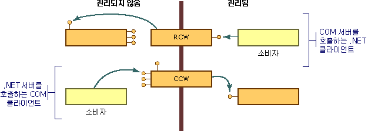

# COM 래퍼
COM은 다음과 같은 여러 중요한 방식에서 .NET Framework 개체 모델과 다릅니다.  
  
-   COM 개체의 클라이언트는 이러한 개체의 수명을 관리해야 합니다. 공용 언어 런타임은 해당 환경에서 개체의 수명을 관리합니다.  
  
-   COM 개체의 클라이언트는 해당 서비스를 제공하는 인터페이스를 요청하고 다시 인터페이스 포인터를 가져와 서비스를 사용할 수 있는지 여부를 검색합니다. .NET 개체의 클라이언트는 리플렉션을 사용하여 개체의 기능에 대한 설명을 가져올 수 있습니다.  
  
-   NET 개체는 .NET Framework 실행 환경에서 관리하는 메모리에 상주합니다. 실행 환경은 성능상의 이유로 메모리에서 개체를 이동하고, 이동되는 개체에 대한 모든 참조를 업데이트할 수 있습니다. 개체에 대한 포인터가 있는, 관리되지 않는 클라이언트의 경우 개체가 동일한 위치에 유지되어야 합니다. 이러한 클라이언트에는 위치가 고정되지 않은 개체를 처리하는 메커니즘이 없습니다.  
  
 이러한 차이점을 극복하기 위해 런타임은 관리되는 클라이언트와 관리되지 않는 클라이언트 둘 다가 해당 환경 내에서 개체를 호출한다고 여기도록 래퍼 클래스를 제공합니다. 관리되는 클라이언트가 COM 개체에 대해 메서드를 호출할 때마다 런타임은 RCW([런타임 호출 가능 래퍼](runtime-callable-wrapper.md))를 만듭니다. RCW는 무엇보다도 관리되는 참조 메커니즘과 관리되지 않는 참조 메커니즘 간의 차이점을 추상화합니다. 또한 런타임은 CCW([COM 호출 가능 래퍼](com-callable-wrapper.md))를 만들어 프로세스를 반대로 하고 COM 클라이언트가 .NET 개체에 대해 메서드를 원활하게 호출할 수 있게 합니다. 다음 그림과 같이 호출하는 코드의 관점에 따라 런타임이 만드는 래퍼 클래스가 결정됩니다.  
  
   
COM 래퍼 개요  
  
 대부분의 경우 런타임에 의해 생성된 표준 RCW 또는 CCW는 COM 및 .NET Framework 사이의 경계를 넘어가는 호출에 대해 적절한 마샬링을 제공합니다. 사용자 지정 특성을 사용하여 런타임이 관리 코드와 비관리 코드를 나타내는 방식을 필요에 따라 조정할 수 있습니다.  
  
## 참고 항목  
 [고급 COM 상호 운용성](https://msdn.microsoft.com/library/3ada36e5-2390-4d70-b490-6ad8de92f2fb(v=vs.100))  
 [런타임 호출 가능 래퍼](runtime-callable-wrapper.md)  
 [COM 호출 가능 래퍼](com-callable-wrapper.md)  
 [표준 래퍼 사용자 지정](https://msdn.microsoft.com/library/c40d089b-6a3c-41b5-a20d-d760c215e49d(v=vs.100))  
 [방법: 런타임 호출 가능 래퍼 사용자 지정](https://msdn.microsoft.com/library/4a4bb3da-4d60-4517-99f2-78d46a681732(v=vs.100))
