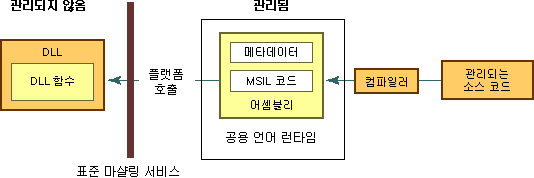

# 관리되지 않는 DLL 함수 사용
플랫폼 호출은 Win32 API의 함수와 같이 DLL(동적 연결 라이브러리)에서 구현된 관리되지 않는 함수를 관리 코드가 호출할 수 있도록 하는 서비스입니다. 이 서비스는 내보낸 함수를 찾아서 호출하고 필요에 따라 상호 운용 경계를 가로질러 인수(정수, 문자열, 배열, 구조체 등)를 마샬링합니다. 이 서비스에 대한 자세한 내용은 [플랫폼 호출 자세히 보기](http://msdn.microsoft.com/en-us/ba9dd55b-2eaa-45cd-8afd-75cb8d64d243)를 참조하세요.  
  
 이 섹션에서는 관리되지 않는 DLL 함수 사용과 관련된 여러 가지 작업을 소개합니다. 다음 작업 이외에 일반적인 고려 사항과 추가 정보 및 예제를 제공하는 링크가 있습니다.  
  
#### 내보낸 DLL 함수를 사용하려면 다음을 수행합니다.  
  
1.  [DLL에서 함수를 식별합니다](../../../docs/framework/interop/identifying-functions-in-dlls.md).  
  
     최소한 함수 이름 및 함수가 포함된 DLL 이름을 지정해야 합니다.  
  
2.  [DLL 함수가 포함된 클래스를 만듭니다](../../../docs/framework/interop/creating-a-class-to-hold-dll-functions.md).  
  
     기존 클래스를 사용하거나, 각 관리되지 않는 함수에 대한 개별 클래스를 만들거나, 관련 관리되지 않는 함수 집합을 포함하는 클래스 하나를 만들 수 있습니다.  
  
3.  [관리 코드에서 프로토타입을 만듭니다](../../../docs/framework/interop/creating-prototypes-in-managed-code.md).  
  
     [Visual Basic] **Declare** 문을 **Function** 및 **Lib** 키워드와 함께 사용합니다. 드물지만 **DllImportAttribute**를 **Shared Function** 키워드와 함께 사용할 수 있습니다. 이러한 경우에 대해서는 이 섹션의 뒷부분에서 설명합니다.  
  
     [C#] **DllImportAttribute**를 사용하여 DLL 및 함수를 식별합니다. **static** 및 **extern** 한정자를 사용하여 메서드를 표시합니다.  
  
     [C++] **DllImportAttribute**를 사용하여 DLL 및 함수를 식별합니다. **extern “C”**를 사용하여 래퍼 메서드 또는 함수를 표시합니다.  
  
4.  [DLL 함수를 호출합니다](../../../docs/framework/interop/calling-a-dll-function.md).  
  
     다른 관리되는 메서드에서 호출하는 것처럼 관리되는 클래스에서 메서드를 호출합니다. [구조체 전달](../../../docs/framework/interop/passing-structures.md) 및 [콜백 함수 구현](../../../docs/framework/interop/callback-functions.md)은 특별한 경우입니다.  
  
 플랫폼 호출에서 사용되는 .NET 기반 선언을 생성하는 방법을 보여 주는 예제는 [플랫폼 호출을 사용하여 데이터 마샬링](../../../docs/framework/interop/marshaling-data-with-platform-invoke.md)을 참조하세요.  
  
## 플랫폼 호출 자세히 보기  
 플랫폼 호출은 메타데이터에 의존하여 내보낸 함수를 찾고 런타임에 해당 인수를 마샬링합니다. 다음 그림에서 이 프로세스를 나타냅니다.  
  
   
관리되는 DLL 함수에 대한 플랫폼 호출  
  
 플랫폼 호출이 관리되지 않는 함수를 호출할 때 다음 작업 시퀀스를 수행합니다.  
  
1.  함수가 포함된 DLL을 찾습니다.  
  
2.  DLL을 메모리로 로드합니다.  
  
3.  메모리에서 함수를 찾고 인수를 스택에 넣어 필요에 따라 데이터를 마샬링합니다.  
  
    > [!NOTE]
    >  DLL을 찾아서 로드하고 메모리에서 함수의 주소를 찾는 작업은 함수에 대한 첫 번째 호출에서만 수행됩니다.  
  
4.  컨트롤을 관리되지 않는 함수에 전송합니다.  
  
 플랫폼 호출은 관리되지 않는 함수에서 생성된 예외를 관리되는 호출자로 throw합니다.  
  
## 참고 항목  
 [비관리 코드와의 상호 운용](../../../docs/framework/interop/index.md)  
 [플랫폼 호출 예제](../../../docs/framework/interop/platform-invoke-examples.md)  
 [interop 마샬링](../../../docs/framework/interop/interop-marshaling.md)  
 [관리되지 않는 DLL 함수 사용](../../../docs/framework/interop/consuming-unmanaged-dll-functions.md)
