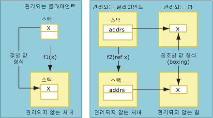
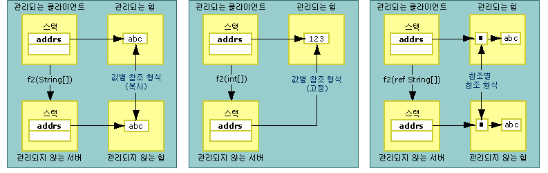

# 복사 및 고정Copying and Pinning
데이터를 마샬링할 때 interop 마샬러는 마샬링되는 데이터를 복사 또는 고정할 수 있습니다.When marshaling data, the interop marshaler can copy or pin the data being marshaled. 데이터를 복사하면 한 메모리 위치의 데이터 복사본이 또 다른 메모리 위치에 배치됩니다.Copying the data places a copy of data from one memory location in another memory location. 다음 그림에서는 값 형식 복사와 관리되는 메모리에서 관리되지 않는 메모리로 참조를 통해 전달되는 형식 복사의 차이점을 보여 줍니다.The following illustration shows the differences between copying a value type and copying a type passed by reference from managed to unmanaged memory.  
  
   
값 및 참조로 전달되는 값 형식Value types passed by value and by reference  
  
 값으로 전달되는 메서드 인수는 스택의 값으로 비관리 코드에 마샬링됩니다.Method arguments passed by value are marshaled to unmanaged code as values on the stack. 복사는 직접 프로세스입니다.The copying process is direct. 참조로 전달된 인수는 스택의 포인터로 전달됩니다.Arguments passed by reference are passed as pointers on the stack. 참조 형식도 값 및 참조로 전달됩니다.Reference types are also passed by value and by reference. 다음 그림과 같이 값으로 전달되는 참조 형식은 복사 또는 고정됩니다.As the following illustration shows, reference types passed by value are either copied or pinned.  
  
   
값 및 참조로 전달되는 참조 형식Reference types passed by value and by reference  
  
 고정 작업은 현재 메모리 위치에서 데이터를 일시적으로 잠그므로 공용 언어 런타임의 가비지 수집기에 의해 데이터가 재배치되지 않습니다.Pinning temporarily locks the data in its current memory location, thus keeping it from being relocated by the common language runtime's garbage collector. 마샬러는 데이터를 고정하여 복사 오버헤드를 줄이고 성능을 개선합니다.The marshaler pins data to reduce the overhead of copying and enhance performance. 데이터 형식에 따라 마샬링 프로세스 중에 복사 또는 고정되는지 결정됩니다.The type of the data determines whether it is copied or pinned during the marshaling process.  고정 작업은 <xref:System.String> 같은 개체의 마샬링 중에 수행되지만 <xref:System.Runtime.InteropServices.GCHandle> 클래스를 사용하여 메모리를 수동으로 고정할 수도 있습니다.Pinning is automatically performed during marshaling for objects such as <xref:System.String>, however you can also manually pin memory using the <xref:System.Runtime.InteropServices.GCHandle> class.  
  
## 서식 있는 Blittable 클래스Formatted Blittable Classes  
 서식 있는 [blittable](../../../docs/framework/interop/blittable-and-non-blittable-types.md) 클래스의 경우 수정된 레이아웃(서식 있음)을 포함하고 관리되는 메모리와 관리되지 않는 메모리에서 모두 공통적인 데이터 표현을 사용합니다.Formatted [blittable](../../../docs/framework/interop/blittable-and-non-blittable-types.md) classes have fixed layout (formatted) and common data representation in both managed and unmanaged memory. 이러한 형식에 마샬링이 필요하면 힙의 개체 포인터가 호출 수신자에게 직접 전달됩니다.When these types require marshaling, a pointer to the object in the heap is passed to the callee directly. 호출 수신자는 포인터로 참조되는 메모리 위치의 콘텐츠를 변경할 수 있습니다.The callee can change the contents of the memory location being referenced by the pointer.  
  
> [!NOTE]
>  매개 변수가 Out 또는 In/Out으로 표시된 경우 호출 수신자는 메모리 콘텐츠를 변경할 수 있습니다. 반면 호출 수신자는 매개 변수가 In(서식 있는 blittable 형식의 기본값)으로 마샬링되도록 설정된 경우 콘텐츠 변경을 피해야 합니다.The callee can change the memory contents if the parameter is marked Out or In/Out. In contrast, the callee should avoid changing the contents when the parameter is set to marshal as In, which is the default for formatted blittable types. In 개체를 수정하면 같은 클래스를 형식 라이브러리로 내보내고 아파트 간 호출을 수행하는 데 사용할 경우 문제가 발생합니다.Modifying an In object generates problems when the same class is exported to a type library and used to make cross-apartment calls.  
  
## 서식 있는 비 Blittable 클래스Formatted Non-Blittable Classes  
 서식 있는 비 [blittable](../../../docs/framework/interop/blittable-and-non-blittable-types.md) 클래스의 경우 수정된 레이아웃(서식 있음)을 포함하지만 관리되는 메모리와 관리되지 않는 메모리에서 서로 다른 데이터 표현을 사용합니다.Formatted [non-blittable](../../../docs/framework/interop/blittable-and-non-blittable-types.md) classes have fixed layout (formatted) but the data representation is different in managed and unmanaged memory. 다음 조건에서는 데이터를 변환해야 할 수 있습니다.The data can require transformation under the following conditions:  
  
-   비 blittable 클래스가 값으로 마샬링될 경우 호출 수신자는 데이터 구조의 복사본 포인터를 받습니다.If a non-blittable class is marshaled by value, the callee receives a pointer to a copy of the data structure.  
  
-   비 blittable 클래스가 참조로 마샬링될 경우 호출 수신자는 데이터 구조의 복사본 포인터에 대한 포인터를 받습니다.If a non-blittable class is marshaled by reference, the callee receives a pointer to a pointer to a copy of the data structure.  
  
-   <xref:System.Runtime.InteropServices.InAttribute> 특성이 설정되면 이 복사본은 항상 인스턴스 상태로 초기화되고 필요에 따라 마샬링됩니다.If the <xref:System.Runtime.InteropServices.InAttribute> attribute is set, this copy is always initialized with the instance's state, marshaling as necessary.  
  
-   <xref:System.Runtime.InteropServices.OutAttribute> 특성이 설정되면 반환 시 항상 상태가 인스턴스로 다시 복사되고 필요에 따라 마샬링됩니다.If the <xref:System.Runtime.InteropServices.OutAttribute> attribute is set, the state is always copied back to the instance on return, marshaling as necessary.  
  
-   **InAttribute** 및 **OutAttribute**가 둘 다 설정되면 두 복사본이 모두 필요합니다.If both **InAttribute** and **OutAttribute** are set, both copies are required. 한쪽 특성이 생략되면 마샬러는 한쪽 복사본을 제거하여 최적화할 수 있습니다.If either attribute is omitted, the marshaler can optimize by eliminating either copy.  
  
## 참조 형식Reference Types  
 참조 형식은 값 또는 참조로 전달될 수 있습니다.Reference types can be passed by value or by reference. 참조 형식이 값으로 전달되면 형식 포인터가 스택에 전달됩니다.When they are passed by value, a pointer to the type is passed on the stack. 참조로 전달될 경우 형식 포인터에 대한 포인터가 스택에 전달됩니다.When passed by reference, a pointer to a pointer to the type is passed on the stack.  
  
 참조 형식에는 다음과 같은 조건부 동작이 있습니다.Reference types have the following conditional behavior:  
  
-   참조 형식이 값으로 전달되고 비 blittable 형식의 멤버를 포함할 경우 형식은 두 번 변환됩니다.If a reference type is passed by value and it has members of non-blittable types, the types are converted twice:  
  
    -   인수가 관리되지 않는 쪽에 전달될 경우.When an argument is passed to the unmanaged side.  
  
    -   호출에서 반환 시.On return from the call.  
  
     불필요한 복사와 변환을 피하기 위해 이러한 형식은 In 매개 변수로 마샬링됩니다.To avoid unnecessarily copying and conversion, these types are marshaled as In parameters. 호출자가 호출 수신자에 의한 변경 내용을 보려면 **InAttribute** 및 **OutAttribute** 특성을 인수에 명시적으로 적용해야 합니다.You must explicitly apply the **InAttribute** and **OutAttribute** attributes to an argument for the caller to see changes made by the callee.  
  
-   참조 형식이 값으로 전달되고 blittable 형식의 멤버만 포함할 경우 형식이 마샬링 중에 고정될 수 있고 호출자는 호출 수신자에 의한 형식 멤버의 변경 내용을 볼 수 있습니다.If a reference type is passed by value and it has only members of blittable types, it can be pinned during marshaling and any changes made to the members of the type by the callee are seen by the caller. 이 동작이 필요한 경우 **InAttribute** 및 **OutAttribute**를 명시적으로 적용합니다.Apply **InAttribute** and **OutAttribute** explicitly if you want this behavior. 방향 특성을 사용하지 않으면 interop 마샬러가 방향 정보를 형식 라이브러리에 내보내지 않고(기본값인 In으로 내보냄), 이로 인해 COM 아파트 간 마샬링에 관련된 문제가 발생할 수 있습니다.Without these directional attributes, the interop marshaler does not export directional information to the type library (it exports as In, which is the default) and this can cause problems with COM cross-apartment marshaling.  
  
-   참조 형식이 참조로 전달되면 형식은 기본적으로 In/Out으로 마샬링됩니다.If a reference type is passed by reference, it will be marshaled as In/Out by default.  
  
## System.String 및 System.Text.StringBuilderSystem.String and System.Text.StringBuilder  
 데이터가 비관리 코드에 값 또는 참조로 마샬링되면 일반적으로 마샬러는 데이터를 보조 버퍼에 복사하고(복사 중에 문자 집합을 변환할 수 있음) 버퍼 참조를 호출 수신자에게 전달합니다.When data is marshaled to unmanaged code by value or by reference, the marshaler typically copies the data to a secondary buffer (possibly converting character sets during the copy) and passes a reference to the buffer to the callee. 참조가 **SysAllocString**을 사용하여 할당된 **BSTR**이 아니면 참조는 항상 **CoTaskMemAlloc**를 사용하여 할당됩니다.Unless the reference is a **BSTR** allocated with **SysAllocString**, the reference is always allocated with **CoTaskMemAlloc**.  
  
 한쪽 문자열 형식이 값(예: 유니코드 문자 문자열)으로 마샬링될 경우의 최적화처럼 마샬러는 새 버퍼에 복사하는 대신 내부 유니코드 버퍼의 관리되는 문자열에 대한 직접 포인터를 호출 수신자에게 전달합니다.As an optimization when either string type is marshaled by value (such as a Unicode character string), the marshaler passes the callee a direct pointer to managed strings in the internal Unicode buffer instead of copying it to a new buffer.  
  
> [!CAUTION]
>  문자열이 값으로 전달되면 호출 수신자는 마샬러가 전달한 참조를 변경할 수 없습니다.When a string is passed by value, the callee must never alter the reference passed by the marshaler. 변경하면 관리되는 힙이 손상될 수 있습니다.Doing so can corrupt the managed heap.  
  
 <xref:System.String?displayProperty=nameWithType>이 참조로 전달되면 마샬러는 호출을 수행하기 전에 문자열 콘텐츠를 보조 버퍼에 복사합니다.When a <xref:System.String?displayProperty=nameWithType> is passed by reference, the marshaler copies the contents the string to a secondary buffer before making the call. 그런 다음 호출에서 반환 시 버퍼 콘텐츠를 새 문자열에 복사합니다.It then copies the contents of the buffer into a new string on return from the call. 이 방법을 사용하면 변경할 수 없는 관리되는 문자열이 변경되지 않습니다.This technique ensures that the immutable managed string remains unaltered.  
  
 <xref:System.Text.StringBuilder?displayProperty=nameWithType>가 값으로 전달되면 마샬러는 **StringBuilder**의 내부 버퍼에 대한 참조를 호출자에게 직접 전달합니다.When a <xref:System.Text.StringBuilder?displayProperty=nameWithType> is passed by value, the marshaler passes a reference to the internal buffer of the **StringBuilder** directly to the caller. 호출자와 호출 수신자가 버퍼 크기가 동의해야 합니다.The caller and callee must agree on the size of the buffer. 호출자는 적절한 길이의 **StringBuilder**를 만들어야 합니다.The caller is responsible for creating a **StringBuilder** of adequate length. 호출 수신자는 버퍼가 오버런되지 않도록 필요한 예방 조치를 수행해야 합니다.The callee must take the necessary precautions to ensure that the buffer is not overrun. **StringBuilder**는 값으로 전달되는 참조 형식이 기본적으로 In 매개 변수로 전달되는 규칙의 예외입니다.**StringBuilder** is an exception to the rule that reference types passed by value are passed as In parameters by default. 항상 In/Out으로 전달됩니다.It is always passed as In/Out.  
  
## 참고 항목See Also  
 [기본 마샬링 동작Default Marshaling Behavior](../../../docs/framework/interop/default-marshaling-behavior.md)  
 [Interop 마샬러를 사용한 메모리 관리Memory Management with the Interop Marshaler](http://msdn.microsoft.com/library/417206ce-ee3e-4619-9529-0c0b686c7bee)  
 [방향 특성Directional Attributes](http://msdn.microsoft.com/library/241ac5b5-928e-4969-8f58-1dbc048f9ea2)  
 [interop 마샬링Interop Marshaling](../../../docs/framework/interop/interop-marshaling.md)
