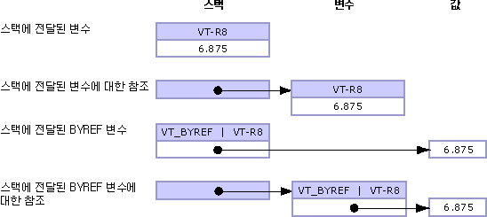

# <a name="default-marshaling-for-objects"></a><span data-ttu-id="dcbb8-102">개체에 대한 마샬링</span><span class="sxs-lookup"><span data-stu-id="dcbb8-102">Default Marshaling for Objects</span></span>
<span data-ttu-id="dcbb8-103"><xref:System.Object?displayProperty=nameWithType>로 형식화된 매개 변수와 필드는 비관리 코드에 다음 형식 하나로 표시할 수 있습니다.</span><span class="sxs-lookup"><span data-stu-id="dcbb8-103">Parameters and fields typed as <xref:System.Object?displayProperty=nameWithType> can be exposed to unmanaged code as one of the following types:</span></span>  
  
-   <span data-ttu-id="dcbb8-104">개체가 매개 변수인 경우 변형.</span><span class="sxs-lookup"><span data-stu-id="dcbb8-104">A variant when the object is a parameter.</span></span>  
  
-   <span data-ttu-id="dcbb8-105">개체가 구조체 필드인 경우 인터페이스.</span><span class="sxs-lookup"><span data-stu-id="dcbb8-105">An interface when the object is a structure field.</span></span>  
  
 <span data-ttu-id="dcbb8-106">COM interop만 개체 형식에 대한 마샬링을 지원합니다.</span><span class="sxs-lookup"><span data-stu-id="dcbb8-106">Only COM interop supports marshaling for object types.</span></span> <span data-ttu-id="dcbb8-107">기본 동작은 개체를 COM 변형으로 마샬링하는 것입니다.</span><span class="sxs-lookup"><span data-stu-id="dcbb8-107">The default behavior is to marshal objects to COM variants.</span></span> <span data-ttu-id="dcbb8-108">이러한 규칙은 **개체**에만 적용되고 **Object** 클래스에서 파생되는 강력한 형식의 개체에는 적용되지 않습니다.</span><span class="sxs-lookup"><span data-stu-id="dcbb8-108">These rules apply only to the type **Object** and do not apply to strongly typed objects that derive from the **Object** class.</span></span>  
  
 <span data-ttu-id="dcbb8-109">이 항목에서는 개체 형식 마샬링에 대한 다음과 같은 추가 정보를 제공합니다.</span><span class="sxs-lookup"><span data-stu-id="dcbb8-109">This topic provides the following additional information about marshaling object types:</span></span>  
  
-   [<span data-ttu-id="dcbb8-110">마샬링 옵션</span><span class="sxs-lookup"><span data-stu-id="dcbb8-110">Marshaling Options</span></span>](#cpcondefaultmarshalingforobjectsanchor7)  
  
-   [<span data-ttu-id="dcbb8-111">인터페이스에 개체 마샬링</span><span class="sxs-lookup"><span data-stu-id="dcbb8-111">Marshaling Object to Interface</span></span>](#cpcondefaultmarshalingforobjectsanchor2)  
  
-   [<span data-ttu-id="dcbb8-112">변형에 개체 마샬링</span><span class="sxs-lookup"><span data-stu-id="dcbb8-112">Marshaling Object to Variant</span></span>](#cpcondefaultmarshalingforobjectsanchor3)  
  
-   [<span data-ttu-id="dcbb8-113">개체에 변형 마샬링</span><span class="sxs-lookup"><span data-stu-id="dcbb8-113">Marshaling Variant to Object</span></span>](#cpcondefaultmarshalingforobjectsanchor4)  
  
-   [<span data-ttu-id="dcbb8-114">ByRef 변형 마샬링</span><span class="sxs-lookup"><span data-stu-id="dcbb8-114">Marshaling ByRef Variants</span></span>](#cpcondefaultmarshalingforobjectsanchor6)  
  
<a name="cpcondefaultmarshalingforobjectsanchor7"></a>   
## <a name="marshaling-options"></a><span data-ttu-id="dcbb8-115">마샬링 옵션</span><span class="sxs-lookup"><span data-stu-id="dcbb8-115">Marshaling Options</span></span>  
 <span data-ttu-id="dcbb8-116">다음 표에서는 **Object** 데이터 형식에 대한 마샬링 옵션을 보여 줍니다.</span><span class="sxs-lookup"><span data-stu-id="dcbb8-116">The following table shows the marshaling options for the **Object** data type.</span></span> <span data-ttu-id="dcbb8-117"><xref:System.Runtime.InteropServices.MarshalAsAttribute> 특성은 개체를 마샬링하기 위한 여러 <xref:System.Runtime.InteropServices.UnmanagedType> 열거형 값을 제공합니다.</span><span class="sxs-lookup"><span data-stu-id="dcbb8-117">The <xref:System.Runtime.InteropServices.MarshalAsAttribute> attribute provides several <xref:System.Runtime.InteropServices.UnmanagedType> enumeration values to marshal objects.</span></span>  
  
|<span data-ttu-id="dcbb8-118">열거형 형식</span><span class="sxs-lookup"><span data-stu-id="dcbb8-118">Enumeration type</span></span>|<span data-ttu-id="dcbb8-119">관리되지 않는 형식에 대한 설명</span><span class="sxs-lookup"><span data-stu-id="dcbb8-119">Description of unmanaged format</span></span>|  
|----------------------|-------------------------------------|  
|<span data-ttu-id="dcbb8-120">**UnmanagedType.Struct**</span><span class="sxs-lookup"><span data-stu-id="dcbb8-120">**UnmanagedType.Struct**</span></span><br /><br /> <span data-ttu-id="dcbb8-121">(매개 변수 기본값)</span><span class="sxs-lookup"><span data-stu-id="dcbb8-121">(default for parameters)</span></span>|<span data-ttu-id="dcbb8-122">COM 스타일 변형.</span><span class="sxs-lookup"><span data-stu-id="dcbb8-122">A COM-style variant.</span></span>|  
|<span data-ttu-id="dcbb8-123">**UnmanagedType.Interface**</span><span class="sxs-lookup"><span data-stu-id="dcbb8-123">**UnmanagedType.Interface**</span></span>|<span data-ttu-id="dcbb8-124">**IDispatch** 인터페이스(가능한 경우), 이외에는 **IUnknown** 인터페이스.</span><span class="sxs-lookup"><span data-stu-id="dcbb8-124">An **IDispatch** interface, if possible; otherwise, an **IUnknown** interface.</span></span>|  
|<span data-ttu-id="dcbb8-125">**UnmanagedType.IUnknown**</span><span class="sxs-lookup"><span data-stu-id="dcbb8-125">**UnmanagedType.IUnknown**</span></span><br /><br /> <span data-ttu-id="dcbb8-126">(필드 기본값)</span><span class="sxs-lookup"><span data-stu-id="dcbb8-126">(default for fields)</span></span>|<span data-ttu-id="dcbb8-127">**IUnknown** 인터페이스.</span><span class="sxs-lookup"><span data-stu-id="dcbb8-127">An **IUnknown** interface.</span></span>|  
|<span data-ttu-id="dcbb8-128">**UnmanagedType.IDispatch**</span><span class="sxs-lookup"><span data-stu-id="dcbb8-128">**UnmanagedType.IDispatch**</span></span>|<span data-ttu-id="dcbb8-129">**IDispatch** 인터페이스.</span><span class="sxs-lookup"><span data-stu-id="dcbb8-129">An **IDispatch** interface.</span></span>|  
  
 <span data-ttu-id="dcbb8-130">다음 예제에서는 `MarshalObject`에 대한 관리되는 인터페이스 정의를 보여 줍니다.</span><span class="sxs-lookup"><span data-stu-id="dcbb8-130">The following example shows the managed interface definition for `MarshalObject`.</span></span>  
  
```vb  
Interface MarshalObject  
   Sub SetVariant(o As Object)  
   Sub SetVariantRef(ByRef o As Object)  
   Function GetVariant() As Object  
  
   Sub SetIDispatch( <MarshalAs(UnmanagedType.IDispatch)> o As Object)  
   Sub SetIDispatchRef(ByRef <MarshalAs(UnmanagedType.IDispatch)> o _  
      As Object)  
   Function GetIDispatch() As <MarshalAs(UnmanagedType.IDispatch)> Object  
   Sub SetIUnknown( <MarshalAs(UnmanagedType.IUnknown)> o As Object)  
   Sub SetIUnknownRef(ByRef <MarshalAs(UnmanagedType.IUnknown)> o _  
      As Object)  
   Function GetIUnknown() As <MarshalAs(UnmanagedType.IUnknown)> Object  
End Interface  
```  
  
```csharp  
interface MarshalObject {  
   void SetVariant(Object o);  
   void SetVariantRef(ref Object o);  
   Object GetVariant();  
  
   void SetIDispatch ([MarshalAs(UnmanagedType.IDispatch)]Object o);  
   void SetIDispatchRef([MarshalAs(UnmanagedType.IDispatch)]ref Object o);  
   [MarshalAs(UnmanagedType.IDispatch)] Object GetIDispatch();  
   void SetIUnknown ([MarshalAs(UnmanagedType.IUnknown)]Object o);  
   void SetIUnknownRef([MarshalAs(UnmanagedType.IUnknown)]ref Object o);  
   [MarshalAs(UnmanagedType.IUnknown)] Object GetIUnknown();  
}  
```  
  
 <span data-ttu-id="dcbb8-131">다음 코드는 `MarshalObject` 인터페이스를 형식 라이브러리에 내보냅니다.</span><span class="sxs-lookup"><span data-stu-id="dcbb8-131">The following code exports the `MarshalObject` interface to a type library.</span></span>  
  
```  
interface MarshalObject {  
   HRESULT SetVariant([in] VARIANT o);  
   HRESULT SetVariantRef([in,out] VARIANT *o);  
   HRESULT GetVariant([out,retval] VARIANT *o)   
   HRESULT SetIDispatch([in] IDispatch *o);  
   HRESULT SetIDispatchRef([in,out] IDispatch **o);  
   HRESULT GetIDispatch([out,retval] IDispatch **o)   
   HRESULT SetIUnknown([in] IUnknown *o);  
   HRESULT SetIUnknownRef([in,out] IUnknown **o);  
   HRESULT GetIUnknown([out,retval] IUnknown **o)   
}  
```  
  
> [!NOTE]
>  <span data-ttu-id="dcbb8-132">Interop 마샬러는 호출한 후 변형 내부에서 할당된 메모리를 자동으로 해제합니다.</span><span class="sxs-lookup"><span data-stu-id="dcbb8-132">The interop marshaler automatically frees any allocated object inside the variant after the call.</span></span>  
  
 <span data-ttu-id="dcbb8-133">다음 예제에서는 서식 있는 값 형식을 보여 줍니다.</span><span class="sxs-lookup"><span data-stu-id="dcbb8-133">The following example shows a formatted value type.</span></span>  
  
```vb  
Public Structure ObjectHolder  
   Dim o1 As Object  
   <MarshalAs(UnmanagedType.IDispatch)> Public o2 As Object  
End Structure  
```  
  
```csharp  
public struct ObjectHolder {  
   Object o1;  
   [MarshalAs(UnmanagedType.IDispatch)]public Object o2;  
}  
```  
  
 <span data-ttu-id="dcbb8-134">다음 코드는 서식 있는 형식을 형식 라이브러리에 내보냅니다.</span><span class="sxs-lookup"><span data-stu-id="dcbb8-134">The following code exports the formatted type to a type library.</span></span>  
  
```  
struct ObjectHolder {  
   VARIANT o1;  
   IDispatch *o2;  
}  
```  
  
<a name="cpcondefaultmarshalingforobjectsanchor2"></a>   
## <a name="marshaling-object-to-interface"></a><span data-ttu-id="dcbb8-135">인터페이스에 개체 마샬링</span><span class="sxs-lookup"><span data-stu-id="dcbb8-135">Marshaling Object to Interface</span></span>  
 <span data-ttu-id="dcbb8-136">개체가 COM에 인터페이스로 노출되면 해당 인터페이스는 관리되는 형식 <xref:System.Object>에 대한 클래스 인터페이스입니다(**_Object** 인터페이스).</span><span class="sxs-lookup"><span data-stu-id="dcbb8-136">When an object is exposed to COM as an interface, that interface is the class interface for the managed type <xref:System.Object> (the **_Object** interface).</span></span> <span data-ttu-id="dcbb8-137">이 인터페이스는 결과 형식 라이브러리에서 **IDispatch**(<xref:System.Runtime.InteropServices.UnmanagedType>) 또는 **IUnknown**(**UnmanagedType.IUnknown**)으로 형식화됩니다.</span><span class="sxs-lookup"><span data-stu-id="dcbb8-137">This interface is typed as an **IDispatch** (<xref:System.Runtime.InteropServices.UnmanagedType>) or an **IUnknown** (**UnmanagedType.IUnknown**) in the resulting type library.</span></span> <span data-ttu-id="dcbb8-138">COM 클라이언트는 **_Object** 인터페이스를 통해 관리되는 클래스 또는 파생 클래스에 의해 구현된 모든 멤버를 동적으로 호출할 수 있습니다.</span><span class="sxs-lookup"><span data-stu-id="dcbb8-138">COM clients can dynamically invoke the members of the managed class or any members implemented by its derived classes through the **_Object** interface.</span></span> <span data-ttu-id="dcbb8-139">클라이언트는 **QueryInterface**를 호출하여 관리되는 형식에 의해 명시적으로 구현된 다른 인터페이스를 가져올 수도 있습니다.</span><span class="sxs-lookup"><span data-stu-id="dcbb8-139">The client can also call **QueryInterface** to obtain any other interface explicitly implemented by the managed type.</span></span>  
  
<a name="cpcondefaultmarshalingforobjectsanchor3"></a>   
## <a name="marshaling-object-to-variant"></a><span data-ttu-id="dcbb8-140">변형에 개체 마샬링</span><span class="sxs-lookup"><span data-stu-id="dcbb8-140">Marshaling Object to Variant</span></span>  
 <span data-ttu-id="dcbb8-141">개체가 변형에 마샬링되면 내부 변형 형식은 런타임에 다음 규칙에 따라 결정됩니다.</span><span class="sxs-lookup"><span data-stu-id="dcbb8-141">When an object is marshaled to a variant, the internal variant type is determined at run time, based on the following rules:</span></span>  
  
-   <span data-ttu-id="dcbb8-142">개체 참조가 null(Visual Basic의 경우 **Nothing**)이면 개체는 **VT_EMPTY** 형식 변형에 마샬링됩니다.</span><span class="sxs-lookup"><span data-stu-id="dcbb8-142">If the object reference is null (**Nothing** in Visual Basic), the object is marshaled to a variant of type **VT_EMPTY**.</span></span>  
  
-   <span data-ttu-id="dcbb8-143">개체가 다음 표에 나열된 형식의 인스턴스이면 결과 변형 형식은 표에 나와 있는 대로 마샬러에 기본 제공된 규칙에 따라 결정됩니다.</span><span class="sxs-lookup"><span data-stu-id="dcbb8-143">If the object is an instance of any type listed in the following table, the resulting variant type is determined by the rules built into the marshaler and shown in the table.</span></span>  
  
-   <span data-ttu-id="dcbb8-144">마샬링 동작을 명시적으로 제어해야 하는 기타 개체는 <xref:System.IConvertible> 인터페이스를 구현합니다.</span><span class="sxs-lookup"><span data-stu-id="dcbb8-144">Other objects that need to explicitly control the marshaling behavior can implement the <xref:System.IConvertible> interface.</span></span> <span data-ttu-id="dcbb8-145">이 경우 변형 형식은 <xref:System.IConvertible.GetTypeCode%2A?displayProperty=nameWithType> 메서드에서 반환된 형식 코드에 의해 결정됩니다.</span><span class="sxs-lookup"><span data-stu-id="dcbb8-145">In that case, the variant type is determined by the type code returned from the <xref:System.IConvertible.GetTypeCode%2A?displayProperty=nameWithType> method.</span></span> <span data-ttu-id="dcbb8-146">이외의 경우에는 개체가 **VT_UNKNOWN** 형식 변형으로 마샬링됩니다.</span><span class="sxs-lookup"><span data-stu-id="dcbb8-146">Otherwise, the object is marshaled as a variant of type **VT_UNKNOWN**.</span></span>  
  
### <a name="marshaling-system-types-to-variant"></a><span data-ttu-id="dcbb8-147">변형에 시스템 형식 마샬링</span><span class="sxs-lookup"><span data-stu-id="dcbb8-147">Marshaling System Types to Variant</span></span>  
 <span data-ttu-id="dcbb8-148">다음 표에서는 관리 개체 형식 및 해당 COM 변형 형식을 보여 줍니다.</span><span class="sxs-lookup"><span data-stu-id="dcbb8-148">The following table shows managed object types and their corresponding COM variant types.</span></span> <span data-ttu-id="dcbb8-149">이러한 형식은 호출되는 메서드의 시그니처가 <xref:System.Object?displayProperty=nameWithType> 형식인 경우에만 변환됩니다.</span><span class="sxs-lookup"><span data-stu-id="dcbb8-149">These types are converted only when the signature of the method being called is of type <xref:System.Object?displayProperty=nameWithType>.</span></span>  
  
|<span data-ttu-id="dcbb8-150">개체 유형</span><span class="sxs-lookup"><span data-stu-id="dcbb8-150">Object type</span></span>|<span data-ttu-id="dcbb8-151">COM 변형 형식</span><span class="sxs-lookup"><span data-stu-id="dcbb8-151">COM variant type</span></span>|  
|-----------------|----------------------|  
|<span data-ttu-id="dcbb8-152">Null 개체 참조(Visual Basic의 경우 **Nothing**).</span><span class="sxs-lookup"><span data-stu-id="dcbb8-152">Null object reference (**Nothing** in Visual Basic).</span></span>|<span data-ttu-id="dcbb8-153">**VT_EMPTY**</span><span class="sxs-lookup"><span data-stu-id="dcbb8-153">**VT_EMPTY**</span></span>|  
|<xref:System.DBNull?displayProperty=nameWithType>|<span data-ttu-id="dcbb8-154">**VT_NULL**</span><span class="sxs-lookup"><span data-stu-id="dcbb8-154">**VT_NULL**</span></span>|  
|<xref:System.Runtime.InteropServices.ErrorWrapper?displayProperty=nameWithType>|<span data-ttu-id="dcbb8-155">**VT_ERROR**</span><span class="sxs-lookup"><span data-stu-id="dcbb8-155">**VT_ERROR**</span></span>|  
|<xref:System.Reflection.Missing?displayProperty=nameWithType>|<span data-ttu-id="dcbb8-156">**VT_ERROR**(**E_PARAMNOTFOUND** 포함)</span><span class="sxs-lookup"><span data-stu-id="dcbb8-156">**VT_ERROR** with **E_PARAMNOTFOUND**</span></span>|  
|<xref:System.Runtime.InteropServices.DispatchWrapper?displayProperty=nameWithType>|<span data-ttu-id="dcbb8-157">**VT_DISPATCH**</span><span class="sxs-lookup"><span data-stu-id="dcbb8-157">**VT_DISPATCH**</span></span>|  
|<xref:System.Runtime.InteropServices.UnknownWrapper?displayProperty=nameWithType>|<span data-ttu-id="dcbb8-158">**VT_UNKNOWN**</span><span class="sxs-lookup"><span data-stu-id="dcbb8-158">**VT_UNKNOWN**</span></span>|  
|<xref:System.Runtime.InteropServices.CurrencyWrapper?displayProperty=nameWithType>|<span data-ttu-id="dcbb8-159">**VT_CY**</span><span class="sxs-lookup"><span data-stu-id="dcbb8-159">**VT_CY**</span></span>|  
|<xref:System.Boolean?displayProperty=nameWithType>|<span data-ttu-id="dcbb8-160">**VT_BOOL**</span><span class="sxs-lookup"><span data-stu-id="dcbb8-160">**VT_BOOL**</span></span>|  
|<xref:System.SByte?displayProperty=nameWithType>|<span data-ttu-id="dcbb8-161">**VT_I1**</span><span class="sxs-lookup"><span data-stu-id="dcbb8-161">**VT_I1**</span></span>|  
|<xref:System.Byte?displayProperty=nameWithType>|<span data-ttu-id="dcbb8-162">**VT_UI1**</span><span class="sxs-lookup"><span data-stu-id="dcbb8-162">**VT_UI1**</span></span>|  
|<xref:System.Int16?displayProperty=nameWithType>|<span data-ttu-id="dcbb8-163">**VT_I2**</span><span class="sxs-lookup"><span data-stu-id="dcbb8-163">**VT_I2**</span></span>|  
|<xref:System.UInt16?displayProperty=nameWithType>|<span data-ttu-id="dcbb8-164">**VT_UI2**</span><span class="sxs-lookup"><span data-stu-id="dcbb8-164">**VT_UI2**</span></span>|  
|<xref:System.Int32?displayProperty=nameWithType>|<span data-ttu-id="dcbb8-165">**VT_I4**</span><span class="sxs-lookup"><span data-stu-id="dcbb8-165">**VT_I4**</span></span>|  
|<xref:System.UInt32?displayProperty=nameWithType>|<span data-ttu-id="dcbb8-166">**VT_UI4**</span><span class="sxs-lookup"><span data-stu-id="dcbb8-166">**VT_UI4**</span></span>|  
|<xref:System.Int64?displayProperty=nameWithType>|<span data-ttu-id="dcbb8-167">**VT_I8**</span><span class="sxs-lookup"><span data-stu-id="dcbb8-167">**VT_I8**</span></span>|  
|<xref:System.UInt64?displayProperty=nameWithType>|<span data-ttu-id="dcbb8-168">**VT_UI8**</span><span class="sxs-lookup"><span data-stu-id="dcbb8-168">**VT_UI8**</span></span>|  
|<xref:System.Single?displayProperty=nameWithType>|<span data-ttu-id="dcbb8-169">**VT_R4**</span><span class="sxs-lookup"><span data-stu-id="dcbb8-169">**VT_R4**</span></span>|  
|<xref:System.Double?displayProperty=nameWithType>|<span data-ttu-id="dcbb8-170">**VT_R8**</span><span class="sxs-lookup"><span data-stu-id="dcbb8-170">**VT_R8**</span></span>|  
|<xref:System.Decimal?displayProperty=nameWithType>|<span data-ttu-id="dcbb8-171">**VT_DECIMAL**</span><span class="sxs-lookup"><span data-stu-id="dcbb8-171">**VT_DECIMAL**</span></span>|  
|<xref:System.DateTime?displayProperty=nameWithType>|<span data-ttu-id="dcbb8-172">**VT_DATE**</span><span class="sxs-lookup"><span data-stu-id="dcbb8-172">**VT_DATE**</span></span>|  
|<xref:System.String?displayProperty=nameWithType>|<span data-ttu-id="dcbb8-173">**VT_BSTR**</span><span class="sxs-lookup"><span data-stu-id="dcbb8-173">**VT_BSTR**</span></span>|  
|<xref:System.IntPtr?displayProperty=nameWithType>|<span data-ttu-id="dcbb8-174">**VT_INT**</span><span class="sxs-lookup"><span data-stu-id="dcbb8-174">**VT_INT**</span></span>|  
|<xref:System.UIntPtr?displayProperty=nameWithType>|<span data-ttu-id="dcbb8-175">**VT_UINT**</span><span class="sxs-lookup"><span data-stu-id="dcbb8-175">**VT_UINT**</span></span>|  
|<xref:System.Array?displayProperty=nameWithType>|<span data-ttu-id="dcbb8-176">**VT_ARRAY**</span><span class="sxs-lookup"><span data-stu-id="dcbb8-176">**VT_ARRAY**</span></span>|  
  
 <span data-ttu-id="dcbb8-177">다음 코드 예제에서는 이전 예제에서 정의된 `MarshalObject` 인터페이스를 사용하여 다양한 변형 형식을 COM 서버에 전달하는 방법을 보여 줍니다.</span><span class="sxs-lookup"><span data-stu-id="dcbb8-177">Using the `MarshalObject` interface defined in the previous example, the following code example demonstrates how to pass various types of variants to a COM server.</span></span>  
  
```vb  
Dim mo As New MarshalObject()  
mo.SetVariant(Nothing)         ' Marshal as variant of type VT_EMPTY.  
mo.SetVariant(System.DBNull.Value) ' Marshal as variant of type VT_NULL.  
mo.SetVariant(CInt(27))        ' Marshal as variant of type VT_I2.  
mo.SetVariant(CLng(27))        ' Marshal as variant of type VT_I4.  
mo.SetVariant(CSng(27.0))      ' Marshal as variant of type VT_R4.  
mo.SetVariant(CDbl(27.0))      ' Marshal as variant of type VT_R8.  
```  
  
```csharp  
MarshalObject mo = new MarshalObject();  
mo.SetVariant(null);            // Marshal as variant of type VT_EMPTY.  
mo.SetVariant(System.DBNull.Value); // Marshal as variant of type VT_NULL.  
mo.SetVariant((int)27);          // Marshal as variant of type VT_I2.  
mo.SetVariant((long)27);          // Marshal as variant of type VT_I4.  
mo.SetVariant((single)27.0);   // Marshal as variant of type VT_R4.  
mo.SetVariant((double)27.0);   // Marshal as variant of type VT_R8.  
```  
  
 <span data-ttu-id="dcbb8-178">일치하는 관리되는 형식이 없는 COM 형식은 <xref:System.Runtime.InteropServices.ErrorWrapper>, <xref:System.Runtime.InteropServices.DispatchWrapper>, <xref:System.Runtime.InteropServices.UnknownWrapper>, <xref:System.Runtime.InteropServices.CurrencyWrapper> 등의 래퍼 클래스를 사용하여 마샬링할 수 있습니다.</span><span class="sxs-lookup"><span data-stu-id="dcbb8-178">COM types that do not have corresponding managed types can be marshaled using wrapper classes such as <xref:System.Runtime.InteropServices.ErrorWrapper>, <xref:System.Runtime.InteropServices.DispatchWrapper>, <xref:System.Runtime.InteropServices.UnknownWrapper>, and <xref:System.Runtime.InteropServices.CurrencyWrapper>.</span></span> <span data-ttu-id="dcbb8-179">다음 코드 예제에서는 이러한 래퍼를 사용하여 다양한 변형 형식을 COM 서버에 전달하는 방법을 보여 줍니다.</span><span class="sxs-lookup"><span data-stu-id="dcbb8-179">The following code example demonstrates how to use these wrappers to pass various types of variants to a COM server.</span></span>  
  
```vb  
Imports System.Runtime.InteropServices  
' Pass inew as a variant of type VT_UNKNOWN interface.  
mo.SetVariant(New UnknownWrapper(inew))  
' Pass inew as a variant of type VT_DISPATCH interface.  
mo.SetVariant(New DispatchWrapper(inew))  
' Pass a value as a variant of type VT_ERROR interface.  
mo.SetVariant(New ErrorWrapper(&H80054002))  
' Pass a value as a variant of type VT_CURRENCY interface.  
mo.SetVariant(New CurrencyWrapper(New Decimal(5.25)))  
```  
  
```csharp  
using System.Runtime.InteropServices;  
// Pass inew as a variant of type VT_UNKNOWN interface.  
mo.SetVariant(new UnknownWrapper(inew));  
// Pass inew as a variant of type VT_DISPATCH interface.  
mo.SetVariant(new DispatchWrapper(inew));  
// Pass a value as a variant of type VT_ERROR interface.  
mo.SetVariant(new ErrorWrapper(0x80054002));  
// Pass a value as a variant of type VT_CURRENCY interface.  
mo.SetVariant(new CurrencyWrapper(new Decimal(5.25)));  
```  
  
 <span data-ttu-id="dcbb8-180">래퍼 클래스는 <xref:System.Runtime.InteropServices> 네임스페이스에서 정의됩니다.</span><span class="sxs-lookup"><span data-stu-id="dcbb8-180">The wrapper classes are defined in the <xref:System.Runtime.InteropServices> namespace.</span></span>  
  
### <a name="marshaling-the-iconvertible-interface-to-variant"></a><span data-ttu-id="dcbb8-181">변형에 IConvertible 인터페이스 마샬링</span><span class="sxs-lookup"><span data-stu-id="dcbb8-181">Marshaling the IConvertible Interface to Variant</span></span>  
 <span data-ttu-id="dcbb8-182">이전 섹션에 나와 있지 않은 형식의 경우 <xref:System.IConvertible> 인터페이스를 구현하여 형식을 마샬링하는 방법을 제어할 수 있습니다.</span><span class="sxs-lookup"><span data-stu-id="dcbb8-182">Types other than those listed in the previous section can control how they are marshaled by implementing the <xref:System.IConvertible> interface.</span></span> <span data-ttu-id="dcbb8-183">개체가 **IConvertible** 인터페이스를 구현할 경우 COM 변형 형식은 런타임에 <xref:System.IConvertible.GetTypeCode%2A?displayProperty=nameWithType> 메서드에서 반환된 <xref:System.TypeCode> 열거형 값에 따라 결정됩니다.</span><span class="sxs-lookup"><span data-stu-id="dcbb8-183">If the object implements the **IConvertible** interface, the COM variant type is determined at run time by the value of the <xref:System.TypeCode> enumeration returned from the <xref:System.IConvertible.GetTypeCode%2A?displayProperty=nameWithType> method.</span></span>  
  
 <span data-ttu-id="dcbb8-184">다음 표에서는 **TypeCode** 열거형의 가능한 값과 각 값에 대한 일치하는 COM 변형 형식을 보여 줍니다.</span><span class="sxs-lookup"><span data-stu-id="dcbb8-184">The following table shows the possible values for the **TypeCode** enumeration and the corresponding COM variant type for each value.</span></span>  
  
|<span data-ttu-id="dcbb8-185">TypeCode</span><span class="sxs-lookup"><span data-stu-id="dcbb8-185">TypeCode</span></span>|<span data-ttu-id="dcbb8-186">COM 변형 형식</span><span class="sxs-lookup"><span data-stu-id="dcbb8-186">COM variant type</span></span>|  
|--------------|----------------------|  
|<span data-ttu-id="dcbb8-187">**TypeCode.Empty**</span><span class="sxs-lookup"><span data-stu-id="dcbb8-187">**TypeCode.Empty**</span></span>|<span data-ttu-id="dcbb8-188">**VT_EMPTY**</span><span class="sxs-lookup"><span data-stu-id="dcbb8-188">**VT_EMPTY**</span></span>|  
|<span data-ttu-id="dcbb8-189">**TypeCode.Object**</span><span class="sxs-lookup"><span data-stu-id="dcbb8-189">**TypeCode.Object**</span></span>|<span data-ttu-id="dcbb8-190">**VT_UNKNOWN**</span><span class="sxs-lookup"><span data-stu-id="dcbb8-190">**VT_UNKNOWN**</span></span>|  
|<span data-ttu-id="dcbb8-191">**TypeCode.DBNull**</span><span class="sxs-lookup"><span data-stu-id="dcbb8-191">**TypeCode.DBNull**</span></span>|<span data-ttu-id="dcbb8-192">**VT_NULL**</span><span class="sxs-lookup"><span data-stu-id="dcbb8-192">**VT_NULL**</span></span>|  
|<span data-ttu-id="dcbb8-193">**TypeCode.Boolean**</span><span class="sxs-lookup"><span data-stu-id="dcbb8-193">**TypeCode.Boolean**</span></span>|<span data-ttu-id="dcbb8-194">**VT_BOOL**</span><span class="sxs-lookup"><span data-stu-id="dcbb8-194">**VT_BOOL**</span></span>|  
|<span data-ttu-id="dcbb8-195">**TypeCode.Char**</span><span class="sxs-lookup"><span data-stu-id="dcbb8-195">**TypeCode.Char**</span></span>|<span data-ttu-id="dcbb8-196">**VT_UI2**</span><span class="sxs-lookup"><span data-stu-id="dcbb8-196">**VT_UI2**</span></span>|  
|<span data-ttu-id="dcbb8-197">**TypeCode.Sbyte**</span><span class="sxs-lookup"><span data-stu-id="dcbb8-197">**TypeCode.Sbyte**</span></span>|<span data-ttu-id="dcbb8-198">**VT_I1**</span><span class="sxs-lookup"><span data-stu-id="dcbb8-198">**VT_I1**</span></span>|  
|<span data-ttu-id="dcbb8-199">**TypeCode.Byte**</span><span class="sxs-lookup"><span data-stu-id="dcbb8-199">**TypeCode.Byte**</span></span>|<span data-ttu-id="dcbb8-200">**VT_UI1**</span><span class="sxs-lookup"><span data-stu-id="dcbb8-200">**VT_UI1**</span></span>|  
|<span data-ttu-id="dcbb8-201">**TypeCode.Int16**</span><span class="sxs-lookup"><span data-stu-id="dcbb8-201">**TypeCode.Int16**</span></span>|<span data-ttu-id="dcbb8-202">**VT_I2**</span><span class="sxs-lookup"><span data-stu-id="dcbb8-202">**VT_I2**</span></span>|  
|<span data-ttu-id="dcbb8-203">**TypeCode.UInt16**</span><span class="sxs-lookup"><span data-stu-id="dcbb8-203">**TypeCode.UInt16**</span></span>|<span data-ttu-id="dcbb8-204">**VT_UI2**</span><span class="sxs-lookup"><span data-stu-id="dcbb8-204">**VT_UI2**</span></span>|  
|<span data-ttu-id="dcbb8-205">**TypeCode.Int32**</span><span class="sxs-lookup"><span data-stu-id="dcbb8-205">**TypeCode.Int32**</span></span>|<span data-ttu-id="dcbb8-206">**VT_I4**</span><span class="sxs-lookup"><span data-stu-id="dcbb8-206">**VT_I4**</span></span>|  
|<span data-ttu-id="dcbb8-207">**TypeCode.UInt32**</span><span class="sxs-lookup"><span data-stu-id="dcbb8-207">**TypeCode.UInt32**</span></span>|<span data-ttu-id="dcbb8-208">**VT_UI4**</span><span class="sxs-lookup"><span data-stu-id="dcbb8-208">**VT_UI4**</span></span>|  
|<span data-ttu-id="dcbb8-209">**TypeCode.Int64**</span><span class="sxs-lookup"><span data-stu-id="dcbb8-209">**TypeCode.Int64**</span></span>|<span data-ttu-id="dcbb8-210">**VT_I8**</span><span class="sxs-lookup"><span data-stu-id="dcbb8-210">**VT_I8**</span></span>|  
|<span data-ttu-id="dcbb8-211">**TypeCode.UInt64**</span><span class="sxs-lookup"><span data-stu-id="dcbb8-211">**TypeCode.UInt64**</span></span>|<span data-ttu-id="dcbb8-212">**VT_UI8**</span><span class="sxs-lookup"><span data-stu-id="dcbb8-212">**VT_UI8**</span></span>|  
|<span data-ttu-id="dcbb8-213">**TypeCode.Single**</span><span class="sxs-lookup"><span data-stu-id="dcbb8-213">**TypeCode.Single**</span></span>|<span data-ttu-id="dcbb8-214">**VT_R4**</span><span class="sxs-lookup"><span data-stu-id="dcbb8-214">**VT_R4**</span></span>|  
|<span data-ttu-id="dcbb8-215">**TypeCode.Double**</span><span class="sxs-lookup"><span data-stu-id="dcbb8-215">**TypeCode.Double**</span></span>|<span data-ttu-id="dcbb8-216">**VT_R8**</span><span class="sxs-lookup"><span data-stu-id="dcbb8-216">**VT_R8**</span></span>|  
|<span data-ttu-id="dcbb8-217">**TypeCode.Decimal**</span><span class="sxs-lookup"><span data-stu-id="dcbb8-217">**TypeCode.Decimal**</span></span>|<span data-ttu-id="dcbb8-218">**VT_DECIMAL**</span><span class="sxs-lookup"><span data-stu-id="dcbb8-218">**VT_DECIMAL**</span></span>|  
|<span data-ttu-id="dcbb8-219">**TypeCode.DateTime**</span><span class="sxs-lookup"><span data-stu-id="dcbb8-219">**TypeCode.DateTime**</span></span>|<span data-ttu-id="dcbb8-220">**VT_DATE**</span><span class="sxs-lookup"><span data-stu-id="dcbb8-220">**VT_DATE**</span></span>|  
|<span data-ttu-id="dcbb8-221">**TypeCode.String**</span><span class="sxs-lookup"><span data-stu-id="dcbb8-221">**TypeCode.String**</span></span>|<span data-ttu-id="dcbb8-222">**VT_BSTR**</span><span class="sxs-lookup"><span data-stu-id="dcbb8-222">**VT_BSTR**</span></span>|  
|<span data-ttu-id="dcbb8-223">지원되지 않습니다.</span><span class="sxs-lookup"><span data-stu-id="dcbb8-223">Not supported.</span></span>|<span data-ttu-id="dcbb8-224">**VT_INT**</span><span class="sxs-lookup"><span data-stu-id="dcbb8-224">**VT_INT**</span></span>|  
|<span data-ttu-id="dcbb8-225">지원되지 않습니다.</span><span class="sxs-lookup"><span data-stu-id="dcbb8-225">Not supported.</span></span>|<span data-ttu-id="dcbb8-226">**VT_UINT**</span><span class="sxs-lookup"><span data-stu-id="dcbb8-226">**VT_UINT**</span></span>|  
|<span data-ttu-id="dcbb8-227">지원되지 않습니다.</span><span class="sxs-lookup"><span data-stu-id="dcbb8-227">Not supported.</span></span>|<span data-ttu-id="dcbb8-228">**VT_ARRAY**</span><span class="sxs-lookup"><span data-stu-id="dcbb8-228">**VT_ARRAY**</span></span>|  
|<span data-ttu-id="dcbb8-229">지원되지 않습니다.</span><span class="sxs-lookup"><span data-stu-id="dcbb8-229">Not supported.</span></span>|<span data-ttu-id="dcbb8-230">**VT_RECORD**</span><span class="sxs-lookup"><span data-stu-id="dcbb8-230">**VT_RECORD**</span></span>|  
|<span data-ttu-id="dcbb8-231">지원되지 않습니다.</span><span class="sxs-lookup"><span data-stu-id="dcbb8-231">Not supported.</span></span>|<span data-ttu-id="dcbb8-232">**VT_CY**</span><span class="sxs-lookup"><span data-stu-id="dcbb8-232">**VT_CY**</span></span>|  
|<span data-ttu-id="dcbb8-233">지원되지 않습니다.</span><span class="sxs-lookup"><span data-stu-id="dcbb8-233">Not supported.</span></span>|<span data-ttu-id="dcbb8-234">**VT_VARIANT**</span><span class="sxs-lookup"><span data-stu-id="dcbb8-234">**VT_VARIANT**</span></span>|  
  
 <span data-ttu-id="dcbb8-235">COM 변형 값은 **IConvertible.To** *Type* 인터페이스를 호출하여 결정됩니다. 여기서 **To** *Type*은 **IConvertible.GetTypeCode**에서 반환된 형식에 해당하는 변환 루틴입니다.</span><span class="sxs-lookup"><span data-stu-id="dcbb8-235">The value of the COM variant is determined by calling the **IConvertible.To** *Type* interface, where **To** *Type* is the conversion routine that corresponds to the type that was returned from **IConvertible.GetTypeCode**.</span></span> <span data-ttu-id="dcbb8-236">예를 들어 **IConvertible.GetTypeCode**에서 **TypeCode.Double**을 반환하는 개체는 **VT_R8** 형식의 COM 변형으로 마샬링됩니다.</span><span class="sxs-lookup"><span data-stu-id="dcbb8-236">For example, an object that returns **TypeCode.Double** from **IConvertible.GetTypeCode** is marshaled as a COM variant of type **VT_R8**.</span></span> <span data-ttu-id="dcbb8-237">**IConvertible** 인터페이스를 캐스팅하고 <xref:System.IConvertible.ToDouble%2A> 메서드를 호출하여 COM 변형의 **dblVal** 필드에 저장된 변형 값을 가져올 수 있습니다.</span><span class="sxs-lookup"><span data-stu-id="dcbb8-237">You can obtain the value of the variant (stored in the **dblVal** field of the COM variant) by casting to the **IConvertible** interface and calling the <xref:System.IConvertible.ToDouble%2A> method.</span></span>  
  
<a name="cpcondefaultmarshalingforobjectsanchor4"></a>   
## <a name="marshaling-variant-to-object"></a><span data-ttu-id="dcbb8-238">개체에 변형 마샬링</span><span class="sxs-lookup"><span data-stu-id="dcbb8-238">Marshaling Variant to Object</span></span>  
 <span data-ttu-id="dcbb8-239">변형을 개체에 마샬링하면 마샬링된 변형의 형식 및 때때로 값에 따라 생성된 개체 형식이 결정됩니다.</span><span class="sxs-lookup"><span data-stu-id="dcbb8-239">When marshaling a variant to an object, the type, and sometimes the value, of the marshaled variant determines the type of object produced.</span></span> <span data-ttu-id="dcbb8-240">다음 표에서는 각 변형 형식 및 변형이 COM에서 .NET Framework로 전달될 때 마샬러가 만드는 일치하는 개체 형식을 나타냅니다.</span><span class="sxs-lookup"><span data-stu-id="dcbb8-240">The following table identifies each variant type and the corresponding object type that the marshaler creates when a variant is passed from COM to the .NET Framework.</span></span>  
  
|<span data-ttu-id="dcbb8-241">COM 변형 형식</span><span class="sxs-lookup"><span data-stu-id="dcbb8-241">COM variant type</span></span>|<span data-ttu-id="dcbb8-242">개체 유형</span><span class="sxs-lookup"><span data-stu-id="dcbb8-242">Object type</span></span>|  
|----------------------|-----------------|  
|<span data-ttu-id="dcbb8-243">**VT_EMPTY**</span><span class="sxs-lookup"><span data-stu-id="dcbb8-243">**VT_EMPTY**</span></span>|<span data-ttu-id="dcbb8-244">Null 개체 참조(Visual Basic의 경우 **Nothing**).</span><span class="sxs-lookup"><span data-stu-id="dcbb8-244">Null object reference (**Nothing** in Visual Basic).</span></span>|  
|<span data-ttu-id="dcbb8-245">**VT_NULL**</span><span class="sxs-lookup"><span data-stu-id="dcbb8-245">**VT_NULL**</span></span>|<xref:System.DBNull?displayProperty=nameWithType>|  
|<span data-ttu-id="dcbb8-246">**VT_DISPATCH**</span><span class="sxs-lookup"><span data-stu-id="dcbb8-246">**VT_DISPATCH**</span></span>|<span data-ttu-id="dcbb8-247">**System.__ComObject** 또는 null((pdispVal == null)인 경우)</span><span class="sxs-lookup"><span data-stu-id="dcbb8-247">**System.__ComObject** or null if (pdispVal == null)</span></span>|  
|<span data-ttu-id="dcbb8-248">**VT_UNKNOWN**</span><span class="sxs-lookup"><span data-stu-id="dcbb8-248">**VT_UNKNOWN**</span></span>|<span data-ttu-id="dcbb8-249">**System.__ComObject** 또는 null((punkVal == null)인 경우)</span><span class="sxs-lookup"><span data-stu-id="dcbb8-249">**System.__ComObject** or null if (punkVal == null)</span></span>|  
|<span data-ttu-id="dcbb8-250">**VT_ERROR**</span><span class="sxs-lookup"><span data-stu-id="dcbb8-250">**VT_ERROR**</span></span>|<xref:System.UInt32?displayProperty=nameWithType>|  
|<span data-ttu-id="dcbb8-251">**VT_BOOL**</span><span class="sxs-lookup"><span data-stu-id="dcbb8-251">**VT_BOOL**</span></span>|<xref:System.Boolean?displayProperty=nameWithType>|  
|<span data-ttu-id="dcbb8-252">**VT_I1**</span><span class="sxs-lookup"><span data-stu-id="dcbb8-252">**VT_I1**</span></span>|<xref:System.SByte?displayProperty=nameWithType>|  
|<span data-ttu-id="dcbb8-253">**VT_UI1**</span><span class="sxs-lookup"><span data-stu-id="dcbb8-253">**VT_UI1**</span></span>|<xref:System.Byte?displayProperty=nameWithType>|  
|<span data-ttu-id="dcbb8-254">**VT_I2**</span><span class="sxs-lookup"><span data-stu-id="dcbb8-254">**VT_I2**</span></span>|<xref:System.Int16?displayProperty=nameWithType>|  
|<span data-ttu-id="dcbb8-255">**VT_UI2**</span><span class="sxs-lookup"><span data-stu-id="dcbb8-255">**VT_UI2**</span></span>|<xref:System.UInt16?displayProperty=nameWithType>|  
|<span data-ttu-id="dcbb8-256">**VT_I4**</span><span class="sxs-lookup"><span data-stu-id="dcbb8-256">**VT_I4**</span></span>|<xref:System.Int32?displayProperty=nameWithType>|  
|<span data-ttu-id="dcbb8-257">**VT_UI4**</span><span class="sxs-lookup"><span data-stu-id="dcbb8-257">**VT_UI4**</span></span>|<xref:System.UInt32?displayProperty=nameWithType>|  
|<span data-ttu-id="dcbb8-258">**VT_I8**</span><span class="sxs-lookup"><span data-stu-id="dcbb8-258">**VT_I8**</span></span>|<xref:System.Int64?displayProperty=nameWithType>|  
|<span data-ttu-id="dcbb8-259">**VT_UI8**</span><span class="sxs-lookup"><span data-stu-id="dcbb8-259">**VT_UI8**</span></span>|<xref:System.UInt64?displayProperty=nameWithType>|  
|<span data-ttu-id="dcbb8-260">**VT_R4**</span><span class="sxs-lookup"><span data-stu-id="dcbb8-260">**VT_R4**</span></span>|<xref:System.Single?displayProperty=nameWithType>|  
|<span data-ttu-id="dcbb8-261">**VT_R8**</span><span class="sxs-lookup"><span data-stu-id="dcbb8-261">**VT_R8**</span></span>|<xref:System.Double?displayProperty=nameWithType>|  
|<span data-ttu-id="dcbb8-262">**VT_DECIMAL**</span><span class="sxs-lookup"><span data-stu-id="dcbb8-262">**VT_DECIMAL**</span></span>|<xref:System.Decimal?displayProperty=nameWithType>|  
|<span data-ttu-id="dcbb8-263">**VT_DATE**</span><span class="sxs-lookup"><span data-stu-id="dcbb8-263">**VT_DATE**</span></span>|<xref:System.DateTime?displayProperty=nameWithType>|  
|<span data-ttu-id="dcbb8-264">**VT_BSTR**</span><span class="sxs-lookup"><span data-stu-id="dcbb8-264">**VT_BSTR**</span></span>|<xref:System.String?displayProperty=nameWithType>|  
|<span data-ttu-id="dcbb8-265">**VT_INT**</span><span class="sxs-lookup"><span data-stu-id="dcbb8-265">**VT_INT**</span></span>|<xref:System.Int32?displayProperty=nameWithType>|  
|<span data-ttu-id="dcbb8-266">**VT_UINT**</span><span class="sxs-lookup"><span data-stu-id="dcbb8-266">**VT_UINT**</span></span>|<xref:System.UInt32?displayProperty=nameWithType>|  
|<span data-ttu-id="dcbb8-267">**VT_ARRAY** &#124; **VT_\***</span><span class="sxs-lookup"><span data-stu-id="dcbb8-267">**VT_ARRAY** &#124; **VT_\***</span></span>|<xref:System.Array?displayProperty=nameWithType>|  
|<span data-ttu-id="dcbb8-268">**VT_CY**</span><span class="sxs-lookup"><span data-stu-id="dcbb8-268">**VT_CY**</span></span>|<xref:System.Decimal?displayProperty=nameWithType>|  
|<span data-ttu-id="dcbb8-269">**VT_RECORD**</span><span class="sxs-lookup"><span data-stu-id="dcbb8-269">**VT_RECORD**</span></span>|<span data-ttu-id="dcbb8-270">일치하는 boxed 값 형식.</span><span class="sxs-lookup"><span data-stu-id="dcbb8-270">Corresponding boxed value type.</span></span>|  
|<span data-ttu-id="dcbb8-271">**VT_VARIANT**</span><span class="sxs-lookup"><span data-stu-id="dcbb8-271">**VT_VARIANT**</span></span>|<span data-ttu-id="dcbb8-272">지원되지 않습니다.</span><span class="sxs-lookup"><span data-stu-id="dcbb8-272">Not supported.</span></span>|  
  
 <span data-ttu-id="dcbb8-273">COM에서 관리 코드에 전달된 다음 다시 COM에 전달되는 변형 형식은 호출하는 동안 동일한 변형 형식을 유지할 수 없습니다.</span><span class="sxs-lookup"><span data-stu-id="dcbb8-273">Variant types passed from COM to managed code and then back to COM might not retain the same variant type for the duration of the call.</span></span> <span data-ttu-id="dcbb8-274">**VT_DISPATCH** 형식 변형이 COM에서 .NET Framework에 전달될 경우 어떤 일이 나타나는지 살펴봅니다.</span><span class="sxs-lookup"><span data-stu-id="dcbb8-274">Consider what happens when a variant of type **VT_DISPATCH** is passed from COM to the .NET Framework.</span></span> <span data-ttu-id="dcbb8-275">마샬링하는 동안 변형은 <xref:System.Object?displayProperty=nameWithType>로 변환됩니다.</span><span class="sxs-lookup"><span data-stu-id="dcbb8-275">During marshaling, the variant is converted to a <xref:System.Object?displayProperty=nameWithType>.</span></span> <span data-ttu-id="dcbb8-276">**Object**가 다시 COM에 전달되면 다시 **VT_UNKNOWN** 형식 변형에 마샬링됩니다.</span><span class="sxs-lookup"><span data-stu-id="dcbb8-276">If the **Object** is then passed back to COM, it is marshaled back to a variant of type **VT_UNKNOWN**.</span></span> <span data-ttu-id="dcbb8-277">개체가 관리 코드에서 COM에 마샬링될 때 생성된 변형이 처음에 개체를 생성하는 데 사용되는 변형과 같은 형식이라는 보장은 없습니다.</span><span class="sxs-lookup"><span data-stu-id="dcbb8-277">There is no guarantee that the variant produced when an object is marshaled from managed code to COM will be the same type as the variant initially used to produce the object.</span></span>  
  
<a name="cpcondefaultmarshalingforobjectsanchor6"></a>   
## <a name="marshaling-byref-variants"></a><span data-ttu-id="dcbb8-278">ByRef 변형 마샬링</span><span class="sxs-lookup"><span data-stu-id="dcbb8-278">Marshaling ByRef Variants</span></span>  
 <span data-ttu-id="dcbb8-279">변형 자체는 값 또는 참조로 전달될 수 있지만 **VT_BYREF** 플래그를 변형 형식과 함께 사용하여 변형의 콘텐츠가 값 대신 참조로 전달되고 있음을 나타낼 수도 있습니다.</span><span class="sxs-lookup"><span data-stu-id="dcbb8-279">Although variants themselves can be passed by value or by reference, the **VT_BYREF** flag can also be used with any variant type to indicate that the contents of the variant are being passed by reference instead of by value.</span></span> <span data-ttu-id="dcbb8-280">참조를 통한 변형 마샬링과 **VT_BYREF** 플래그를 통한 변형 마샬링의 차이점은 혼동될 수 있습니다.</span><span class="sxs-lookup"><span data-stu-id="dcbb8-280">The difference between marshaling variants by reference and marshaling a variant with the **VT_BYREF** flag set can be confusing.</span></span> <span data-ttu-id="dcbb8-281">다음 그림에서는 차이점을 분명히 설명합니다.</span><span class="sxs-lookup"><span data-stu-id="dcbb8-281">The following illustration clarifies the differences.</span></span>  
  
 <span data-ttu-id="dcbb8-282"></span><span class="sxs-lookup"><span data-stu-id="dcbb8-282"></span></span>  
<span data-ttu-id="dcbb8-283">값 및 참조로 전달되는 변형</span><span class="sxs-lookup"><span data-stu-id="dcbb8-283">Variants passed by value and by reference</span></span>  
  
 <span data-ttu-id="dcbb8-284">**값을 통한 개체 및 변형 마샬링의 기본 동작**</span><span class="sxs-lookup"><span data-stu-id="dcbb8-284">**Default behavior for marshaling objects and variants by value**</span></span>  
  
-   <span data-ttu-id="dcbb8-285">관리 코드에서 COM에 개체를 전달할 경우 [변형에 개체 마샬링](#cpcondefaultmarshalingforobjectsanchor3)에 정의된 규칙에 따라 개체의 콘텐츠가 마샬러에서 생성된 새 변형에 복사됩니다.</span><span class="sxs-lookup"><span data-stu-id="dcbb8-285">When passing objects from managed code to COM, the contents of the object are copied into a new variant created by the marshaler, using the rules defined in [Marshaling Object to Variant](#cpcondefaultmarshalingforobjectsanchor3).</span></span> <span data-ttu-id="dcbb8-286">비관리 쪽에서 변형에 적용된 변경 내용은 호출에서 반환 시 다시 원래 개체에 전파되지 않습니다.</span><span class="sxs-lookup"><span data-stu-id="dcbb8-286">Changes made to the variant on the unmanaged side are not propagated back to the original object on return from the call.</span></span>  
  
-   <span data-ttu-id="dcbb8-287">COM에서 관리 코드에 변형을 전달할 경우 [개체에 변형 마샬링](#cpcondefaultmarshalingforobjectsanchor4)에 정의된 규칙에 따라 변형의 콘텐츠가 새로 생성된 개체에 복사됩니다.</span><span class="sxs-lookup"><span data-stu-id="dcbb8-287">When passing variants from COM to managed code, the contents of the variant are copied to a newly created object, using the rules defined in [Marshaling Variant to Object](#cpcondefaultmarshalingforobjectsanchor4).</span></span> <span data-ttu-id="dcbb8-288">관리 쪽에서 개체에 적용된 변경 내용은 호출에서 반환 시 다시 원래 변형에 전파되지 않습니다.</span><span class="sxs-lookup"><span data-stu-id="dcbb8-288">Changes made to the object on the managed side are not propagated back to the original variant on return from the call.</span></span>  
  
 <span data-ttu-id="dcbb8-289">**참조를 통한 개체 및 변형 마샬링의 기본 동작**</span><span class="sxs-lookup"><span data-stu-id="dcbb8-289">**Default behavior for marshaling objects and variants by reference**</span></span>  
  
 <span data-ttu-id="dcbb8-290">변경 내용을 다시 호출자에게 전파하려면 매개 변수를 참조로 전달해야 합니다.</span><span class="sxs-lookup"><span data-stu-id="dcbb8-290">To propagate changes back to the caller, the parameters must be passed by reference.</span></span> <span data-ttu-id="dcbb8-291">예를 들어 C#에서 **ref**키워드(또는 Visual Basic 관리 코드의 경우 **ByRef**)를 사용하여 매개 변수를 참조로 전달합니다.</span><span class="sxs-lookup"><span data-stu-id="dcbb8-291">For example, you can use the **ref** keyword in C# (or **ByRef** in Visual Basic managed code) to pass parameters by reference.</span></span> <span data-ttu-id="dcbb8-292">COM에서 참조 매개 변수는 **변형\*** 같은 포인터를 통해 전달됩니다.</span><span class="sxs-lookup"><span data-stu-id="dcbb8-292">In COM, reference parameters are passed using a pointer such as a **variant \***.</span></span>  
  
-   <span data-ttu-id="dcbb8-293">개체를 COM에 참조로 전달하면 마샬러는 새 변형을 만들고 호출이 수행되기 전에 개체 참조의 콘텐츠를 변형에 복사합니다.</span><span class="sxs-lookup"><span data-stu-id="dcbb8-293">When passing an object to COM by reference, the marshaler creates a new variant and copies the contents of the object reference into the variant before the call is made.</span></span> <span data-ttu-id="dcbb8-294">사용자가 변형 콘텐츠를 자유롭게 변경할 수 있는 관리되지 않는 함수에 변형이 전달됩니다.</span><span class="sxs-lookup"><span data-stu-id="dcbb8-294">The variant is passed to the unmanaged function where the user is free to change the contents of the variant.</span></span> <span data-ttu-id="dcbb8-295">호출에서 반환 시 비관리 쪽에서 변형에 적용된 변경 내용이 다시 원래 개체에 전파됩니다.</span><span class="sxs-lookup"><span data-stu-id="dcbb8-295">On return from the call, any changes made to the variant on the unmanaged side are propagated back to the original object.</span></span> <span data-ttu-id="dcbb8-296">변형 형식이 호출에 전달된 변형 형식과 다를 경우 변경 내용이 다른 형식의 개체에 다시 전파됩니다.</span><span class="sxs-lookup"><span data-stu-id="dcbb8-296">If the type of the variant differs from the type of the variant passed to the call, then the changes are propagated back to an object of a different type.</span></span> <span data-ttu-id="dcbb8-297">즉, 호출에 전달된 개체 형식이 호출에서 반환된 개체 형식과 다를 수 있습니다.</span><span class="sxs-lookup"><span data-stu-id="dcbb8-297">That is, the type of the object passed into the call can differ from the type of the object returned from the call.</span></span>  
  
-   <span data-ttu-id="dcbb8-298">변형을 관리 코드에 참조로 전달하면 마샬러가 새 개체를 만들고 호출을 수행하기 전에 변형 콘텐츠를 개체에 복사합니다.</span><span class="sxs-lookup"><span data-stu-id="dcbb8-298">When passing a variant to managed code by reference, the marshaler creates a new object and copies the contents of the variant into the object before making the call.</span></span> <span data-ttu-id="dcbb8-299">사용자가 개체를 자유롭게 변경할 수 있는 관리되는 함수에 개체 참조가 전달됩니다.</span><span class="sxs-lookup"><span data-stu-id="dcbb8-299">A reference to the object is passed to the managed function, where the user is free to change the object.</span></span> <span data-ttu-id="dcbb8-300">호출에서 반환 시 참조된 개체의 변경 내용이 다시 원래 변형에 전파됩니다.</span><span class="sxs-lookup"><span data-stu-id="dcbb8-300">On return from the call, any changes made to the referenced object are propagated back to the original variant.</span></span> <span data-ttu-id="dcbb8-301">개체 형식이 호출에 전달된 개체 형식과 다를 경우 원래 변형의 형식이 변경되고 값이 다시 변형에 전파됩니다.</span><span class="sxs-lookup"><span data-stu-id="dcbb8-301">If the type of the object differs from the type of the object passed in to the call, the type of the original variant is changed and the value is propagated back into the variant.</span></span> <span data-ttu-id="dcbb8-302">즉, 호출에 전달된 변형 형식이 호출에서 반환된 변형 형식과 다를 수 있습니다.</span><span class="sxs-lookup"><span data-stu-id="dcbb8-302">Again, the type of the variant passed into the call can differ from the type of the variant returned from the call.</span></span>  
  
 <span data-ttu-id="dcbb8-303">**VT_BYREF 플래그가 설정된 변형 마샬링의 기본 동작**</span><span class="sxs-lookup"><span data-stu-id="dcbb8-303">**Default behavior for marshaling a variant with the VT_BYREF flag set**</span></span>  
  
-   <span data-ttu-id="dcbb8-304">값으로 관리 코드에 전달되는 변형에는 변형에 값 대신 참조가 포함됨을 나타내도록 **VT_BYREF** 플래그가 설정되어 있을 수 있습니다.</span><span class="sxs-lookup"><span data-stu-id="dcbb8-304">A variant being passed to managed code by value can have the **VT_BYREF** flag set to indicate that the variant contains a reference instead of a value.</span></span> <span data-ttu-id="dcbb8-305">이 경우 변형은 값으로 전달되므로 개체에 계속 마샬링됩니다.</span><span class="sxs-lookup"><span data-stu-id="dcbb8-305">In this case, the variant is still marshaled to an object because the variant is being passed by value.</span></span> <span data-ttu-id="dcbb8-306">마샬러는 변형 콘텐츠를 자동으로 역참조하고 호출을 수행하기 전에 변형을 새로 생성된 개체에 복사합니다.</span><span class="sxs-lookup"><span data-stu-id="dcbb8-306">The marshaler automatically dereferences the contents of the variant and copies it into a newly created object before making the call.</span></span> <span data-ttu-id="dcbb8-307">그런 다음 개체가 관리되는 함수에 전달되지만 호출에서 반환 시 개체는 다시 원래 변형으로 전파되지 않습니다.</span><span class="sxs-lookup"><span data-stu-id="dcbb8-307">The object is then passed into the managed function; however, on return from the call, the object is not propagated back into the original variant.</span></span> <span data-ttu-id="dcbb8-308">관리 개체의 변경 내용이 손실됩니다.</span><span class="sxs-lookup"><span data-stu-id="dcbb8-308">Changes made to the managed object are lost.</span></span>  
  
    > [!CAUTION]
    >  <span data-ttu-id="dcbb8-309">변형에 **VT_BYREF** 플래그가 설정된 경우에도 값으로 전달된 변형 값을 변경할 수 없습니다.</span><span class="sxs-lookup"><span data-stu-id="dcbb8-309">There is no way to change the value of a variant passed by value, even if the variant has the **VT_BYREF** flag set.</span></span>  
  
-   <span data-ttu-id="dcbb8-310">참조로 관리 코드에 전달되는 변형에는 변형에 또 다른 참조가 포함됨을 나타내도록 **VT_BYREF** 플래그가 설정되어 있을 수도 있습니다.</span><span class="sxs-lookup"><span data-stu-id="dcbb8-310">A variant being passed to managed code by reference can also have the **VT_BYREF** flag set to indicate that the variant contains another reference.</span></span> <span data-ttu-id="dcbb8-311">이 경우 변형은 참조로 전달되므로 **ref** 개체에 마샬링됩니다.</span><span class="sxs-lookup"><span data-stu-id="dcbb8-311">If it does, the variant is marshaled to a **ref** object because the variant is being passed by reference.</span></span> <span data-ttu-id="dcbb8-312">마샬러는 변형 콘텐츠를 자동으로 역참조하고 호출을 수행하기 전에 변형을 새로 생성된 개체에 복사합니다.</span><span class="sxs-lookup"><span data-stu-id="dcbb8-312">The marshaler automatically dereferences the contents of the variant and copies it into a newly created object before making the call.</span></span> <span data-ttu-id="dcbb8-313">호출에서 반환 시 개체의 형식이 전달된 개체와 동일한 경우에만 개체 값이 다시 원래 변형 내의 참조에 전파됩니다.</span><span class="sxs-lookup"><span data-stu-id="dcbb8-313">On return from the call, the value of the object is propagated back to the reference within the original variant only if the object is the same type as the object passed in.</span></span> <span data-ttu-id="dcbb8-314">즉, 전파를 통해 **VT_BYREF** 플래그가 설정된 변형의 형식이 변경되지 않습니다.</span><span class="sxs-lookup"><span data-stu-id="dcbb8-314">That is, propagation does not change the type of a variant with the **VT_BYREF** flag set.</span></span> <span data-ttu-id="dcbb8-315">호출하는 동안 개체 형식이 변경되면 호출에서 반환 시 <xref:System.InvalidCastException>이 발생합니다.</span><span class="sxs-lookup"><span data-stu-id="dcbb8-315">If the type of the object is changed during the call, an <xref:System.InvalidCastException> occurs on return from the call.</span></span>  
  
 <span data-ttu-id="dcbb8-316">다음 표에서는 변형 및 개체에 대한 전파 규칙을 간략하게 설명합니다.</span><span class="sxs-lookup"><span data-stu-id="dcbb8-316">The following table summarizes the propagation rules for variants and objects.</span></span>  
  
|<span data-ttu-id="dcbb8-317">시작</span><span class="sxs-lookup"><span data-stu-id="dcbb8-317">From</span></span>|<span data-ttu-id="dcbb8-318">대상</span><span class="sxs-lookup"><span data-stu-id="dcbb8-318">To</span></span>|<span data-ttu-id="dcbb8-319">변경 내용이 다시 전파됨</span><span class="sxs-lookup"><span data-stu-id="dcbb8-319">Changes propagated back</span></span>|  
|----------|--------|-----------------------------|  
|<span data-ttu-id="dcbb8-320">**변형**  *v*</span><span class="sxs-lookup"><span data-stu-id="dcbb8-320">**Variant**  *v*</span></span>|<span data-ttu-id="dcbb8-321">**개체**  *o*</span><span class="sxs-lookup"><span data-stu-id="dcbb8-321">**Object**  *o*</span></span>|<span data-ttu-id="dcbb8-322">Never</span><span class="sxs-lookup"><span data-stu-id="dcbb8-322">Never</span></span>|  
|<span data-ttu-id="dcbb8-323">**개체**  *o*</span><span class="sxs-lookup"><span data-stu-id="dcbb8-323">**Object**  *o*</span></span>|<span data-ttu-id="dcbb8-324">**변형**  *v*</span><span class="sxs-lookup"><span data-stu-id="dcbb8-324">**Variant**  *v*</span></span>|<span data-ttu-id="dcbb8-325">Never</span><span class="sxs-lookup"><span data-stu-id="dcbb8-325">Never</span></span>|  
|<span data-ttu-id="dcbb8-326">**변형**   ***\****  *pv*</span><span class="sxs-lookup"><span data-stu-id="dcbb8-326">**Variant**   ***\****  *pv*</span></span>|<span data-ttu-id="dcbb8-327">**Ref 개체**  *o*</span><span class="sxs-lookup"><span data-stu-id="dcbb8-327">**Ref Object**  *o*</span></span>|<span data-ttu-id="dcbb8-328">Always</span><span class="sxs-lookup"><span data-stu-id="dcbb8-328">Always</span></span>|  
|<span data-ttu-id="dcbb8-329">**Ref 개체**  *o*</span><span class="sxs-lookup"><span data-stu-id="dcbb8-329">**Ref object**  *o*</span></span>|<span data-ttu-id="dcbb8-330">**변형**   ***\****  *pv*</span><span class="sxs-lookup"><span data-stu-id="dcbb8-330">**Variant**   ***\****  *pv*</span></span>|<span data-ttu-id="dcbb8-331">Always</span><span class="sxs-lookup"><span data-stu-id="dcbb8-331">Always</span></span>|  
|<span data-ttu-id="dcbb8-332">**변형**  *v\*\*\*(VT_BYREF*\* *&#124;* **VT_\*)**</span><span class="sxs-lookup"><span data-stu-id="dcbb8-332">**Variant**  *v* **(VT_BYREF** *&#124;* **VT_\*)**</span></span>|<span data-ttu-id="dcbb8-333">**개체**  *o*</span><span class="sxs-lookup"><span data-stu-id="dcbb8-333">**Object**  *o*</span></span>|<span data-ttu-id="dcbb8-334">Never</span><span class="sxs-lookup"><span data-stu-id="dcbb8-334">Never</span></span>|  
|<span data-ttu-id="dcbb8-335">**변형**  *v***(VT_BYREF** *&#124;* **VT_)**</span><span class="sxs-lookup"><span data-stu-id="dcbb8-335">**Variant**  *v* **(VT_BYREF** *&#124;* **VT_)**</span></span>|<span data-ttu-id="dcbb8-336">**Ref 개체**  *o*</span><span class="sxs-lookup"><span data-stu-id="dcbb8-336">**Ref Object**  *o*</span></span>|<span data-ttu-id="dcbb8-337">형식이 변경되지 않은 경우에만.</span><span class="sxs-lookup"><span data-stu-id="dcbb8-337">Only if the type has not changed.</span></span>|  
  
## <a name="see-also"></a><span data-ttu-id="dcbb8-338">참고 항목</span><span class="sxs-lookup"><span data-stu-id="dcbb8-338">See Also</span></span>  
 [<span data-ttu-id="dcbb8-339">기본 마샬링 동작</span><span class="sxs-lookup"><span data-stu-id="dcbb8-339">Default Marshaling Behavior</span></span>](default-marshaling-behavior.md)  
 [<span data-ttu-id="dcbb8-340">Blittable 형식 및 비 Blittable 형식</span><span class="sxs-lookup"><span data-stu-id="dcbb8-340">Blittable and Non-Blittable Types</span></span>](blittable-and-non-blittable-types.md)  
 <span data-ttu-id="dcbb8-341">[방향 특성](https://msdn.microsoft.com/library/241ac5b5-928e-4969-8f58-1dbc048f9ea2(v=vs.100))</span><span class="sxs-lookup"><span data-stu-id="dcbb8-341">[Directional Attributes](https://msdn.microsoft.com/library/241ac5b5-928e-4969-8f58-1dbc048f9ea2(v=vs.100))</span></span>  
 [<span data-ttu-id="dcbb8-342">복사 및 고정</span><span class="sxs-lookup"><span data-stu-id="dcbb8-342">Copying and Pinning</span></span>](copying-and-pinning.md)
