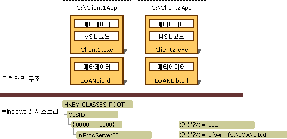

# Interop 응용 프로그램 배포Deploying an Interop Application
Interop 응용 프로그램에는 일반적으로 .NET 클라이언트 어셈블리, 고유한 COM 형식 라이브러리를 나타내는 하나 이상의 interop 어셈블리 및 하나 이상의 등록된 COM 구성 요소가 포함됩니다.An interop application typically includes a .NET client assembly, one or more interop assemblies representing distinct COM type libraries, and one or more registered COM components. Visual Studio 및 [!INCLUDE[winsdklong](../../../includes/winsdklong-md.md)]에서는 [형식 라이브러리를 어셈블리로 가져오기](importing-a-type-library-as-an-assembly.md)에 설명된 대로 형식 라이브러리를 interop 어셈블리로 가져오고 변환하는 도구를 제공합니다.Visual Studio and the [!INCLUDE[winsdklong](../../../includes/winsdklong-md.md)] provide tools to import and convert a type library to an interop assembly, as discussed in [Importing a Type Library as an Assembly](importing-a-type-library-as-an-assembly.md). Interop 응용 프로그램을 배포하는 두 가지 방법은 다음과 같습니다.There are two ways to deploy an interop application:  
  
-   포함된 interop 형식 사용: [!INCLUDE[net_v40_long](../../../includes/net-v40-long-md.md)]부터 interop 어셈블리의 형식 정보를 실행 파일에 포함하도록 컴파일러에 지시할 수 있습니다.By using embedded interop types: Beginning with the [!INCLUDE[net_v40_long](../../../includes/net-v40-long-md.md)], you can instruct the compiler to embed type information from an interop assembly into your executable. 컴파일러는 응용 프로그램에서 사용하는 형식 정보만 포함합니다.The compiler embeds only the type information that your application uses. Interop 어셈블리를 응용 프로그램에 배포할 필요는 없습니다.You do not have to deploy the interop assembly with your application. 이것이 권장되는 방법입니다.This is the recommended technique.  
  
-   Interop 어셈블리 배포: interop 어셈블리에 대한 표준 참조를 만들 수 있습니다.By deploying interop assemblies: You can create a standard reference to an interop assembly. 이 경우 interop 어셈블리를 응용 프로그램에 배포해야 합니다.In this case, the interop assembly must be deployed with your application. 이 방법을 적용하는데 전용 COM 구성 요소를 사용하지 않을 경우 관리 코드에 통합하려는 COM 구성 요소의 작성자가 게시한 PIA(주 interop 어셈블리)를 항상 참조하세요.If you employ this technique, and you are not using a private COM component, always reference the primary interop assembly (PIA) published by the author of the COM component you intend to incorporate in your managed code. 주 interop 어셈블리를 생성 및 사용하는 방법에 대한 자세한 내용은 [주 Interop 어셈블리](https://msdn.microsoft.com/library/b977a8be-59a0-40a0-a806-b11ffba5c080(v=vs.100))를 참조하세요.For more information about producing and using primary interop assemblies, see [Primary Interop Assemblies](https://msdn.microsoft.com/library/b977a8be-59a0-40a0-a806-b11ffba5c080(v=vs.100)).  
  
 포함된 interop 형식을 사용할 경우 배포는 간단하고 직관적입니다.If you use embedded interop types, deployment is simple and straightforward. 특별히 수행할 작업이 없습니다.There is nothing special you need to do. 이 문서의 나머지 부분에서는 응용 프로그램에 interop 어셈블리를 배포하기 위한 시나리오를 설명합니다.The rest of this article describes the scenarios for deploying interop assemblies with your application.  
  
## Interop 어셈블리 배포Deploying Interop Assemblies  
 어셈블리는 강력한 이름을 가질 수 있습니다.Assemblies can have strong names. 강력한 이름의 어셈블리에는 고유한 ID를 제공하는 게시자의 공개 키가 포함됩니다.A strong-named assembly includes the publisher's public key, which provides a unique identity. [형식 라이브러리 가져오기(Tlbimp.exe)](../tools/tlbimp-exe-type-library-importer.md)에서 생성되는 어셈블리는 게시자가 **/keyfile** 옵션을 사용하여 서명할 수 있습니다.Assemblies that are produced by the [Type Library Importer (Tlbimp.exe)](../tools/tlbimp-exe-type-library-importer.md) can be signed by the publisher by using the **/keyfile** option. 서명된 어셈블리를 전역 어셈블리 캐시에 설치할 수 있습니다.You can install signed assemblies into the global assembly cache. 서명되지 않은 어셈블리는 사용자 컴퓨터에 전용 어셈블리로 설치해야 합니다.Unsigned assemblies must be installed on the user's machine as private assemblies.  
  
### 전용 어셈블리Private Assemblies  
 전용으로 사용할 어셈블리를 설치하려면 응용 프로그램 실행 파일과 가져온 COM 형식을 포함하는 interop 어셈블리가 둘 다 동일한 디렉터리 구조에 설치되어야 합니다.To install an assembly to be used privately, both the application executable and the interop assembly that contains imported COM types must be installed in the same directory structure. 다음 그림에서는 개별 응용 프로그램 디렉터리에 있는 Client1.exe 및 Client2.exe에서 전용으로 사용할 서명되지 않은 interop 어셈블리를 보여 줍니다.The following illustration shows an unsigned interop assembly to be used privately by Client1.exe and Client2.exe, which reside in separate application directories. 이 예제에서 LOANLib.dll이라는 interop 어셈블리는 두 번 설치됩니다.The interop assembly, which is called LOANLib.dll in this example, is installed twice.  
  
   
전용 배포에 대한 디렉터리 구조 및 레지스트리 항목Directory structure and registry entries for a private deployment  
  
 응용 프로그램과 연결된 모든 COM 구성 요소는 Windows 레지스트리에 설치해야 합니다.All COM components associated with the application must be installed in the Windows registry. 그림의 Client1.exe 및 Client2.exe가 서로 다른 컴퓨터에 설치된 경우에는 두 컴퓨터에 모두 COM 구성 요소를 등록해야 합니다.If Client1.exe and Client2.exe in the illustration are installed on different computers, you must register the COM components on both computers.  
  
### 공유 어셈블리Shared Assemblies  
 여러 응용 프로그램에서 공유되는 어셈블리는 전역 어셈블리 캐시라는 중앙 집중식 리포지토리에 설치해야 합니다.Assemblies that are shared by multiple applications should be installed in a centralized repository called the global assembly cache. .NET 클라이언트는 전역 어셈블리 캐시에서 시그니처 및 설치된 interop 어셈블리의 동일한 복사본에 액세스할 수 있습니다..NET clients can access the same copy of the interop assembly, which is signed and installed in the global assembly cache. 주 interop 어셈블리를 생성 및 사용하는 방법에 대한 자세한 내용은 [주 Interop 어셈블리](https://msdn.microsoft.com/library/b977a8be-59a0-40a0-a806-b11ffba5c080(v=vs.100))를 참조하세요.For more information about producing and using primary interop assemblies, see [Primary Interop Assemblies](https://msdn.microsoft.com/library/b977a8be-59a0-40a0-a806-b11ffba5c080(v=vs.100)).  
  
## 참고 항목See Also  
 [.NET Framework에 COM 구성 요소 노출Exposing COM Components to the .NET Framework](exposing-com-components.md)  
 [형식 라이브러리를 어셈블리로 가져오기Importing a Type Library as an Assembly](importing-a-type-library-as-an-assembly.md)  
 [관리 코드에서 COM 형식을 사용 하 여](https://msdn.microsoft.com/library/1a95a8ca-c8b8-4464-90b0-5ee1a1135b66(v=vs.100))[Using COM Types in Managed Code](https://msdn.microsoft.com/library/1a95a8ca-c8b8-4464-90b0-5ee1a1135b66(v=vs.100))  
 [Interop 프로젝트 컴파일Compiling an Interop Project](compiling-an-interop-project.md)
