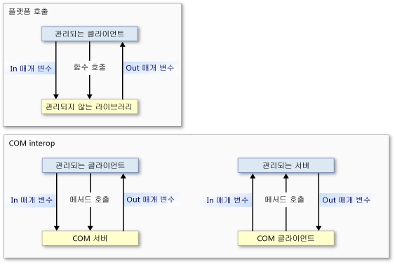

# Interop 마샬링
 Interop 마샬링은 호출 중 관리되는 메모리와 관리되지 않는 메모리 간에 메서드 인수와 반환 값을 통해 데이터를 전달하는 방법을 제어합니다. Interop 마샬링은 공용 언어 런타임 마샬링 서비스에서 수행하는 런타임 작업입니다.  
  
 대부분의 데이터 형식은 관리되는 메모리와 관리되지 않는 메모리 둘 다에서 공통된 표현을 갖습니다. Interop 마샬러는 이러한 형식을 자동으로 처리합니다. 다른 형식은 모호하거나 관리되는 메모리에서 표시되지 않을 수 있습니다.  
  
 모호한 형식은 관리되는 단일 형식에 관리되지 않는 여러 표현이 매핑되거나 배열 크기와 같은 형식 정보가 누락되었을 수 있습니다. 모호한 형식에 대해 마샬러는 기본 표현과 여러 표현이 있는 대체 표현을 제공합니다. 모호한 형식을 마샬링하는 방법에 대한 명시적 지침을 마샬러에 제공할 수 있습니다.  
  
 이 개요는 다음과 같은 단원으로 구성됩니다.  
  
-   [플랫폼 호출 및 COM Interop 모델](#platform_invoke_and_com_interop_models)  
  
-   [마샬링 및 COM 아파트](#marshaling_and_com_apartments)  
  
-   [원격 호출 마샬링](#marshaling_remote_calls)  
  
-   [관련 항목](#related_topics)  
  
-   [참조](#reference)  
  
   
## 플랫폼 호출 및 COM Interop 모델  
 공용 언어 런타임은 비관리 코드와 상호 운용하는 두 가지 메커니즘을 제공합니다.  
  
-   플랫폼 호출 - 관리 코드가 관리되지 않는 라이브러리에서 내보낸 함수를 호출할 수 있게 해줍니다.  
  
-   COM interop - 관리 코드가 인터페이스를 통해 COM(구성 요소 개체 모델) 개체와 상호 운용할 수 있게 해줍니다.  
  
 플랫폼 호출과 COM interop는 둘 다 interop 마샬링을 사용하여 호출자와 호출 수신자 간에 메서드 인수를 정확하게 이동하고 필요한 경우 역방향으로 이동합니다. 다음 그림과 같이 플랫폼 호출 메서드는 관리 코드에서 비관리 코드로 전달되며 [콜백 함수](callback-functions.md)가 사용되는 경우를 제외하고 반대 방향으로 전달되지 않습니다. 플랫폼 호출은 관리 코드에서 비관리 코드로만 전달될 수 있지만 데이터는 입력 또는 출력 매개 변수로 양방향으로 전달될 수 있습니다. COM interop 메서드 호출은 어느 방향으로든 전달될 수 있습니다.  
  
   
플랫폼 호출 및 COM Interop 호출 흐름  
  
 가장 낮은 수준에서 두 메커니즘은 모두 동일한 interop 마샬링 서비스를 사용하지만 특정 데이터 형식은 COM interop 또는 플랫폼 호출에서만 지원됩니다. 자세한 내용은 [기본 마샬링 동작](default-marshaling-behavior.md)을 참조하세요.  
  
 [맨 위로 이동](#top)  
  
   
## 마샬링 및 COM 아파트  
 interop 마샬러는 공용 언어 런타임 힙과 관리되지 않는 힙 간에 데이터를 마샬링합니다. 호출자와 호출 수신자가 동일한 데이터 인스턴스에서 작동할 수 없을 때마다 마샬링이 발생합니다. interop 마샬러를 사용하면 호출자와 호출 수신자가 고유한 데이터 복사본이 있는 것처럼 동일한 데이터에서 작동하는 것으로 나타날 수 있습니다.  
  
 COM에는 COM 아파트 간이나 서로 다른 COM 프로세스 간에 데이터를 마샬링하는 마샬러도 있습니다. 동일한 COM 아파트 내의 관리 코드와 비관리 코드 간에 호출하는 경우에는 interop 마샬러만 사용됩니다. 다른 COM 아파트나 다른 프로세스 내의 관리 코드와 비관리 코드 간에 호출하는 경우 interop 마샬러와 COM 마샬러가 모두 사용됩니다.  
  
### COM 클라이언트 및 관리되는 서버  
 [Regasm.exe(어셈블리 등록 도구)](../tools/regasm-exe-assembly-registration-tool.md)로 등록된 형식 라이브러리를 사용하여 내보낸 관리되는 서버는 `ThreadingModel` 레지스트리 항목이 `Both`로 설정되어 있습니다. 이 값은 STA(단일 스레드 아파트) 또는 MTA(다중 스레드 아파트)로 서버를 활성화할 수 있음을 나타냅니다. 서버 개체는 다음 표와 같이 해당 호출자와 동일한 아파트에 만들어집니다.  
  
|COM 클라이언트|.NET 서버|마샬링 요구 사항|  
|----------------|-----------------|-----------------------------|  
|STA|`Both`가 STA로 바뀝니다.|동일한 아파트 마샬링|  
|MTA|`Both`가 MTA로 바뀝니다.|동일한 아파트 마샬링|  
  
 클라이언트와 서버가 동일한 아파트에 있으므로 interop 마샬링 서비스에서 모든 데이터 마샬링을 자동으로 처리합니다. 다음 그림에서는 동일한 COM 스타일 아파트 내의 관리되는 힙과 관리되지 않는 힙 간에 작동하는 interop 마샬링 서비스를 보여 줍니다.  
  
   
동일한 아파트 마샬링 프로세스  
  
 관리되는 서버를 내보내려는 경우 COM 클라이언트가 서버의 아파트를 결정하는 것에 주의합니다. MTA로 초기화된 COM 클라이언트에서 호출하는 관리되는 서버는 스레드로부터 안전해야 합니다.  
  
### 관리되는 클라이언트 및 COM 서버  
 관리되는 클라이언트 아파트에 대한 기본 설정은 MTA입니다. 그러나 .NET 클라이언트의 응용 프로그램 형식을 통해 기본 설정을 변경할 수 있습니다. 예를 들어 [!INCLUDE[vbprvblong](../../../includes/vbprvblong-md.md)] 클라이언트 아파트 설정은 STA입니다. <xref:System.STAThreadAttribute?displayProperty=nameWithType>, <xref:System.MTAThreadAttribute?displayProperty=nameWithType>, <xref:System.Threading.Thread.ApartmentState%2A?displayProperty=nameWithType> 속성 또는 <xref:System.Web.UI.Page.AspCompatMode%2A?displayProperty=nameWithType> 속성을 사용하여 관리되는 클라이언트의 아파트 설정을 검사하고 변경할 수 있습니다.  
  
 구성 요소의 작성자가 COM 서버의 스레드 선호도를 설정합니다. 다음 표에서는 .NET 클라이언트 및 COM 서버에 대한 아파트 설정의 조합을 보여 줍니다. 또한 조합에 대한 마샬링 요구 사항을 보여 줍니다.  
  
|.NET 클라이언트|COM 서버|마샬링 요구 사항|  
|-----------------|----------------|-----------------------------|  
|MTA(기본값)|MTA   STA|Interop 마샬링   Interop 및 COM 마샬링|  
|STA|MTA   STA|Interop 및 COM 마샬링   Interop 마샬링|  
  
 관리되는 클라이언트와 관리되지 않는 서버가 동일한 아파트에 있으므로 interop 마샬링 서비스에서 모든 데이터 마샬링을 처리합니다. 그러나 클라이언트와 서버가 서로 다른 아파트에서 초기화된 경우 COM 마샬링도 필요합니다. 다음 그림에서는 아파트 간 호출의 요소를 보여 줍니다.  
  
   
.NET 클라이언트와 COM 개체 간의 아파트 간 호출  
  
 아파트 간 마샬링의 경우 다음을 수행할 수 있습니다.  
  
-   경계를 넘어가는 호출이 많은 경우에만 두드러지는 아파트 간 마샬링의 오버헤드를 수락합니다. 호출이 성공적으로 아파트 경계를 넘어가려면 COM 구성 요소의 형식 라이브러리를 등록해야 합니다.  
  
-   클라이언트 스레드를 STA 또는 MTA로 설정하여 주 스레드를 변경합니다. 예를 들어 C# 클라이언트가 많은 STA COM 구성 요소를 호출하는 경우 주 스레드를 STA로 설정하여 아파트 간 마샬링을 방지할 수 있습니다.  
  
    > [!NOTE]
    >  C# 클라이언트의 스레드를 STA로 설정한 후 MTA COM 구성 요소를 호출하려면 아파트 간 마샬링이 필요합니다.  
  
 아파트 모델을 명시적으로 선택하는 방법에 대한 자세한 내용은 [관리되는 스레딩과 관리되지 않는 스레딩](https://msdn.microsoft.com/library/db425c20-4b2f-4433-bf96-76071c7881e5(v=vs.100))을 참조하세요.  
  
 [맨 위로 이동](#top)  
  
   
## 원격 호출 마샬링  
 아파트 간 마샬링과 마찬가지로 COM 마샬링은 개체가 개별 프로세스에 상주할 때마다 관리 및 비관리 코드 간의 각 호출에 사용됩니다. 예:  
  
-   원격 호스트의 관리되는 서버를 호출하는 COM 클라이언트는 DCOM(분산된 COM)을 사용합니다.  
  
-   원격 호스트의 COM 서버를 호출하는 관리되는 클라이언트는 DCOM을 사용합니다.  
  
 다음 그림에서는 interop 마샬링과 COM 마샬링이 프로세스 및 호스트 경계 간에 통신 채널을 제공하는 방법을 보여 줍니다.  
  
   
크로스 프로세스 마샬링  
  
### ID 유지  
 공용 언어 런타임은 관리되는 참조와 관리되지 않는 참조의 ID를 유지합니다. 다음 그림에서는 프로세스 및 호스트 경계 간에 관리되지 않는 직접 참조(위쪽 행)와 관리되는 직접 참조(아래쪽 행)의 흐름을 보여 줍니다.  
  
   
프로세스 및 호스트 경계 간에 전달되는 참조  
  
 다음 그림에서  
  
-   관리되지 않는 클라이언트는 원격 호스트에서 이 참조를 가져오는 관리되는 개체로부터 COM 개체에 대한 참조를 가져옵니다. 원격 메커니즘은 DCOM입니다.  
  
-   관리되는 클라이언트는 원격 호스트에서 이 참조를 가져오는 COM 개체로부터 관리되는 개체에 대한 참조를 가져옵니다. 원격 메커니즘은 DCOM입니다.  
  
    > [!NOTE]
    >  관리되는 서버의 내보낸 형식 라이브러리를 등록해야 합니다.  
  
 호출자와 호출 수신자 간의 프로세스 경계 수는 관련이 없습니다. in-process 및 out-of-process 호출에 대해 동일한 직접 참조가 발생합니다.  
  
### 관리되는 원격  
 런타임에서는 프로세스 및 호스트 경계를 넘은 관리되는 개체 간에 통신 채널을 설정하는 데 사용할 수 있는 관리되는 원격 기능도 제공합니다. 관리되는 원격 기능은 다음 그림과 같이 통신 구성 요소 간의 방화벽을 수용할 수 있습니다.  
  
   
SOAP 또는 TcpChannel 클래스를 사용하는 방화벽을 통한 원격 호출  
  
 서비스 구성 요소와 COM 간의 호출과 같은 관리되지 않는 일부 호출은 SOAP를 채널로 사용할 수 있습니다.  
  
 [맨 위로 이동](#top)  
  
   
## 관련 항목  
  
|제목|설명|  
|-----------|-----------------|  
|[기본 마샬링 동작](default-marshaling-behavior.md)|Interop 마샬링 서비스에서 데이터를 마샬링하는 데 사용하는 규칙을 설명합니다.|  
|[플랫폼 호출을 사용하여 데이터 마샬링](marshaling-data-with-platform-invoke.md)|메서드 매개 변수를 선언하고 관리되지 않는 라이브러리에서 내보낸 함수에 인수를 전달하는 방법을 설명합니다.|  
|[COM Interop를 사용하여 데이터 마샬링](marshaling-data-with-com-interop.md)|COM 래퍼를 사용자 지정하여 마샬링 동작을 변경하는 방법을 설명합니다.|  
|[방법: 관리 코드 DCOM을 WCF로 마이그레이션](how-to-migrate-managed-code-dcom-to-wcf.md)|DCOM에서 WCF로 마이그레이션하는 방법을 설명합니다.|  
|[방법: HRESULT 및 예외 매핑](how-to-map-hresults-and-exceptions.md)|사용자 지정 예외를 HRESULT에 매핑하는 방법을 설명하고 각 HRESULT와 .NET Framework에 있는 해당 예외 클래스 간의 전체 매핑을 제공합니다.|  
|[제네릭 형식을 통한 상호 운용](https://msdn.microsoft.com/library/26b88e03-085b-4b53-94ba-a5a9c709ce58(v=vs.100))|COM 상호 운용성을 위해 제네릭 형식을 사용할 때 지원되는 작업을 설명합니다.|  
|[비관리 코드와의 상호 운용](index.md)|공용 언어 런타임에서 제공하는 상호 운용성 서비스를 설명합니다.|  
|[고급 COM 상호 운용성](https://msdn.microsoft.com/library/3ada36e5-2390-4d70-b490-6ad8de92f2fb(v=vs.100))|COM 구성 요소를 .NET Framework 응용 프로그램으로 통합하는 방법에 대한 추가정보 링크를 제공합니다.|  
|[상호 운용을 위한 디자인 고려 사항](https://msdn.microsoft.com/library/b59637f6-fe35-40d6-ae72-901e7a707689(v=vs.100))|통합된 COM 구성 요소를 작성하기 위한 팁을 제공합니다.|  
  
 [맨 위로 이동](#top)  
  
   
## 참조  
 <xref:System.Runtime.InteropServices?displayProperty=nameWithType>  
  
 [맨 위로 이동](#top)
