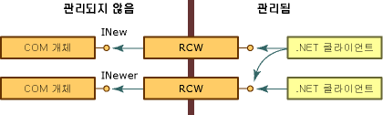
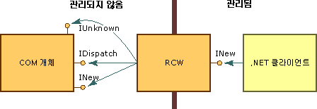

# RCWRuntime Callable Wrapper
공용 언어 런타임은 RCW(런타임 호출 가능 래퍼)라는 프록시를 통해 COM 개체를 노출합니다.The common language runtime exposes COM objects through a proxy called the runtime callable wrapper (RCW). RCW는 .NET 클라이언트에 일반적인 개체인 것처럼 나타나지만 주요 기능이 .NET 클라이언트와 COM 개체 간의 호출을 마샬링하는 것입니다.Although the RCW appears to be an ordinary object to .NET clients, its primary function is to marshal calls between a .NET client and a COM object.  
  
 런타임은 개체에 있는 참조 수에 관계없이 각 COM 개체에 대해 RCW를 정확한 한 개 만듭니다.The runtime creates exactly one RCW for each COM object, regardless of the number of references that exist on that object. 런타임은 각 개체에 대해 프로세스당 하나의 RCW를 유지 관리합니다.The runtime maintains a single RCW per process for each object.  특정 응용 프로그램 도메인이나 아파트에서 RCW를 만든 다음 다른 응용 프로그램 도메인이나 아파트에 참조를 전달하는 경우 첫 번째 개체에 대한 프록시가 사용됩니다.If you create an RCW in one application domain or apartment, and then pass a reference to another application domain or apartment, a proxy to the first object will be used.  다음 그림과 같이 INew 및 INewer 인터페이스를 노출하는 COM 개체에 대한 참조가 임의 개수의 관리되는 클라이언트에 포함될 수 있습니다.As the following illustration shows, any number of managed clients can hold a reference to the COM objects that expose INew and INewer interfaces.  
  
   
런타임 호출 가능 래퍼를 통해 COM 개체 액세스Accessing COM objects through the runtime callable wrapper  
  
 형식 라이브러리에서 파생된 메타데이터를 사용하여 런타임은 호출되는 COM 개체와 해당 개체에 대한 래퍼를 둘 다 만듭니다.Using metadata derived from a type library, the runtime creates both the COM object being called and a wrapper for that object. 각 RCW는 래핑하는 COM 개체에서 인터페이스 포인터 캐시를 유지 관리하고, RCW가 더 이상 필요하지 않으면 COM 개체에서 해당 참조를 해제합니다.Each RCW maintains a cache of interface pointers on the COM object it wraps and releases its reference on the COM object when the RCW is no longer needed. 런타임은 RCW에서 가비지 수집을 수행합니다.The runtime performs garbage collection on the RCW.  
  
 다른 활동 중에서도 RCW는 래핑된 개체를 대신하여 관리 코드와 비관리 코드 간에 데이터를 마샬링합니다.Among other activities, the RCW marshals data between managed and unmanaged code, on behalf of the wrapped object. 특히, RCW는 클라이언트와 서버 간에 서로 다른 데이터 표현이 전달될 때마다 메서드 인수 및 메서드 반환 값에 대한 마샬링을 제공합니다.Specifically, the RCW provides marshaling for method arguments and method return values whenever the client and server have different representations of the data passed between them.  
  
 표준 래퍼는 기본 제공 마샬링 규칙을 적용합니다.The standard wrapper enforces built-in marshaling rules. 예를 들어 .NET 클라이언트가 관리되지 않는 개체에 문자열 형식을 인수의 일부로 전달하는 경우 래퍼가 문자열을 BSTR 형식으로 변환합니다.For example, when a .NET client passes a String type as part of an argument to an unmanaged object, the wrapper converts the string to a BSTR type. COM 개체가 관리되는 호출자에게 BSTR을 반환하는 경우 호출자는 문자열을 수신합니다.Should the COM object return a BSTR to its managed caller, the caller receives a String. 클라이언트와 서버 둘 다 익숙한 데이터를 보내고 받습니다.Both the client and the server send and receive data that is familiar to them. 다른 형식은 변환이 필요하지 않습니다.Other types require no conversion. 예를 들어 표준 래퍼는 형식을 변환하지 않고 관리 코드와 비관리 코드 간에 항상 4바이트 정수를 전달합니다.For instance, a standard wrapper will always pass a 4-byte integer between managed and unmanaged code without converting the type.  
  
## 선택한 인터페이스 마샬링Marshaling selected interfaces  
 RCW([런타임 호출 가능 래퍼](runtime-callable-wrapper.md))의 주요 목표는 관리되는 프로그래밍 모델과 관리되지 않는 프로그래밍 모델 간의 차이를 숨기는 것입니다.The primary goal of the [runtime callable wrapper](runtime-callable-wrapper.md) (RCW) is to hide the differences between the managed and unmanaged programming models. 매끄러운 전환을 만들기 위해 RCW는 다음 그림과 같이 .NET 클라이언트에 노출하지 않고 선택한 COM 인터페이스를 사용합니다.To create a seamless transition, the RCW consumes selected COM interfaces without exposing them to the .NET client, as shown in the following illustration.  
  
   
COM 인터페이스 및 런타임 호출 가능 래퍼COM interfaces and the runtime callable wrapper  
  
 초기 바인딩된 개체로 만들어진 경우 RCW는 특정 형식입니다.When created as an early-bound object, the RCW is a specific type. COM 개체가 구현하는 인터페이스를 구현하고 개체의 인터페이스에서 메서드, 속성 및 이벤트를 노출합니다.It implements the interfaces that the COM object implements and exposes the methods, properties, and events from the object's interfaces. 그림에서 RCW는 INew 인터페이스를 노출하지만 **IUnknown** 및 **IDispatch** 인터페이스를 사용합니다.In the illustration, the RCW exposes the INew interface but consumes the **IUnknown** and **IDispatch** interfaces. 또한 RCW는 INew 인터페이스의 모든 멤버를 .NET 클라이언트에 노출합니다.Further, the RCW exposes all members of the INew interface to the .NET client.  
  
 RCW는 래핑하는 개체에 의해 노출되는, 다음 표에 나열된 인터페이스를 사용합니다.The RCW consumes the interfaces listed in the following table, which are exposed by the object it wraps.  
  
|인터페이스Interface|설명Description|  
|---------------|-----------------|  
|**IDispatch****IDispatch**|리플렉션을 통해 런타임에 COM 개체에 바인딩합니다.For late binding to COM objects through reflection.|  
|**IErrorInfo****IErrorInfo**|오류, 소스, 도움말 파일, 도움말 컨텍스트에 대한 설명과 오류를 정의한 인터페이스의 GUID를 제공합니다(.NET 클래스의 경우 항상 **GUID_NULL**).Provides a textual description of the error, its source, a Help file, Help context, and the GUID of the interface that defined the error (always **GUID_NULL** for .NET classes).|  
|**IProvideClassInfo****IProvideClassInfo**|래핑되는 COM 개체가 **IProvideClassInfo**를 구현하는 경우 RCW는 이 인터페이스에서 형식 정보를 추출하여 더 나은 형식 ID를 제공합니다.If the COM object being wrapped implements **IProvideClassInfo**, the RCW extracts the type information from this interface to provide better type identity.|  
|**IUnknown****IUnknown**|개체 ID, 형식 강제 변환 및 수명 관리에 사용됩니다.For object identity, type coercion, and lifetime management:   -   개체 ID-   Object identity      런타임은 각 개체에 대한 **IUnknown** 인터페이스의 값을 비교하여 COM 개체를 구분합니다.The runtime distinguishes between COM objects by comparing the value of the **IUnknown** interface for each object. -   형식 강제 변환-   Type coercion      RCW는 **QueryInterface** 메서드에 의해 수행된 동적 형식 검색을 인식합니다.The RCW recognizes the dynamic type discovery performed by the **QueryInterface** method. -   수명 관리-   Lifetime management      **QueryInterface** 메서드를 통해 RCW는 관리되지 않는 개체에 대한 참조를 가져오고, 런타임이 래퍼에 대해 가비지 수집을 수행하여 관리되지 않는 개체를 해제할 때까지 유지합니다.Using the **QueryInterface** method, the RCW gets and holds a reference to an unmanaged object until the runtime performs garbage collection on the wrapper, which releases the unmanaged object.|  
  
 필요에 따라 RCW는 래핑하는 개체에 의해 노출되는, 다음 표에 나열된 인터페이스를 사용합니다.The RCW optionally consumes the interfaces listed in the following table, which are exposed by the object it wraps.  
  
|인터페이스Interface|설명Description|  
|---------------|-----------------|  
|**IConnectionPoint** 및 **IConnectionPointContainer****IConnectionPoint** and **IConnectionPointContainer**|RCW는 연결 지점 이벤트 스타일을 대리자 기반 이벤트에 노출하는 개체를 변환합니다.The RCW converts objects that expose the connection-point event style to delegate-based events.|  
|**IDispatchEx****IDispatchEx**|클래스가 **IDispatchEx**를 구현하는 경우 RCW는 **IExpando**를 구현합니다.If the class implements **IDispatchEx**, the RCW implements **IExpando**. **IDispatchEx** 인터페이스는 **IDispatch**와 달리 멤버의 대/소문자 구분 호출, 열거형, 추가, 삭제를 가능하게 하는 **IDispatch** 인터페이스의 확장입니다.The **IDispatchEx** interface is an extension of the **IDispatch** interface that, unlike **IDispatch**, enables enumeration, addition, deletion, and case-sensitive calling of members.|  
|**IEnumVARIANT****IEnumVARIANT**|열거형을 지원하는 COM 형식이 컬렉션으로 처리될 수 있게 합니다.Enables COM types that support enumerations to be treated as collections.|  
  
## 참고 항목See Also  
 [COM 래퍼COM Wrappers](com-wrappers.md)  
 [선택한 인터페이스 마샬링](https://msdn.microsoft.com/library/fdb97fd0-f694-4832-bf15-a4e7cf413840(v=vs.100))[Marshaling Selected Interfaces](https://msdn.microsoft.com/library/fdb97fd0-f694-4832-bf15-a4e7cf413840(v=vs.100))  
 [COM 호출 가능 래퍼COM Callable Wrapper](com-callable-wrapper.md)  
 [형식 라이브러리를 어셈블리로 변환 요약](https://msdn.microsoft.com/library/bf3f90c5-4770-4ab8-895c-3ba1055cc958(v=vs.100))[Type Library to Assembly Conversion Summary](https://msdn.microsoft.com/library/bf3f90c5-4770-4ab8-895c-3ba1055cc958(v=vs.100))  
 [형식 라이브러리를 어셈블리로 가져오기Importing a Type Library as an Assembly](importing-a-type-library-as-an-assembly.md)
