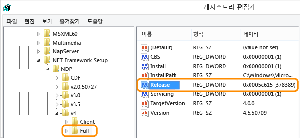

# 방법: 설치된 .NET Framework 버전 확인
사용자는 자신의 컴퓨터에 여러 버전의 .NET Framework를 설치하여 실행할 수 있습니다. 따라서 앱을 개발하거나 배포할 때는 사용자의 컴퓨터에 어떤 .NET Framework 버전이 설치되었는지 알아야 합니다. .NET Framework는 각 버전으로 식별되는 다음과 같은 2개의 주요 구성 요소로 구성됩니다.  
  
-   앱의 기능을 제공하는 형식 및 리소스 컬렉션에 해당하는 어셈블리 집합. .NET Framework와 어셈블리는 동일한 버전 번호를 공유합니다.  
  
-   앱 코드를 관리하고 실행하는 CLR\(공용 언어 런타임\). CLR은 고유한 버전 번호로 식별됩니다\([버전 및 종속성](../../../docs/framework/migration-guide/versions-and-dependencies.md) 참조\).  
  
 컴퓨터에 설치된 정확한 .NET Framework 버전 목록을 보려면 다음을 참조하여 레지스트리를 확인하거나 코드로 레지스트리를 쿼리합니다.  
  
 [레지스트리 보기\(버전 1\-4\)](#net_a)  
[레지스트리 보기\(버전 4.5 이상\)](#net_b)  
[코드를 사용하여 레지스트리 쿼리\(버전 1\-4\)](#net_c)  
[코드를 사용하여 레지스트리 쿼리\(버전 4.5 이상\)](#net_d)  
  
 CLR 버전을 찾으려면 다음을 참조하여 도구나 코드를 사용합니다.  
  
 [Clrver 도구 사용](#clr_a)  
[코드를 사용하여 System.Environment 클래스 쿼리](#clr_b)  
  
 .NET Framework의 버전별로 설치된 업데이트를 검색하는 방법에 대한 자세한 내용은 [방법: 설치된 .NET Framework 업데이트 확인](../../../docs/framework/migration-guide/how-to-determine-which-net-framework-updates-are-installed.md)을 참조하세요. .NET Framework 설치에 대한 자세한 내용은 [설치 가이드](../../../docs/framework/install/guide-for-developers.md)를 참조하세요.  
  
<a name="net_a"></a>   
#### 레지스트리를 확인하여 .NET Framework 버전을 찾으려면\(.NET Framework 1\-4\)  
  
1.  **시작** 메뉴에서 **실행**을 선택합니다.  
  
2.  **열기** 상자에 **regedit.exe**를 입력합니다.  
  
     regedit.exe를 실행하려면 관리자 자격 증명이 있어야 합니다.  
  
3.  레지스트리 편집기에서 다음 하위 키를 엽니다.  
  
     `HKEY_LOCAL_MACHINE\SOFTWARE\Microsoft\NET Framework Setup\NDP`  
  
     설치된 버전은 NDP 하위 키 아래에 나열됩니다. 버전 번호는 **Version** 엔트리에 저장됩니다.[!INCLUDE[net_v40_long](../../../includes/net-v40-long-md.md)]의 **Version** 엔트리는 NDP 아래 Client 또는 Full 하위 키 아래에 있거나 두 하위 키 아래 모두에 있습니다.  
  
    > [!NOTE]
    >  레지스트리의 "NET Framework Setup" 폴더는 마침표로 시작하지 않습니다.  
  
<a name="net_b"></a>   
#### 레지스트리를 확인하여 .NET Framework 버전을 찾으려면\(.NET Framework 4.5 이상\)  
  
1.  **시작** 메뉴에서 **실행**을 선택합니다.  
  
2.  **열기** 상자에 **regedit.exe**를 입력합니다.  
  
     regedit.exe를 실행하려면 관리자 자격 증명이 있어야 합니다.  
  
3.  레지스트리 편집기에서 다음 하위 키를 엽니다.  
  
     `HKEY_LOCAL_MACHINE\SOFTWARE\Microsoft\NET Framework Setup\NDP\v4\Full`  
  
     `Full` 하위 키에 대한 경로에는 `.NET Framework` 대신 `Net Framework` 하위 키가 포함되어 있습니다.  
  
    > [!NOTE]
    >  `Full` 하위 키가 없으면 .NET Framework 4.5 이상이 설치되어 있지 않은 것입니다.  
  
     `Release`라는 DWORD 값을 확인합니다.`Release` DWORD가 있으면 [!INCLUDE[net_v45](../../../includes/net-v45-md.md)] 또는 그 이상 버전이 해당 컴퓨터에 설치되어 있음을 나타냅니다.  
  
       
  
     `Release` DWORD의 값은 설치된 .NET Framework 버전을 나타냅니다.  
  
    |릴리스 DWORD의 값|버전|  
    |------------------|--------|  
    |378389|.NET Framework 4.5|  
    |378675|.NET Framework 4.5.1이 Windows 8.1 또는 Windows Server 2012 R2와 함께 설치됨|  
    |378758|.NET Framework 4.5.1이 Windows 8, Windows 7 SP1 또는 Windows Vista SP2에 설치됨|  
    |379893|.NET Framework 4.5.2|  
    |Windows 10 시스템에서: 393295<br /><br /> 다른 모든 OS 버전에서: 393297|[!INCLUDE[net_v46](../../../includes/net-v46-md.md)]|  
    |Windows 10 11월 업데이트 시스템: 394254<br /><br /> 모든 다른 OS 버전: 394271|[!INCLUDE[net_v461](../../../includes/net-v461-md.md)]|  
  
<a name="net_c"></a>   
#### 코드로 레지스트리를 쿼리하여 .NET Framework 버전을 찾으려면\(.NET Framework 1\-4\)  
  
-   <xref:Microsoft.Win32.RegistryKey?displayProperty=fullName> 클래스를 사용하여 Windows 레지스트리의 HKEY\_LOCAL\_MACHINE 아래에 있는 Software\\Microsoft\\NET Framework Setup\\NDP\\ 하위 키에 액세스합니다.  
  
     다음 코드에서는 이 쿼리의 예제를 보여 줍니다.  
  
    > [!NOTE]
    >  이 코드는 [!INCLUDE[net_v45](../../../includes/net-v45-md.md)] 이상 버전을 검색하는 방법은 보여 주지 않습니다. 이전 섹션에 설명된 대로 `Release` DWORD를 확인하여 해당 버전을 검색합니다.  
  
     [!code-csharp[ListVersions#0](../../../samples/snippets/csharp/VS_Snippets_CLR/listversions/cs/program.cs#0)]
     [!code-vb[ListVersions#0](../../../samples/snippets/visualbasic/VS_Snippets_CLR/listversions/vb/program.vb#0)]  
    [!code-csharp[ListVersions#1](../../../samples/snippets/csharp/VS_Snippets_CLR/listversions/cs/program.cs#1)]
    [!code-vb[ListVersions#1](../../../samples/snippets/visualbasic/VS_Snippets_CLR/listversions/vb/program.vb#1)]  
  
     이 예제는 다음과 유사한 출력 결과를 표시합니다.  
  
    ```  
  
    v2.0.50727  2.0.50727.4016  SP2 v3.0  3.0.30729.4037  SP2 v3.5  3.5.30729.01  SP1 v4 Client  4.0.30319 Full  4.0.30319  
    ```  
  
<a name="net_d"></a>   
#### 코드로 레지스트리를 쿼리하여 .NET Framework 버전을 찾으려면\(.NET Framework 4.5 이상\)  
  
1.  `Release` DWORD가 있으면 .NET Framework 4.5 이상이 컴퓨터에 설치되어 있는 것입니다. 이 키워드 값이 설치된 버전을 나타냅니다. 이 키워드를 확인하려면 <xref:Microsoft.Win32.RegistryKey?displayProperty=fullName> 클래스의 <xref:Microsoft.Win32.RegistryKey.OpenBaseKey%2A> 및 <xref:Microsoft.Win32.RegistryKey.OpenSubKey%2A> 메서드를 사용하여 Windows 레지스트리의 HKEY\_LOCAL\_MACHINE 아래에 있는 Software\\Microsoft\\NET Framework Setup\\NDP\\v4\\Full 하위 키에 액세스합니다.  
  
2.  `Release` 키워드 값을 확인하여 설치된 버전을 확인합니다. 이후 버전과의 호환성을 유지하려는 경우 버전의 값이 표에 나와 있는 값 이상인지를 확인하면 됩니다. 다음 표에는 .NET Framework 버전 및 이에 해당되는 `Release` 키워드가 나와 있습니다.  
  
    |버전|릴리스 DWORD의 값|  
    |--------|------------------|  
    |.NET Framework 4.5|378389|  
    |.NET Framework 4.5.1이 Windows 8.1과 함께 설치됨|378675|  
    |.NET Framework 4.5.1이 Windows 8, Windows 7 SP1 또는 Windows Vista SP2에 설치됨|378758|  
    |.NET Framework 4.5.2|379893|  
    |[!INCLUDE[net_v46](../../../includes/net-v46-md.md)]이 Windows 10과 함께 설치됨|393295|  
    |[!INCLUDE[net_v46](../../../includes/net-v46-md.md)]이 다른 모든 Windows OS 버전에 설치됨|393297|  
    |Windows 10에 설치된 [!INCLUDE[net_v461](../../../includes/net-v461-md.md)]|394254|  
    |[!INCLUDE[net_v461](../../../includes/net-v461-md.md)]이 다른 모든 Windows OS 버전에 설치됨|394271|  
  
     버전 값이 각 버전의 릴리스 키워드 값 이상인지를 확인하는 예제는 다음과 같습니다.  
  
     [!code-csharp[ListVersions#0](../../../samples/snippets/csharp/VS_Snippets_CLR/listversions/cs/program.cs#0)]
     [!code-vb[ListVersions#0](../../../samples/snippets/visualbasic/VS_Snippets_CLR/listversions/vb/program.vb#0)]  
    [!code-csharp[ListVersions#3](../../../samples/snippets/csharp/VS_Snippets_CLR/listversions/cs/program.cs#3)]
    [!code-vb[ListVersions#3](../../../samples/snippets/visualbasic/VS_Snippets_CLR/listversions/vb/program.vb#3)]  
    [!code-csharp[ListVersions#4](../../../samples/snippets/csharp/VS_Snippets_CLR/listversions/cs/program.cs#4)]
    [!code-vb[ListVersions#4](../../../samples/snippets/visualbasic/VS_Snippets_CLR/listversions/vb/program.vb#4)]  
  
     이 예제는 다음과 유사한 출력 결과를 표시합니다.  
  
    ```  
    Version: 4.5.1 or later  
    ```  
  
<a name="clr_a"></a>   
#### Clrver 도구를 사용하여 현재 런타임 버전을 찾으려면  
  
-   CLR 버전 도구\(Clrver.exe\)를 사용하여 컴퓨터에 설치된 공용 언어 런타임의 버전을 확인합니다.  
  
     Visual Studio 명령 프롬프트에서 `clrver`을 입력합니다. 이 명령은 다음과 유사한 출력 결과를 표시합니다.  
  
    ```  
    Versions installed on the machine: v2.0.50727 v4.0.30319  
    ```  
  
     이 도구의 사용 방법에 대한 자세한 내용은 [Clrver.exe\(CLR 버전 도구\)](../../../docs/framework/tools/clrver-exe-clr-version-tool.md)를 참조하세요.  
  
<a name="clr_b"></a>   
#### Environment 클래스를 코드로 쿼리하여 현재 런타임 버전을 확인하려면  
  
-   현재 코드를 실행하는 런타임 버전을 식별하는 <xref:System.Version> 개체를 검색하기 위해 <xref:System.Environment.Version%2A?displayProperty=fullName> 속성을 쿼리합니다.<xref:System.Version.Major%2A?displayProperty=fullName> 속성을 사용하여 주 릴리스 식별자\(예: 버전 4.0의 "4"\)를 얻거나 <xref:System.Version.Minor%2A?displayProperty=fullName> 속성을 사용하여 부 릴리스 식별자\(예: 버전 4.0의 "0"\)를 얻거나 <xref:System.Object.ToString%2A?displayProperty=fullName> 메서드를 사용하여 전체 버전 문자열\(예: 다음 코드에 표시된 "4.0.30319.18010"\)을 얻을 수 있습니다. 이 속성은 현재 코드를 실행 중인 런타임 버전을 반영하는 단일 값을 반환합니다. 컴퓨터에 설치되어 있을 수 있는 다른 버전의 런타임이나 어셈블리 버전은 반환하지 않습니다.  
  
     .NET Framework 버전 4, 4.5, 4.5.1 및 4.5.2의 경우 <xref:System.Environment.Version%2A?displayProperty=fullName> 속성은 문자열 표시가 `4.0.30319.xxxxx` 형식인 <xref:System.Version> 개체를 반환합니다.[!INCLUDE[net_v46](../../../includes/net-v46-md.md)]의 경우 형식은 `4.0.30319.42000`입니다.  
  
     런타임 버전 정보의 <xref:System.Environment.Version%2A?displayProperty=fullName> 속성을 쿼리하는 예제는 다음과 같습니다.  
  
     [!code-csharp[ListVersions#0](../../../samples/snippets/csharp/VS_Snippets_CLR/listversions/cs/program.cs#0)]
     [!code-vb[ListVersions#0](../../../samples/snippets/visualbasic/VS_Snippets_CLR/listversions/vb/program.vb#0)]  
    [!code-csharp[ListVersions#2](../../../samples/snippets/csharp/VS_Snippets_CLR/listversions/cs/program.cs#2)]
    [!code-vb[ListVersions#2](../../../samples/snippets/visualbasic/VS_Snippets_CLR/listversions/vb/program.vb#2)]  
  
     이 예제는 다음과 유사한 출력 결과를 표시합니다.  
  
    ```  
    Version: 4.0.30319.18010  
    ```  
  
## 참고 항목  
 [방법: 설치된 .NET Framework 업데이트 확인](../../../docs/framework/migration-guide/how-to-determine-which-net-framework-updates-are-installed.md)   
 [설치 가이드](../../../docs/framework/install/guide-for-developers.md)   
 [버전 및 종속성](../../../docs/framework/migration-guide/versions-and-dependencies.md)