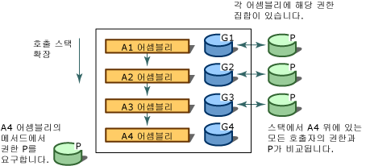

# 코드 액세스 보안Code Access Security
[!INCLUDE[net_security_note](../../../includes/net-security-note-md.md)]  
  
 복잡하게 연결된 오늘날의 컴퓨터 시스템은 다양한 알 수 없는 소스에서 시작되는 코드에 자주 노출됩니다.Today's highly connected computer systems are frequently exposed to code originating from various, possibly unknown sources. 코드가 전자 메일에 첨부되거나, 문서에 포함되거나, 인터넷을 통해 다운로드될 수 있습니다.Code can be attached to e-mail, contained in documents, or downloaded over the Internet. 많은 컴퓨터 사용자는 데이터를 손상시키거나 삭제하여 시간과 비용 손실을 초래할 수 있는 악성 모바일 코드(바이러스와 웜 포함)의 효과를 직접 체험했습니다.Unfortunately, many computer users have experienced firsthand the effects of malicious mobile code, including viruses and worms, which can damage or destroy data and cost time and money.  
  
 가장 일반적인 보안 메커니즘은 로그온 자격 증명(일반적으로 암호)에 따라 사용자에게 권한을 부여하고 사용자가 액세스할 수 있는 리소스(대개 디렉터리 및 파일)를 제한합니다.Most common security mechanisms give rights to users based on their logon credentials (usually a password) and restrict resources (often directories and files) that the user is allowed to access. 그러나 이 접근 방식은 여러 가지 문제를 해결하지 못합니다. 사용자는 많은 소스에서 코드를 가져오며, 이 중의 일부는 신뢰할 수 없습니다. 코드에 버그 또는 취약성이 포함될 수 있으며, 이로 인해 코드가 악성 코드에 의해 악용될 수 있습니다. 코드에서 사용자가 예상하지 못한 작업을 수행하는 경우가 있습니다.However, this approach fails to address several issues: users obtain code from many sources, some of which might be unreliable; code can contain bugs or vulnerabilities that enable it to be exploited by malicious code; and code sometimes does things that the user does not know it will do. 결과적으로 신중하고 신뢰할 수 있는 사용자가 악의적이거나 오류가 많은 소프트웨어를 실행할 경우 컴퓨터 시스템이 손상되고 개인 데이터가 유출될 수 있습니다.As a result, computer systems can be damaged and private data can be leaked when cautious and trustworthy users run malicious or error-filled software. 대부분의 운영 체제 보안 메커니즘에서는 웹 페이지의 스크립트를 제외하고 코드를 실행하려면 코드의 모든 부분을 완전히 신뢰할 수 있어야 합니다.Most operating system security mechanisms require that every piece of code must be completely trusted in order to run, except perhaps for scripts on a Web page. 따라서 시스템 간에 트러스트 관계가 없는 경우에도 한 컴퓨터 시스템에서 시작된 코드가 다른 시스템에서 보호된 상태로 실행될 수 있도록 허용하는 널리 적용 가능한 보안 메커니즘이 여전히 필요합니다.Therefore, there is still a need for a widely applicable security mechanism that allows code originating from one computer system to execute with protection on another system, even when there is no trust relationship between the systems.  
  
 .NET Framework에서는 악성 모바일 코드로부터 컴퓨터 시스템을 보호하고, 알 수 없는 출처의 코드가 보호된 상태로 실행될 수 있도록 하고, 신뢰할 수 있는 코드가 의도적으로 또는 실수로 보안을 손상시키지 않도록 방지하는 코드 액세스 보안이라는 보안 메커니즘을 제공합니다.The .NET Framework provides a security mechanism called code access security to help protect computer systems from malicious mobile code, to allow code from unknown origins to run with protection, and to help prevent trusted code from intentionally or accidentally compromising security. 코드 액세스 보안을 통해 코드 발생 위치 및 코드 ID의 다른 측면에 따라 다양한 수준으로 코드를 신뢰할 수 있습니다.Code access security enables code to be trusted to varying degrees depending on where the code originates and on other aspects of the code's identity. 또한 코드 액세스 보안은 코드에 다양한 신뢰 수준을 적용하여 실행되려면 완전히 신뢰할 수 있어야 하는 코드의 양을 최소화합니다.Code access security also enforces the varying levels of trust on code, which minimizes the amount of code that must be fully trusted in order to run. 코드 액세스 보안을 사용하면 코드가 악의적이거나 오류가 많은 코드에서 악용될 가능성을 줄일 수 있습니다.Using code access security can reduce the likelihood that your code will be misused by malicious or error-filled code. 코드에서 수행할 수 있도록 허용해야 하는 작업 집합을 지정할 수 있으므로 책임을 줄일 수 있습니다.It can reduce your liability, because you can specify the set of operations your code should be allowed to perform. 코드 액세스 보안은 코드에서 보안 취약성으로 인해 발생할 수 있는 손상을 최소화하는 데 도움이 될 수도 있습니다.Code access security can also help minimize the damage that can result from security vulnerabilities in your code.  
  
> [!NOTE]
>  [!INCLUDE[net_v40_long](../../../includes/net-v40-long-md.md)]에서는 코드 액세스 보안의 주요 부분이 변경되었습니다.Major changes have been made to code access security in the [!INCLUDE[net_v40_long](../../../includes/net-v40-long-md.md)]. 가장 주목할 만한 변경은 [보안 투명도](../../../docs/framework/misc/security-transparent-code.md), 이었지만 코드 액세스 보안에 영향을 주는 다른 중요 한 변경 내용도 있습니다.The most notable change has been [security transparency](../../../docs/framework/misc/security-transparent-code.md), but there are also other significant changes that affect code access security. 이러한 변경에 대 한 정보를 참조 하십시오. [보안 변경 내용](../../../docs/framework/security/security-changes.md)합니다.For information about these changes, see [Security Changes](../../../docs/framework/security/security-changes.md).  
  
 코드 액세스 보안은 주로 라이브러리 코드와 부분적으로 신뢰할 수 있는 응용 프로그램에 영향을 줍니다.Code access security primarily affects library code and partially trusted applications. 라이브러리 개발자는 부분적으로 신뢰할 수 있는 응용 프로그램의 무단 액세스로부터 코드를 보호해야 합니다.Library developers must protect their code from unauthorized access from partially trusted applications. 부분적으로 신뢰할 수 있는 응용 프로그램은 인터넷과 같은 외부 소스에서 로드된 응용 프로그램입니다.Partially trusted applications are applications that are loaded from external sources such as the Internet. 데스크톱이나 로컬 인트라넷에 설치된 응용 프로그램은 완전 신뢰로 실행됩니다.Applications that are installed on your desktop or on the local intranet run in full trust. 완전 신뢰 응용 프로그램이 영향을 받지 않는 코드 액세스 보안으로 표시 되어 있지 않다면 [보안 투명](../../../docs/framework/misc/security-transparent-code.md)은 완전히 신뢰할 수 있는 되기 때문에 있습니다.Full-trust applications are not affected by code access security unless they are marked as [security-transparent](../../../docs/framework/misc/security-transparent-code.md), because they are fully trusted. 완전 신뢰 응용 프로그램에 대한 유일한 제한 사항은 <xref:System.Security.SecurityTransparentAttribute> 특성으로 표시된 응용 프로그램이 <xref:System.Security.SecurityCriticalAttribute> 특성으로 표시된 코드를 호출할 수 없다는 것입니다.The only limitation for full-trust applications is that applications that are marked with the <xref:System.Security.SecurityTransparentAttribute> attribute cannot call code that is marked with the <xref:System.Security.SecurityCriticalAttribute> attribute. 코드 액세스 보안을 적용할 수 있도록 부분적으로 신뢰할 수 있는 응용 프로그램은 샌드박스(예: Internet Explorer)에서 실행되어야 합니다.Partially trusted applications must be run in a sandbox (for example, in Internet Explorer) so that code access security can be applied. 인터넷에서 응용 프로그램을 다운로드하고 데스크톱에서 실행하려고 하면 다음 메시지와 함께 <xref:System.NotSupportedException>이 표시됩니다. “이전 버전의 .NET Framework에서 어셈블리에 샌드박스가 적용된 네트워크 위치에서 어셈블리를 로드하려고 했습니다.If you download an application from the Internet and try to run it from your desktop, you will get a <xref:System.NotSupportedException> with the message: "An attempt was made to load an assembly from a network location which would have caused the assembly to be sandboxed in previous versions of the .NET Framework. .NET Framework의 이 릴리스는 기본적으로 CAS 정책을 사용하도록 설정하지 않으므로 이러한 로드는 위험할 수 있습니다."This release of the .NET Framework does not enable CAS policy by default, so this load may be dangerous." 인 경우 응용 프로그램이 신뢰할 수 있는지를 사용 하 여 완전 신뢰로 실행 되도록를 사용할 수 있습니다는 [ \<loadFromRemoteSources > 요소](../../../docs/framework/configure-apps/file-schema/runtime/loadfromremotesources-element.md)합니다.If you are sure that the application can be trusted, you can enable it to be run as full trust by using the [\<loadFromRemoteSources> element](../../../docs/framework/configure-apps/file-schema/runtime/loadfromremotesources-element.md). 샌드박스에서 응용 프로그램을 실행 하는 방법에 대 한 정보를 참조 하십시오. [하는 방법: 부분적으로 신뢰할 수 있는 코드 실행 샌드박스에서](../../../docs/framework/misc/how-to-run-partially-trusted-code-in-a-sandbox.md)합니다.For information about running an application in a sandbox, see [How to: Run Partially Trusted Code in a Sandbox](../../../docs/framework/misc/how-to-run-partially-trusted-code-in-a-sandbox.md).  
  
 코드에서 단일 코드 액세스 보안 호출을 수행하지 않는 경우에도 공용 언어 런타임을 대상으로 하는 모든 관리 코드가 코드 액세스 보안의 혜택을 받습니다.All managed code that targets the common language runtime receives the benefits of code access security, even if that code does not make a single code access security call. 자세한 내용은 [코드 액세스 보안 기본 사항](../../../docs/framework/misc/code-access-security-basics.md)을 참조하세요.For more information, see [Code Access Security Basics](../../../docs/framework/misc/code-access-security-basics.md).  
  
   
## 코드 액세스 보안의 주요 기능Key Functions of Code Access Security  
 코드 액세스 보안은 보호된 리소스와 작업에 대한 코드의 액세스를 제한하는 데 도움이 됩니다.Code access security helps limit the access that code has to protected resources and operations. .NET Framework에서 코드 액세스 보안은 다음 기능을 수행합니다.In the .NET Framework, code access security performs the following functions:  
  
-   다양한 시스템 리소스에 액세스하는 데 필요한 권한을 나타내는 권한 및 권한 집합을 정의합니다.Defines permissions and permission sets that represent the right to access various system resources.  
  
-   코드에서 해당 코드의 호출자가 특정 권한을 갖도록 요구할 수 있도록 합니다.Enables code to demand that its callers have specific permissions.  
  
-   코드의 호출자가 디지털 서명을 갖도록 해당 코드가 요구하여 특정 조직이나 사이트의 호출자만이 보호된 코드를 호출할 수 있도록 합니다.Enables code to demand that its callers possess a digital signature, thus allowing only callers from a particular organization or site to call the protected code.  
  
-   호출 스택에 있는 모든 호출자에게 부여된 권한과 해당 호출자가 가져야 하는 권한을 비교하여 런타임에 코드를 제한합니다.Enforces restrictions on code at run time by comparing the granted permissions of every caller on the call stack to the permissions that callers must have.  
  
   
## 호출 스택 워크Walking the Call Stack  
 리소스에 액세스하거나 작업을 수행할 수 있는 권한이 코드에 있는지 확인하기 위해서 런타임 보안 시스템은 호출 스택 워크를 수행하여 각 호출자에게 부여된 권한과 요청된 권한을 비교합니다.To determine whether code is authorized to access a resource or perform an operation, the runtime's security system walks the call stack, comparing the granted permissions of each caller to the permission being demanded. 호출 스택의 호출자에게 요청된 권한이 없는 경우 보안 예외가 발생하고 액세스가 거부됩니다.If any caller in the call stack does not have the demanded permission, a security exception is thrown and access is refused. 스택 워크는 신뢰 수준이 낮은 코드가 신뢰 수준이 높은 코드를 호출하고 해당 코드를 통해 권한 없는 작업을 수행하는 유인 공격을 방지하기 위한 것입니다.The stack walk is designed to help prevent luring attacks, in which less-trusted code calls highly trusted code and uses it to perform unauthorized actions. 런타임에 모든 호출자의 권한을 요구할 경우 성능에 영향을 주지만 신뢰 수준이 낮은 코드에 의한 유인 공격으로부터 코드를 보호하는 데 필요합니다.Demanding permissions of all callers at run time affects performance, but it is essential to help protect code from luring attacks by less-trusted code. 성능을 최적화하기 위해 코드에서 수행하는 스택 워크 수를 줄일 수 있지만 이 경우 보안 약점이 노출되지 않는지 항상 확인해야 합니다.To optimize performance, you can have your code perform fewer stack walks; however, you must be sure that you do not expose a security weakness whenever you do this.  
  
 다음 그림에서는 Assembly A4의 메서드가 해당 호출자에게 P 권한이 있도록 요구할 때 발생하는 스택 워크를 보여 줍니다.The following illustration shows the stack walk that results when a method in Assembly A4 demands that its callers have permission P.  
  
   
보안 스택 워크Security stack walk  
  
   
## 관련 항목Related Topics  
  
|제목Title|설명Description|  
|-----------|-----------------|  
|[코드 액세스 보안 기본 사항Code Access Security Basics](../../../docs/framework/misc/code-access-security-basics.md)|코드 액세스 보안 및 가장 일반적인 용도를 설명합니다.Describes code access security and its most common uses.|  
|[보안 투명 코드, 수준 2Security-Transparent Code, Level 2](../../../docs/framework/misc/security-transparent-code-level-2.md)|[!INCLUDE[net_v40_short](../../../includes/net-v40-short-md.md)]의 보안 투명성 모델을 설명합니다.Describes the security transparency model in the [!INCLUDE[net_v40_short](../../../includes/net-v40-short-md.md)].|  
|[부분적으로 신뢰할 수 있는 코드에서 라이브러리를 사용 하 여Using Libraries from Partially Trusted Code](../../../docs/framework/misc/using-libraries-from-partially-trusted-code.md)|비관리 코드에 라이브러리를 사용할 수 있도록 하는 방법 및 비관리 코드에서 라이브러리를 사용하는 방법을 설명합니다.Describes how to enable libraries for use with unmanaged code and how to use libraries from unmanaged code.|  
|[주요 보안 개념Key Security Concepts](../../../docs/standard/security/key-security-concepts.md)|.NET Framework 보안 시스템에서 사용되는 주요 용어와 개념을 개략적으로 설명합니다.Provides an overview of many of the key terms and concepts used in the .NET Framework security system.|  
|[역할 기반 보안Role-Based Security](../../../docs/standard/security/role-based-security.md)|역할 기반 보안을 통합하는 방법을 설명합니다.Describes how to incorporate security based on roles.|  
|[Cryptographic ServicesCryptographic Services](../../../docs/standard/security/cryptographic-services.md)|응용 프로그램에 암호화를 통합하는 방법을 설명합니다.Describes how to incorporate cryptography into your applications.|
