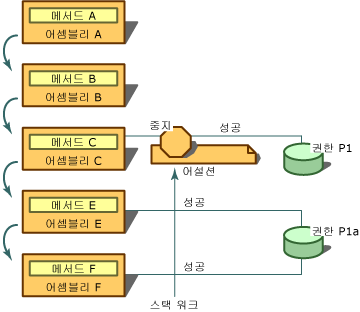

# <a name="using-the-assert-method"></a><span data-ttu-id="81907-102">Assert 메서드 사용</span><span class="sxs-lookup"><span data-stu-id="81907-102">Using the Assert Method</span></span>
[!INCLUDE[net_security_note](../../../includes/net-security-note-md.md)]  
  
 <span data-ttu-id="81907-103"><xref:System.Security.CodeAccessPermission.Assert%2A>는 코드 액세스 권한 클래스 및 <xref:System.Security.PermissionSet> 클래스에서 호출할 수 있는 메서드입니다.</span><span class="sxs-lookup"><span data-stu-id="81907-103"><xref:System.Security.CodeAccessPermission.Assert%2A> is a method that can be called on code access permission classes and on the <xref:System.Security.PermissionSet> class.</span></span> <span data-ttu-id="81907-104">사용할 수 있습니다 **Assert** 사용자 코드 (및 다운스트림 호출자) 수행할 작업을 수행할 수 있는 권한이 코드의 호출자를 사용할 수 있도록 되지 않았을 수 있는 권한을 합니다.</span><span class="sxs-lookup"><span data-stu-id="81907-104">You can use **Assert** to enable your code (and downstream callers) to perform actions that your code has permission to do but its callers might not have permission to do.</span></span> <span data-ttu-id="81907-105">보안 어설션은 보안 검사 중 런타임이 수행하는 일반적인 프로세스를 변경합니다.</span><span class="sxs-lookup"><span data-stu-id="81907-105">A security assertion changes the normal process that the runtime performs during a security check.</span></span> <span data-ttu-id="81907-106">사용 권한을 어설션하는 경우 어설션된 권한에 대해 코드의 호출자를 검사하지 않도록 보안 시스템에 지시합니다.</span><span class="sxs-lookup"><span data-stu-id="81907-106">When you assert a permission, it tells the security system not to check the callers of your code for the asserted permission.</span></span>  
  
> [!CAUTION]
>  <span data-ttu-id="81907-107">어설션은 보안 허점을 열고 보안 제한을 적용하는 런타임 메커니즘을 저해할 수 있으므로 신중하게 사용해야 합니다.</span><span class="sxs-lookup"><span data-stu-id="81907-107">Use assertions carefully because they can open security holes and undermine the runtime's mechanism for enforcing security restrictions.</span></span>  
  
 <span data-ttu-id="81907-108">어설션은 라이브러리가 비관리 코드를 호출하거나 라이브러리의 의도한 용도와 명확한 관련이 없는 권한이 필요한 호출을 수행하는 경우에 유용합니다.</span><span class="sxs-lookup"><span data-stu-id="81907-108">Assertions are useful in situations in which a library calls into unmanaged code or makes a call that requires a permission that is not obviously related to the library's intended use.</span></span> <span data-ttu-id="81907-109">모든 비관리 코드를 호출 해야 하는 코드에 관리 되는 예를 들어 **SecurityPermission** 와 **UnmanagedCode** 플래그를 지정 합니다.</span><span class="sxs-lookup"><span data-stu-id="81907-109">For example, all managed code that calls into unmanaged code must have **SecurityPermission** with the **UnmanagedCode** flag specified.</span></span> <span data-ttu-id="81907-110">로컬 인트라넷에서 다운로드된 코드와 같은, 로컬 컴퓨터에서 시작되지 않은 코드에는 기본적으로 이 사용 권한이 부여되지 않습니다.</span><span class="sxs-lookup"><span data-stu-id="81907-110">Code that does not originate from the local computer, such as code that is downloaded from the local intranet, will not be granted this permission by default.</span></span> <span data-ttu-id="81907-111">따라서 로컬 인트라넷에서 다운로드된 코드가 비관리 코드를 사용하는 라이브러리를 호출할 수 있으려면 라이브러리에서 어설션된 사용 권한이 있어야 합니다.</span><span class="sxs-lookup"><span data-stu-id="81907-111">Therefore, in order for code that is downloaded from the local intranet to be able to call a library that uses unmanaged code, it must have the permission asserted by the library.</span></span> <span data-ttu-id="81907-112">또한 일부 라이브러리는 호출자에게 표시되지 않으며 특별한 사용 권한이 필요한 호출을 수행할 수 있습니다.</span><span class="sxs-lookup"><span data-stu-id="81907-112">Additionally, some libraries might make calls that are unseen to callers and require special permissions.</span></span>  
  
 <span data-ttu-id="81907-113">코드가 호출자로부터 완전히 숨겨지는 방식으로 리소스에 액세스하는 상황에서 어설션을 사용할 수도 있습니다.</span><span class="sxs-lookup"><span data-stu-id="81907-113">You can also use assertions in situations in which your code accesses a resource in a way that is completely hidden from callers.</span></span> <span data-ttu-id="81907-114">예를 들어 라이브러리가 데이터베이스에서 정보를 얻지만 이 과정에서 컴퓨터 레지스트리의 정보도 읽는다고 가정합니다.</span><span class="sxs-lookup"><span data-stu-id="81907-114">For example, suppose your library acquires information from a database, but in the process also reads information from the computer registry.</span></span> <span data-ttu-id="81907-115">코드에 필요한 알 수 없습니다 있는 라이브러리를 사용 하는 개발자가 원본에 액세스할 수 없기 때문에 **RegistryPermission** 코드를 사용 하려면.</span><span class="sxs-lookup"><span data-stu-id="81907-115">Because developers using your library do not have access to your source, they have no way of knowing that their code requires **RegistryPermission** in order to use your code.</span></span> <span data-ttu-id="81907-116">이 경우 코드의 호출자에게 레지스트리에 액세스할 수 있는 권한을 요구하는 것이 타당하거나 필요하지 않다고 결정할 경우 레지스트리를 읽을 수 있는 권한을 어설션할 수 있습니다.</span><span class="sxs-lookup"><span data-stu-id="81907-116">In this case, if you decide that it is not reasonable or necessary to require that callers of your code have permission to access the registry, you can assert permission for reading the registry.</span></span> <span data-ttu-id="81907-117">이 경우에 적절 한 권한을 어설션하는 그렇게 라이브러리 없는 호출자가 **RegistryPermission** 라이브러리를 사용할 수 있습니다.</span><span class="sxs-lookup"><span data-stu-id="81907-117">In this situation, it is appropriate for the library to assert the permission so that callers without **RegistryPermission** can use the library.</span></span>  
  
 <span data-ttu-id="81907-118">어설션은 어설션된 권한 및 다운스트림 호출자가 요청한 권한이 동일한 형식이고 요청된 권한이 어설션된 권한의 하위 집합인 경우에만 스택 워크에 영향을 줍니다.</span><span class="sxs-lookup"><span data-stu-id="81907-118">The assertion affects the stack walk only if the asserted permission and a permission demanded by a downstream caller are of the same type and if the demanded permission is a subset of the asserted permission.</span></span> <span data-ttu-id="81907-119">예를 들어, 어설션 **FileIOPermission** C 드라이브와 다운스트림 요청이에 모든 파일 읽기에 대 한 **FileIOPermission** C:\Temp의 파일을 읽을 수는 어설션이 영향을 줄 수는 스택 워크; 그러나 요청 된 경우 **FileIOPermission** C 드라이브에 쓰려고 어설션이 갖기 영향을 주지 않습니다.</span><span class="sxs-lookup"><span data-stu-id="81907-119">For example, if you assert **FileIOPermission** to read all files on the C drive, and a downstream demand is made for **FileIOPermission** to read files in C:\Temp, the assertion could affect the stack walk; however, if the demand was for **FileIOPermission** to write to the C drive, the assertion would have no effect.</span></span>  
  
 <span data-ttu-id="81907-120">어설션을 수행하려면 코드에 어셜션하는 권한 및 어설션을 수행하는 권한을 나타내는 <xref:System.Security.Permissions.SecurityPermission>을 둘 다 부여해야 합니다.</span><span class="sxs-lookup"><span data-stu-id="81907-120">To perform assertions, your code must be granted both the permission you are asserting and the <xref:System.Security.Permissions.SecurityPermission> that represents the right to make assertions.</span></span> <span data-ttu-id="81907-121">코드에 부여되지 않은 권한을 어설션할 수도 있지만 어설션을 통해 보안 검사가 성공하기 전에 실패하므로 어설션의 의미가 없습니다.</span><span class="sxs-lookup"><span data-stu-id="81907-121">Although you could assert a permission that your code has not been granted, the assertion would be pointless because the security check would fail before the assertion could cause it to succeed.</span></span>  
  
 <span data-ttu-id="81907-122">다음 그림과 사용 하면 어떤 일이 생기 **Assert**합니다.</span><span class="sxs-lookup"><span data-stu-id="81907-122">The following illustration shows what happens when you use **Assert**.</span></span> <span data-ttu-id="81907-123">다음 문이 A, B, C, E 및 F 어셈블리와 두 개의 사용 권한 P1과 P1A에 대해 true라고 가정합니다.</span><span class="sxs-lookup"><span data-stu-id="81907-123">Assume that the following statements are true about assemblies A, B, C, E, and F, and two permissions, P1 and P1A:</span></span>  
  
-   <span data-ttu-id="81907-124">P1A는 C 드라이브의 .txt 파일을 읽을 수 있는 권한을 나타냅니다.</span><span class="sxs-lookup"><span data-stu-id="81907-124">P1A represents the right to read .txt files on the C drive.</span></span>  
  
-   <span data-ttu-id="81907-125">P1은 C 드라이브의 모든 파일을 읽을 수 있는 권한을 나타냅니다.</span><span class="sxs-lookup"><span data-stu-id="81907-125">P1 represents the right to read all files on the C drive.</span></span>  
  
-   <span data-ttu-id="81907-126">P1A와 p 1은 모두 **FileIOPermission** 형식이 고 P1A는 p 1의 하위 집합입니다.</span><span class="sxs-lookup"><span data-stu-id="81907-126">P1A and P1 are both **FileIOPermission** types, and P1A is a subset of P1.</span></span>  
  
-   <span data-ttu-id="81907-127">어셈블리 E와 F에는 P1A 권한이 부여되었습니다.</span><span class="sxs-lookup"><span data-stu-id="81907-127">Assemblies E and F have been granted P1A permission.</span></span>  
  
-   <span data-ttu-id="81907-128">어셈블리 C에는 P1 권한이 부여되었습니다.</span><span class="sxs-lookup"><span data-stu-id="81907-128">Assembly C has been granted P1 permission.</span></span>  
  
-   <span data-ttu-id="81907-129">어셈블리 A와 B에는 P1 및 P1A 권한이 부여되지 않았습니다.</span><span class="sxs-lookup"><span data-stu-id="81907-129">Assemblies A and B have been granted neither P1 nor P1A permissions.</span></span>  
  
-   <span data-ttu-id="81907-130">메서드 A는 어셈블리 A에 포함되고, 메서드 B는 어셈블리 B에 포함됩니다.</span><span class="sxs-lookup"><span data-stu-id="81907-130">Method A is contained in assembly A, method B is contained in assembly B, and so on.</span></span>  
  
 <span data-ttu-id="81907-131"></span><span class="sxs-lookup"><span data-stu-id="81907-131"></span></span>  
<span data-ttu-id="81907-132">Assert 사용</span><span class="sxs-lookup"><span data-stu-id="81907-132">Using Assert</span></span>  
  
 <span data-ttu-id="81907-133">이 시나리오, 메서드는 호출 B, C B 호출, C 호출 E, E 호출에서 F 어설션 (P1 권한) C 드라이브에 파일을 읽을 수 있는 권한 및 메서드 E 권한 (P1A)는 C 드라이브의.txt 파일을 읽을 권한을 요청 합니다.</span><span class="sxs-lookup"><span data-stu-id="81907-133">In this scenario, method A calls B, B calls C, C calls E, and E calls F. Method C asserts permission to read files on the C drive (permission P1), and method E demands permission to read .txt files on the C drive (permission P1A).</span></span> <span data-ttu-id="81907-134">F의 요청이 런타임에 발생 하면 F의 모든 호출자의 권한을 검사 하는 스택 워크가 수행 E부터 시작에 부여 P1A 권한이 있으므로 C의 어설션이 발견 됩니다, C의 권한을 검사 하는 스택 워크가 진행 됩니다.</span><span class="sxs-lookup"><span data-stu-id="81907-134">When the demand in F is encountered at run time, a stack walk is performed to check the permissions of all callers of F, starting with E. E has been granted P1A permission, so the stack walk proceeds to examine the permissions of C, where C's assertion is discovered.</span></span> <span data-ttu-id="81907-135">요청된 권한(P1A)이 어설션된 권한(P1)의 하위 집합이기 때문에 스택 워크가 중지되고 보안 검사가 자동으로 성공합니다.</span><span class="sxs-lookup"><span data-stu-id="81907-135">Because the demanded permission (P1A) is a subset of the asserted permission (P1), the stack walk stops and the security check automatically succeeds.</span></span> <span data-ttu-id="81907-136">어셈블리 A와 B에 권한 P1A가 부여되지 않은 것은 중요하지 않습니다.</span><span class="sxs-lookup"><span data-stu-id="81907-136">It does not matter that assemblies A and B have not been granted permission P1A.</span></span> <span data-ttu-id="81907-137">P1을 어설션하여 메서드 C는 호출자에게 리소스에 액세스할 수 있는 권한이 부여되지 않은 경우에도 호출자가 P1로 보호된 리소스에 액세스할 수 있도록 합니다.</span><span class="sxs-lookup"><span data-stu-id="81907-137">By asserting P1, method C ensures that its callers can access the resource protected by P1, even if the callers have not been granted permission to access that resource.</span></span>  
  
 <span data-ttu-id="81907-138">클래스 라이브러리를 디자인하고 클래스가 보호된 리소스에 액세스하는 경우 대체로 클래스의 호출자에게 적절한 권한을 요구하는 보안 요청을 수행해야 합니다.</span><span class="sxs-lookup"><span data-stu-id="81907-138">If you design a class library and a class accesses a protected resource, you should, in most cases, make a security demand requiring that the callers of the class have the appropriate permission.</span></span> <span data-ttu-id="81907-139">클래스 다음에 대 한 작업을 수행 하는 경우 대부분의 호출자에 게 알고 있는 사용 권한이 없으며 호출 하 여 권한을 어설션할 수 인 경우 코드를이 호출할 수 있도록 하려면는 **Assert** 작업을 나타내는 권한 개체에서 메서드 코드에서 수행 합니다.</span><span class="sxs-lookup"><span data-stu-id="81907-139">If the class then performs an operation for which you know most of its callers will not have permission, and if you are willing to take the responsibility for letting these callers call your code, you can assert the permission by calling the **Assert** method on a permission object that represents the operation the code is performing.</span></span> <span data-ttu-id="81907-140">사용 하 여 **Assert** 정상적으로 하지 않는 수를 사용 하면 호출자가 이러한 방식으로 코드를 호출 합니다.</span><span class="sxs-lookup"><span data-stu-id="81907-140">Using **Assert** in this way lets callers that normally could not do so call your code.</span></span> <span data-ttu-id="81907-141">따라서 권한을 어설션하는 경우 구성 요소가 잘못 사용되지 않도록 사전에 적절한 보안 검사를 수행해야 합니다.</span><span class="sxs-lookup"><span data-stu-id="81907-141">Therefore, if you assert a permission, you should be sure to perform appropriate security checks beforehand to prevent your component from being misused.</span></span>  
  
 <span data-ttu-id="81907-142">예를 들어 신뢰할 수 있는 라이브러리 클래스에 파일을 삭제하는 메서드가 있다고 가정합니다.</span><span class="sxs-lookup"><span data-stu-id="81907-142">For example, suppose your highly trusted library class has a method that deletes files.</span></span> <span data-ttu-id="81907-143">관리되지 않은 Win32 함수를 호출하여 파일에 액세스합니다.</span><span class="sxs-lookup"><span data-stu-id="81907-143">It accesses the file by calling an unmanaged Win32 function.</span></span> <span data-ttu-id="81907-144">호출자가 호출 코드의 **삭제** 삭제 될 파일의 이름을 전달 하는 메서드 C:\Test.txt 합니다.</span><span class="sxs-lookup"><span data-stu-id="81907-144">A caller invokes your code's **Delete** method, passing in the name of the file to be deleted, C:\Test.txt.</span></span> <span data-ttu-id="81907-145">내에서 **삭제** 메서드를 작성 하는 코드는 <xref:System.Security.Permissions.FileIOPermission> C:\Test.txt에 대 한 쓰기를 나타내는 개체입니다.</span><span class="sxs-lookup"><span data-stu-id="81907-145">Within the **Delete** method, your code creates a <xref:System.Security.Permissions.FileIOPermission> object representing write access to C:\Test.txt.</span></span> <span data-ttu-id="81907-146">파일을 삭제하려면 쓰기 권한이 필요합니다. 다음 코드를 호출 하 여 명령적 보안 검사를 호출는 **FileIOPermission** 개체의 **요청** 메서드.</span><span class="sxs-lookup"><span data-stu-id="81907-146">(Write access is required to delete a file.) Your code then invokes an imperative security check by calling the **FileIOPermission** object's **Demand** method.</span></span> <span data-ttu-id="81907-147">호출 스택의 호출자 중 하나에 이 권한이 없는 경우 <xref:System.Security.SecurityException>이 발생합니다.</span><span class="sxs-lookup"><span data-stu-id="81907-147">If one of the callers in the call stack does not have this permission, a <xref:System.Security.SecurityException> is thrown.</span></span> <span data-ttu-id="81907-148">예외가 발생하지 않으면 모든 호출자에게 C:\Test.txt에 액세스할 수 있는 권한이 있음을 알고 있습니다.</span><span class="sxs-lookup"><span data-stu-id="81907-148">If no exception is thrown, you know that all callers have the right to access C:\Test.txt.</span></span> <span data-ttu-id="81907-149">대부분의 호출자에 게 비관리 코드에 액세스할 권한이 없는, 다음 작성 하는 코드 생각 하므로 코드는 <xref:System.Security.Permissions.SecurityPermission> 비관리 코드를 호출할 수 있는 권한을 나타내는 개체의 호출 개체 **Assert** 메서드.</span><span class="sxs-lookup"><span data-stu-id="81907-149">Because you believe that most of your callers will not have permission to access unmanaged code, your code then creates a <xref:System.Security.Permissions.SecurityPermission> object that represents the right to call unmanaged code and calls the object's **Assert** method.</span></span> <span data-ttu-id="81907-150">끝으로, 관리되지 않는 Win32 함수를 호출하여 C:\Text.txt를 삭제하고 호출자에게 컨트롤을 반환합니다.</span><span class="sxs-lookup"><span data-stu-id="81907-150">Finally, it calls the unmanaged Win32 function to delete C:\Text.txt and returns control to the caller.</span></span>  
  
> [!CAUTION]
>  <span data-ttu-id="81907-151">다른 코드가 사용자 코드를 사용하여 어설션하는 권한으로 보호된 리소스를 액세스할 수 있는 상황에서는 코드에서 어설션을 사용하지 않도록 해야 합니다.</span><span class="sxs-lookup"><span data-stu-id="81907-151">You must be sure that your code does not use assertions in situations where your code can be used by other code to access a resource that is protected by the permission you are asserting.</span></span> <span data-ttu-id="81907-152">예를 들어 호출자가 매개 변수로 이름이 지정 된 파일에 쓰는 코드에서 어설션 하지 않습니다는 **FileIOPermission** 코드가 열려 제 3 자가 잘못 사용 될 수 있으므로 파일에 쓰기 위한 합니다.</span><span class="sxs-lookup"><span data-stu-id="81907-152">For example, in code that writes to a file whose name is specified by the caller as a parameter, you would not assert the **FileIOPermission** for writing to files because your code would be open to misuse by a third party.</span></span>  
  
 <span data-ttu-id="81907-153">명령적 보안 구문을 사용 하는 경우 호출 된 **Assert** 동일한 메서드의 여러 권한에 대해는 메서드를 사용 하면 보안 예외를 throw 합니다.</span><span class="sxs-lookup"><span data-stu-id="81907-153">When you use the imperative security syntax, calling the **Assert** method on multiple permissions in the same method causes a security exception to be thrown.</span></span> <span data-ttu-id="81907-154">대신 만들어야는 **PermissionSet** 개체를 호출 하 고 호출 하려는 개별 사용 권한을 전달 하는 **Assert** 에서 메서드는 **PermissionSet** 개체입니다.</span><span class="sxs-lookup"><span data-stu-id="81907-154">Instead, you should create a **PermissionSet** object, pass it the individual permissions you want to invoke, and then call the **Assert** method on the **PermissionSet** object.</span></span> <span data-ttu-id="81907-155">호출할 수 있습니다는 **Assert** 메서드 선언적 보안 구문을 사용할 때 한 번 이상.</span><span class="sxs-lookup"><span data-stu-id="81907-155">You can call the **Assert** method more than once when you use the declarative security syntax.</span></span>  
  
 <span data-ttu-id="81907-156">다음 예제에서는 재정의 보안 검사를 사용 하 여 선언적 구문을 보여 줍니다는 **Assert** 메서드.</span><span class="sxs-lookup"><span data-stu-id="81907-156">The following example shows declarative syntax for overriding security checks using the **Assert** method.</span></span> <span data-ttu-id="81907-157">에 **FileIOPermissionAttribute** 구문에는 두 개의 값이:는 <xref:System.Security.Permissions.SecurityAction> 열거형 및 권한 부여는 디렉터리 또는 파일의 위치입니다.</span><span class="sxs-lookup"><span data-stu-id="81907-157">Notice that the **FileIOPermissionAttribute** syntax takes two values: a <xref:System.Security.Permissions.SecurityAction> enumeration and the location of the file or directory to which permission is to be granted.</span></span> <span data-ttu-id="81907-158">에 대 한 호출 **Assert** 에 대 한 액세스에 대 한 요청이 `C:\Log.txt` 성공 하지만 파일에 액세스할 수 있는 권한이 호출자에 게 확인 되지 않습니다.</span><span class="sxs-lookup"><span data-stu-id="81907-158">The call to **Assert** causes demands for access to `C:\Log.txt` to succeed, even though callers are not checked for permission to access the file.</span></span>  
  
```vb  
Option Explicit  
Option Strict  
  
Imports System  
Imports System.IO  
Imports System.Security.Permissions  
  
Namespace LogUtil  
   Public Class Log  
      Public Sub New()  
  
      End Sub  
  
     <FileIOPermission(SecurityAction.Assert, All := "C:\Log.txt")> Public Sub   
      MakeLog()  
         Dim TextStream As New StreamWriter("C:\Log.txt")  
         TextStream.WriteLine("This  Log was created on {0}", DateTime.Now) '  
         TextStream.Close()  
      End Sub  
   End Class  
End Namespace  
```  
  
```csharp  
namespace LogUtil  
{  
   using System;  
   using System.IO;  
   using System.Security.Permissions;  
  
   public class Log  
   {  
      public Log()  
      {      
      }     
      [FileIOPermission(SecurityAction.Assert, All = @"C:\Log.txt")]  
      public void MakeLog()  
      {     
         StreamWriter TextStream = new StreamWriter(@"C:\Log.txt");  
         TextStream.WriteLine("This  Log was created on {0}", DateTime.Now);  
         TextStream.Close();  
      }  
   }  
}   
```  
  
 <span data-ttu-id="81907-159">다음 코드 조각을 사용 하 여 보안 검사를 재정의 명령적 구문을 보여는 **Assert** 메서드.</span><span class="sxs-lookup"><span data-stu-id="81907-159">The following code fragments show imperative syntax for overriding security checks using the **Assert** method.</span></span> <span data-ttu-id="81907-160">이 예제에서는의 인스턴스는 **FileIOPermission** 개체를 선언 합니다.</span><span class="sxs-lookup"><span data-stu-id="81907-160">In this example, an instance of the **FileIOPermission** object is declared.</span></span> <span data-ttu-id="81907-161">해당 생성자에 전달 됩니다 **FileIOPermissionAccess.AllAccess** 다음 파일의 위치를 설명 하는 문자열, 허용 되는 액세스 유형을 정의 합니다.</span><span class="sxs-lookup"><span data-stu-id="81907-161">Its constructor is passed **FileIOPermissionAccess.AllAccess** to define the type of access allowed, followed by a string describing the file's location.</span></span> <span data-ttu-id="81907-162">한 번의 **FileIOPermission** 개체를 정의 호출 하면 해당 **Assert** 보안 검사를 재정의 하는 메서드.</span><span class="sxs-lookup"><span data-stu-id="81907-162">Once the **FileIOPermission** object is defined, you only need to call its **Assert** method to override the security check.</span></span>  
  
```vb  
Option Explicit  
Option Strict  
Imports System  
Imports System.IO  
Imports System.Security.Permissions  
Namespace LogUtil  
   Public Class Log  
      Public Sub New()  
      End Sub 'New  
  
      Public Sub MakeLog()  
         Dim FilePermission As New FileIOPermission(FileIOPermissionAccess.AllAccess, "C:\Log.txt")  
         FilePermission.Assert()  
         Dim TextStream As New StreamWriter("C:\Log.txt")  
         TextStream.WriteLine("This  Log was created on {0}", DateTime.Now)  
         TextStream.Close()  
      End Sub  
   End Class  
End Namespace  
```  
  
```csharp  
namespace LogUtil  
{  
   using System;  
   using System.IO;  
   using System.Security.Permissions;  
  
   public class Log  
   {  
      public Log()  
      {      
      }     
      public void MakeLog()  
      {  
         FileIOPermission FilePermission = new FileIOPermission(FileIOPermissionAccess.AllAccess,@"C:\Log.txt");   
         FilePermission.Assert();  
         StreamWriter TextStream = new StreamWriter(@"C:\Log.txt");  
         TextStream.WriteLine("This  Log was created on {0}", DateTime.Now);  
         TextStream.Close();  
      }  
   }  
}  
```  
  
## <a name="see-also"></a><span data-ttu-id="81907-163">참고 항목</span><span class="sxs-lookup"><span data-stu-id="81907-163">See Also</span></span>  
 <xref:System.Security.PermissionSet>  
 <xref:System.Security.Permissions.SecurityPermission>  
 <xref:System.Security.Permissions.FileIOPermission>  
 <xref:System.Security.Permissions.SecurityAction>  
 [<span data-ttu-id="81907-164">특성</span><span class="sxs-lookup"><span data-stu-id="81907-164">Attributes</span></span>](../../../docs/standard/attributes/index.md)  
 [<span data-ttu-id="81907-165">코드 액세스 보안</span><span class="sxs-lookup"><span data-stu-id="81907-165">Code Access Security</span></span>](../../../docs/framework/misc/code-access-security.md)
