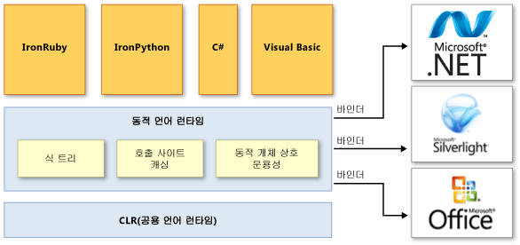

# 동적 언어 런타임 개요
DLR(*동적 언어 런타임*)은 동적 언어에 대한 서비스 집합을 CLR(공용 언어 런타임)에 추가하는 런타임 환경입니다. DLR을 사용하면 .NET Framework에서 실행할 동적 언어를 개발하고 정적 형식의 언어에 동적 기능을 추가하기가 간편해집니다.  
  
 동적 언어는 런타임에 개체의 형식을 식별할 수 있지만, C# 및 Visual Basic과 같은 정적 형식의 언어에서는(`Option Explicit On`을 사용할 경우) 디자인 타임에 개체 형식을 지정해야 합니다. 동적 언어의 예로는 Lisp, Smalltalk, JavaScript, PHP, Ruby, Python, ColdFusion, Lua, Cobra, Groovy가 있습니다.  
  
 대부분의 동적 언어는 개발자에 대한 다음과 같은 장점을 제공합니다.  
  
-   빠른 피드백 루프(REPL 또는 읽기-평가-인쇄 루프)를 사용하는 기능. 이 기능을 통해 여러 문을 입력하고 즉시 실행하여 결과를 확인할 수 있습니다.  
  
-   하향식 개발 및 더 전통적인 상향식 개발 지원. 예를 들어 하향식 방법을 사용할 경우 아직 구현되지 않은 함수를 호출하고 나서 필요할 때 기본 구현을 추가할 수 있습니다.  
  
-   전체 코드에서 static 형식 선언을 변경할 필요가 없으므로 더 간편한 리팩터링 및 코드 수정.  
  
 동적 언어는 우수한 스크립팅 언어를 만듭니다. 고객은 새로운 명령 및 기능을 사용하여 동적 언어를 통해 생성된 응용 프로그램을 쉽게 확장할 수 있습니다. 동적 언어는 웹 사이트 및 테스트 도구를 만들고, 서버 팜을 유지 관리하고, 다양한 유틸리티를 개발하고, 데이터 변형을 수행하는 데도 자주 사용됩니다.  
  
 DLR의 목적은 동적 언어 시스템이 .NET Framework에서 실행되고 동적 언어에 .NET 상호 운용성을 제공할 수 있도록 하는 것입니다. DLR은 Visual Studio 2010에서 C# 및 Visual Basic에 동적 개체를 도입하여 이러한 언어에서 동적 동작을 지원하고 동적 언어와의 상호 운용성을 가능하게 합니다.  
  
 DLR을 통해 동적 작업을 지원하는 라이브러리도 만들 수 있습니다. 예를 들어 XML 또는 JSON(JavaScript Object Notation) 개체를 사용하는 라이브러리가 있는 경우 개체는 DLR을 사용하는 언어에 대해 동적 개체로 나타날 수 있습니다. 이를 통해 라이브러리 사용자는 개체를 사용하고 개체 멤버에 액세스하기 위한 더 간단하고 더 중립적인 코드 구문을 작성할 수 있습니다.  
  
 예를 들어 다음 코드를 사용하여 C#의 XML에서 카운터를 증가시킬 수 있습니다.  
  
 `Scriptobj.SetProperty("Count", ((int)GetProperty("Count")) + 1);`  
  
 DLR을 사용하면 동일한 작업 대신 다음 코드를 사용할 수 있습니다.  
  
 `scriptobj.Count += 1;`  
  
 CLR과 비슷하게 DLR은 .NET Framework의 일부이고 .NET Framework 및 Visual Studio 설치 패키지와 함께 제공됩니다. 오픈 소스 버전의 DLR은 또한 [CodePlex](http://go.microsoft.com/fwlink/?LinkId=141028) 웹 사이트에서 다운로드할 수 있습니다.  
  
> [!NOTE]
>  오픈 소스 버전의 DLR에는 Visual Studio 및 .NET Framework에 포함된 DLR의 모든 기능이 들어 있습니다. 언어 구현자를 위한 추가적인 지원도 제공합니다. 자세한 내용은 [CodePlex](http://go.microsoft.com/fwlink/?LinkId=141028) 웹 사이트의 설명서를 참조하세요.  
  
 DLR을 사용하여 개발된 언어의 예는 다음과 같습니다.  
  
-   IronPython. [GitHub](https://github.com/IronLanguages/ironpython2) 웹 사이트에서 오픈 소스 소프트웨어로 제공됩니다.  
  
-   IronRuby. [RubyForge](http://go.microsoft.com/fwlink/?LinkId=141044) 웹 사이트에서 오픈 소스 소프트웨어로 제공됩니다.  
  
## 기본 DLR 장점  
 DLR은 다음과 같은 장점을 제공합니다.  
  
### .NET Framework에 대한 동적 언어 포팅 간소화  
 DLR을 사용하면 언어 구현자가 어휘 분석기, 구문 분석기, 의미 체계 분석기, 코드 생성기 및 기존에는 직접 만들어야 했던 기타 도구를 만들 필요가 없습니다. DLR을 사용하려면 언어가 트리 모양 구조의 언어 수준 코드, 런타임 도우미 루틴 및 <xref:System.Dynamic.IDynamicMetaObjectProvider> 인터페이스를 구현하는 선택적 동적 개체를 나타내는 *식 트리*를 생성해야 합니다. DLR 및 .NET Framework는 많은 코드 분석 및 코드 생성 작업을 자동화합니다. 이를 통해 언어 구현자는 고유한 언어 기능에 집중할 수 있습니다.  
  
### 정적 형식의 언어에서 동적 기능 사용  
 C# 및 Visual Basic과 같은 기존 .NET Framework 언어는 동적 개체를 만들고 정적 형식의 개체와 함께 사용할 수 있습니다. 예를 들어 C# 및 Visual Basic은 HTML, DOM(문서 개체 모델) 및 .NET 리플렉션에 대해 동적 개체를 사용할 수 있습니다.  
  
### 미래 DLR 및 .NET Framework의 장점 제공  
 DLR을 사용하여 구현된 언어는 미래 DLR 및 .NET Framework의 향상된 기능을 활용할 수 있습니다. 예를 들어 .NET Framework가 향상된 가비지 수집기나 더 빠른 어셈블리 로드 시간을 제공하는 새로운 버전을 릴리스할 경우 DLR을 사용하여 구현된 언어도 이러한 장점을 활용할 수 있습니다. DLR이 향상된 컴파일과 같은 최적화를 추가하는 경우 DLR을 사용하여 구현된 모든 언어의 성능도 향상됩니다.  
  
### 라이브러리 및 개체의 공유 구현  
 하나의 언어로 구현된 개체 및 라이브러리가 다른 언어에서 사용될 수 있습니다. DLR을 통해 정적 형식의 언어와 동적 언어 간에 상호 운용이 가능해집니다. 예를 들어 C#은 동적 언어로 작성된 라이브러리를 사용하는 동적 개체를 선언할 수 있습니다. 동시에 동적 언어는 .NET Framework의 라이브러리를 사용할 수 있습니다.  
  
### 빠른 동적 디스패치 및 호출 제공  
 DLR은 고급 다형적 캐싱을 지원함으로써 동적 작업의 빠른 실행을 제공합니다. DLR은 개체를 사용하는 작업을 필요한 런타임 구현에 바인딩하는 규칙을 만들고 나서 이러한 규칙을 캐시하여 같은 개체 형식에서 같은 코드를 연속 실행하는 동안 리소스가 많이 사용하는 바인딩 계산을 피합니다.  
  
## DLR 아키텍처  
 다음 그림은 동적 언어 런타임의 아키텍처를 보여 줍니다.  
  
   
DLR 아키텍처  
  
 DLR은 동적 언어 지원을 개선하기 위해 서비스 집합을 CLR에 추가합니다. 이러한 서비스에는 다음 항목이 포함됩니다.  
  
-   식 트리. DLR은 식 트리를 사용하여 언어 의미 체계를 나타냅니다. 이 목적으로 DLR은 제어 흐름, 할당 및 기타 언어 모델링 노드를 포함하도록 LINQ 식 트리를 확장했습니다. 자세한 내용은 [식 트리](http://msdn.microsoft.com/library/fb1d3ed8-d5b0-4211-a71f-dd271529294b)를 참조하세요.  
  
-   호출 사이트 캐싱. *동적 호출 사이트*는 코드에서 동적 개체에 대해 `a + b` 또는 `a.b()` 같은 작업을 수행하는 위치입니다. DLR은 `a` 및 `b`의 특징(대개 이러한 개체의 형식)과 작업 정보를 캐시합니다. 해당 작업이 이전에 수행된 적이 있으면 DLR은 빠른 디스패치를 위해 캐시에서 모든 필요한 정보를 검색합니다.  
  
-   동적 개체 상호 운용성. DLR은 동적 개체와 개체를 나타내고 언어 구현자 및 동적 라이브러리 작성자가 사용할 수 있는 클래스 및 인터페이스 집합을 제공합니다. 이러한 클래스 및 인터페이스에는 <xref:System.Dynamic.IDynamicMetaObjectProvider>, <xref:System.Dynamic.DynamicMetaObject>, <xref:System.Dynamic.DynamicObject> 및 <xref:System.Dynamic.ExpandoObject>가 포함됩니다.  
  
 DLR은 호출 사이트에서 바인더를 사용하여 .NET Framework뿐 아니라 Silverlight 및 COM이 포함된 다른 인프라 및 서비스와 통신합니다. 바인더는 언어의 의미 체계를 캡슐화하고 호출 사이트에서 식 트리를 사용하여 작업을 수행하는 방법을 지정합니다. 이를 통해 동적 언어와 정적 형식의 언어가 DLR을 사용하여 라이브러리를 공유하고 DLR이 지원하는 모든 기술에 액세스할 수 있습니다.  
  
## DLR 설명서  
 오픈 소스 버전의 DLR을 사용하여 언어에 동적 동작을 추가하는 방법이나 .NET Framework에 동적 언어를 사용할 수 있도록 하는 방법에 대한 자세한 내용은 [CodePlex](http://go.microsoft.com/fwlink/?LinkId=141028) 웹 사이트에서 제공하는 문서를 참조하세요.  
  
## 참고 항목  
 <xref:System.Dynamic.ExpandoObject>   
 <xref:System.Dynamic.DynamicObject>   
 [공용 언어 런타임](../../../docs/standard/clr.md)   
 [Expression Trees](http://msdn.microsoft.com/library/fb1d3ed8-d5b0-4211-a71f-dd271529294b)   
 [연습: 동적 개체 만들기 및 사용](~/docs/csharp/programming-guide/types/walkthrough-creating-and-using-dynamic-objects.md)

