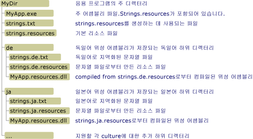

# <a name="creating-satellite-assemblies-for-desktop-apps"></a><span data-ttu-id="870f8-102">데스크톱 응용 프로그램용 위성 어셈블리 만들기</span><span class="sxs-lookup"><span data-stu-id="870f8-102">Creating Satellite Assemblies for Desktop Apps</span></span>
<span data-ttu-id="870f8-103">리소스 파일은 지역화된 응용 프로그램에서 중요한 역할을 합니다.</span><span class="sxs-lookup"><span data-stu-id="870f8-103">Resource files play a central role in localized applications.</span></span> <span data-ttu-id="870f8-104">응용 프로그램을 사용하여 사용자의 언어 및 문화권에서 문자열, 이미지 및 기타 데이터를 표시하고 사용자의 언어 또는 문화권에 대한 리소스를 사용할 수 없는 경우 대체 데이터를 제공할 수 있습니다.</span><span class="sxs-lookup"><span data-stu-id="870f8-104">They enable an application to display strings, images, and other data in the user's own language and culture, and to provide alternate data if resources for the user's own language or culture are unavailable.</span></span> <span data-ttu-id="870f8-105">.NET Framework에서는 허브 및 스포크 모델을 사용하여 지역화된 리소스를 찾고 검색합니다.</span><span class="sxs-lookup"><span data-stu-id="870f8-105">The .NET Framework uses a hub-and-spoke model to locate and retrieve localized resources.</span></span> <span data-ttu-id="870f8-106">허브는 지역화할 수 없는 실행 코드와 중립 또는 기본 문화권이라고 하는 단일 문화권의 리소스를 포함하는 주 어셈블리입니다.</span><span class="sxs-lookup"><span data-stu-id="870f8-106">The hub is the main assembly that contains the non-localizable executable code and the resources for a single culture, which is called the neutral or default culture.</span></span> <span data-ttu-id="870f8-107">기본 문화권은 응용 프로그램의 대체 문화권으로, 지역화된 리소스를 사용할 수 없는 경우 사용됩니다.</span><span class="sxs-lookup"><span data-stu-id="870f8-107">The default culture is the fallback culture for the application; it is used when no localized resources are available.</span></span> <span data-ttu-id="870f8-108"><xref:System.Resources.NeutralResourcesLanguageAttribute> 특성을 사용하여 응용 프로그램의 기본 문화권의 문화를 지정합니다.</span><span class="sxs-lookup"><span data-stu-id="870f8-108">You use the <xref:System.Resources.NeutralResourcesLanguageAttribute> attribute to designate the culture of the application's default culture.</span></span> <span data-ttu-id="870f8-109">각 스포크는 지역화된 단일 문화권의 리소스를 포함하지만 코드는 포함하지 않는 위성 어셈블리에 연결됩니다.</span><span class="sxs-lookup"><span data-stu-id="870f8-109">Each spoke connects to a satellite assembly that contains the resources for a single localized culture but does not contain any code.</span></span> <span data-ttu-id="870f8-110">위성 어셈블리는 주 어셈블리의 일부가 아니므로 응용 프로그램의 주 어셈블리를 바꾸지 않고도 특정 문화권에 해당하는 리소스를 손쉽게 업데이트하거나 바꿀 수 있습니다.</span><span class="sxs-lookup"><span data-stu-id="870f8-110">Because the satellite assemblies are not part of the main assembly, you can easily update or replace resources that correspond to a specific culture without replacing the main assembly for the application.</span></span>  
  
> [!NOTE]
>  <span data-ttu-id="870f8-111">응용 프로그램의 기본 문화권의 리소스를 위성 어셈블리에 저장할 수도 있습니다.</span><span class="sxs-lookup"><span data-stu-id="870f8-111">The resources of an application's default culture can also be stored in a satellite assembly.</span></span> <span data-ttu-id="870f8-112">그러려면 <xref:System.Resources.NeutralResourcesLanguageAttribute> 특성에 <xref:System.Resources.UltimateResourceFallbackLocation.Satellite?displayProperty=nameWithType>의 값을 할당합니다.</span><span class="sxs-lookup"><span data-stu-id="870f8-112">To do this, you assign the <xref:System.Resources.NeutralResourcesLanguageAttribute> attribute a value of <xref:System.Resources.UltimateResourceFallbackLocation.Satellite?displayProperty=nameWithType>.</span></span>  
  
## <a name="satellite-assembly-name-and-location"></a><span data-ttu-id="870f8-113">위성 어셈블리의 이름 및 위치</span><span class="sxs-lookup"><span data-stu-id="870f8-113">Satellite Assembly Name and Location</span></span>  
 <span data-ttu-id="870f8-114">허브 및 스포크 모델을 사용하려면 리소스를 쉽게 찾아서 사용할 수 있도록 특정 위치에 두어야 합니다.</span><span class="sxs-lookup"><span data-stu-id="870f8-114">The hub-and-spoke model requires that you place resources in specific locations so that they can be easily located and used.</span></span> <span data-ttu-id="870f8-115">리소스 컴파일과 이름 지정을 제대로 하지 않거나 리소스를 정확한 위치에 두지 않으면 공용 언어 런타임에서는 이 리소스를 찾을 수 없으며 대신 기본 문화권의 리소스를 사용합니다.</span><span class="sxs-lookup"><span data-stu-id="870f8-115">If you do not compile and name resources as expected, or if you do not place them in the correct locations, the common language runtime will not be able to locate them and will use the resources of the default culture instead.</span></span> <span data-ttu-id="870f8-116"><xref:System.Resources.ResourceManager> 개체로 표현되는 .NET Framework 리소스 관리자는 지역화된 리소스에 자동으로 액세스하는 데 사용됩니다.</span><span class="sxs-lookup"><span data-stu-id="870f8-116">The .NET Framework Resource Manager, represented by a <xref:System.Resources.ResourceManager> object, is used to automatically access localized resources.</span></span> <span data-ttu-id="870f8-117">리소스 관리자에는 다음 사항이 필요합니다.</span><span class="sxs-lookup"><span data-stu-id="870f8-117">The Resource Manager requires the following:</span></span>  
  
-   <span data-ttu-id="870f8-118">단일 위성 어셈블리는 특정 문화권에 대한 모든 리소스를 포함해야 합니다.</span><span class="sxs-lookup"><span data-stu-id="870f8-118">A single satellite assembly must include all the resources for a particular culture.</span></span> <span data-ttu-id="870f8-119">즉, 여러 .txt 또는 .resx 파일을 단일 이진 .resources 파일로 컴파일해야 합니다.</span><span class="sxs-lookup"><span data-stu-id="870f8-119">In other words, you should compile multiple .txt or .resx files into a single binary .resources file.</span></span>  
  
-   <span data-ttu-id="870f8-120">해당 문화권의 리소스를 저장하는 각 지역화된 문화권에 대한 응용 프로그램 디렉터리에 있는 별도의 하위 디렉터리가 있어야 합니다.</span><span class="sxs-lookup"><span data-stu-id="870f8-120">There must be a separate subdirectory in the application directory for each localized culture that stores that culture's resources.</span></span> <span data-ttu-id="870f8-121">하위 디렉터리 이름은 문화권 이름과 동일해야 합니다.</span><span class="sxs-lookup"><span data-stu-id="870f8-121">The subdirectory name must be the same as the culture name.</span></span> <span data-ttu-id="870f8-122">또는 위성 어셈블리를 전역 어셈블리 캐시에 저장할 수 있습니다.</span><span class="sxs-lookup"><span data-stu-id="870f8-122">Alternately, you can store your satellite assemblies in the global assembly cache.</span></span> <span data-ttu-id="870f8-123">이 경우 어셈블리의 강력한 이름의 문화권 정보 구성 요소는 해당 문화권을 나타내야 합니다.</span><span class="sxs-lookup"><span data-stu-id="870f8-123">In this case, the culture information component of the assembly's strong name must indicate its culture.</span></span> <span data-ttu-id="870f8-124">이 항목의 뒷부분에 있는 [위성 어셈블리를 전역 어셈블리 캐시에 설치](#SN)를 참조하세요.</span><span class="sxs-lookup"><span data-stu-id="870f8-124">(See the [Installing Satellite Assemblies in the Global Assembly Cache](#SN) section later in this topic.)</span></span>  
  
    > [!NOTE]
    >  <span data-ttu-id="870f8-125">응용 프로그램에 하위 문화권의 리소스가 들어 있는 경우 각 하위 문화권을 응용 프로그램 디렉터리 아래 별도의 하위 디렉터리에 둡니다.</span><span class="sxs-lookup"><span data-stu-id="870f8-125">If your application includes resources for subcultures, place each subculture in a separate subdirectory under the application directory.</span></span> <span data-ttu-id="870f8-126">주 문화권의 디렉터리 아래 하위 디렉터리에 하위 문화권을 두면 안 됩니다.</span><span class="sxs-lookup"><span data-stu-id="870f8-126">Do not place subcultures in subdirectories under their main culture's directory.</span></span>  
  
-   <span data-ttu-id="870f8-127">위성 어셈블리는 응용 프로그램과 동일한 이름을 가져야 하고 ".resources.dll"을 파일 이름 확장명으로 사용해야 합니다.</span><span class="sxs-lookup"><span data-stu-id="870f8-127">The satellite assembly must have the same name as the application, and must use the file name extension ".resources.dll".</span></span> <span data-ttu-id="870f8-128">예를 들어, 응용 프로그램의 이름이 Example.exe인 경우, 각 위성 어셈블리의 이름은 Example.resources.dll이어야 합니다.</span><span class="sxs-lookup"><span data-stu-id="870f8-128">For example, if an application is named Example.exe, the name of each satellite assembly should be Example.resources.dll.</span></span> <span data-ttu-id="870f8-129">위성 어셈블리 이름이 해당 리소스 파일의 문화권을 나타내지 않는다는 것에 주의합니다.</span><span class="sxs-lookup"><span data-stu-id="870f8-129">Note that the satellite assembly name does not indicate the culture of its resource files.</span></span> <span data-ttu-id="870f8-130">그러나, 위성 어셈블리는 문화권을 지정하는 디렉터리에 나타납니다.</span><span class="sxs-lookup"><span data-stu-id="870f8-130">However, the satellite assembly appears in a directory that does specify the culture.</span></span>  
  
-   <span data-ttu-id="870f8-131">위성 어셈블리의 문화권에 대한 정보는 어셈블리의 메타데이터에 포함되어야 합니다.</span><span class="sxs-lookup"><span data-stu-id="870f8-131">Information about the culture of the satellite assembly must be included in the assembly's metadata.</span></span> <span data-ttu-id="870f8-132">문화권 이름을 위성 어셈블리의 메타데이터에 저장하려면 [어셈블리 링커](../../../docs/framework/tools/al-exe-assembly-linker.md)를 사용하여 리소스를 위성 어셈블리에 포함할 때 `/culture` 옵션을 지정합니다.</span><span class="sxs-lookup"><span data-stu-id="870f8-132">To store the culture name in the satellite assembly's metadata, you specify the `/culture` option when you use [Assembly Linker](../../../docs/framework/tools/al-exe-assembly-linker.md) to embed resources in the satellite assembly.</span></span>  
  
 <span data-ttu-id="870f8-133">다음 그림은 [전역 어셈블리 캐시](../../../docs/framework/app-domains/gac.md)에 설치하지 않는 응용 프로그램에 대한 샘플 디렉터리 구조 및 위치 요구 사항을 보여 줍니다.</span><span class="sxs-lookup"><span data-stu-id="870f8-133">The following illustration shows a sample directory structure and location requirements for applications that you are not installing in the [global assembly cache](../../../docs/framework/app-domains/gac.md).</span></span> <span data-ttu-id="870f8-134">.txt 및 .resources 확장명을 가진 항목은 최종 응용 프로그램과 함께 제공되지 않습니다.</span><span class="sxs-lookup"><span data-stu-id="870f8-134">The items with .txt and .resources extensions will not ship with the final application.</span></span> <span data-ttu-id="870f8-135">이러한 중간 리소스 파일은 최종 위성 리소스 어셈블리를 만드는 데 사용됩니다.</span><span class="sxs-lookup"><span data-stu-id="870f8-135">These are the intermediate resource files used to create the final satellite resource assemblies.</span></span> <span data-ttu-id="870f8-136">이 예제에서는 .resx 파일을 .txt 파일로 대체할 수 있습니다.</span><span class="sxs-lookup"><span data-stu-id="870f8-136">In this example, you could substitute .resx files for the .txt files.</span></span> <span data-ttu-id="870f8-137">자세한 내용은 [리소스 패키지 및 배포](../../../docs/framework/resources/packaging-and-deploying-resources-in-desktop-apps.md)를 참조하세요.</span><span class="sxs-lookup"><span data-stu-id="870f8-137">For more information, see [Packaging and Deploying Resources](../../../docs/framework/resources/packaging-and-deploying-resources-in-desktop-apps.md).</span></span>  
  
 <span data-ttu-id="870f8-138"></span><span class="sxs-lookup"><span data-stu-id="870f8-138"></span></span>  
<span data-ttu-id="870f8-139">위성 어셈블리 디렉터리</span><span class="sxs-lookup"><span data-stu-id="870f8-139">Satellite assembly directory</span></span>  
  
## <a name="compiling-satellite-assemblies"></a><span data-ttu-id="870f8-140">위성 어셈블리 컴파일</span><span class="sxs-lookup"><span data-stu-id="870f8-140">Compiling Satellite Assemblies</span></span>  
 <span data-ttu-id="870f8-141">[리소스 파일 생성기(Resgen.exe)](../../../docs/framework/tools/resgen-exe-resource-file-generator.md)를 사용하여 리소스를 포함하는 텍스트 파일 또는 XML(.resx) 파일을 이진 .resources 파일로 컴파일합니다.</span><span class="sxs-lookup"><span data-stu-id="870f8-141">You use [Resource File Generator (Resgen.exe)](../../../docs/framework/tools/resgen-exe-resource-file-generator.md) to compile text files or XML (.resx) files that contain resources to binary .resources files.</span></span> <span data-ttu-id="870f8-142">그런 다음 [어셈블리 링커(Al.exe)](../../../docs/framework/tools/al-exe-assembly-linker.md)를 사용하여 .resources 파일을 위성 어셈블리로 컴파일합니다.</span><span class="sxs-lookup"><span data-stu-id="870f8-142">You then use [Assembly Linker (Al.exe)](../../../docs/framework/tools/al-exe-assembly-linker.md) to compile .resources files into satellite assemblies.</span></span> <span data-ttu-id="870f8-143">Al.exe는 지정한 .resources 파일에서 어셈블리를 만듭니다.</span><span class="sxs-lookup"><span data-stu-id="870f8-143">Al.exe creates an assembly from the .resources files that you specify.</span></span> <span data-ttu-id="870f8-144">위성 어셈블리는 리소스만 포함할 수 있으며, 어떠한 실행 코드도 포함할 수 없습니다.</span><span class="sxs-lookup"><span data-stu-id="870f8-144">Satellite assemblies can contain only resources; they cannot contain any executable code.</span></span>  
  
 <span data-ttu-id="870f8-145">다음 Al.exe 명령은 독일 리소스 파일 strings.de.resources에서 `Example` 응용 프로그램에 대한 위성 어셈블리를 만듭니다.</span><span class="sxs-lookup"><span data-stu-id="870f8-145">The following Al.exe command creates a satellite assembly for the application `Example` from the German resources file strings.de.resources.</span></span>  
  
```console
al -target:lib -embed:strings.de.resources -culture:de -out:Example.resources.dll  
```  
  
 <span data-ttu-id="870f8-146">다음 Al.exe 명령은 파일 strings.de.resources에서 `Example` 응용 프로그램에 대한 위성 어셈블리도 만듭니다.</span><span class="sxs-lookup"><span data-stu-id="870f8-146">The following Al.exe command also creates a satellite assembly for the application `Example` from the file strings.de.resources.</span></span> <span data-ttu-id="870f8-147">**/template** 옵션을 사용하면 위성 어셈블리가 부모 어셈블리(Example.dll)로부터 문화권 관련 정보를 제외한 모든 어셈블리 메타데이터를 상속합니다.</span><span class="sxs-lookup"><span data-stu-id="870f8-147">The **/template** option causes the satellite assembly to inherit all assembly metadata except for its culture information from the parent assembly (Example.dll).</span></span>  
  
```console
al -target:lib -embed:strings.de.resources -culture:de -out:Example.resources.dll -template:Example.dll  
```  
  
 <span data-ttu-id="870f8-148">다음 표에서는 이러한 명령에 사용된 Al.exe 옵션을 더 자세히 설명합니다.</span><span class="sxs-lookup"><span data-stu-id="870f8-148">The following table describes the Al.exe options used in these commands in more detail.</span></span>  
  
|<span data-ttu-id="870f8-149">옵션</span><span class="sxs-lookup"><span data-stu-id="870f8-149">Option</span></span>|<span data-ttu-id="870f8-150">설명</span><span class="sxs-lookup"><span data-stu-id="870f8-150">Description</span></span>|  
|------------|-----------------|  
|<span data-ttu-id="870f8-151">**-target:** lib</span><span class="sxs-lookup"><span data-stu-id="870f8-151">**-target:** lib</span></span>|<span data-ttu-id="870f8-152">위성 어셈블리가 라이브러리(.dll) 파일로 컴파일되도록 지정합니다.</span><span class="sxs-lookup"><span data-stu-id="870f8-152">Specifies that your satellite assembly is compiled to a library (.dll) file.</span></span> <span data-ttu-id="870f8-153">위성 어셈블리가 실행 코드를 포함하지 않고 응용 프로그램의 주 어셈블리가 아니므로 위성 어셈블리를 DLL로 저장해야 합니다.</span><span class="sxs-lookup"><span data-stu-id="870f8-153">Because a satellite assembly does not contain executable code and is not an application's main assembly, you must save satellite assemblies as DLLs.</span></span>|  
|<span data-ttu-id="870f8-154">**-embed:** strings.de.resources</span><span class="sxs-lookup"><span data-stu-id="870f8-154">**-embed:** strings.de.resources</span></span>|<span data-ttu-id="870f8-155">Al.exe가 어셈블리를 컴파일할 때 포함할 리소스 파일의 이름을 지정합니다.</span><span class="sxs-lookup"><span data-stu-id="870f8-155">Specifies the name of the resource file to embed when Al.exe compiles the assembly.</span></span> <span data-ttu-id="870f8-156">위성 어셈블리에 여러 개의 .resources 파일을 포함할 수 있지만, 허브 및 스포크 모델을 따르는 경우, 각 문화권에 대해 하나의 위성 어셈블리를 컴파일해야 합니다.</span><span class="sxs-lookup"><span data-stu-id="870f8-156">You can embed multiple .resources files in a satellite assembly, but if you are following the hub-and-spoke model, you must compile one satellite assembly for each culture.</span></span> <span data-ttu-id="870f8-157">그러나 문자열 및 개체에 대해 별도의 .resources 파일을 만들 수 있습니다.</span><span class="sxs-lookup"><span data-stu-id="870f8-157">However, you can create separate .resources files for strings and objects.</span></span>|  
|<span data-ttu-id="870f8-158">**-culture:** de</span><span class="sxs-lookup"><span data-stu-id="870f8-158">**-culture:** de</span></span>|<span data-ttu-id="870f8-159">컴파일한 리소스의 문화권을 지정합니다.</span><span class="sxs-lookup"><span data-stu-id="870f8-159">Specifies the culture of the resource to compile.</span></span> <span data-ttu-id="870f8-160">공용 언어 런타임은 지정된 문화권의 리소스를 검색할 때 이 정보를 사용합니다.</span><span class="sxs-lookup"><span data-stu-id="870f8-160">The common language runtime uses this information when it searches for the resources for a specified culture.</span></span> <span data-ttu-id="870f8-161">이 옵션을 생략해도 Al.exe는 리소스를 컴파일하지만 런타임에서는 사용자가 리소스를 요청할 때 해당 리소스를 찾을 수 없습니다.</span><span class="sxs-lookup"><span data-stu-id="870f8-161">If you omit this option, Al.exe will still compile the resource, but the runtime will not be able to find it when a user requests it.</span></span>|  
|<span data-ttu-id="870f8-162">**-out:** Example.resources.dll</span><span class="sxs-lookup"><span data-stu-id="870f8-162">**-out:** Example.resources.dll</span></span>|<span data-ttu-id="870f8-163">출력 파일의 이름을 지정합니다.</span><span class="sxs-lookup"><span data-stu-id="870f8-163">Specifies the name of the output file.</span></span> <span data-ttu-id="870f8-164">이 이름은 명명 표준 *baseName*.resources.*extension*을 따라야 합니다. 여기서 *baseName*은 주 어셈블리의 이름이고 *extension*은 유효한 파일 이름 확장명(예: .dll)입니다.</span><span class="sxs-lookup"><span data-stu-id="870f8-164">The name must follow the naming standard *baseName*.resources.*extension*, where *baseName* is the name of the main assembly and *extension* is a valid file name extension (such as .dll).</span></span> <span data-ttu-id="870f8-165">런타임이 출력 파일 이름을 기반으로 위성 어셈블리의 문화권을 결정할 수 없는 경우 지정하기 위해 **/culture** 옵션을 사용해야 합니다.</span><span class="sxs-lookup"><span data-stu-id="870f8-165">Note that the runtime is not able to determine the culture of a satellite assembly based on its output file name; you must use the **/culture** option to specify it.</span></span>|  
|<span data-ttu-id="870f8-166">**-template:** Example.dll</span><span class="sxs-lookup"><span data-stu-id="870f8-166">**-template:** Example.dll</span></span>|<span data-ttu-id="870f8-167">위성 어셈블리가 culture 필드를 제외하고 모든 어셈블리 메타데이터를 상속할 어셈블리를 지정합니다.</span><span class="sxs-lookup"><span data-stu-id="870f8-167">Specifies an assembly from which the satellite assembly will inherit all assembly metadata except the culture field.</span></span> <span data-ttu-id="870f8-168">이 옵션은 [강력한 이름](../../../docs/framework/app-domains/strong-named-assemblies.md)을 가진 어셈블리를 지정할 때에만 위성 어셈블리에 영향을 미칩니다.</span><span class="sxs-lookup"><span data-stu-id="870f8-168">This option affects satellite assemblies only if you specify an assembly that has a [strong name](../../../docs/framework/app-domains/strong-named-assemblies.md).</span></span>|  
  
 <span data-ttu-id="870f8-169">Al.exe에서 사용할 수 있는 전체 옵션 목록을 보려면 [어셈블리 링커(Al.exe)](../../../docs/framework/tools/al-exe-assembly-linker.md)를 참조하세요.</span><span class="sxs-lookup"><span data-stu-id="870f8-169">For a complete list of options available with Al.exe, see [Assembly Linker (Al.exe)](../../../docs/framework/tools/al-exe-assembly-linker.md).</span></span>  
  
## <a name="satellite-assemblies-an-example"></a><span data-ttu-id="870f8-170">위성 어셈블리: 예</span><span class="sxs-lookup"><span data-stu-id="870f8-170">Satellite Assemblies: An Example</span></span>  
 <span data-ttu-id="870f8-171">다음은 지역화된 인사말이 들어 있는 메시지 상자를 표시하는 간단한 "Hello world" 예제입니다.</span><span class="sxs-lookup"><span data-stu-id="870f8-171">The following is a simple "Hello world" example that displays a message box containing a localized greeting.</span></span> <span data-ttu-id="870f8-172">이 예제에서는 영어(미국), 프랑스어(프랑스) 및 러시아어(러시아) 문화권에 대한 리소스가 포함되고 해당 대체 문화권은 영어입니다.</span><span class="sxs-lookup"><span data-stu-id="870f8-172">The example includes resources for the English (United States), French (France), and Russian (Russia) cultures, and its fallback culture is English.</span></span> <span data-ttu-id="870f8-173">예제를 만들려면 다음을 수행합니다.</span><span class="sxs-lookup"><span data-stu-id="870f8-173">To create the example, do the following:</span></span>  
  
1.  <span data-ttu-id="870f8-174">기본 문화권의 리소스를 포함하는 Greeting.resx 또는 Greeting.txt라는 리소스 파일을 만듭니다.</span><span class="sxs-lookup"><span data-stu-id="870f8-174">Create a resource file named Greeting.resx or Greeting.txt to contain the resource for the default culture.</span></span> <span data-ttu-id="870f8-175">값이 “Hello world!”인 `HelloString`이라는 단일 문자열을</span><span class="sxs-lookup"><span data-stu-id="870f8-175">Store a single string named `HelloString` whose value is "Hello world!"</span></span> <span data-ttu-id="870f8-176">이 파일에 저장합니다.</span><span class="sxs-lookup"><span data-stu-id="870f8-176">in this file.</span></span>  
  
2.  <span data-ttu-id="870f8-177">영어(en)가 응용 프로그램의 기본 문화권임을 나타내려면 다음 <xref:System.Resources.NeutralResourcesLanguageAttribute?displayProperty=nameWithType> 특성을 응용 프로그램의 AssemblyInfo 파일 또는 응용 프로그램의 주 어셈블리로 컴파일할 주 소스 코드 파일에 추가합니다.</span><span class="sxs-lookup"><span data-stu-id="870f8-177">To indicate that English (en) is the application's default culture, add the following <xref:System.Resources.NeutralResourcesLanguageAttribute?displayProperty=nameWithType> attribute to the application's AssemblyInfo file or to the main source code file that will be compiled into the application's main assembly.</span></span>  
  
     [!code-csharp[Conceptual.Resources.Locating#2](../../../samples/snippets/csharp/VS_Snippets_CLR/conceptual.resources.locating/cs/assemblyinfo.cs#2)]
     [!code-vb[Conceptual.Resources.Locating#2](../../../samples/snippets/visualbasic/VS_Snippets_CLR/conceptual.resources.locating/vb/assemblyinfo.vb#2)]  
  
3.  <span data-ttu-id="870f8-178">추가 문화권(en-US, fr-FR 및 ru-RU)에 대한 지원을 응용 프로그램에 다음과 같이 추가할 수 있습니다.</span><span class="sxs-lookup"><span data-stu-id="870f8-178">Add support for additional cultures (en-US, fr-FR, and ru-RU) to the application as follows:</span></span>  
  
    -   <span data-ttu-id="870f8-179">"en-US" 또는 영어(미국) 문화권을 지원하려면 Greeting.en-US.resx 또는 Greeting.en-US.txt라는 리소스 파일을 만들어 값이 "Hi world!"인 `HelloString`이라는 단일 문자열에 저장합니다.</span><span class="sxs-lookup"><span data-stu-id="870f8-179">To support the en-US or English (United States) culture, create a resource file named Greeting.en-US.resx or Greeting.en-US.txt, and store in it a single string named `HelloString` whose value is "Hi world!"</span></span>  
  
    -   <span data-ttu-id="870f8-180">"fr-FR" 또는 프랑스어(프랑스) 문화권을 지원하려면 Greeting.fr-FR.resx 또는 Greeting.fr-FR.txt라는 리소스 파일을 만들어 값이 "Salut tout le monde!"인 `HelloString`이라는 단일 문자열에 저장합니다.</span><span class="sxs-lookup"><span data-stu-id="870f8-180">To support the fr-FR or French (France) culture, create a resource file named Greeting.fr-FR.resx or Greeting.fr-FR.txt, and store in it a single string named `HelloString` whose value is "Salut tout le monde!"</span></span>  
  
    -   <span data-ttu-id="870f8-181">ru-RU 또는 러시아어(러시아) 문화권을 지원하려면 Greeting.ru-RU.resx 또는 Greeting.ru-RU.txt라는 리소스 파일을 만들어 값이 "Всем привет!"인 `HelloString`이라는 단일 문자열에 저장합니다.</span><span class="sxs-lookup"><span data-stu-id="870f8-181">To support the ru-RU or Russian (Russia) culture, create a resource file named Greeting.ru-RU.resx or Greeting.ru-RU.txt, and store in it a single string named `HelloString` whose value is "Всем привет!"</span></span>  
  
4.  <span data-ttu-id="870f8-182">[Resgen.exe](../../../docs/framework/tools/resgen-exe-resource-file-generator.md)를 사용하여 각 텍스트 또는 XML 리소스 파일을 이진 .resources 파일로 컴파일합니다.</span><span class="sxs-lookup"><span data-stu-id="870f8-182">Use [Resgen.exe](../../../docs/framework/tools/resgen-exe-resource-file-generator.md) to compile each text or XML resource file to a binary .resources file.</span></span> <span data-ttu-id="870f8-183">출력은 .resx 또는 .txt 파일과 동일한 루트 파일 이름을 가지고 있지만 .resources 확장명과는 다른 파일의 집합입니다.</span><span class="sxs-lookup"><span data-stu-id="870f8-183">The output is a set of files that have the same root file name as the .resx or .txt files, but a .resources extension.</span></span> <span data-ttu-id="870f8-184">Visual Studio를 사용하여 예제를 만들면 컴파일 프로세스는 자동으로 처리됩니다.</span><span class="sxs-lookup"><span data-stu-id="870f8-184">If you create the example with Visual Studio, the compilation process is handled automatically.</span></span> <span data-ttu-id="870f8-185">Visual Studio를 사용하지 않는 경우, .resx 파일을 .resources 파일로 컴파일하는 데 다음 명령을 실행합니다.</span><span class="sxs-lookup"><span data-stu-id="870f8-185">If you aren't using Visual Studio, run the following commands to compile the .resx files into .resources files:</span></span>  
  
    ```console
    resgen Greeting.resx  
    resgen Greeting.en-us.resx  
    resgen Greeting.fr-FR.resx  
    resgen Greeting.ru-RU.resx  
    ```  
  
     <span data-ttu-id="870f8-186">리소스가 XML 파일 대신 텍스트 파일에 있는 경우 .resx 확장명을 .txt로 바꿉니다.</span><span class="sxs-lookup"><span data-stu-id="870f8-186">If your resources are in text files instead of XML files, replace the .resx extension with .txt.</span></span>  
  
5.  <span data-ttu-id="870f8-187">다음 소스 코드를 기본 문화권에 대한 리소스와 함께 응용 프로그램의 주 어셈블리로 컴파일합니다.</span><span class="sxs-lookup"><span data-stu-id="870f8-187">Compile the following source code along with the resources for the default culture into the application's main assembly:</span></span>  
  
    > [!IMPORTANT]
    >  <span data-ttu-id="870f8-188">Visual Studio 대신 명령줄을 사용하여 예제를 만들 경우 <xref:System.Resources.ResourceManager> 클래스 생성자에 대한 호출을 `ResourceManager rm = new ResourceManager("Greetings", typeof(Example).Assembly);`와 같이 수정해야 합니다.</span><span class="sxs-lookup"><span data-stu-id="870f8-188">If you are using the command line rather than Visual Studio to create the example, you should modify the call to the <xref:System.Resources.ResourceManager> class constructor to the following: `ResourceManager rm = new ResourceManager("Greetings", typeof(Example).Assembly);`</span></span>  
  
     [!code-csharp[Conceptual.Resources.Locating#1](../../../samples/snippets/csharp/VS_Snippets_CLR/conceptual.resources.locating/cs/program.cs#1)]
     [!code-vb[Conceptual.Resources.Locating#1](../../../samples/snippets/visualbasic/VS_Snippets_CLR/conceptual.resources.locating/vb/module1.vb#1)]  
  
     <span data-ttu-id="870f8-189">응용 프로그램의 이름이 Example이고 명령줄에서 컴파일하는 경우 C# 컴파일러에 대한 명령은 다음과 같습니다.</span><span class="sxs-lookup"><span data-stu-id="870f8-189">If the application is named Example and you are compiling from the command line, the command for the C# compiler is:</span></span>  
  
    ```console  
    csc Example.cs -res:Greeting.resources  
    ```  
  
     <span data-ttu-id="870f8-190">해당 Visual Basic 컴파일러 명령은 다음과 같습니다.</span><span class="sxs-lookup"><span data-stu-id="870f8-190">The corresponding Visual Basic compiler command is:</span></span>  
  
    ```console  
    vbc Example.vb -res:Greeting.resources  
    ```  
  
6.  <span data-ttu-id="870f8-191">응용 프로그램에서 지원되는 각 지역화된 문화권에 대한 주 응용 프로그램 디렉터리에서 하위 디렉터리를 만듭니다.</span><span class="sxs-lookup"><span data-stu-id="870f8-191">Create a subdirectory in the main application directory for each localized culture supported by the application.</span></span> <span data-ttu-id="870f8-192">en-US, fr-FR 및 ru-RU 하위 디렉터리를 만들어야 합니다.</span><span class="sxs-lookup"><span data-stu-id="870f8-192">You should create an en-US, an fr-FR, and an ru-RU subdirectory.</span></span> <span data-ttu-id="870f8-193">Visual Studio는 컴파일 프로세스의 일부로 이러한 하위 디렉터리를 자동으로 만듭니다.</span><span class="sxs-lookup"><span data-stu-id="870f8-193">Visual Studio creates these subdirectories automatically as part of the compilation process.</span></span>  
  
7.  <span data-ttu-id="870f8-194">각 문화권별 .resources 파일을 위성 어셈블리로 포함하고 해당 디렉터리에 저장합니다.</span><span class="sxs-lookup"><span data-stu-id="870f8-194">Embed the individual culture-specific .resources files into satellite assemblies and save them to the appropriate directory.</span></span> <span data-ttu-id="870f8-195">각 .resources 파일에 대해 이 작업을 수행하는 명령은 다음과 같습니다.</span><span class="sxs-lookup"><span data-stu-id="870f8-195">The command to do this for each .resources file is:</span></span>  
  
    ```console
    al -target:lib -embed:Greeting.culture.resources -culture:culture -out:culture\Example.resources.dll  
    ```  
  
     <span data-ttu-id="870f8-196">여기서 *culture*는 리소스가 위성 어셈블리에 포함된 문화권의 이름입니다.</span><span class="sxs-lookup"><span data-stu-id="870f8-196">where *culture* is the name of the culture whose resources the satellite assembly contains.</span></span> <span data-ttu-id="870f8-197">Visual Studio는 이 프로세스를 자동으로 처리합니다.</span><span class="sxs-lookup"><span data-stu-id="870f8-197">Visual Studio handles this process automatically.</span></span>  
  
 <span data-ttu-id="870f8-198">그런 다음 예제를 실행할 수 있습니다.</span><span class="sxs-lookup"><span data-stu-id="870f8-198">You can then run the example.</span></span> <span data-ttu-id="870f8-199">지원되는 문화권 중 하나를 현재 문화권으로 임의로 만들고 지역화된 인사말을 표시합니다.</span><span class="sxs-lookup"><span data-stu-id="870f8-199">It will randomly make one of the supported cultures the current culture and display a localized greeting.</span></span>  
  
<a name="SN"></a>   
## <a name="installing-satellite-assemblies-in-the-global-assembly-cache"></a><span data-ttu-id="870f8-200">전역 어셈블리 캐시에 위성 어셈블리 설치</span><span class="sxs-lookup"><span data-stu-id="870f8-200">Installing Satellite Assemblies in the Global Assembly Cache</span></span>  
 <span data-ttu-id="870f8-201">로컬 응용 프로그램 하위 디렉터리에 어셈블리를 설치하는 대신, 전역 어셈블리 캐시에 설치할 수 있습니다.</span><span class="sxs-lookup"><span data-stu-id="870f8-201">Instead of installing assemblies in a local application subdirectory, you can install them in the global assembly cache.</span></span> <span data-ttu-id="870f8-202">이는 클래스 라이브러리 및 클래스 라이브러리 리소스 어셈블리가 여러 응용 프로그램에서 사용되는 경우 특히 유용합니다.</span><span class="sxs-lookup"><span data-stu-id="870f8-202">This is particularly useful if you have class libraries and class library resource assemblies that are used by multiple applications.</span></span>  
  
 <span data-ttu-id="870f8-203">전역 어셈블리 캐시에 어셈블리를 설치하려면 강력한 이름이 필요합니다.</span><span class="sxs-lookup"><span data-stu-id="870f8-203">Installing assemblies in the global assembly cache requires that they have strong names.</span></span> <span data-ttu-id="870f8-204">강력한 이름의 어셈블리는 유효한 공개/개인 키 쌍으로 서명됩니다.</span><span class="sxs-lookup"><span data-stu-id="870f8-204">Strong-named assemblies are signed with a valid public/private key pair.</span></span> <span data-ttu-id="870f8-205">바인딩 요청을 만족시키는 데 사용할 어셈블리를 결정하기 위해 런타임에서 사용하는 버전 정보가 포함됩니다.</span><span class="sxs-lookup"><span data-stu-id="870f8-205">They contain version information that the runtime uses to determine which assembly to use to satisfy a binding request.</span></span> <span data-ttu-id="870f8-206">강력한 이름과 버전 관리에 대한 자세한 내용은 [어셈블리 버전 관리](../../../docs/framework/app-domains/assembly-versioning.md)를 참조하세요.</span><span class="sxs-lookup"><span data-stu-id="870f8-206">For more information about strong names and versioning, see [Assembly Versioning](../../../docs/framework/app-domains/assembly-versioning.md).</span></span> <span data-ttu-id="870f8-207">강력한 이름에 대한 자세한 내용은 [강력한 이름의 어셈블리](../../../docs/framework/app-domains/strong-named-assemblies.md)를 참조하세요.</span><span class="sxs-lookup"><span data-stu-id="870f8-207">For more information about strong names, see [Strong-Named Assemblies](../../../docs/framework/app-domains/strong-named-assemblies.md).</span></span>  
  
 <span data-ttu-id="870f8-208">응용 프로그램을 개발 중이면 최종 공개/개인 키 쌍에 액세스할 권한이 없을 수 있습니다.</span><span class="sxs-lookup"><span data-stu-id="870f8-208">When you are developing an application, it is unlikely that you will have access to the final public/private key pair.</span></span> <span data-ttu-id="870f8-209">위성 어셈블리를 전역 어셈블리 캐시에 설치하고 예상대로 작동하는지 확인하려면 지연된 서명이라는 방법을 사용할 수 있습니다.</span><span class="sxs-lookup"><span data-stu-id="870f8-209">In order to install a satellite assembly in the global assembly cache and ensure that it works as expected, you can use a technique called delayed signing.</span></span> <span data-ttu-id="870f8-210">어셈블리 서명을 연기하면 빌드할 때 강력한 이름 시그니처에 사용할 파일 공간이 예약됩니다.</span><span class="sxs-lookup"><span data-stu-id="870f8-210">When you delay sign an assembly, at build time you reserve space in the file for the strong name signature.</span></span> <span data-ttu-id="870f8-211">나중에 최종 공개/개인 키 쌍을 사용할 수 있을 때까지 실제 서명이 연기됩니다.</span><span class="sxs-lookup"><span data-stu-id="870f8-211">The actual signing is delayed until later, when the final public/private key pair is available.</span></span> <span data-ttu-id="870f8-212">지연된 서명에 대한 자세한 내용은 [어셈블리 서명 연기](../../../docs/framework/app-domains/delay-sign-assembly.md)를 참조하세요.</span><span class="sxs-lookup"><span data-stu-id="870f8-212">For more information about delayed signing, see [Delay Signing an Assembly](../../../docs/framework/app-domains/delay-sign-assembly.md).</span></span>  
  
### <a name="obtaining-the-public-key"></a><span data-ttu-id="870f8-213">공개 키 가져오기</span><span class="sxs-lookup"><span data-stu-id="870f8-213">Obtaining the Public Key</span></span>  
 <span data-ttu-id="870f8-214">어셈블리 서명을 연기하려면 공개 키에 대한 액세스 권한이 있어야 합니다.</span><span class="sxs-lookup"><span data-stu-id="870f8-214">To delay sign an assembly, you must have access to the public key.</span></span> <span data-ttu-id="870f8-215">최종 서명을 수행하는 회사 내 조직으로부터 실제 공개 키를 얻거나 [강력한 이름 도구(Sn.exe)](../../../docs/framework/tools/sn-exe-strong-name-tool.md)를 사용하여 공개 키를 만들 수 있습니다.</span><span class="sxs-lookup"><span data-stu-id="870f8-215">You can either obtain the real public key from the organization in your company that will do the eventual signing, or create a public key by using the [Strong Name Tool (Sn.exe)](../../../docs/framework/tools/sn-exe-strong-name-tool.md).</span></span>  
  
 <span data-ttu-id="870f8-216">다음 Sn.exe 명령으로 테스트 공개/개인 키 쌍을 만듭니다.</span><span class="sxs-lookup"><span data-stu-id="870f8-216">The following Sn.exe command creates a test public/private key pair.</span></span> <span data-ttu-id="870f8-217">**–k** 옵션은 Sn.exe가 새 키 쌍을 만들고 TestKeyPair.snk라는 파일에 저장하도록 지정합니다.</span><span class="sxs-lookup"><span data-stu-id="870f8-217">The **–k** option specifies that Sn.exe should create a new key pair and save it in a file named TestKeyPair.snk.</span></span>  
  
```console
sn –k TestKeyPair.snk   
```  
  
 <span data-ttu-id="870f8-218">테스트 키 쌍을 포함하는 파일에서 공개 키를 추출할 수 있습니다.</span><span class="sxs-lookup"><span data-stu-id="870f8-218">You can extract the public key from the file that contains the test key pair.</span></span> <span data-ttu-id="870f8-219">다음 명령은 TestKeyPair.snk에서 공개 키를 추출하고 PublicKey.snk에 저장합니다.</span><span class="sxs-lookup"><span data-stu-id="870f8-219">The following command extracts the public key from TestKeyPair.snk and saves it in PublicKey.snk:</span></span>  
  
```console
sn –p TestKeyPair.snk PublicKey.snk  
```  
  
### <a name="delay-signing-an-assembly"></a><span data-ttu-id="870f8-220">어셈블리 서명 연기</span><span class="sxs-lookup"><span data-stu-id="870f8-220">Delay Signing an Assembly</span></span>  
 <span data-ttu-id="870f8-221">공개 키를 얻었거나 만든 후에는 [어셈블리 링커(Al.exe)](../../../docs/framework/tools/al-exe-assembly-linker.md)를 사용하여 어셈블리를 컴파일하고 지연된 서명을 지정합니다.</span><span class="sxs-lookup"><span data-stu-id="870f8-221">After you obtain or create the public key, you use the [Assembly Linker (Al.exe)](../../../docs/framework/tools/al-exe-assembly-linker.md) to compile the assembly and specify delayed signing.</span></span>  
  
 <span data-ttu-id="870f8-222">다음 Al.exe 명령은 strings.ja.resources 파일로부터 StringLibrary 응용 프로그램에 대한 강력한 이름의 위성 어셈블리를 만듭니다.</span><span class="sxs-lookup"><span data-stu-id="870f8-222">The following Al.exe command creates a strong-named satellite assembly for the application StringLibrary from the strings.ja.resources file:</span></span>  
  
```console 
al -target:lib -embed:strings.ja.resources -culture:ja -out:StringLibrary.resources.dll -delay+ -keyfile:PublicKey.snk  
```  
  
 <span data-ttu-id="870f8-223">**-delay+** 옵션은 어셈블리 링커가 어셈블리 서명을 연기하도록 지정합니다.</span><span class="sxs-lookup"><span data-stu-id="870f8-223">The **-delay+** option specifies that the Assembly Linker should delay sign the assembly.</span></span> <span data-ttu-id="870f8-224">**-keyfile** 옵션은 어셈블리 서명을 연기하는 데 사용할 공개 키를 포함하는 키 파일의 이름을 지정합니다.</span><span class="sxs-lookup"><span data-stu-id="870f8-224">The **-keyfile** option specifies the name of the key file that contains the public key to use to delay sign the assembly.</span></span>  
  
### <a name="re-signing-an-assembly"></a><span data-ttu-id="870f8-225">어셈블리 다시 서명</span><span class="sxs-lookup"><span data-stu-id="870f8-225">Re-signing an Assembly</span></span>  
 <span data-ttu-id="870f8-226">응용 프로그램을 배포하기 전에, 실제 키 쌍으로 지연 서명된 위성 어셈블리를 다시 서명해야 합니다.</span><span class="sxs-lookup"><span data-stu-id="870f8-226">Before you deploy your application, you must re-sign the delay signed satellite assembly with the real key pair.</span></span> <span data-ttu-id="870f8-227">Sn.exe를 사용하여 이를 수행할 수 있습니다.</span><span class="sxs-lookup"><span data-stu-id="870f8-227">You can do this by using Sn.exe.</span></span>  
  
 <span data-ttu-id="870f8-228">다음 Sn.exe 명령은 RealKeyPair.snk 파일에 저장된 실제 키 쌍으로 StringLibrary.resources.dll에 서명합니다.</span><span class="sxs-lookup"><span data-stu-id="870f8-228">The following Sn.exe command signs StringLibrary.resources.dll with the key pair stored in the file RealKeyPair.snk.</span></span> <span data-ttu-id="870f8-229">**–R** 옵션은 이전에 서명했거나 지연 서명된 어셈블리에 다시 서명하도록 지정합니다.</span><span class="sxs-lookup"><span data-stu-id="870f8-229">The **–R** option specifies that a previously signed or delay signed assembly is to be re-signed.</span></span>  
  
```console
sn –R StringLibrary.resources.dll RealKeyPair.snk   
```  
  
### <a name="installing-a-satellite-assembly-in-the-global-assembly-cache"></a><span data-ttu-id="870f8-230">전역 어셈블리 캐시에 위성 어셈블리 설치</span><span class="sxs-lookup"><span data-stu-id="870f8-230">Installing a Satellite Assembly in the Global Assembly Cache</span></span>  
 <span data-ttu-id="870f8-231">런타임이 리소스 대체 프로세스에서 리소스를 검색할 때, 가장 먼저 [전역 어셈블리 캐시](../../../docs/framework/app-domains/gac.md)에서 찾습니다.</span><span class="sxs-lookup"><span data-stu-id="870f8-231">When the runtime searches for resources in the resource fallback process, it looks in the [global assembly cache](../../../docs/framework/app-domains/gac.md) first.</span></span> <span data-ttu-id="870f8-232">자세한 내용은 [리소스 패키지 및 배포](../../../docs/framework/resources/packaging-and-deploying-resources-in-desktop-apps.md) 항목의 “리소스 대체 프로세스” 섹션을 참조하세요. 위성 어셈블리를 강력한 이름으로 서명하는 즉시 [전역 어셈블리 캐시 도구(Gacutil.exe)](../../../docs/framework/tools/gacutil-exe-gac-tool.md)를 사용하여 전역 어셈블리 캐시에 설치할 수 있습니다.</span><span class="sxs-lookup"><span data-stu-id="870f8-232">(For more information, see the "Resource Fallback Process" section of the [Packaging and Deploying Resources](../../../docs/framework/resources/packaging-and-deploying-resources-in-desktop-apps.md) topic.) As soon as a satellite assembly is signed with a strong name, it can be installed in the global assembly cache by using the [Global Assembly Cache Tool (Gacutil.exe)](../../../docs/framework/tools/gacutil-exe-gac-tool.md).</span></span>  
  
 <span data-ttu-id="870f8-233">다음 Gacutil.exe 명령은 StringLibrary.resources.dll을 전역 어셈블리 캐시에 설치합니다.</span><span class="sxs-lookup"><span data-stu-id="870f8-233">The following Gacutil.exe command installs StringLibrary.resources.dll in the global assembly cache:</span></span>  
  
```console
gacutil -i:StringLibrary.resources.dll  
```  
  
 <span data-ttu-id="870f8-234">**/i** 옵션은 Gacutil.exe가 지정된 어셈블리를 전역 어셈블리 캐시에 설치하도록 지정합니다.</span><span class="sxs-lookup"><span data-stu-id="870f8-234">The **/i** option specifies that Gacutil.exe should install the specified assembly into the global assembly cache.</span></span> <span data-ttu-id="870f8-235">위성 어셈블리가 캐시에 설치된 후, 포함된 리소스는 위성 어셈블리를 사용하도록 설계된 모든 응용 프로그램에서 사용할 수 있게 됩니다.</span><span class="sxs-lookup"><span data-stu-id="870f8-235">After the satellite assembly is installed in the cache, the resources it contains become available to all applications that are designed to use the satellite assembly.</span></span>  
  
### <a name="resources-in-the-global-assembly-cache-an-example"></a><span data-ttu-id="870f8-236">전역 어셈블리 캐시의 리소스: 예</span><span class="sxs-lookup"><span data-stu-id="870f8-236">Resources in the Global Assembly Cache: An Example</span></span>  
 <span data-ttu-id="870f8-237">다음 예제에서는 .NET Framework 클래스 라이브러리에서 메서드를 사용하여 지역화된 인사말을 리소스 파일에서 추출하고 반환합니다.</span><span class="sxs-lookup"><span data-stu-id="870f8-237">The following example uses a method in a .NET Framework class library to extract and return a localized greeting from a resource file.</span></span> <span data-ttu-id="870f8-238">라이브러리 및 리소스를 전역 어셈블리 캐시에 등록합니다.</span><span class="sxs-lookup"><span data-stu-id="870f8-238">The library and its resources are registered in the global assembly cache.</span></span> <span data-ttu-id="870f8-239">예제에는 영어(미국), 프랑스어(프랑스), 러시아어(러시아) 및 영미 문화권에 대한 리소스가 포함됩니다.</span><span class="sxs-lookup"><span data-stu-id="870f8-239">The example includes resources for the English (United States), French (France), Russian (Russia), and English cultures.</span></span> <span data-ttu-id="870f8-240">영어는 기본 문화권으로, 해당 리소스는 주 어셈블리에 저장됩니다.</span><span class="sxs-lookup"><span data-stu-id="870f8-240">English is the default culture; its resources are stored in the main assembly.</span></span> <span data-ttu-id="870f8-241">처음 예제는 라이브러리 및 공개 키를 가진 위성 어셈블리의 서명을 연기한 다음, 공개/개인 키 쌍을 사용하여 다시 서명합니다.</span><span class="sxs-lookup"><span data-stu-id="870f8-241">The example initially delay signs the library and its satellite assemblies with a public key, then re-signs them with a public/private key pair.</span></span> <span data-ttu-id="870f8-242">예제를 만들려면 다음을 수행합니다.</span><span class="sxs-lookup"><span data-stu-id="870f8-242">To create the example, do the following:</span></span>  
  
1.  <span data-ttu-id="870f8-243">Visual Studio를 사용하지 않는 경우 다음 [강력한 이름 도구(Sn.exe)](../../../docs/framework/tools/sn-exe-strong-name-tool.md) 명령을 사용하여 ResKey.snk라는 공개/개인 키 쌍을 만듭니다.</span><span class="sxs-lookup"><span data-stu-id="870f8-243">If you are not using Visual Studio, use the following [Strong Name Tool (Sn.exe)](../../../docs/framework/tools/sn-exe-strong-name-tool.md) command to create a public/private key pair named ResKey.snk:</span></span>  
  
    ```console
    sn –k ResKey.snk  
    ```  
  
     <span data-ttu-id="870f8-244">Visual Studio를 사용하는 경우 프로젝트 **속성** 대화 상자의 **서명** 탭을 사용하여 키 파일을 생성합니다.</span><span class="sxs-lookup"><span data-stu-id="870f8-244">If you are using Visual Studio, use the **Signing** tab of the project **Properties** dialog box to generate the key file.</span></span>  
  
2.  <span data-ttu-id="870f8-245">다음 [강력한 이름 도구(Sn.exe)](../../../docs/framework/tools/sn-exe-strong-name-tool.md) 명령을 사용하여 PublicKey.snk라는 공개 키 파일을 만듭니다.</span><span class="sxs-lookup"><span data-stu-id="870f8-245">Use the following [Strong Name Tool (Sn.exe)](../../../docs/framework/tools/sn-exe-strong-name-tool.md) command to create a public key file named PublicKey.snk:</span></span>  
  
    ```console
    sn –p ResKey.snk PublicKey.snk  
    ```  
  
3.  <span data-ttu-id="870f8-246">기본 문화권의 리소스를 포함할 Strings.resx라는 리소스 파일을 만듭니다.</span><span class="sxs-lookup"><span data-stu-id="870f8-246">Create a resource file named Strings.resx to contain the resource for the default culture.</span></span> <span data-ttu-id="870f8-247">"How do you do?"의 값을 가진 `Greeting`이라는 이름의 단일 문자열을</span><span class="sxs-lookup"><span data-stu-id="870f8-247">Store a single string named `Greeting` whose value is "How do you do?"</span></span> <span data-ttu-id="870f8-248">해당 파일에 저장합니다.</span><span class="sxs-lookup"><span data-stu-id="870f8-248">in that file.</span></span>  
  
4.  <span data-ttu-id="870f8-249">"en"가 응용 프로그램의 기본 문화권임을 나타내려면 다음 <xref:System.Resources.NeutralResourcesLanguageAttribute?displayProperty=nameWithType> 특성을 응용 프로그램의 AssemblyInfo 파일 또는 응용 프로그램의 주 어셈블리로 컴파일할 주 소스 코드 파일에 추가합니다.</span><span class="sxs-lookup"><span data-stu-id="870f8-249">To indicate that "en" is the application's default culture, add the following <xref:System.Resources.NeutralResourcesLanguageAttribute?displayProperty=nameWithType> attribute to the application's AssemblyInfo file or to the main source code file that will be compiled into the application's main assembly:</span></span>  
  
     [!code-csharp[Conceptual.Resources.Satellites#2](../../../samples/snippets/csharp/VS_Snippets_CLR/conceptual.resources.satellites/cs/stringlibrary.cs#2)]
     [!code-vb[Conceptual.Resources.Satellites#2](../../../samples/snippets/visualbasic/VS_Snippets_CLR/conceptual.resources.satellites/vb/stringlibrary.vb#2)]  
  
5.  <span data-ttu-id="870f8-250">추가 문화권(en-US, fr-FR 및 ru-RU 문화권)에 대한 지원을 응용 프로그램에 다음과 같이 추가합니다.</span><span class="sxs-lookup"><span data-stu-id="870f8-250">Add support for additional cultures (the en-US, fr-FR, and ru-RU cultures) to the application as follows:</span></span>  
  
    -   <span data-ttu-id="870f8-251">"en-US" 또는 영어(미국) 문화권을 지원하려면 Strings.en-US.resx 또는 Strings.en-US.txt라는 리소스 파일을 만들어 값이 "Hello!"인 `Greeting`이라는 단일 문자열에 저장합니다.</span><span class="sxs-lookup"><span data-stu-id="870f8-251">To support the "en-US" or English (United States) culture, create a resource file named Strings.en-US.resx or Strings.en-US.txt, and store in it a single string named `Greeting` whose value is "Hello!".</span></span>  
  
    -   <span data-ttu-id="870f8-252">"fr-FR" 또는 프랑스어(프랑스) 문화권을 지원하려면 Strings.fr-FR.resx 또는 Strings.fr-FR.txt라는 리소스 파일을 만들어 값이 ""Bon jour!"인 `Greeting`이라는 단일 문자열에 저장합니다.</span><span class="sxs-lookup"><span data-stu-id="870f8-252">To support the "fr-FR" or French (France) culture, create a resource file named Strings.fr-FR.resx or Strings.fr-FR.txt and store in it a single string named `Greeting` whose value is "Bon jour!"</span></span>  
  
    -   <span data-ttu-id="870f8-253">"ru-RU" 또는 러시아어(러시아) 문화권을 지원하려면 Strings.ru-RU.resx 또는 Strings.ru-RU.txt라는 리소스 파일을 만들어 값이 "Привет!"인 `Greeting`이라는 단일 문자열에 저장합니다.</span><span class="sxs-lookup"><span data-stu-id="870f8-253">To support the "ru-RU" or Russian (Russia) culture, create a resource file named Strings.ru-RU.resx or Strings.ru-RU.txt and store in it a single string named `Greeting` whose value is "Привет!"</span></span>  
  
6.  <span data-ttu-id="870f8-254">[Resgen.exe](../../../docs/framework/tools/resgen-exe-resource-file-generator.md)를 사용하여 각 텍스트 또는 XML 리소스 파일을 이진 .resources 파일로 컴파일합니다.</span><span class="sxs-lookup"><span data-stu-id="870f8-254">Use [Resgen.exe](../../../docs/framework/tools/resgen-exe-resource-file-generator.md) to compile each text or XML resource file to a binary .resources file.</span></span> <span data-ttu-id="870f8-255">출력은 .resx 또는 .txt 파일과 동일한 루트 파일 이름을 가지고 있지만 .resources 확장명과는 다른 파일의 집합입니다.</span><span class="sxs-lookup"><span data-stu-id="870f8-255">The output is a set of files that have the same root file name as the .resx or .txt files, but a .resources extension.</span></span> <span data-ttu-id="870f8-256">Visual Studio를 사용하여 예제를 만들면 컴파일 프로세스는 자동으로 처리됩니다.</span><span class="sxs-lookup"><span data-stu-id="870f8-256">If you create the example with Visual Studio, the compilation process is handled automatically.</span></span> <span data-ttu-id="870f8-257">Visual Studio를 사용하지 않는 경우, .resx 파일을 .resources 파일로 컴파일하는 데 다음 명령을 실행합니다.</span><span class="sxs-lookup"><span data-stu-id="870f8-257">If you aren't using Visual Studio, run the following command to compile the .resx files into .resources files:</span></span>  
  
    ```console
    resgen filename  
    ```  
  
     <span data-ttu-id="870f8-258">여기서 *filename*은 선택적 경로, 파일 이름 및 .resx 또는 텍스트 파일의 확장명입니다.</span><span class="sxs-lookup"><span data-stu-id="870f8-258">where *filename* is the optional path, file name, and extension of the .resx or text file.</span></span>  
  
7.  <span data-ttu-id="870f8-259">StringLibrary.vb 또는 StringLibrary.cs에 대한 다음 소스 코드를 기본 문화권의 리소스와 함께 StringLibrary.dll이라는 지연 서명된 라이브러리 어셈블리로 컴파일합니다.</span><span class="sxs-lookup"><span data-stu-id="870f8-259">Compile the following source code for StringLibrary.vb or StringLibrary.cs along with the resources for the default culture into a delay signed library assembly named StringLibrary.dll:</span></span>  
  
    > [!IMPORTANT]
    >  <span data-ttu-id="870f8-260">Visual Studio 대신 명령줄을 사용하여 예제를 만들 경우 <xref:System.Resources.ResourceManager> 클래스 생성자에 대한 호출을 `ResourceManager rm = new ResourceManager("Strings",` `typeof(Example).Assembly);`로 수정해야 합니다.</span><span class="sxs-lookup"><span data-stu-id="870f8-260">If you are using the command line rather than Visual Studio to create the example, you should modify the call to the <xref:System.Resources.ResourceManager> class constructor to `ResourceManager rm = new ResourceManager("Strings",` `typeof(Example).Assembly);`.</span></span>  
  
     [!code-csharp[Conceptual.Resources.Satellites#1](../../../samples/snippets/csharp/VS_Snippets_CLR/conceptual.resources.satellites/cs/stringlibrary.cs#1)]
     [!code-vb[Conceptual.Resources.Satellites#1](../../../samples/snippets/visualbasic/VS_Snippets_CLR/conceptual.resources.satellites/vb/stringlibrary.vb#1)]  
  
     <span data-ttu-id="870f8-261">C# 컴파일러에 대한 명령은 다음과 같습니다.</span><span class="sxs-lookup"><span data-stu-id="870f8-261">The command for the C# compiler is:</span></span>  
  
    ```console
    csc -t:library -resource:Strings.resources -delaysign+ -keyfile:publickey.snk StringLibrary.cs  
    ```  
  
     <span data-ttu-id="870f8-262">해당 Visual Basic 컴파일러 명령은 다음과 같습니다.</span><span class="sxs-lookup"><span data-stu-id="870f8-262">The corresponding Visual Basic compiler command is:</span></span>  
  
    ```console  
    vbc -t:library -resource:Strings.resources -delaysign+ -keyfile:publickey.snk StringLibrary.vb  
    ```  
  
8.  <span data-ttu-id="870f8-263">응용 프로그램에서 지원되는 각 지역화된 문화권에 대한 주 응용 프로그램 디렉터리에서 하위 디렉터리를 만듭니다.</span><span class="sxs-lookup"><span data-stu-id="870f8-263">Create a subdirectory in the main application directory for each localized culture supported by the application.</span></span> <span data-ttu-id="870f8-264">en-US, fr-FR 및 ru-RU 하위 디렉터리를 만들어야 합니다.</span><span class="sxs-lookup"><span data-stu-id="870f8-264">You should create an en-US, an fr-FR, and an ru-RU subdirectory.</span></span> <span data-ttu-id="870f8-265">Visual Studio는 컴파일 프로세스의 일부로 이러한 하위 디렉터리를 자동으로 만듭니다.</span><span class="sxs-lookup"><span data-stu-id="870f8-265">Visual Studio creates these subdirectories automatically as part of the compilation process.</span></span> <span data-ttu-id="870f8-266">위성 어셈블리가 모두 같은 파일 이름을 갖기 때문에, 공개/개인 키 쌍으로 서명될 때까지 각 문화권별 위성 어셈블리를 저장하는 데 하위 디렉터리가 사용됩니다.</span><span class="sxs-lookup"><span data-stu-id="870f8-266">Because all satellite assemblies have the same file name, the subdirectories are used to store individual culture-specific satellite assemblies until they are signed with a public/private key pair.</span></span>  
  
9. <span data-ttu-id="870f8-267">각 문화권별 .resources 파일을 지연 서명된 위성 어셈블리로 포함하고 해당 디렉터리에 저장합니다.</span><span class="sxs-lookup"><span data-stu-id="870f8-267">Embed the individual culture-specific .resources files into delay signed satellite assemblies and save them to the appropriate directory.</span></span> <span data-ttu-id="870f8-268">각 .resources 파일에 대해 이 작업을 수행하는 명령은 다음과 같습니다.</span><span class="sxs-lookup"><span data-stu-id="870f8-268">The command to do this for each .resources file is:</span></span>  
  
    ```console
    al -target:lib -embed:Strings.culture.resources -culture:culture -out:culture\StringLibrary.resources.dll -delay+ -keyfile:publickey.snk  
    ```  
  
     <span data-ttu-id="870f8-269">여기서 *culture*는 문화권의 이름입니다.</span><span class="sxs-lookup"><span data-stu-id="870f8-269">where *culture* is the name of a culture.</span></span> <span data-ttu-id="870f8-270">이 예제에서 문화권 이름은 en-US, fr-FR 및 ru-RU입니다.</span><span class="sxs-lookup"><span data-stu-id="870f8-270">In this example, the culture names are en-US, fr-FR, and ru-RU.</span></span>  
  
10. <span data-ttu-id="870f8-271">다음과 같이 [강력한 이름 도구(Sn.exe)](../../../docs/framework/tools/sn-exe-strong-name-tool.md)를 사용하여 StringLibrary.dll에 다시 서명합니다.</span><span class="sxs-lookup"><span data-stu-id="870f8-271">Re-sign StringLibrary.dll by using the [Strong Name Tool (Sn.exe)](../../../docs/framework/tools/sn-exe-strong-name-tool.md) as follows:</span></span>  
  
    ```console
    sn –R StringLibrary.dll RealKeyPair.snk  
    ```  
  
11. <span data-ttu-id="870f8-272">개별 위성 어셈블리에 다시 서명합니다.</span><span class="sxs-lookup"><span data-stu-id="870f8-272">Re-sign the individual satellite assemblies.</span></span> <span data-ttu-id="870f8-273">이를 위해 각 위성 어셈블리에 대해 [강력한 이름 도구(Sn.exe)](../../../docs/framework/tools/sn-exe-strong-name-tool.md)를 다음과 같이 사용합니다.</span><span class="sxs-lookup"><span data-stu-id="870f8-273">To do this, use the [Strong Name Tool (Sn.exe)](../../../docs/framework/tools/sn-exe-strong-name-tool.md) as follows for each satellite assembly:</span></span>  
  
    ```console
    sn –R StringLibrary.resources.dll RealKeyPair.snk  
    ```  
  
12. <span data-ttu-id="870f8-274">다음 명령을 사용하여 StringLibrary.dll 및 전역 어셈블리 캐시에 있는 각 위성 어셈블리를 등록합니다.</span><span class="sxs-lookup"><span data-stu-id="870f8-274">Register StringLibrary.dll and each of its satellite assemblies in the global assembly cache by using the following command:</span></span>  
  
    ```console
    gacutil -i filename  
    ```  
  
     <span data-ttu-id="870f8-275">여기서 *filename*은 등록할 파일의 이름입니다.</span><span class="sxs-lookup"><span data-stu-id="870f8-275">where *filename* is the name of the file to register.</span></span>  
  
13. <span data-ttu-id="870f8-276">Visual Studio를 사용하는 경우 `Example`이라는 새 **콘솔 응용 프로그램** 프로젝트를 만들고, StringLibrary.dll에 참조와 다음 소스 코드를 추가하고 컴파일합니다.</span><span class="sxs-lookup"><span data-stu-id="870f8-276">If you are using Visual Studio, create a new **Console Application** project named `Example`, add a reference to StringLibrary.dll and the following source code to it, and compile.</span></span>  
  
     [!code-csharp[Conceptual.Resources.Satellites#3](../../../samples/snippets/csharp/VS_Snippets_CLR/conceptual.resources.satellites/cs/example.cs#3)]
     [!code-vb[Conceptual.Resources.Satellites#3](../../../samples/snippets/visualbasic/VS_Snippets_CLR/conceptual.resources.satellites/vb/example.vb#3)]  
  
     <span data-ttu-id="870f8-277">명령줄에서 컴파일하려면 C# 컴파일러에서 다음 명령을 사용합니다.</span><span class="sxs-lookup"><span data-stu-id="870f8-277">To compile from the command line, use the following command for the C# compiler:</span></span>  
  
    ```console
    csc Example.cs -r:StringLibrary.dll   
    ```  
  
     <span data-ttu-id="870f8-278">Visual Basic 컴파일러의 명령줄은 다음과 같습니다.</span><span class="sxs-lookup"><span data-stu-id="870f8-278">The command line for the Visual Basic compiler is:</span></span>  
  
    ```console
    vbc Example.vb -r:StringLibrary.dll   
    ```  
  
14. <span data-ttu-id="870f8-279">Example.exe를 실행합니다.</span><span class="sxs-lookup"><span data-stu-id="870f8-279">Run Example.exe.</span></span>  
  
## <a name="see-also"></a><span data-ttu-id="870f8-280">참고 항목</span><span class="sxs-lookup"><span data-stu-id="870f8-280">See Also</span></span>  
 [<span data-ttu-id="870f8-281">리소스 패키징 및 배포</span><span class="sxs-lookup"><span data-stu-id="870f8-281">Packaging and Deploying Resources</span></span>](../../../docs/framework/resources/packaging-and-deploying-resources-in-desktop-apps.md)  
 [<span data-ttu-id="870f8-282">어셈블리 서명 연기</span><span class="sxs-lookup"><span data-stu-id="870f8-282">Delay Signing an Assembly</span></span>](../../../docs/framework/app-domains/delay-sign-assembly.md)  
 [<span data-ttu-id="870f8-283">Al.exe(어셈블리 링커)</span><span class="sxs-lookup"><span data-stu-id="870f8-283">Al.exe (Assembly Linker)</span></span>](../../../docs/framework/tools/al-exe-assembly-linker.md)  
 [<span data-ttu-id="870f8-284">Sn.exe(강력한 이름 도구)</span><span class="sxs-lookup"><span data-stu-id="870f8-284">Sn.exe (Strong Name Tool)</span></span>](../../../docs/framework/tools/sn-exe-strong-name-tool.md)  
 [<span data-ttu-id="870f8-285">Gacutil.exe(전역 어셈블리 캐시 도구)</span><span class="sxs-lookup"><span data-stu-id="870f8-285">Gacutil.exe (Global Assembly Cache Tool)</span></span>](../../../docs/framework/tools/gacutil-exe-gac-tool.md)  
 [<span data-ttu-id="870f8-286">데스크톱 앱의 리소스</span><span class="sxs-lookup"><span data-stu-id="870f8-286">Resources in Desktop Apps</span></span>](../../../docs/framework/resources/index.md)
