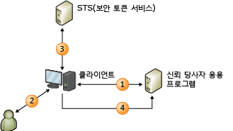

# 클레임 기반 ID 모델
클레임 인식 응용 프로그램을 작성할 때 사용자 ID가 클레임 집합으로 응용 프로그램에 표시됩니다. 클레임 중 하나는 사용자 이름이고, 다른 하나는 전자 메일 주소일 수 있습니다. 외부 ID 시스템은 수신하는 ID 데이터가 신뢰할 수 있는 출처에서 제공되는 암호화 보증과 함께 각각의 요청을 작성한 사용자에 대해 파악하기 위해 필요한 모든 사항을 응용 프로그램에 제공하도록 구성됩니다.  
  
 이 모델에서는 Single Sign-On을 더욱 쉽게 달성할 수 있으며, 응용 프로그램이 더 이상 다음과 같은 작업을 수행할 필요가 없습니다.  
  
-   사용자 인증  
  
-   사용자 계정 및 암호 저장  
  
-   사용자 ID 세부 정보를 조회하기 위해 엔터프라이즈 디렉터리 호출  
  
-   다른 플랫폼 또는 회사의 ID 시스템과 통합  
  
 이 모델에서는 응용 프로그램이 사용자를 인증한 시스템에서 제공하는 클레임을 기반으로 ID 관련 결정을 수행합니다. 이는 사용자의 이름을 사용한 단순 응용 프로그램 개인 설정부터 사용자에게 응용 프로그램에서 더욱 중요한 기능 및 리소스에 대한 액세스 권한 부여까지 모든 작업이 될 수 있습니다.  
  
 이 항목에서는 다음 내용에 대해 설명합니다.  
  
-   [클레임 기반 ID 소개](../../../docs/framework/security/claims-based-identity-model.md#BKMK_1)  
  
-   [클레임 기반 ID 모델에 대한 기본 시나리오](../../../docs/framework/security/claims-based-identity-model.md#BKMK_2)  
  
   
## 클레임 기반 ID 소개  
 다음 용어와 개념은 ID에 대한 새로운 아키텍처를 이해하는 데 도움을 줍니다.  
  
### 클레임  
 WIF(Windows Identity Foundation)의 프로그래밍 모델을 설명하기 위해 보안을 유지할 시스템에서 사용자 또는 기타 일부 엔터티의 속성 집합을 나타내는 데 용어 “ID”를 사용합니다.  
  
### 클레임  
 클레임을 이름, 전자 메일 주소, 나이 및 판매 역할의 멤버 자격과 같은 ID 정보의 일부로 간주하십시오. 응용 프로그램에서 수신하는 클레임 수가 많을수록 사용자에 대해 더 많이 파악할 수 있습니다. 왜 이를 일반적으로 기업 디렉터리를 설명하는 데 사용되는 “특성”이 아닌 “클레임”이라고 하는지 궁금하실 것입니다. 이유는 전달 방법과 관련이 있습니다. 이 모델에서는 응용 프로그램이 디렉터리에서 사용자 속성을 조회하지 않습니다. 대신 사용자가 응용 프로그램에 클레임을 전달하고 응용 프로그램이 이를 검사합니다. 각 클레임은 발급자에 의해 생성되므로 발급자를 신뢰하는 만큼만 클레임을 신뢰하게 됩니다. 예를 들어, 사용자가 직접 생성한 클레임보다 회사의 도메인 컨트롤러에서 생성된 클레임을 더 신뢰합니다. WIF는 클레임을 발급한 사람을 확인할 수 있는 <xref:System.Security.Claims.Claim> 속성이 있는 <xref:System.Security.Claims.Claim.Issuer%2A> 유형으로 클레임을 표시합니다.  
  
### 보안 토큰  
 사용자는 요청과 함께 응용 프로그램에 클레임 집합을 전달합니다. 웹 서비스에서는 이러한 클레임이 SOAP 봉투의 보안 헤더로 전달됩니다. 브라우저 기반 웹 응용 프로그램에서는 클레임이 사용자의 브라우저로부터 HTTP POST를 통해 도착하고 세션에 필요한 경우 나중에 쿠키에 캐시될 수 있습니다. 클레임의 도착 방식에 관계없이 보안 토큰이 제공되는 위치에서 직렬화해야 합니다. 보안 토큰은 발급 기관에서 디지털로 서명한 클레임의 직렬화된 집합입니다. 서명이 중요합니다. 서명은 사용자가 여러 클레임을 구성하고 보냈음을 보증합니다. 암호화가 필요 없거나 이를 원하지 않는 낮은 수중의 보안 상태에서 서명되지 않은 토큰을 사용할 수 있지만 이러한 시나리오는 이 항목에 설명되어 있지 않습니다.  
  
 WIF의 주요 기능 중 하나는 보안 토큰을 읽고 만드는 기능입니다. WIF와 .NET Framework가 모든 암호화 작업을 처리하고 읽을 수 있는 클레임 집합과 함께 응용 프로그램을 제공합니다.  
  
### 발급 기관  
 Kerberos 티켓을 발급하는 도메인 컨트롤러에서 X.509 인증서를 발급하는 인증 기관까지 여러 가지 유형의 발급 기관이 있지만, 이 항목에 설명된 특정 유형의 기관에서는 클레임을 포함하는 보안 토큰을 발급합니다. 이 발급 기관은 보안 토큰을 발급하는 방법을 알고 있는 웹 응용 프로그램 또는 웹 서비스입니다. 요청을 만드는 대상 신뢰 당사자와 사용자에게 적절한 클레임을 발급할 수 있도록 충분한 지식이 있어야 하며 클레임을 조회하고 사용자를 인증하기 위해 사용자 저장소와 상호 작용해야 할 수 있습니다.  
  
 어떤 발급 기관을 선택하든 ID 솔루션에서 중심적인 역할을 수행합니다. 클레임을 신뢰하여 응용 프로그램에서 인증을 고려하는 경우 해당 기관에 책임을 전달하고 대신 사용자를 인증하도록 요청합니다.  
  
### STS(보안 토큰 서비스)  
 STS(보안 토큰 서비스)는 WS-Trust 및 WS-Federation 프로토콜에 따라 보안 토큰을 작성, 서명 및 발급하는 서비스 구성 요소입니다. 이 프로토콜의 구현을 위해 수행해야 할 많은 작업이 있지만 WIF가 이러한 작업을 모두 수행하므로, 프로토콜에 대한 전문 지식이 없어도 누구나 쉽게 STS를 가져오고 실행할 수 있습니다. [AD FS(Active Directory® Federation Services) 2.0](http://go.microsoft.com/fwlink/?LinkID=247516)과 같이 미리 빌드된 STS 또는 [Microsoft Azure ACS(Access Control Service)](http://go.microsoft.com/fwlink/?LinkID=247517)와 같은 클라우드 STS를 사용하거나 사용자 지정 토큰을 발급하거나 사용자 지정 인증 또는 권한 부여를 제공하려는 경우 WIF를 사용하여 고유한 사용자 지정 STS를 만들 수 있습니다. WIF를 사용하면 쉽게 자체 STS를 만들 수 있습니다.  
  
### 타사 응용 프로그램 신뢰  
 클레임을 신뢰하는 응용 프로그램을 빌드할 때 RP(신뢰 당사자) 응용 프로그램을 빌드합니다. RP의 동의어로는, “클레임 인식 응용 프로그램” 및 “클레임 기반 응용 프로그램”이 있습니다. 웹 응용 프로그램과 웹 서비스가 모두 RP일 수 있습니다. RP 응용 프로그램은 STS에서 발급한 토큰을 사용하고 토큰에서 클레임을 추출하여 ID 관련 작업에 사용합니다. WIF는 RP 응용 프로그램을 작성하는 데 도움을 주는 기능을 제공합니다.  
  
### 표준  
 모두 상호 운용 가능한 상태로 만들기 위해 이전 시나리오에서 여러 WS-* 표준이 사용됩니다. WS-MetadataExchange를 사용하여 정책이 검색되고 WS-Policy 사양에 따라 정책이 구조화됩니다. STS가 보안 토큰을 요청하고 수신하는 방법을 설명하는 WS-Trust 사양을 구현하는 끝점을 노출합니다. 오늘날 대부분의 STS가 SAML(Security Assertion Markup Language)로 서식이 지정된 토큰을 발급합니다. SAML은 상호 운용 가능한 방식으로 클레임을 나타내는 데 사용할 수 있는 업계에서 통용되는 XML 용어입니다. 또는 다중 플랫폼 상황에서 이를 통해 완전히 다른 플랫폼에서 STS와 통신하고 플랫폼에 관계없이 모든 응용 프로그램에서 Single Sign-On을 달성할 수 있습니다.  
  
### 브라우저 기반 응용 프로그램  
 스마트 클라이언트만 클레임 기반 ID 모델을 사용할 수 있는 것이 아닙니다. 브라우저 기반 응용 프로그램(수동 클라이언트라고도 함)에서도 사용할 수 있습니다. 다음 시나리오는 이러한 작동 방식을 설명합니다.  
  
 먼저, 사용자가 클레임 인식 웹 응용 프로그램(신뢰 당사자 응용 프로그램)에서 브라우저를 가리킵니다. 사용자를 인증할 수 있도록 웹 응용 프로그램이 브라우저를 STS로 리디렉션합니다. STS는 들어오는 요청을 읽고, 표준 HTTP 메커니즘을 사용하여 사용자를 인증한 후 SAML 토큰을 만드는 단순 웹 응용 프로그램에서 호스팅되며, 브라우저에서 SAML 토큰을 RP에 다시 보내는 HTTP POST가 시작되도록 하는 JavaScript 코드의 일부로 회신합니다. 이 POST의 본문에는 RP가 요청한 클레임이 포함됩니다. 이때 일반적으로 요청할 때마다 사용자를 리디렉션할 필요가 없도록 RP가 클레임을 쿠키에 패키지합니다.  
  
   
## 클레임 기반 ID 모델에 대한 기본 시나리오  
 다음은 클레임 기반 시스템의 예입니다.  
  
   
  
 이 다이어그램은 사이트를 사용할 웹 브라우저의 인증 및 클라이언트에 WIF를 사용하도록 구성된 웹 사이트(신뢰 당사자 응용 프로그램, RP)를 보여줍니다.  
  
1.  인증되지 않은 사용자가 페이지를 요청하면 이 브라우저가 ID 공급자(IP) 페이지로 리디렉션됩니다.  
  
2.  IP를 사용하려면 사용자가 자격 증명을 제공해야 합니다(예: username/password, Kerberos 등).  
  
3.  IP가 브라우저에 반환되는 토큰을 발급합니다.  
  
4.  이제 브라우저가 원래 요청된 페이지로 다시 리디렉션되며, 이 페이지에서 WIF가 토큰이 페이지 전반의 요구 사항을 만족하는지 판별합니다. 이 경우 한 번만 인증하면 되도록 세션을 설정하기 위해 쿠키가 발급되고, 응용 프로그램에 제어가 전달됩니다.
