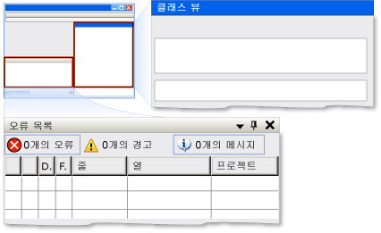

# UI 자동화 Dock 컨트롤 패턴 구현Implementing the UI Automation Dock Control Pattern
> [!NOTE]
>  이 설명서는 <xref:System.Windows.Automation> 네임스페이스에 정의된 관리되는 [!INCLUDE[TLA2#tla_uiautomation](../../../includes/tla2sharptla-uiautomation-md.md)] 클래스를 사용하려는 .NET Framework 개발자를 위한 것입니다.This documentation is intended for .NET Framework developers who want to use the managed [!INCLUDE[TLA2#tla_uiautomation](../../../includes/tla2sharptla-uiautomation-md.md)] classes defined in the <xref:System.Windows.Automation> namespace. [!INCLUDE[TLA2#tla_uiautomation](../../../includes/tla2sharptla-uiautomation-md.md)]에 대한 최신 정보는 [Windows 자동화 API: UI 자동화](http://go.microsoft.com/fwlink/?LinkID=156746)를 참조하세요.For the latest information about [!INCLUDE[TLA2#tla_uiautomation](../../../includes/tla2sharptla-uiautomation-md.md)], see [Windows Automation API: UI Automation](http://go.microsoft.com/fwlink/?LinkID=156746).  
  
 이 항목에서는 속성에 대한 정보를 포함하여 <xref:System.Windows.Automation.Provider.IDockProvider>를 구현하기 위한 지침 및 규칙을 제공합니다.This topic introduces guidelines and conventions for implementing <xref:System.Windows.Automation.Provider.IDockProvider>, including information about properties. 추가 참조에 대한 링크는 항목 끝에 나열되어 있습니다.Links to additional references are listed at the end of the topic.  
  
 <xref:System.Windows.Automation.DockPattern> 컨트롤 패턴은 도킹 컨테이너 내에서 컨트롤의 도킹 속성을 노출하는 데 사용 됩니다.The <xref:System.Windows.Automation.DockPattern> control pattern is used to expose the dock properties of a control within a docking container. 도킹 컨테이너는 자식 요소를 서로 맞춰 가로 또는 세로로 정렬할 수 있는 컨트롤입니다.A docking container is a control that allows you to arrange child elements horizontally and vertically, relative to each other. 이 컨트롤 패턴을 구현하는 컨트롤의 예제를 보려면 [Control Pattern Mapping for UI Automation Clients](../../../docs/framework/ui-automation/control-pattern-mapping-for-ui-automation-clients.md)을 참조하세요.For examples of controls that implement this control pattern, see [Control Pattern Mapping for UI Automation Clients](../../../docs/framework/ui-automation/control-pattern-mapping-for-ui-automation-clients.md).  
  
 ![두 명의 자식이 도킹된 된 도킹 컨테이너입니다. ] (../../../docs/framework/ui-automation/media/uia-dockpattern-dockingexample.PNG "UIA_DockPattern_DockingExample")  
Visual Studio에서 "클래스 뷰" 창이 DockPosition.Right이고 "오류 목록" 창이 DockPosition.Bottom인 도킹의 예Docking Example from Visual Studio Where "Class View" Window Is DockPosition.Right and "Error List" Window Is DockPosition.Bottom  
  
   
## 구현 지침 및 규칙Implementation Guidelines and Conventions  
 Dock 컨트롤 패턴을 구현할 때는 다음 지침 및 규칙에 유의하세요.When implementing the Dock control pattern, note the following guidelines and conventions:  
  
-   <xref:System.Windows.Automation.Provider.IDockProvider> 는 도킹 컨테이너의 속성 또는 도킹 컨테이너 내에 있는 현재 컨트롤에 인접하여 도킹된 컨트롤의 속성을 노출하지 않습니다.<xref:System.Windows.Automation.Provider.IDockProvider> does not expose any properties of the docking container or any properties of controls that are docked adjacent to the current control within the docking container.  
  
-   컨트롤은 현재 z-순서에 따라 서로 맞춰가며 도킹됩니다. z-순서 배치가 높을수록 도킹 컨테이너의 지정된 가장자리에서 멀리 배치됩니다.Controls are docked relative to each other based on their current z-order; the higher their z-order placement, the farther they are placed from the specified edge of the docking container.  
  
-   도킹 컨테이너의 크기가 조정되는 경우, 컨테이너 내의 모든 도킹된 컨트롤은 원래 도킹되었던 가장자리와 같은 수준의 위치로 재조정됩니다.If the docking container is resized, any docked controls within the container will be repositioned flush to the same edge to which they were originally docked. 또한 도킹된 컨트롤의 크기가 조정되어 <xref:System.Windows.Automation.DockPosition>의 도킹 동작에 따라 컨테이너 내의 모든 공간을 채웁니다.The docked controls will also resize to fill any space within the container according to the docking behavior of their <xref:System.Windows.Automation.DockPosition>. 예를 들어, <xref:System.Windows.Automation.DockPosition.Top> 이 지정된 경우 컨트롤의 왼쪽과 오른쪽이 확장되어 사용 가능한 모든 공간을 채웁니다.For example, if <xref:System.Windows.Automation.DockPosition.Top> is specified, the left and right sides of the control will expand to fill any available space. <xref:System.Windows.Automation.DockPosition.Fill> 이 지정된 경우 컨트롤의 상/하/좌/우 모두 확장되어 사용 가능한 모든 공간을 채웁니다.If <xref:System.Windows.Automation.DockPosition.Fill> is specified, all four sides of the control will expand to fill any available space.  
  
-   다중 모니터 시스템에서, 컨트롤은 현재 모니터의 왼쪽 또는 오른쪽에 도킹해야 합니다.On a multi-monitor system, controls should dock to the left or right side of the current monitor. 그렇지 않을 경우, 가장 왼쪽에 있는 모니터의 왼쪽이나 가장 오른쪽에 있는 모니터의 오른쪽에 도킹해야 합니다.If that is not possible, they should dock to the left side of the leftmost monitor or the right side of the rightmost monitor.  
  
   
## IDockProvider에 필요한 멤버Required Members for IDockProvider  
 IDockProvider 인터페이스를 구현하려면 다음과 같은 속성 및 메서드가 필요합니다.The following properties and methods are required for implementing the IDockProvider interface.  
  
|필요한 멤버Required members|멤버 형식Member type|노트Notes|  
|----------------------|-----------------|-----------|  
|<xref:System.Windows.Automation.Provider.IDockProvider.DockPosition%2A>|속성Property|없음None|  
|<xref:System.Windows.Automation.Provider.IDockProvider.SetDockPosition%2A>|메서드Method|없음None|  
  
 이 컨트롤 패턴에 연결된 이벤트가 없습니다.This control pattern has no associated events.  
  
   
## 예외Exceptions  
 공급자는 다음과 같은 예외를 throw해야 합니다.Providers must throw the following exceptions.  
  
|예외 형식Exception type|조건Condition|  
|--------------------|---------------|  
|<xref:System.InvalidOperationException>|<xref:System.Windows.Automation.Provider.IDockProvider.SetDockPosition%2A>   -컨트롤 수 없는 경우 요청된 된 도킹 스타일을 실행할 수 있습니다.-   When a control is not able to execute the requested dock style.|  
  
## 참고 항목See Also  
 [UI 자동화 컨트롤 패턴 개요UI Automation Control Patterns Overview](../../../docs/framework/ui-automation/ui-automation-control-patterns-overview.md)  
 [UI 자동화 공급자의 컨트롤 패턴 지원Support Control Patterns in a UI Automation Provider](../../../docs/framework/ui-automation/support-control-patterns-in-a-ui-automation-provider.md)  
 [클라이언트용 UI 자동화 컨트롤 패턴UI Automation Control Patterns for Clients](../../../docs/framework/ui-automation/ui-automation-control-patterns-for-clients.md)  
 [UI 자동화 트리 개요UI Automation Tree Overview](../../../docs/framework/ui-automation/ui-automation-tree-overview.md)  
 [UI 자동화의 캐싱 사용Use Caching in UI Automation](../../../docs/framework/ui-automation/use-caching-in-ui-automation.md)
