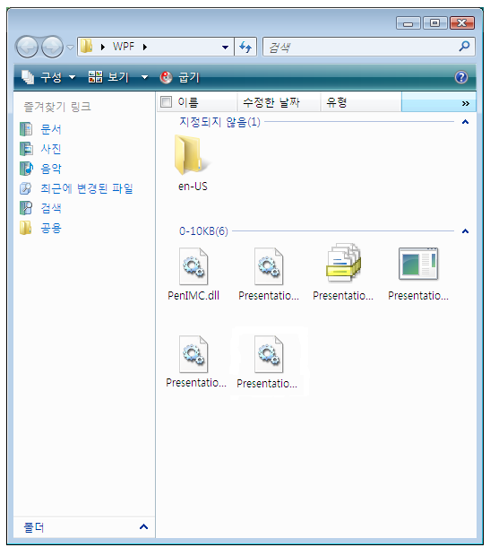

# UI 자동화 Grid 컨트롤 패턴 구현Implementing the UI Automation Grid Control Pattern
> [!NOTE]
>  이 설명서는 <xref:System.Windows.Automation> 네임스페이스에 정의된 관리되는 [!INCLUDE[TLA2#tla_uiautomation](../../../includes/tla2sharptla-uiautomation-md.md)] 클래스를 사용하려는 .NET Framework 개발자를 위한 것입니다.This documentation is intended for .NET Framework developers who want to use the managed [!INCLUDE[TLA2#tla_uiautomation](../../../includes/tla2sharptla-uiautomation-md.md)] classes defined in the <xref:System.Windows.Automation> namespace. [!INCLUDE[TLA2#tla_uiautomation](../../../includes/tla2sharptla-uiautomation-md.md)]에 대한 최신 정보는 [Windows 자동화 API: UI 자동화](http://go.microsoft.com/fwlink/?LinkID=156746)를 참조하세요.For the latest information about [!INCLUDE[TLA2#tla_uiautomation](../../../includes/tla2sharptla-uiautomation-md.md)], see [Windows Automation API: UI Automation](http://go.microsoft.com/fwlink/?LinkID=156746).  
  
 이 항목에서는 속성, 메서드 및 이벤트에 대한 정보를 포함하여 <xref:System.Windows.Automation.Provider.IGridProvider>를 구현하기 위한 지침 및 규칙을 제공합니다.This topic introduces guidelines and conventions for implementing <xref:System.Windows.Automation.Provider.IGridProvider>, including information about properties, methods, and events. 추가 참조에 대한 링크는 개요의 끝에 나열되어 있습니다.Links to additional references are listed at the end of the overview.  
  
 <xref:System.Windows.Automation.GridPattern> 컨트롤 패턴은 자식 요소 컬렉션에 컨테이너 역할을 하는 컨트롤을 지원하는 데 사용됩니다.The <xref:System.Windows.Automation.GridPattern> control pattern is used to support controls that act as containers for a collection of child elements. 이 요소의 자식 항목은 <xref:System.Windows.Automation.Provider.IGridItemProvider> 를 구현해야 하며 행과 열로 트래버스할 수 있는 2차원의 논리적 좌표계로 구성되어야 합니다.The children of this element must implement <xref:System.Windows.Automation.Provider.IGridItemProvider> and be organized in a two-dimensional logical coordinate system that can be traversed by row and column. 이 컨트롤 패턴을 구현하는 컨트롤의 예제를 보려면 [Control Pattern Mapping for UI Automation Clients](../../../docs/framework/ui-automation/control-pattern-mapping-for-ui-automation-clients.md)을 참조하세요.For examples of controls that implement this control pattern, see [Control Pattern Mapping for UI Automation Clients](../../../docs/framework/ui-automation/control-pattern-mapping-for-ui-automation-clients.md).  
  
   
## 구현 지침 및 규칙Implementation Guidelines and Conventions  
 Grid 컨트롤 패턴을 구현할 때는 다음 지침 및 규칙에 유의하세요.When implementing the Grid control pattern, note the following guidelines and conventions:  
  
-   Grid 좌표는 0부터 시작하며, 로캘에 따라 왼쪽 상단 또는 오른쪽 상단 셀의 좌표가 (0, 0)입니다.Grid coordinates are zero-based with the upper left (or upper right cell depending on locale) having coordinates (0, 0).  
  
-   셀이 비어 있더라도 UI 자동화 요소가 반환되어야 해당 셀의 <xref:System.Windows.Automation.Provider.IGridItemProvider.ContainingGrid%2A> 속성을 지원할 수 있습니다.If a cell is empty, a UI Automation element must still be returned in order to support the <xref:System.Windows.Automation.Provider.IGridItemProvider.ContainingGrid%2A> property for that cell. 이러한 상황은 표에 있는 자식 요소의 레이아웃이 비정형 배열과 비슷할 때 발생합니다.This is possible when the layout of child elements in the grid is similar to a ragged array (see example below).  
  
 ![Windows 탐색기 보기 좋지 않은 레이아웃을 봅니다. ] (../../../docs/framework/ui-automation/media/uia-gridpattern-ragged-array.PNG "UIA_GridPattern_Ragged_Array")  
비어 있는 좌표에서 표 컨트롤의 예Example of a Grid Control with Empty Coordinates  
  
-   단일 항목이 있는 표가 논리적으로 표로 간주되는 경우 이 표는 <xref:System.Windows.Automation.Provider.IGridProvider> 구현에 필요합니다.A grid with a single item is still required to implement <xref:System.Windows.Automation.Provider.IGridProvider> if it is logically considered to be a grid. 표에서 자식 항목의 개수는 중요하지 않습니다.The number of child items in the grid is immaterial.  
  
-   공급자 구현에 따라 숨겨진 행 및 열은 [!INCLUDE[TLA2#tla_uiautomation](../../../includes/tla2sharptla-uiautomation-md.md)] 트리에 로드될 수 있으며, 그에 따라 <xref:System.Windows.Automation.GridPattern.GridPatternInformation.RowCount%2A> 및 <xref:System.Windows.Automation.GridPattern.GridPatternInformation.ColumnCount%2A> 속성에 반영됩니다.Hidden rows and columns, depending on the provider implementation, may be loaded in the [!INCLUDE[TLA2#tla_uiautomation](../../../includes/tla2sharptla-uiautomation-md.md)] tree and therefore will be reflected in the <xref:System.Windows.Automation.GridPattern.GridPatternInformation.RowCount%2A> and <xref:System.Windows.Automation.GridPattern.GridPatternInformation.ColumnCount%2A> properties. 숨겨진 행 및 열이 아직 로드되지 않았으면 반영되지 않습니다.If the hidden rows and columns have not yet been loaded, they should not be counted.  
  
-   <xref:System.Windows.Automation.Provider.IGridProvider> 는 표의 활성 구현을 사용하도록 설정하지 않습니다. 이 기능을 사용하려면 <xref:System.Windows.Automation.Provider.ITransformProvider> 를 구현해야 합니다.<xref:System.Windows.Automation.Provider.IGridProvider> does not enable active manipulation of a grid; <xref:System.Windows.Automation.Provider.ITransformProvider> must be implemented to enable this functionality.  
  
-   추가, 제거 또는 병합된 셀과 같이 표의 구조 또는 레이아웃 변경 내용을 수신하려면 <xref:System.Windows.Automation.StructureChangedEventHandler> 를 사용합니다.Use a <xref:System.Windows.Automation.StructureChangedEventHandler> to listen for structural or layout changes to the grid such as cells that have been added, removed, or merged.  
  
-   표의 항목 또는 셀의 이동을 추적하려면 <xref:System.Windows.Automation.AutomationFocusChangedEventHandler> 를 사용합니다.Use a <xref:System.Windows.Automation.AutomationFocusChangedEventHandler> to track traversal through the items or cells of a grid.  
  
   
## IGridProvider에 필요한 멤버Required Members for IGridProvider  
 IGridProvider 인터페이스를 구현하려면 다음과 같은 속성 및 메서드가 필요합니다.The following properties and methods are required for implementing the IGridProvider interface.  
  
|필요한 멤버Required members|형식Type|노트Notes|  
|----------------------|----------|-----------|  
|<xref:System.Windows.Automation.Provider.IGridProvider.RowCount%2A>|속성Property|없음None|  
|<xref:System.Windows.Automation.Provider.IGridProvider.ColumnCount%2A>|속성Property|없음None|  
|<xref:System.Windows.Automation.Provider.IGridProvider.GetItem%2A>|메서드Method|없음None|  
  
 이 컨트롤 패턴에 연결된 이벤트가 없습니다.This control pattern has no associated events.  
  
   
## 예외Exceptions  
 공급자는 다음과 같은 예외를 throw해야 합니다.Providers must throw the following exceptions.  
  
|예외 형식Exception type|조건Condition|  
|--------------------|---------------|  
|<xref:System.ArgumentOutOfRangeException>|<xref:System.Windows.Automation.Provider.IGridProvider.GetItem%2A>   -요청 된 행 좌표가 보다 큰 경우는 <xref:System.Windows.Automation.Provider.IGridProvider.RowCount%2A> 열 좌표가 보다 큽니다. 또는 <xref:System.Windows.Automation.Provider.IGridProvider.ColumnCount%2A>합니다.-   If the requested row coordinate is larger than the <xref:System.Windows.Automation.Provider.IGridProvider.RowCount%2A> or the column coordinate is larger than the <xref:System.Windows.Automation.Provider.IGridProvider.ColumnCount%2A>.|  
|<xref:System.ArgumentOutOfRangeException>|<xref:System.Windows.Automation.Provider.IGridProvider.GetItem%2A>   -요청 된 행 또는 열의 좌표가 0 보다 작은 경우.-   If either of the requested row or column coordinates is less than zero.|  
  
## 참고 항목See Also  
 [UI 자동화 컨트롤 패턴 개요UI Automation Control Patterns Overview](../../../docs/framework/ui-automation/ui-automation-control-patterns-overview.md)  
 [UI 자동화 공급자의 컨트롤 패턴 지원Support Control Patterns in a UI Automation Provider](../../../docs/framework/ui-automation/support-control-patterns-in-a-ui-automation-provider.md)  
 [클라이언트용 UI 자동화 컨트롤 패턴UI Automation Control Patterns for Clients](../../../docs/framework/ui-automation/ui-automation-control-patterns-for-clients.md)  
 [UI 자동화 GridItem 컨트롤 패턴 구현Implementing the UI Automation GridItem Control Pattern](../../../docs/framework/ui-automation/implementing-the-ui-automation-griditem-control-pattern.md)  
 [UI 자동화 트리 개요UI Automation Tree Overview](../../../docs/framework/ui-automation/ui-automation-tree-overview.md)  
 [UI 자동화의 캐싱 사용Use Caching in UI Automation](../../../docs/framework/ui-automation/use-caching-in-ui-automation.md)
