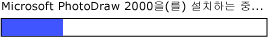

# UI 자동화 RangeValue 컨트롤 패턴 구현Implementing the UI Automation RangeValue Control Pattern
> [!NOTE]
>  이 설명서는 <xref:System.Windows.Automation> 네임스페이스에 정의된 관리되는 [!INCLUDE[TLA2#tla_uiautomation](../../../includes/tla2sharptla-uiautomation-md.md)] 클래스를 사용하려는 .NET Framework 개발자를 위한 것입니다.This documentation is intended for .NET Framework developers who want to use the managed [!INCLUDE[TLA2#tla_uiautomation](../../../includes/tla2sharptla-uiautomation-md.md)] classes defined in the <xref:System.Windows.Automation> namespace. [!INCLUDE[TLA2#tla_uiautomation](../../../includes/tla2sharptla-uiautomation-md.md)]에 대한 최신 정보는 [Windows 자동화 API: UI 자동화](http://go.microsoft.com/fwlink/?LinkID=156746)를 참조하세요.For the latest information about [!INCLUDE[TLA2#tla_uiautomation](../../../includes/tla2sharptla-uiautomation-md.md)], see [Windows Automation API: UI Automation](http://go.microsoft.com/fwlink/?LinkID=156746).  
  
 이 항목에서는 이벤트 및 속성에 대한 정보를 포함하여 <xref:System.Windows.Automation.Provider.IRangeValueProvider>를 구현하기 위한 지침 및 규칙을 제공합니다.This topic introduces guidelines and conventions for implementing <xref:System.Windows.Automation.Provider.IRangeValueProvider>, including information about events and properties. 추가 참조에 대한 링크는 항목 끝에 나열되어 있습니다.Links to additional references are listed at the end of the topic.  
  
 <xref:System.Windows.Automation.RangeValuePattern> 컨트롤 패턴은 범위 내의 값으로 설정할 수 있는 컨트롤을 지원하는 데 사용됩니다.The <xref:System.Windows.Automation.RangeValuePattern> control pattern is used to support controls that can be set to a value within a range. 이 컨트롤 패턴을 구현하는 컨트롤의 예제를 보려면 [Control Pattern Mapping for UI Automation Clients](../../../docs/framework/ui-automation/control-pattern-mapping-for-ui-automation-clients.md)을 참조하세요.For examples of controls that implement this control pattern, see [Control Pattern Mapping for UI Automation Clients](../../../docs/framework/ui-automation/control-pattern-mapping-for-ui-automation-clients.md).  
  
   
## 구현 지침 및 규칙Implementation Guidelines and Conventions  
 Range Value 컨트롤 패턴을 구현할 때는 다음 지침 및 규칙에 유의하세요.When implementing the Range Value control pattern, note the following guidelines and conventions:  
  
-   컨트롤을 통해 로캘 또는 사용자 기본 설정에 따라 지원되는 속성을 보정할 수 있습니다.Controls allow recalibration of their supported properties based upon locale or user preference. 이러한 예로 온도가 화씨 또는 섭씨로 표시되도록 설정할 수 있는 온도계 컨트롤이 있습니다.An example of this is a thermometer control that can be set to display the temperature in Fahrenheit or Celsius.  
  
-   진행률 표시줄 또는 슬라이더와 같은 모호한 범위 값이 있는 컨트롤에서는 해당 값을 정규화해야 합니다.Controls that have ambiguous range values, such as progress bars or sliders, should have those values normalized.  
  
 ![진행률 표시줄입니다. ] (../../../docs/framework/ui-automation/media/uia-rangevaluepattern-progress-bar.PNG "UIA_RangeValuePattern_Progress_Bar")  
이 예로는 값이 정수 유형인 진행률 표시줄이며 최소 및 최대 속성 값이 각각 0과 100으로 정규화됩니다.Example of a Progress Bar Where Value Is of Type Integer and Minimum and Maximum Property Values Are Normalized to 0 and 100, Respectively  
  
   
## IRangeValueProvider에 필요한 멤버Required Members for IRangeValueProvider  
  
|필요한 멤버Required member|멤버 형식Member type|노트Notes|  
|---------------------|-----------------|-----------|  
|<xref:System.Windows.Automation.RangeValuePattern.IsReadOnlyProperty>|속성Property|없음None|  
|<xref:System.Windows.Automation.RangeValuePattern.ValueProperty>|속성Property|없음None|  
|<xref:System.Windows.Automation.RangeValuePattern.LargeChangeProperty>|속성Property|없음None|  
|<xref:System.Windows.Automation.RangeValuePattern.SmallChangeProperty>|속성Property|없음None|  
|<xref:System.Windows.Automation.RangeValuePattern.MaximumProperty>|속성Property|없음None|  
|<xref:System.Windows.Automation.RangeValuePattern.MinimumProperty>|속성Property|없음None|  
|<xref:System.Windows.Automation.RangeValuePattern.SetValue%2A>|메서드Methods|없음None|  
  
 이 컨트롤 패턴에 연결된 이벤트가 없습니다.This control pattern has no associated events.  
  
   
## 예외Exceptions  
 공급자는 다음과 같은 예외를 throw해야 합니다.Providers must throw the following exceptions.  
  
|예외 형식Exception type|조건Condition|  
|--------------------|---------------|  
|<xref:System.ArgumentOutOfRangeException>|<xref:System.Windows.Automation.RangeValuePattern.SetValue%2A> 은 <xref:System.Windows.Automation.RangeValuePattern.MaximumProperty> 보다 크거나 <xref:System.Windows.Automation.RangeValuePattern.MinimumProperty>보다 작은 값으로 호출됩니다.<xref:System.Windows.Automation.RangeValuePattern.SetValue%2A> is called with a value that is either greater than <xref:System.Windows.Automation.RangeValuePattern.MaximumProperty> or less than <xref:System.Windows.Automation.RangeValuePattern.MinimumProperty>.|  
  
## 참고 항목See Also  
 [UI 자동화 컨트롤 패턴 개요UI Automation Control Patterns Overview](../../../docs/framework/ui-automation/ui-automation-control-patterns-overview.md)  
 [UI 자동화 공급자의 컨트롤 패턴 지원Support Control Patterns in a UI Automation Provider](../../../docs/framework/ui-automation/support-control-patterns-in-a-ui-automation-provider.md)  
 [클라이언트용 UI 자동화 컨트롤 패턴UI Automation Control Patterns for Clients](../../../docs/framework/ui-automation/ui-automation-control-patterns-for-clients.md)  
 [UI 자동화 트리 개요UI Automation Tree Overview](../../../docs/framework/ui-automation/ui-automation-tree-overview.md)  
 [UI 자동화의 캐싱 사용Use Caching in UI Automation](../../../docs/framework/ui-automation/use-caching-in-ui-automation.md)
